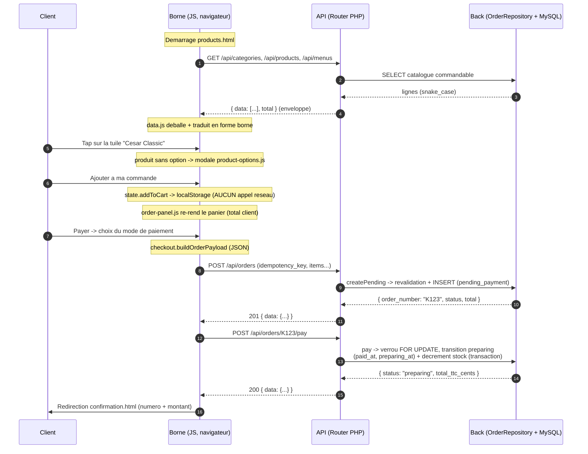

# Flux borne : de la selection d'un produit a la commande

> Auteur : BYAN
> Date : 2026-06-25 (v0.2), 2026-09-24 (v0.3)
> Version : v0.3 (2026-09-24) — mise en coherence avec le code livre (2a09597) : l'encaissement pose `preparing` (et non `paid`) avec `paid_at` et `preparing_at`, sous verrou de la ligne de commande ; references `chemin:ligne` recalees sur le code courant (la validation d'en-tete, le calcul des totaux et l'ecriture des lignes ont ete extraits de `persist()` dans `resolveHeader`, `resolveAndTotal` et `insertLines`) ; extraits de code remplaces par le code courant (reprise sur `ORDER_CANCELLED`, commande en attente modifiable).
> Perimetre : front borne (`src/public/borne/`) + API + back (`src/app/`)
> Methode : trace du code REEL (chemin:ligne cites a chaque etape).

## Scenario fil rouge

Un client choisit une salade a la carte sur la borne kiosk. Il l'ajoute a sa
commande, puis valide et paie. On suit ce chemin de bout en bout, dans le code
reel.

Note sur le produit : la borne n'a pas de produit nomme exactement **"Salade
Cesar"** au seed. Le produit le plus proche est **"Cesar Classic"** (categorie
`salades`, 880 centimes soit 8,80 EUR), insere dans
`db/seeds/0002_catalogue.sql:104` et dote d'une recette dans
`db/seeds/0003_ingredients_recipes.sql:208-212`. Le document utilise ce produit
comme exemple concret ; le chemin trace est celui, generique, d'un produit a la
carte (type `produit`) sans option ni taille multiple.

## Diagramme de sequence



---

## Etape 1 — Chargement du catalogue

Au demarrage de `products.html`, le rendu est declenche au `DOMContentLoaded` par
`src/public/borne/assets/js/page-products.js:151`. La couche de donnees
(`data.js`) appelle l'API en lecture.

Endpoints appeles (constantes en tete de fichier) :
`src/public/borne/assets/js/data.js:17-23`

```js
const CATEGORIES_URL = '/api/categories';
const PRODUCTS_URL   = '/api/products';
const MENUS_URL      = '/api/menus';
const ALLERGENS_URL  = '/api/allergens';
```

`loadProducts()` fait les trois GET en parallele
(`src/public/borne/assets/js/data.js:65-121`) :

```js
_productsPromise = Promise.all([
    loadCategories(),                 // GET /api/categories
    fetchCollection(PRODUCTS_URL),    // GET /api/products
    fetchCollection(MENUS_URL),       // GET /api/menus
]).then(([categories, products, menus]) => { /* regroupement par slug */ });
```

`fetchCollection()` deballe l'enveloppe `{ data: [...] }` et renvoie le tableau
`data` (`src/public/borne/assets/js/data.js:38-43`).

Forme de la reponse (enveloppe standard de l'API) :

```json
{
  "data": [
    {
      "id": 24,
      "category_id": 7,
      "name": "Cesar Classic",
      "description": null,
      "price_cents": 880,
      "image_path": "assets/images/produits/salades/salade-classic-caesar.png",
      "display_order": 2,
      "maxi_variant_name": null,
      "sizes": [],
      "is_orderable": true
    }
  ],
  "total": 30
}
```

> Remarque : `id` ci-dessus est illustratif (l'auto-increment depend de l'ordre
> d'insertion du seed). Le contrat (les cles et leurs types) est, lui, fixe par le
> presenteur cote serveur.

Origine des donnees (cote serveur) :

- Route : `src/public/admin/index.php:99`
  `GET /api/products -> [CatalogueController::class, 'products']`.
- Controleur : `src/app/Controllers/CatalogueController.php:52-85`. Il appelle
  `ProductRepository::availableForCatalogue()`, croise les tailles
  (`sizesByBase()`) et la rupture calculee (`autoUnavailableIds()`), puis
  presente chaque ligne via `presentProduct()`
  (`src/app/Controllers/CatalogueController.php:269-316`).
- Requete SQL :
  `src/app/Catalogue/ProductRepository.php:185-200`
  (`availableForCatalogue()`). Elle ne remonte que le commandable :
  `WHERE p.is_available = 1 AND c.is_active = 1 AND p.base_product_id IS NULL`.

Cote borne, `data.js` traduit la forme canonique (snake_case) vers la forme
historique borne (`nom`, `prix`, `image`, `type`, ...) et regroupe par slug de
categorie (`src/public/borne/assets/js/data.js:79-103`). La salade arrive dans le
tableau `bySlug['salades']`.

---

## Etape 2 — Affichage et selection

`page-products.js` lit `?category=<id>` de l'URL, mappe vers un slug via
`CATEGORY_ID_TO_SLUG` (`src/public/borne/assets/js/data.js:232-242` ;
`salades` = id 7), puis rend les tuiles
(`src/public/borne/assets/js/page-products.js:39-126`).

Au tap sur une tuile, le handler de clic decide du comportement
(`src/public/borne/assets/js/page-products.js:112-117`) :

```js
card.addEventListener('click', (e) => {
    e.preventDefault();
    if (!orderable) return;                              // rupture RG-T21 -> inerte
    if (product.type === 'menu') openMenuComposer(product, categorySlug);
    else openProductOptions(product, categorySlug);      // produit a la carte
});
```

Comportement REEL selon le type :

- **Menu** (`type === 'menu'`) : ouvre le composeur de menu
  (`openMenuComposer`, `src/public/borne/assets/js/page-product-menu.js`).
- **Produit a la carte** (`type === 'produit'`, cas "Cesar Classic") : ouvre la
  modale d'options `openProductOptions`
  (`src/public/borne/assets/js/product-options.js:71`).

Nuance importante a souligner au jury : pour un produit a la carte, il n'y a PAS
de modale de modificateurs d'ingredients (ajouter/retirer) cote borne. La modale
`product-options.js` gere uniquement la quantite et, le cas echeant, un selecteur
de **taille** quand le produit porte plus d'une taille
(`productSizes()`, `src/public/borne/assets/js/product-options.js:57-59`). "Cesar
Classic" n'a pas de tailles multiples (`sizes: []`) : la modale n'affiche que le
prix, un stepper de quantite et le total
(`src/public/borne/assets/js/product-options.js:83-109`).

> Le contrat API supporte des modificateurs d'ingredient (`modifiers`) cote
> serveur (`OrderRepository::resolveModifiers`,
> `src/app/Order/OrderRepository.php:1184-1218`), mais la modale produit de la borne
> n'en construit pas dans le code lu. L'item panier d'un produit simple ne porte
> pas de champ `modifiers` (cf. etape 3). Ce point est signale plutot qu'affirme
> comme une regle : la couche serveur reste prete a les recevoir.

---

## Etape 3 — Ajout au panier (100% cote client, AUCUN appel reseau)

A ce stade, rien n'est envoye au serveur. L'ajout est entierement local.

Au clic sur "Ajouter a ma commande"
(`src/public/borne/assets/js/product-options.js:167-172`) :

```js
overlay.querySelector('#po-add').addEventListener('click', () => {
    addToCart(productCartItem(product, categorySlug, qty, selectedSize));
    refreshCartBadge();
    refreshOrderPanel();
    close();
});
```

L'item panier d'un produit a la carte est construit par `productCartItem()`
(`src/public/borne/assets/js/product-options.js:38-49`) :

```js
{
    id: product.id,            // (ou size.product_id si taille choisie)
    type: 'produit',
    categorie: 'salades',
    libelle: 'Cesar Classic',  // (ou "<nom> - <label taille>")
    prix_cents: 880,           // (ou size.price_cents)
    quantite: 1,
    image: 'assets/images/produits/salades/salade-classic-caesar.png'
}
```

`addToCart()` ecrit dans `localStorage` (cle `wakdo_cart`), sans requete
reseau (`src/public/borne/assets/js/state.js:78-90`). Pour un produit a la carte,
une ligne du meme `id` est fusionnee (quantite incrementee) ; un menu cree une
nouvelle ligne a chaque ajout (compositions potentiellement differentes).

Rendu du panier : `order-panel.js` est l'UNIQUE vue panier (panneau persistant a
droite de l'ecran de commande). Il lit le panier via `getCart()` et le re-rend
apres chaque mutation (`src/public/borne/assets/js/order-panel.js:168-210`). Le
vue-modele pur `buildPanelModel()`
(`src/public/borne/assets/js/order-panel.js:87-98`) calcule le total cote client
pour l'AFFICHAGE seulement :

```js
const totalCents = cart.reduce((sum, item) => sum + lineCents(item), 0);
```

avec `lineCents()` = `prix_cents * quantite` pour un produit simple
(`src/public/borne/assets/js/order-panel.js:44-48`). Ce total client sert
d'echo visuel ; il ne fait PAS foi (cf. etape 6).

---

## Etape 4 — Validation vers l'API (DEUX appels)

Le serveur n'est sollicite qu'au paiement. Le flux reel est en **deux appels HTTP
successifs**, orchestres par `submitOrder()`
(`src/public/borne/assets/js/checkout.js:160-197`).

### 4.a Construction du payload

`buildOrderPayload()` est une fonction pure
(`src/public/borne/assets/js/checkout.js:83-94`). Pour notre salade (produit a la
carte, mode "sur place" -> `dine_in`), le corps POST a la forme :

```json
{
  "idempotency_key": "f3c2...-uuid",
  "service_mode": "dine_in",
  "service_tag": "12",
  "items": [
    { "type": "product", "product_id": 24, "quantity": 1 }
  ]
}
```

- Un produit a la carte est traduit en
  `{ type: 'product', product_id, quantity }`
  (`src/public/borne/assets/js/checkout.js:75`).
- Le mode est mappe `'sur-place' -> 'dine_in'`, `'a-emporter' -> 'takeaway'`
  (`src/public/borne/assets/js/checkout.js:24,31-33`).
- `service_tag` (numero de chevalet) n'est inclus qu'en `dine_in`
  (`src/public/borne/assets/js/checkout.js:90-92`), saisi via la modale chevalet
  de `page-payment.js` (`src/public/borne/assets/js/page-payment.js:82-173`).
- `idempotency_key` : cle STABLE pour la session de paiement, memorisee en
  `sessionStorage` (`src/public/borne/assets/js/checkout.js:118-136`). Un retry reseau,
  ou un retour au panier suivi d'un nouveau paiement, reutilise la meme cle ; elle est
  liberee au succes.

### 4.b Les deux appels

`submitOrder()` (`src/public/borne/assets/js/checkout.js:160-197`) :

```js
const send = () => postJson('/api/orders',
    buildOrderPayload(cart, getMode(), serviceTag, menuSlotsById, checkoutKey()));  // 1er appel
let created;
try { created = await send(); }
catch (e) { if (e.message !== 'ORDER_CANCELLED') throw e; clearCheckoutKey(); created = await send(); }
const number = created?.data?.order_number;
const paid   = await postJson(`/api/orders/${encodeURIComponent(number)}/pay`, {});  // 2e appel
```

Avant l'envoi, les slots de chaque menu du panier sont recharges par `GET /api/menus/{id}`.
Une seule reprise est faite, et seulement sur `ORDER_CANCELLED` : la cle d'idempotence
porte alors une commande annulee ou expiree, et une cle neuve est prise.

1. `POST /api/orders` cree la commande en `pending_payment` et renvoie son
   `order_number`.
2. `POST /api/orders/{order_number}/pay` encaisse la commande et la passe en `preparing`.

Le declenchement vient de `page-payment.js` : le clic sur un mode de paiement
appelle `startCheckout()` puis `doSubmit()`
(`src/public/borne/assets/js/page-payment.js:45-78,199-200`). En sur-place, la
modale chevalet s'intercale avant la soumission ; en a-emporter, soumission
directe.

> Note : le paiement est simule (pas de PSP reel), mais la commande est REELLEMENT
> creee et encaissee cote serveur (`src/public/borne/payment.html:67-70`).

---

## Etape 5 — API : routage vers le back

Routes (entree HTTP du vhost admin, docroot `src/public/admin/`) :
`src/public/admin/index.php:88-89`

```php
$router->add('POST', '/api/orders', [OrderController::class, 'create']);
$router->add('POST', '/api/orders/{number}/pay', [OrderController::class, 'pay']);
```

Le controleur recoit le corps JSON et delegue au repository
(`src/app/Controllers/OrderController.php:35-58`) :

```php
public function create(array $params = []): Response {
    $order = $this->orders()->createPending($this->request->json());   // corps JSON brut
    return $this->json(['data' => $this->present($order)], 201);
}

public function pay(array $params = []): Response {
    $order = $this->orders()->pay((string) ($params['number'] ?? ''));
    return $this->json(['data' => $this->present($order)]);
}
```

> Divergence de nommage a noter : le controleur appelle
> `OrderRepository::createPending()` (et non `create()`). La methode `create()`
> n'existe pas dans le repository ; c'est `createPending()` qui porte le flux kiosk
> (`src/app/Order/OrderRepository.php:102-140`).

Le corps recu cote serveur est exactement le JSON construit a l'etape 4.a. Les
erreurs metier (`OrderValidationException`) sont mappees en codes HTTP par
`orderError()` (`src/app/Controllers/OrderController.php:112-131`) :
`ORDER_NOT_FOUND -> 404`, `INVALID_TRANSITION -> 409`, le reste `-> 422`.

---

## Etape 6 — Traitement back

### 6.a Creation : `createPending` -> `persist`

`createPending()` verifie d'abord l'idempotence
(`src/app/Order/OrderRepository.php:102-140`) :

```php
$existing = $this->findByIdempotencyKey($key);
if ($existing !== null) {
    if ($existing['status'] === 'pending_payment') {
        return $this->replaceItems($existing['order_number'], $req);  // panier modifie (F18)
    }
    if ($existing['status'] === 'cancelled') {
        throw new OrderValidationException('ORDER_CANCELLED');         // cle consommee -> 409
    }
    return $existing;          // deja encaissee : etat reel, sans ecriture
}
return $this->persist($req, 'kiosk', 'K', null);   // source kiosk, prefixe K, pas d'acteur
```

`findByIdempotencyKey()` lit `customer_order WHERE idempotency_key = :k`
(`src/app/Order/OrderRepository.php:42-61`). La colonne porte une contrainte
UNIQUE (`db/migrations/0001_init_schema.sql:328`,
`uk_customer_order_idempotency_key`).

**Revalidation SERVEUR (RG-T16) — le serveur ne s'appuie pas sur le prix client.**
`persist()` (`src/app/Order/OrderRepository.php:301-345`) delegue la validation de
l'en-tete a `resolveHeader()` et le calcul des lignes a `resolveAndTotal()`, qui
re-resout chaque ligne et RE-CALCULE les prix depuis la base ; ces deux methodes
sont partagees avec `replaceItems()`. Le client n'envoie que
`product_id` + `quantity` ; aucun prix client n'est lu dans le code.

- Validation du `service_mode` et du `service_tag` dans `resolveHeader()`
  (`src/app/Order/OrderRepository.php:393-405`).
- Garde rupture de stock RG-T21, dans `resolveAndTotal()` (set calcule une fois)
  (`src/app/Order/OrderRepository.php:430`).
- Resolution ligne par ligne via `resolveLine()`
  (`src/app/Order/OrderRepository.php:432,1064-1111`). Pour un produit a la carte
  (`src/app/Order/OrderRepository.php:1070-1085`) :

```php
$product = $this->products->find((int) ($item['product_id'] ?? 0));
if ($product === null || (int) ($product['is_available'] ?? 0) !== 1) {
    throw new OrderValidationException('PRODUCT_UNAVAILABLE');
}
$unitBase = (int) $product['price_cents'];   // PRIX RELU EN BASE, pas du client
$vat      = (int) $product['vat_rate'];      // TVA RELUE EN BASE
```

Le prix HT par unite est derive du TTC et du taux TVA dans `line()`
(`src/app/Order/OrderRepository.php:1225-1242`) :

```php
$unitHt = (int) round($unitTtc * 1000 / (1000 + $vat));
```

Les totaux commande sont la somme des lignes, dans `resolveAndTotal()`
(`src/app/Order/OrderRepository.php:434-444`).

**INSERT dans une transaction unique** (`src/app/Order/OrderRepository.php:314-342`).

`customer_order` ecrit (`src/app/Order/OrderRepository.php:315-330`) :
`order_number` (provisoire `''`), `idempotency_key`, `source`, `service_mode`,
`service_tag`, `status='pending_payment'`, `acting_user_id`, `total_ht_cents`,
`total_vat_cents`, `total_ttc_cents`.

**Generation du numero `order_number`** (`src/app/Order/OrderRepository.php:331-336`) :

```php
$orderId = (int) ($db->fetch('SELECT LAST_INSERT_ID() AS id')['id'] ?? 0);
$orderNumber = $prefix . $orderId;          // kiosk -> "K" + id, ex. "K123"
$db->execute('UPDATE customer_order SET order_number = :num WHERE id = :id', ...);
```

> Note : le format `K<id>` est une decision projet, qui diverge du
> `K-AAAA-MM-JJ-NNN` de la spec (documente en tete du fichier,
> `src/app/Order/OrderRepository.php:19-21`).

**Snapshots** ecrits sur `order_item` par `insertLines()` (`src/app/Order/OrderRepository.php:457-475`) :
`label_snapshot` (le nom du produit fige), `unit_price_cents_snapshot` (le prix
TTC recalcule), `vat_rate_snapshot` (le taux TVA fige), plus `item_type`,
`product_id`, `menu_id`, `format`, `quantity`. Les colonnes existent dans
`db/migrations/0001_init_schema.sql:352-354`. Pour un menu, `insertLines()` ecrit
aussi `order_item_selection`, et `order_item_modifier` si le corps porte des modificateurs
(`src/app/Order/OrderRepository.php:477-490`) ; pour un produit a la carte sans
modificateur, ces deux tables ne recoivent rien.

### 6.b Encaissement : `pay`

`pay()` (`src/app/Order/OrderRepository.php:523-610`) lit la commande par numero,
gere l'idempotence de transition, puis, dans UNE transaction, verrouille la ligne de
commande (`SELECT ... FOR UPDATE`, `lockOrder()`), relit le total, pose `preparing`
et decremente le stock.

Idempotence / transitions (`src/app/Order/OrderRepository.php:539-549`) :

```php
if (in_array($status, ['paid', 'preparing', 'ready', 'delivered'], true)) {
    return [/* etat reel */];                                 // deja encaissee -> pas de re-decrement
}
if ($status !== 'pending_payment') throw new OrderValidationException('INVALID_TRANSITION'); // cancelled
```

Transition atomique gardee + decrement de stock RG-T20
(`src/app/Order/OrderRepository.php:559-607`) :

```php
$affected = $db->execute(
    "UPDATE customer_order SET status = 'preparing', paid_at = NOW(), preparing_at = NOW(), ...
     WHERE id = :id AND status = 'pending_payment'", ...);
if ($affected === 0) { /* course concurrente : seul le 1er gagne -> sortie idempotente */ }

foreach ($this->consumption($db, $orderId) as $ingredientId => $units) {
    $db->execute('UPDATE ingredient SET stock_quantity = stock_quantity - :u WHERE id = :id', ...);
    $db->execute('INSERT INTO stock_movement (... movement_type ...) VALUES (... \'sale\' ...)', ...);
}
```

- La garde `status = 'pending_payment'` dans le `WHERE` du `UPDATE` assure qu'en
  cas d'appels concurrents, un seul decremente (l'autre voit 0 ligne affectee et
  sort idempotent).
- `consumption()` (`src/app/Order/OrderRepository.php:981-1055`) agrege les unites
  par `ingredient_id` (cle triee : ordre de verrou stable, anti-deadlock) en
  lisant les recettes (`ProductRepository::composition`). Pour "Cesar Classic",
  la recette est seedee (`db/seeds/0003_ingredients_recipes.sql:208-212`) : le
  decrement s'applique.
- Chaque mouvement est trace dans `stock_movement` (`movement_type='sale'`,
  `delta` negatif, `order_id`), table definie en
  `db/migrations/0001_init_schema.sql:420`.

> Nuance documentee dans le code (`src/app/Order/OrderRepository.php:514-516`) :
> le decrement est inerte tant qu'un produit n'a pas de recette
> (`product_ingredient`). La transition vers `preparing` s'applique de toute facon ; le
> mouvement de stock n'est produit que si la composition existe. "Cesar Classic"
> en ayant une, le decrement a lieu.

---

## Etape 7 — Reponse et confirmation

Forme de la reponse des deux appels (presenteur
`src/app/Controllers/OrderController.php:102-110`) :

```json
{
  "data": {
    "id": 123,
    "order_number": "K123",
    "status": "preparing",
    "total_ttc_cents": 880
  }
}
```

`POST /api/orders` renvoie `201` avec `status: "pending_payment"` ;
`POST /api/orders/{number}/pay` renvoie `200` avec `status: "preparing"`.

Cote borne, `submitOrder()` retient `order_number` et `total_ttc_cents`
(`src/public/borne/assets/js/checkout.js:190-196`). `page-payment.js` memorise le
resultat en `sessionStorage` (`wakdo_last_order`), vide le panier, puis redirige
vers `confirmation.html` (`src/public/borne/assets/js/page-payment.js:48-52`) :

```js
const res = await submitOrder({ serviceTag });
sessionStorage.setItem('wakdo_last_order', JSON.stringify(res));
clearCart();
window.location.href = 'confirmation.html';
```

`page-confirmation.js` lit `wakdo_last_order` et affiche le numero REEL et le
montant regle (`src/public/borne/assets/js/page-confirmation.js:22-40`), injectes
dans `#order-number` et `#order-total` de `confirmation.html`
(`src/public/borne/confirmation.html:63,67`). En l'absence de commande soumise
(visite directe), un numero de repli local `WK-<timestamp>` est genere
(`src/public/borne/assets/js/page-confirmation.js:18-20,35`).

---

## Points cles a souligner au jury

1. **Separation front / back nette.** Le panier vit entierement cote client
   (`state.js` + `localStorage`), sans appel reseau a l'ajout
   (`src/public/borne/assets/js/state.js:78-90`). La persistance n'arrive qu'au
   paiement (`src/public/borne/assets/js/checkout.js:171-193`). Le total affiche
   par `order-panel.js` est un echo visuel, pas une source de verite.

2. **Revalidation serveur (securite, RG-T16).** Le serveur RE-CALCULE le prix
   depuis la base ; dans le code lu, aucun prix client n'est utilise : le payload
   ne transporte que `product_id` + `quantity`
   (`src/public/borne/assets/js/checkout.js:75`), et `resolveLine()` relit
   `price_cents` / `vat_rate` en base
   (`src/app/Order/OrderRepository.php:1079-1080`). Un client malveillant ne peut pas
   imposer son prix. La disponibilite est aussi re-verifiee serveur (RG-T21,
   `src/app/Order/OrderRepository.php:430,1071-1078`), au-dela du simple grisage
   d'UI.

3. **Snapshots (tracabilite du prix a l'instant T).** `order_item` fige
   `label_snapshot`, `unit_price_cents_snapshot`, `vat_rate_snapshot`
   (`src/app/Order/OrderRepository.php:457-475` ;
   colonnes `db/migrations/0001_init_schema.sql:352-354`). Une evolution future du
   catalogue ne reecrit pas l'historique d'une commande passee.

4. **Idempotence (anti double-charge).** `idempotency_key` genere cote borne et
   stable pour la session de paiement (`src/public/borne/assets/js/checkout.js:118-136`),
   verifie a la creation (`src/app/Order/OrderRepository.php:104-135`) avec
   contrainte UNIQUE en base (`db/migrations/0001_init_schema.sql:328`). Cote
   `pay()`, l'idempotence de transition evite un double decrement de stock
   (`src/app/Order/OrderRepository.php:539-546`).

5. **Decrement de stock atomique (RG-T20).** Transition `preparing` + decrement +
   `stock_movement` dans une seule transaction
   (`src/app/Order/OrderRepository.php:559-607`). La garde
   `WHERE ... status = 'pending_payment'` et l'ordre de verrou stable par
   `ingredient_id` (`ksort`, `src/app/Order/OrderRepository.php:1052`) protegent
   des courses concurrentes et des deadlocks.

6. **Conventions HTTP.** Enveloppe standard `{ data }` (succes) /
   `{ data: null, error: { code, message } }` (echec) ; `201` a la creation,
   `200` au paiement, mapping des erreurs metier en `404 / 409 / 422`
   (`src/app/Controllers/OrderController.php:43,57,112-131`). Le flux en deux POST
   distincts (creer puis payer) materialise la transition d'etat
   `pending_payment -> preparing`.

### Surprises / points a verifier

- **Nom de methode** : le controleur appelle `createPending()`, pas `create()`
  (qui n'existe pas dans `OrderRepository`). La methode partagee reelle est
  `persist()`.
- **Flux a deux appels** : confirme dans le code
  (`src/public/borne/assets/js/checkout.js:178,193`) — POST creation puis POST
  pay, et non un POST unique.
- **Modificateurs d'ingredient** : le contrat serveur les supporte
  (`src/app/Order/OrderRepository.php:1184-1218`) mais la modale produit borne lue
  ne les construit pas pour un produit a la carte. Signale comme observation, non
  comme regle definitive.
- **Produit exemple** : pas de "Salade Cesar" exacte au seed ; substitue par
  "Cesar Classic" (`db/seeds/0002_catalogue.sql:104`). Le chemin trace reste
  generique pour tout produit a la carte.
