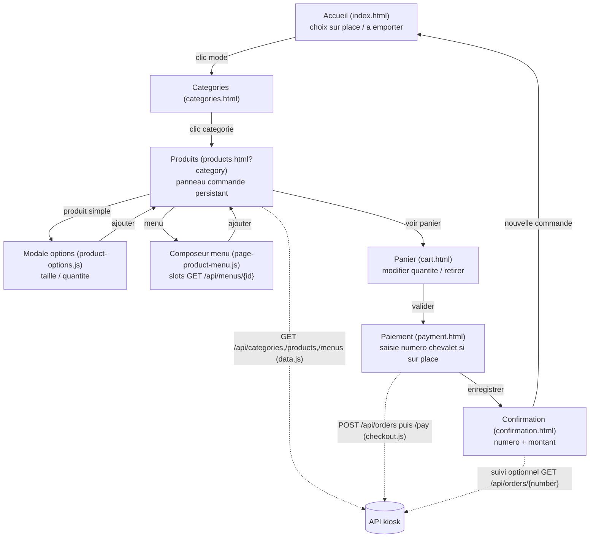
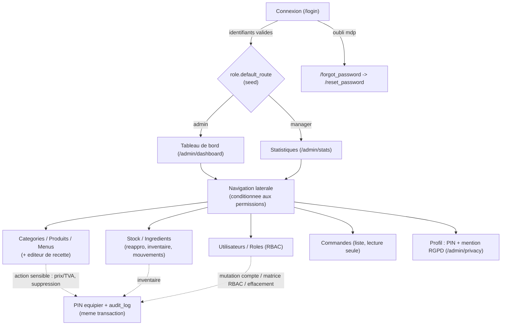

# Schema fonctionnel — Wakdo

> Conceptualisation de l'application (Cr 4.a.1 a 4.a.4) : enchainement des vues en
> fonction des actions et interactions utilisateur, pour les deux interfaces
> (borne kiosk Bloc 1, back-office Bloc 2). Complete les diagrammes UML
> (`docs/uml/use-cases.md`, `sequence-passer-commande.md`, `state-commande.md`) et
> le modele Merise (`docs/merise/`).

---

## 1. Vue d'ensemble

Deux interfaces, deux parcours, un meme catalogue en base :

- **Borne (kiosk)** — publique, anonyme, tactile. Le client compose une commande et
  la valide ; la borne consomme l'API de lecture (catalogue) et l'API de commande
  (creation + encaissement) en `fetch` Ajax.
- **Back-office** — interne, authentifie (sessions + RBAC par permission), pages
  rendues serveur (MVC). Chaque action sensible repasse par un PIN equipier.

Les transitions ci-dessous decrivent quelle vue mene a quelle vue, sous quelle
action, et quel appel API ou garde de securite intervient.

---

## 2. Parcours borne (Bloc 1)

**Transitions detaillees :**

| Vue | Action | Vue suivante | API / etat |
|---|---|---|---|
| Accueil | Choisir « sur place » / « a emporter » | Categories | mode memorise (state.js / nav.js) |
| Categories | Choisir une categorie | Produits | `GET /api/categories` (chargement) |
| Produits | Cliquer un produit simple | Modale options | `GET /api/products` |
| Produits | Cliquer un menu | Composeur de menu | `GET /api/menus/{id}` (slots) |
| Modale / Composeur | Ajouter au panier | Produits (panneau mis a jour) | panier en `localStorage` |
| Produits | Voir le panier | Panier | — |
| Panier | Valider | Paiement | — |
| Paiement | Saisir le numero (chevalet, si sur place) puis enregistrer | Confirmation | `POST /api/orders` puis `POST /api/orders/{number}/pay` (idempotent) |
| Confirmation | Nouvelle commande | Accueil | panier vide |

**Transverse borne :** bascule de police adaptee aux dyslexiques (bouton `a11y.js`,
present sur chaque vue, RGAA Cr 1.c.2) ; navigation clavier + focus-trap dans les
modales ; panneau commande persistant (aside) sur Produits.

---

## 3. Parcours back-office (Bloc 2)

**Gardes et regles :**

| Etape | Garde | Regle Merise |
|---|---|---|
| Acces a toute page `/admin/*` | `SessionGuard::check()` : session valide (idle 4h, absolu 10h, compte actif) | RG-6 / RG-T02 |
| Acces a une fonction | `Authorizer::can(role_id, permission)` : teste une permission, pas un nom de role | RG-T03 |
| Action sensible (annulation, prix/TVA, suppression, gestion compte/RBAC, inventaire, effacement PII) | PIN equipier verifie + ecriture `audit_log` dans la meme transaction | RG-T13 / RG-T14 |
| Echec de PIN | trace `pin.failed` + throttle degressif | RG-T22 |

**Landing par role** (seed `role.default_route`) : admin -> `/admin/dashboard`,
manager -> `/admin/stats`. Les autres roles (kitchen, counter, drive) sont definis
en base ; leurs ecrans operationnels (file cuisine, saisie comptoir/drive) sont
suivis comme evolution (voir le backlog de finition).

---

## 4. Points de contact API

| Interface | Appelle | Sens |
|---|---|---|
| Borne | `GET /api/categories`, `/products`, `/products/{id}`, `/menus`, `/menus/{id}`, `/allergens` | lecture catalogue (anonyme) |
| Borne | `POST /api/orders`, `POST /api/orders/{number}/pay`, `GET /api/orders/{number}` | commande + suivi (anonyme, idempotent) |
| Back-office | pages rendues serveur sous `/admin/*` + `GET /admin/me` | session + RBAC |

CORS : la borne et le back-office partagent l'origine via une passerelle `/api/*`
(meme origine) ; le middleware CORS reste en defense (origine exacte, sans joker).

---

## 5. References croisees

- Cas d'usage et acteurs : `docs/uml/use-cases.md`
- Sequence de commande : `docs/uml/sequence-passer-commande.md`
- Machine a etats de la commande : `docs/uml/state-commande.md`
- Sequence securite (annulation PIN-gated) : `docs/uml/security-sequence.md`
- Modele de donnees : `docs/merise/{dictionary,mcd,mld,mlt}.md`
- Contrat API : `docs/api/conventions.md`
