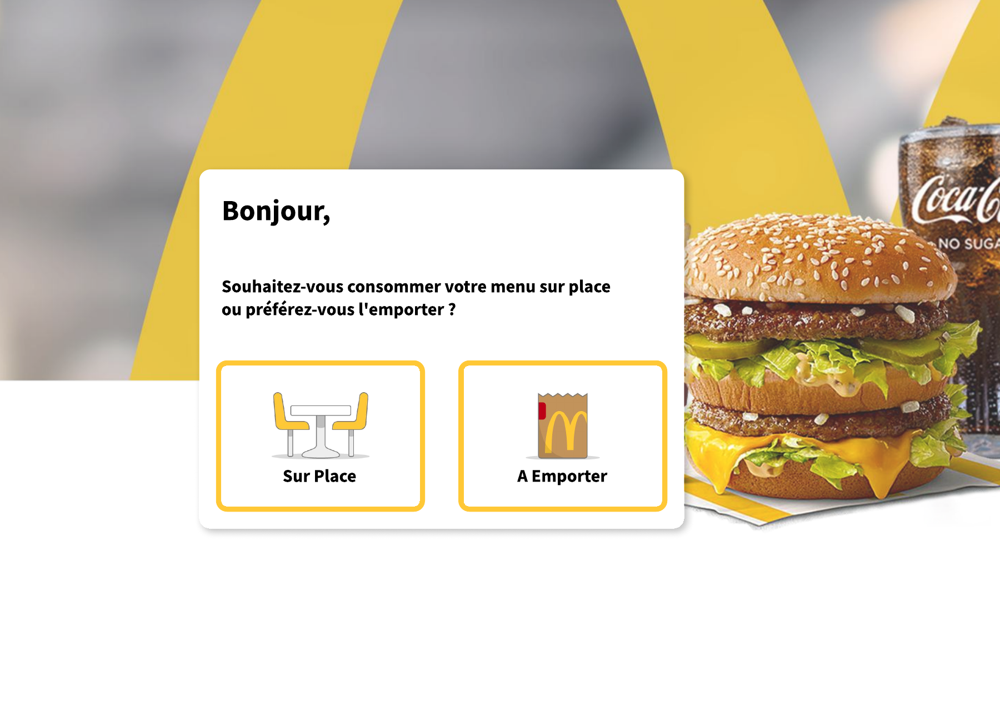
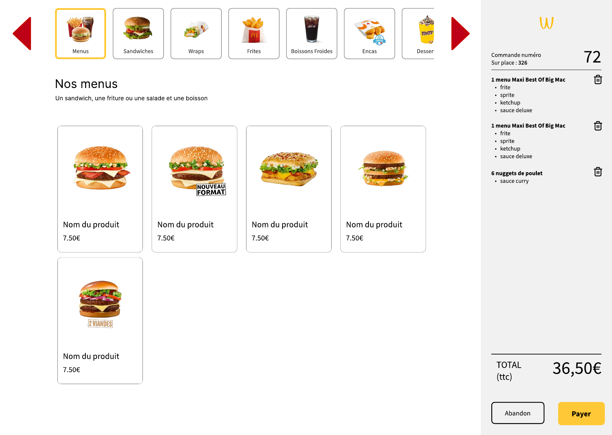
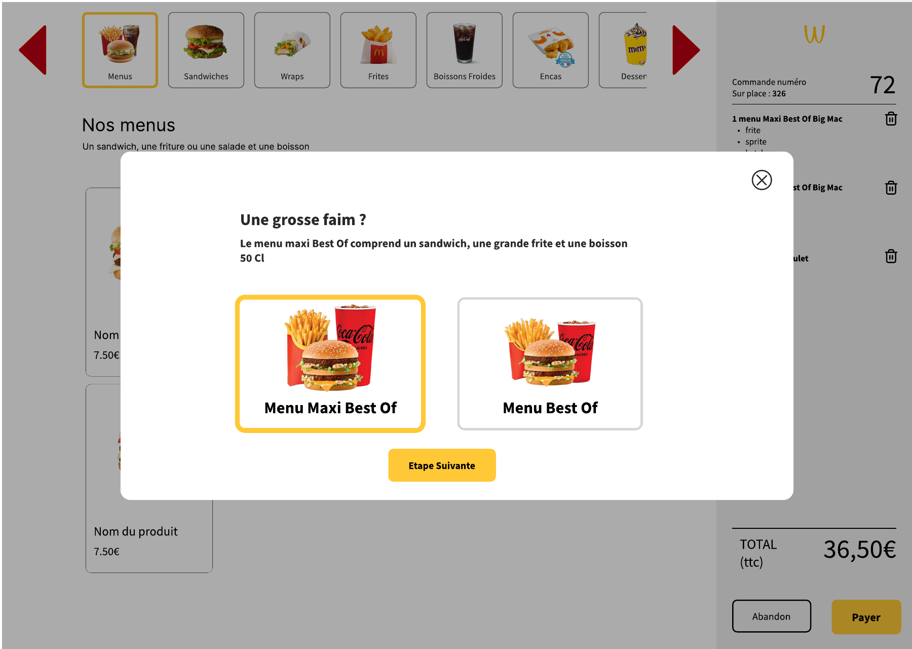
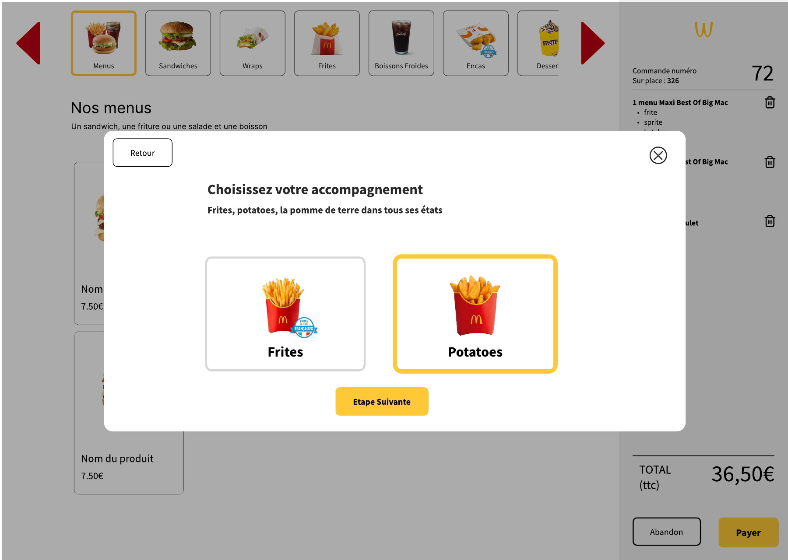
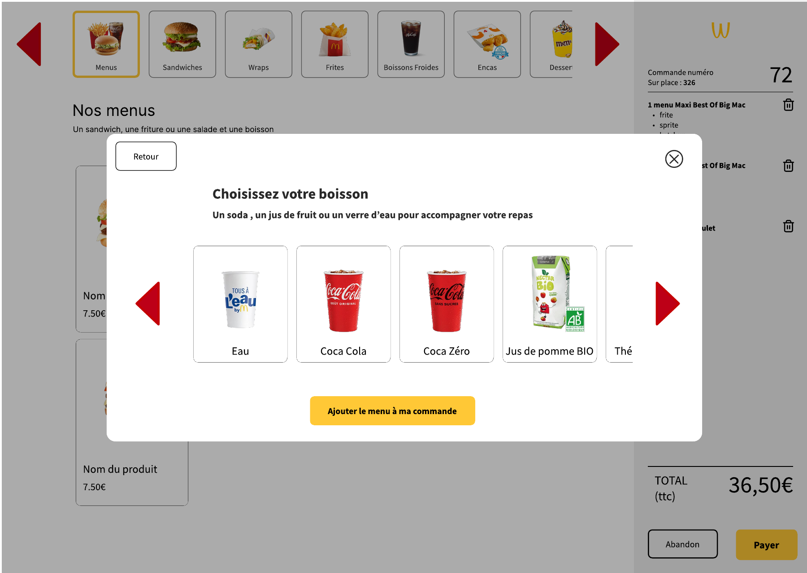
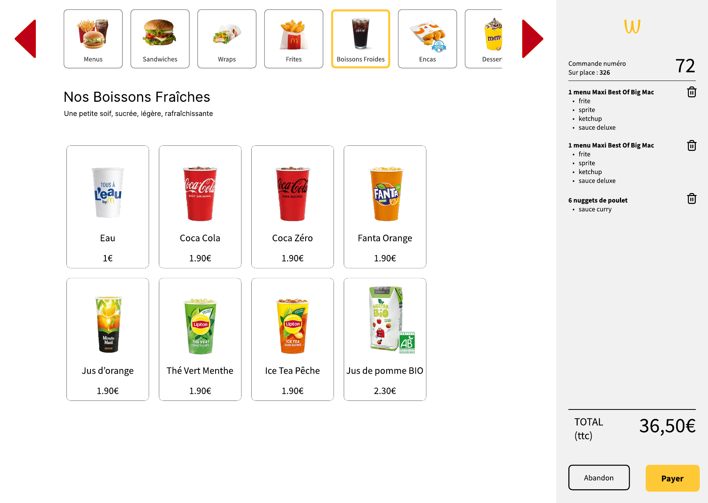
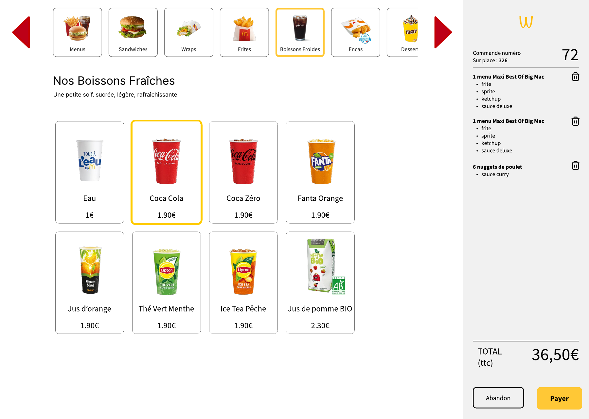
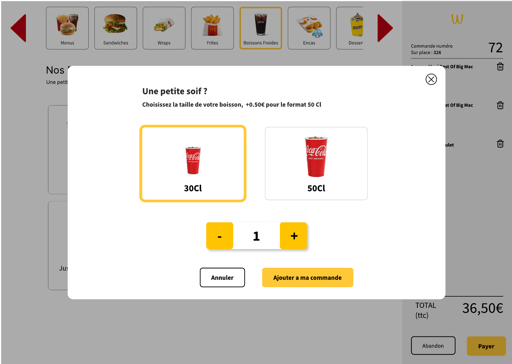
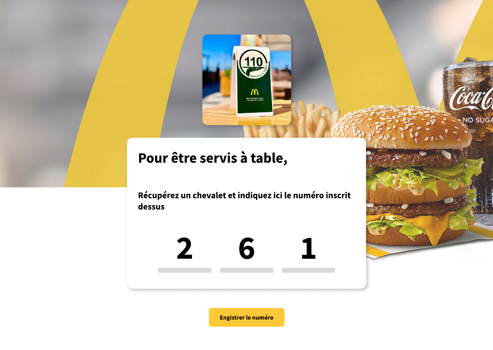
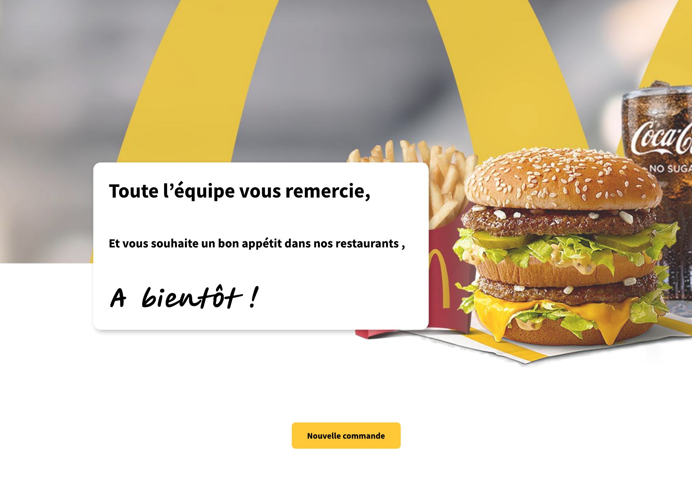

# Maquette borne vs kiosk construit — decomposition et tracabilite

> Auteur : BYAN. Note de tracabilite maquette -> code (appui oral RNCP Bloc 1 :
> "comment etes-vous passe de la maquette au code ?").
> Source : `docs/design/maquette-borne.pdf` (export Figma de l'ecole, 10 ecrans,
> format 1440x1024). Ecrans exportes un a un dans `docs/design/screens/`.

## 1. Lecture d'ensemble

La maquette decrit un **parcours de type McDonald's** (Big Mac, Best Of, McCafe,
arches M, Coca) : c'est la base de reference a rebrander en Wakdo.

Point central : les **10 "ecrans" ne sont pas 10 pages**. Ce sont en realite
~4 ecrans de base plus un systeme de modales qui s'ouvrent par-dessus l'ecran de
commande :

```
Accueil
   -> Ecran de commande UNIQUE
        (bandeau categories en haut + grille produits + panneau commande persistant a droite)
        sur lequel s'ouvrent les modales de composition (taille menu, accompagnement, boisson, format/quantite)
   -> Chevalet (sur place : saisie du numero)
   -> Remerciement
```

Le kiosk construit a desormais rejoint ce paradigme : l'ecran de commande
(`products.html`) porte un **panneau de commande persistant** a droite, les options
produit et le composeur de menu s'ouvrent **en modale** par-dessus la grille, et le
**chevalet** (saisie du numero de table) s'ouvre en modale au paiement sur place. Les
pages intermediaires `product.html` et `cart.html` du premier jet ont ete retirees.
Cette note garde la trace de la decomposition maquette -> code et des ecarts resorbes.

## 2. Decomposition ecran par ecran

### Ecran 1 — Accueil

- "Bonjour," + "Souhaitez-vous consommer votre menu sur place ou preferez-vous l'emporter ?"
- Deux grandes cartes : **Sur Place** (icone table) / **A Emporter** (icone sac).
- Fond : arches + Big Mac + Coca.

### Ecran 2 — Ecran de commande (pivot)

- **Bandeau categories horizontal** (Menus actif, Sandwiches, Wraps, Frites, Boissons Froides, Encas, Desserts...) avec fleches rouges ◀ ▶ pour faire defiler.
- Titre de section "Nos menus" + sous-titre + **grille de produits** (image, nom, prix).
- **Panneau de commande persistant a droite** : numero de commande (72), "Sur place : 326", lignes de commande avec options en puces et icone corbeille, "TOTAL (ttc) 36,50 EUR", boutons "Abandon" / "Payer", logo W en haut.
- Cet ecran est le coeur de la maquette : tout le reste (sauf accueil/chevalet/remerciement) se joue ici ou en modale par-dessus.

### Ecran 3 — Modale "Une grosse faim ?" (composition menu, etape 1)

- Choix de la taille : **Menu Maxi Best Of** / **Menu Best Of**.
- Bouton "Etape Suivante". Premiere etape d'un assistant en modale.

### Ecran 4 — Modale "Choisissez votre accompagnement" (etape 2)

- **Frites** / **Potatoes**.
- Boutons "Retour" + "Etape Suivante".

### Ecran 5 — Modale "Choisissez votre boisson" (etape 3)

- Carrousel de boissons (Eau, Coca, Coca Zero, Jus de pomme BIO, The...) avec ◀ ▶.
- Bouton "Ajouter le menu a ma commande" (fin de l'assistant).

### Ecran 6 — Ecran de commande, categorie Boissons Froides (a la carte)

- Meme ecran pivot, categorie "Boissons Froides" active.
- Grille de 8 boissons avec prix unitaires (Eau 1 EUR, Coca 1.90 EUR, Fanta 1.90 EUR, Jus de pomme BIO 2.30 EUR...).

### Ecran 7 — Selection d'un produit (etat)

- Meme grille, "Coca Cola" entoure en jaune : etat visuel de selection.

### Ecran 8 — Modale "Une petite soif ?" (option produit a la carte)

- Taille **30Cl / 50Cl** (+0.50 EUR pour le 50Cl).
- **Stepper de quantite** (- 1 +).
- Boutons "Annuler" / "Ajouter a ma commande".

### Ecran 9 — Chevalet (sur place)

- "Pour etre servis a table," + "Recuperez un chevalet et indiquez ici le numero inscrit dessus".
- Grands chiffres `2 6 1` + bouton "Enregistrer le numero".

### Ecran 10 — Remerciement

- "Toute l'equipe vous remercie, Et vous souhaite un bon appetit dans nos restaurants, A bientot !"
- Bouton "Nouvelle commande".

## 3. Maquette -> kiosk construit (mapping)

| Maquette | Kiosk construit | Verdict |
|----------|-----------------|---------|
| 1. Accueil sur place / a emporter | `index.html` | conforme |
| 2 + 6. Ecran de commande unique (bandeau + grille + **panneau persistant**) | `products.html` : bandeau categories (`category-strip.js`) + grille + **panneau de commande persistant** a droite (`order-panel.js`) | conforme |
| (pas de page categories separee) | `categories.html` plein ecran "Que souhaitez-vous commander ?" | ecran **ajoute** (la maquette met les categories en bandeau) |
| 3-5. Composeur menu = **assistant modal en etapes** | `page-product-menu.js` : composeur **modal pilote par les slots** de `/api/menus/{id}` (format Maxi puis 1 etape par slot) | conforme |
| 8. Modale d'option produit (taille + quantite) | `product-options.js` : **modale** d'options (taille R4 + stepper de quantite) au-dessus de la grille | conforme |
| 9. Ecran **chevalet** dedie (saisie numero) | **modale chevalet** au paiement sur place (`page-payment.js`), numero pose via l'API ; rappele en confirmation | conforme |
| (aucun ecran de paiement) | `payment.html` "Carte bancaire / Especes" | ecran **ajoute** par le build |
| 10. Remerciement | `confirmation.html` | conforme |

## 4. Ecarts structurants (resorbes)

Les ecarts structurants du premier jet ont ete realignes sur la maquette :

1. **Paradigme.** L'ecran de commande (`products.html`) suit le plan mono-ecran de
   la maquette : categories en bandeau (`category-strip.js`), grille produits, et
   panneau recapitulatif persistant a droite ; les options et le composeur de menu
   s'ouvrent en modale par-dessus. Les pages `product.html` et `cart.html` du
   premier jet ont ete retirees.
2. **Panneau de commande lateral.** La piece centrale de la maquette (numero de
   commande, lignes editables avec quantite et retrait, TOTAL ttc, Abandon / Payer)
   est rendue par `order-panel.js`, visible en permanence sur l'ecran de commande.
3. **Composition de menu.** Le composeur (`page-product-menu.js`) est un assistant
   modal en etapes pilote par les slots de `/api/menus/{id}` (format Maxi puis une
   etape par slot), conforme a l'enchainement de la maquette.

## 5. Rebrand McDonald's -> Wakdo

Le visuel de la maquette est du McDonald's litteral (Big Mac, Best Of, McCafe,
arches, "Tous a l'eau by M"). Le rebrand vers Wakdo (logo W, catalogue propre)
est attendu et legitime : le branding McDo n'est pas livrable. Le sujet de cette
note n'est donc pas le rebrand mais la **structure** des ecrans.

## 6. Suite

Le re-alignement du kiosk sur la maquette (panneau persistant + bandeau categories
+ composeur en modale + chevalet en modale) est livre. La borne lit le catalogue
via l'API REST (`/api/categories|products|menus|allergens`). Reste a faire : la
generation dynamique de l'ecran categories depuis `GET /api/categories` (section 3,
ecran categories) et le polissage visuel du rebrand Wakdo.
