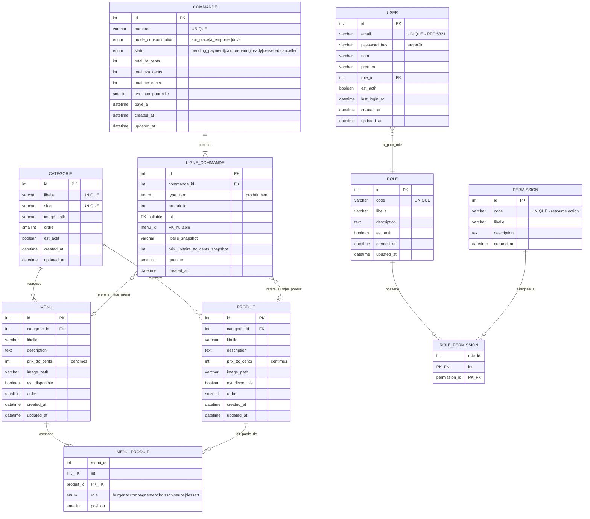

# Dictionnaire de donnees - Wakdo

**Phase Merise** : P1 - Conception, etape 1 (data dictionary first, mantra #33)
**Statut** : v0.1 (squelette MCD a venir, mantra "Incremental Design")
**Date** : 2026-04-30
**Branche** : `feat/p1-stubs-and-dictionary`

---

## 1. Objet du document

Ce dictionnaire liste **toutes les entites de donnees** identifiees pour Wakdo, avec
leurs attributs, types, contraintes et sources. Il sert de base au MCD (entites + relations),
puis au MLD (passage relationnel), puis au DDL (SQL CREATE TABLE).

**Methodologie** : derivation bottom-up depuis les sources disponibles :
- **Source ecole** : `docs/merise/_sources/categories.json` + `produits.json` (66 produits, 9 categories)
- **Brief metier** : `docs/PROJECT_CONTEXT.md` (composition de menu, parcours commande, RBAC,
  modes de consommation)
- **Maquette** : `docs/design/maquette-borne.pdf` (UX kiosk, ecrans visibles)

Tout ecart entre la source ecole et le modele final est documente dans la section "Notes
de modelisation" en bas de ce document.

---

## 2. Conventions generales

### Naming

- **Tables** : `snake_case` au singulier (ex : `categorie`, `produit`, `menu_produit`).
  Le singulier reflete la perspective "1 ligne = 1 instance de l'entite" (convention courante
  dans les ecoles francaises de gestion). Le code applicatif (PHP, JS) utilisera ces noms
  tels quels.
- **Colonnes** : `snake_case`. Suffixes typiques : `_id` (FK), `_at` (timestamp), `_cents`
  (montant monetaire en centimes), `_path` (chemin de fichier), `_taux` (pourcentage ou
  fraction).
- **Cles primaires** : colonne `id` (INT UNSIGNED AUTO_INCREMENT). Pas de cle composite en
  PK, sauf sur les tables de jointure pure.
- **Cles etrangeres** : `<table_referencee>_id` (ex : `categorie_id` dans `produit`).

### Types par defaut

| Categorie | Type MariaDB | Justification |
|---|---|---|
| Identifiants | `INT UNSIGNED AUTO_INCREMENT` | 4 milliards d'ids = largement suffisant pour ce projet |
| Libelles courts | `VARCHAR(120)` | Couvre la plupart des noms produits (ex : `"Signature Beef BBQ Burger (2 viandes)"` = 41 chars) |
| Descriptions | `TEXT` | Longueur variable, pas de limite stricte |
| Montants monetaires | `INT UNSIGNED` (centimes) | Evite les bugs d'arrondi des FLOAT (cf. note 1 en bas) |
| Booleens | `TINYINT(1)` | Convention MariaDB pour `BOOLEAN` (alias) |
| Timestamps | `DATETIME` | Lisible humainement, gere les timezones via app |
| Enumerations | `ENUM('a','b','c')` | Contrainte SGBD, lisible (cf. note 2) |
| Chemins de fichiers | `VARCHAR(255)` | Limite POSIX courante pour un chemin simple |

### Charset et collation

- **Charset** : `utf8mb4` (RFC 3629 - UTF-8 reel sur 4 octets, supporte les emoji et caracteres
  asiatiques). MariaDB gere `utf8mb4` en natif.
- **Collation** : `utf8mb4_unicode_ci` (insensible a la casse, comparaison conforme Unicode).

### Champs d'audit (presents sur toutes les tables metier sauf jointures pures)

| Colonne | Type | Defaut | Role |
|---|---|---|---|
| `created_at` | `DATETIME` | `CURRENT_TIMESTAMP` | Date de creation, non modifiee par la suite (ecriture unique a l'insertion) |
| `updated_at` | `DATETIME` | `CURRENT_TIMESTAMP ON UPDATE CURRENT_TIMESTAMP` | Date de derniere modification, mise a jour automatique |

### Soft delete

Pas de soft delete generalise pour MVP. Les entites qui peuvent etre desactivees temporairement
ont une colonne `est_actif` ou `est_disponible` (boolean). La suppression dure (`DELETE`)
reste possible mais reservee a des operations admin avec sauvegarde prealable.

---

## 3. Entites

### 3.1 `categorie`

Regroupement metier des produits et menus pour l'affichage sur la borne.

| Attribut | Type | NULL | Defaut | Contrainte | Source ecole | Notes |
|---|---|---|---|---|---|---|
| `id` | INT UNSIGNED | NO | AUTO_INCREMENT | PK | `id` (1-9) | identique source |
| `libelle` | VARCHAR(60) | NO | - | UNIQUE | `title` | renomme depuis `title` (semantique francaise) |
| `slug` | VARCHAR(60) | NO | - | UNIQUE | derive de `title` (kebab-case lowercase) | utile pour URL `/api/categories/burgers` |
| `image_path` | VARCHAR(255) | YES | NULL | - | `image` | normalisation post-import (kebab-case lowercase) |
| `ordre` | SMALLINT UNSIGNED | NO | 0 | - | (enrichi) | ordre d'affichage sur la borne, ajustable depuis admin |
| `est_actif` | TINYINT(1) | NO | 1 | - | (enrichi) | permet de desactiver une categorie sans la supprimer |
| `created_at` | DATETIME | NO | CURRENT_TIMESTAMP | - | - | audit |
| `updated_at` | DATETIME | NO | CURRENT_TIMESTAMP ON UPDATE | - | - | audit |

**Exemples** : `menus`, `boissons`, `burgers`, `frites`, `encas`, `wraps`, `salades`,
`desserts`, `sauces`. Volume : 9 lignes a l'init (seed depuis `categories.json`).

---

### 3.2 `produit`

Article unitaire vendable a la carte ou comme composant d'un menu.

| Attribut | Type | NULL | Defaut | Contrainte | Source ecole | Notes |
|---|---|---|---|---|---|---|
| `id` | INT UNSIGNED | NO | AUTO_INCREMENT | PK | `id` (14-66 selon categorie) | identique source |
| `categorie_id` | INT UNSIGNED | NO | - | FK -> `categorie(id)`, ON DELETE RESTRICT | (enrichi : derive de la cle d'objet du JSON) | source absente, deduit de la position dans `produits.json` |
| `libelle` | VARCHAR(120) | NO | - | INDEX | `nom` | renomme depuis `nom` (coherence francaise) |
| `description` | TEXT | YES | NULL | - | (enrichi) | absente de la source ecole, alimente plus tard via admin |
| `prix_ttc_cents` | INT UNSIGNED | NO | - | CHECK > 0 | `prix` (FLOAT) | conversion FLOAT -> INT centimes au seed (cf. note 1) |
| `image_path` | VARCHAR(255) | YES | NULL | - | `image` | normalisation post-import |
| `est_disponible` | TINYINT(1) | NO | 1 | - | (enrichi) | rupture manuelle depuis admin (= booleen, pas de gestion stock numerique en MVP) |
| `ordre` | SMALLINT UNSIGNED | NO | 0 | - | (enrichi) | ordre dans la categorie |
| `created_at` | DATETIME | NO | CURRENT_TIMESTAMP | - | - | audit |
| `updated_at` | DATETIME | NO | CURRENT_TIMESTAMP ON UPDATE | - | - | audit |

**Volume** : 53 lignes a l'init (66 lignes dans `produits.json` moins les 13 menus qui vont dans `menu`). Cf. note 3 pour la separation produit/menu.

---

### 3.3 `menu`

Combo prix fixe = burger + accompagnement + boisson + sauce (composition modelisee dans
`menu_produit`).

| Attribut | Type | NULL | Defaut | Contrainte | Source ecole | Notes |
|---|---|---|---|---|---|---|
| `id` | INT UNSIGNED | NO | AUTO_INCREMENT | PK | `id` (1-13 dans categorie `menus`) | |
| `categorie_id` | INT UNSIGNED | NO | - | FK -> `categorie(id)`, ON DELETE RESTRICT | implicite (categorie `menus`) | |
| `libelle` | VARCHAR(120) | NO | - | INDEX | `nom` | ex : "Menu Le 280", "Menu Big Mac" |
| `description` | TEXT | YES | NULL | - | (enrichi) | |
| `prix_ttc_cents` | INT UNSIGNED | NO | - | CHECK > 0 | `prix` | |
| `image_path` | VARCHAR(255) | YES | NULL | - | `image` | reutilise typiquement l'image du burger dominant |
| `est_disponible` | TINYINT(1) | NO | 1 | - | (enrichi) | |
| `ordre` | SMALLINT UNSIGNED | NO | 0 | - | (enrichi) | |
| `created_at` | DATETIME | NO | CURRENT_TIMESTAMP | - | - | audit |
| `updated_at` | DATETIME | NO | CURRENT_TIMESTAMP ON UPDATE | - | - | audit |

**Volume** : 13 lignes a l'init.

---

### 3.4 `menu_produit` (jointure)

Composition d'un menu : pour chaque menu, la liste des produits avec leur role.

| Attribut | Type | NULL | Defaut | Contrainte | Notes |
|---|---|---|---|---|---|
| `menu_id` | INT UNSIGNED | NO | - | FK -> `menu(id)`, ON DELETE CASCADE | |
| `produit_id` | INT UNSIGNED | NO | - | FK -> `produit(id)`, ON DELETE RESTRICT | RESTRICT pour eviter qu'un produit retire ne casse silencieusement les menus existants |
| `role` | ENUM('burger','accompagnement','boisson','sauce','dessert') | NO | - | - | role metier du produit dans le menu |
| `position` | SMALLINT UNSIGNED | NO | 0 | - | ordre d'affichage dans le menu (ex : burger en 1, frites en 2, etc.) |

**Cle primaire** : composite `(menu_id, produit_id)`.

**Volume estime** : 13 menus x 3-4 produits chacun = 40-50 lignes a l'init.

**Decision YAGNI** : pas de colonne `quantite` (cf. discussion Session 5). Si un menu duo
arrivait, il serait modelise comme un nouveau menu distinct, ou la colonne serait ajoutee
via `ALTER TABLE` avec backfill.

---

### 3.5 `commande`

Transaction client : 1 commande = 1 panier valide a un instant donne.

| Attribut | Type | NULL | Defaut | Contrainte | Notes |
|---|---|---|---|---|---|
| `id` | INT UNSIGNED | NO | AUTO_INCREMENT | PK | |
| `numero` | VARCHAR(20) | NO | - | UNIQUE | format humain ex : `K-2026-04-30-001`, genere a la creation |
| `mode_consommation` | ENUM('sur_place','a_emporter','drive') | NO | - | - | impacte la TVA et le flux operationnel |
| `statut` | ENUM('pending_payment','paid','preparing','ready','delivered','cancelled') | NO | 'pending_payment' | INDEX | machine a etats (cf. MCT a venir) |
| `total_ht_cents` | INT UNSIGNED | NO | - | CHECK >= 0 | snapshot calcule a la validation |
| `total_tva_cents` | INT UNSIGNED | NO | - | CHECK >= 0 | snapshot |
| `total_ttc_cents` | INT UNSIGNED | NO | - | CHECK > 0 | snapshot, doit valoir total_ht_cents + total_tva_cents (verification au MLT) |
| `tva_taux_pourmille` | SMALLINT UNSIGNED | NO | - | - | TVA en pour mille (ex : 100 pour 10%, 55 pour 5,5%). Stocke en INT pour eviter les arrondis FLOAT |
| `paye_a` | DATETIME | YES | NULL | - | timestamp du passage en `paid` (NULL avant) |
| `created_at` | DATETIME | NO | CURRENT_TIMESTAMP | INDEX | utilise pour les agregations stats live |
| `updated_at` | DATETIME | NO | CURRENT_TIMESTAMP ON UPDATE | - | audit |

**Volume estime** : ~100-300 commandes/jour en pic, sur 6 mois de demo = ~10k lignes max.

**TVA en restauration France** (cf. service-public.fr article F31407, 2024) :
- 10% sur la consommation immediate (sur place ou plats chauds a emporter)
- 5,5% sur les produits a emporter destines a la consommation differee

Le taux est snapshote au moment de la commande pour preserver l'integrite historique
si la legislation evolue.

---

### 3.6 `ligne_commande`

Detail d'une commande : produits unitaires OU menus, avec snapshot prix et libelle au moment
de la transaction.

| Attribut | Type | NULL | Defaut | Contrainte | Notes |
|---|---|---|---|---|---|
| `id` | INT UNSIGNED | NO | AUTO_INCREMENT | PK | |
| `commande_id` | INT UNSIGNED | NO | - | FK -> `commande(id)`, ON DELETE CASCADE | si la commande disparait, ses lignes aussi |
| `type_item` | ENUM('produit','menu') | NO | - | - | discriminateur |
| `produit_id` | INT UNSIGNED | YES | NULL | FK -> `produit(id)`, ON DELETE RESTRICT | non-null SI type_item = 'produit' |
| `menu_id` | INT UNSIGNED | YES | NULL | FK -> `menu(id)`, ON DELETE RESTRICT | non-null SI type_item = 'menu' |
| `libelle_snapshot` | VARCHAR(120) | NO | - | - | copie du libelle au moment de la commande (preserve si on renomme) |
| `prix_unitaire_ttc_cents_snapshot` | INT UNSIGNED | NO | - | CHECK > 0 | copie du prix au moment de la commande |
| `quantite` | SMALLINT UNSIGNED | NO | 1 | CHECK > 0 | si le client commande 3 cocas, 1 ligne avec `quantite=3` |
| `created_at` | DATETIME | NO | CURRENT_TIMESTAMP | - | - |

**Contrainte CHECK applicative ou triggers** :
`(type_item='produit' AND produit_id IS NOT NULL AND menu_id IS NULL) OR (type_item='menu' AND menu_id IS NOT NULL AND produit_id IS NULL)`. Cette contrainte est verifiable cote MariaDB
via CHECK (depuis 10.2) ou cote PHP au moment de l'insertion.

**Volume** : ~3-5 lignes par commande -> 30k-50k lignes sur 6 mois.

**Snapshots** : `libelle_snapshot` et `prix_unitaire_ttc_cents_snapshot` permettent de retrouver
la facturation exacte d'une commande historique meme si le produit a ete renomme/repricaye depuis.
Argumentaire jury : integrite des donnees comptables.

---

### 3.7 `user`

Utilisateur du back-office (admin, manager, equipier) - **pas** les clients de la borne, qui
ne sont pas authentifies.

| Attribut | Type | NULL | Defaut | Contrainte | Notes |
|---|---|---|---|---|---|
| `id` | INT UNSIGNED | NO | AUTO_INCREMENT | PK | |
| `email` | VARCHAR(254) | NO | - | UNIQUE | longueur max RFC 5321 |
| `password_hash` | VARCHAR(255) | NO | - | - | hash argon2id (cf. `PASSWORD_ALGO` dans `.env`), longueur 96 chars typique mais marge 255 |
| `nom` | VARCHAR(60) | NO | - | - | |
| `prenom` | VARCHAR(60) | NO | - | - | |
| `role_id` | INT UNSIGNED | NO | - | FK -> `role(id)`, ON DELETE RESTRICT | un user ne peut pas exister sans role |
| `est_actif` | TINYINT(1) | NO | 1 | - | desactivation sans suppression |
| `last_login_at` | DATETIME | YES | NULL | - | utile pour audit et detection comptes dormants |
| `created_at` | DATETIME | NO | CURRENT_TIMESTAMP | - | - |
| `updated_at` | DATETIME | NO | CURRENT_TIMESTAMP ON UPDATE | - | - |

**Volume** : 5-20 lignes (equipe restaurant + 1-2 admins).

**Reference RFC 5321 sur la longueur email** : la limite locale-part = 64, domaine = 255,
total = 254 (incluant le `@`). VARCHAR(254) est la valeur conforme spec.

---

### 3.8 `role`

Roles utilisables dans le back-office (RBAC). Creables / modifiables / desactivables depuis
l'UI admin (les permissions sont statiques, declarees en migration).

| Attribut | Type | NULL | Defaut | Contrainte | Notes |
|---|---|---|---|---|---|
| `id` | INT UNSIGNED | NO | AUTO_INCREMENT | PK | |
| `code` | VARCHAR(40) | NO | - | UNIQUE | identifiant code (ex : `admin`, `manager`, `equipier`) |
| `libelle` | VARCHAR(80) | NO | - | - | nom affichable (ex : `Administrateur`) |
| `description` | TEXT | YES | NULL | - | |
| `est_actif` | TINYINT(1) | NO | 1 | - | desactivation sans suppression (preserve l'historique des users qui avaient ce role) |
| `created_at` | DATETIME | NO | CURRENT_TIMESTAMP | - | - |
| `updated_at` | DATETIME | NO | CURRENT_TIMESTAMP ON UPDATE | - | audit |

**Volume** : 3-5 lignes (admin, manager, equipier-comptoir, equipier-drive). Extensible
via UI admin sans deploiement.

---

### 3.9 `permission`

Permissions granulaires assignables aux roles (ex : `produit.create`, `commande.read`).

| Attribut | Type | NULL | Defaut | Contrainte | Notes |
|---|---|---|---|---|---|
| `id` | INT UNSIGNED | NO | AUTO_INCREMENT | PK | |
| `code` | VARCHAR(60) | NO | - | UNIQUE | format `<resource>.<action>` (ex : `produit.update`) |
| `libelle` | VARCHAR(120) | NO | - | - | nom affichable |
| `description` | TEXT | YES | NULL | - | |
| `created_at` | DATETIME | NO | CURRENT_TIMESTAMP | - | - |

**Volume** : ~20-40 lignes selon granularite (CRUD sur produit, menu, categorie, user, role,
commande, stats).

---

### 3.10 `role_permission` (jointure)

Mapping N-N entre roles et permissions.

| Attribut | Type | NULL | Defaut | Contrainte |
|---|---|---|---|---|
| `role_id` | INT UNSIGNED | NO | - | FK -> `role(id)`, ON DELETE CASCADE |
| `permission_id` | INT UNSIGNED | NO | - | FK -> `permission(id)`, ON DELETE CASCADE |

**Cle primaire** : composite `(role_id, permission_id)`.

**Volume** : ~50-100 lignes selon les attributions (admin couvre potentiellement toutes les
permissions, les autres roles un sous-ensemble).

---

## 4. Diagramme entites-relations (preview MCD)

Diagramme rendu en Mermaid (visible directement dans GitHub et la plupart des viewers
markdown). La syntaxe `erDiagram` cible Merise : entites + cardinalites min/max.

### Lecture des cardinalites Mermaid

| Notation | Signification |
|---|---|
| `\|\|--o{` | exactement 1 -> 0 ou plusieurs |
| `\|\|--\|{` | exactement 1 -> 1 ou plusieurs (au moins 1 obligatoire) |
| `}o--\|\|` | 0 ou plusieurs -> exactement 1 |
| `}o--o\|` | 0 ou plusieurs -> 0 ou 1 (relation optionnelle) |

**Cardinalites cles** :
- `MENU ||--|{ MENU_PRODUIT` : un menu doit avoir au moins 1 entree de composition (regle metier : un menu vide n'a pas de sens)
- `COMMANDE ||--|{ LIGNE_COMMANDE` : une commande sans ligne ne devrait pas exister (controle au MLT)
- `LIGNE_COMMANDE }o--o| PRODUIT` et `}o--o| MENU` : la ligne ne pointe que sur l'un des deux selon `type_item` (polymorphisme)
- `USER }o--|| ROLE` : un user doit avoir un role (`role_id` NOT NULL FK)

---

## 5. Notes de modelisation

### Note 1 - Pourquoi `INT UNSIGNED` en centimes pour les prix

Stocker un prix en `FLOAT` ou `DECIMAL(10,2)` est techniquement valide mais introduit deux
risques :

1. **Arrondi FLOAT** : `0.1 + 0.2 = 0.30000000000000004` en flottants IEEE 754. Sommer 100
   lignes de commande peut produire des ecarts de centimes vs la realite metier.
2. **Conversion FLOAT -> string** : differents drivers PHP/MariaDB peuvent serialiser les
   floats avec une precision variable.

Stocker en `INT UNSIGNED` (centimes : 880 pour 8,80 EUR) elimine ces risques. La conversion
en EUR pour l'affichage se fait cote PHP a la sortie : `number_format($cents / 100, 2)`.

Reference : David Goldberg, *What Every Computer Scientist Should Know About Floating-Point
Arithmetic*, ACM Computing Surveys, 1991. (Le sujet est devenu un classique de la litterature
informatique.)

### Note 2 - Pourquoi `ENUM` plutot que table de reference

Les ENUM (`mode_consommation`, `statut`, `role` dans `menu_produit`, `type_item`) auraient pu
etre des tables de reference (ex : `mode_consommation_referentiel`). Choix retenu : ENUM.

Avantages ENUM dans ce contexte :
- Valeurs stables et limitees (3-7 valeurs max), peu probables d'evoluer
- Contrainte SGBD au lieu de FK runtime, requetes plus simples
- Lisibilite directe en SQL : `WHERE mode_consommation = 'sur_place'`

Cout d'un changement futur : un `ALTER TABLE ... MODIFY COLUMN ... ENUM(...)` pour ajouter une
valeur. Acceptable car les changements sont attendus rarement.

Si plus tard ces ENUMs prennent des libelles ou descriptions multilingues, on les passera en
tables. Pas pour MVP.

### Note 3 - Pourquoi `produit` ET `menu` separes (pas une table unique avec STI)

Option consideree : Single Table Inheritance avec une colonne `type ENUM('produit','menu')`
sur une seule table. Cout : NULLs fantomes sur les colonnes specifiques (un produit n'a pas
de composition).

Option retenue : 2 tables separees (`produit`, `menu`). Avantages :
- Semantique claire (un menu n'est pas un "produit avec composition", c'est une autre nature)
- Contraintes specifiques possibles (ex : un menu doit avoir au moins 1 entree dans
  `menu_produit`, contrainte applicative)
- Pas de NULL sur les colonnes specifiques

Cout : la table `ligne_commande` doit gerer 2 FKs (produit_id OU menu_id) avec une regle
d'exclusivite. Acceptable et courant en e-commerce.

### Note 4 - Pas de gestion stock numerique

Choix MVP : un boolean `est_disponible` suffit. La rupture est geree manuellement par
l'equipier-comptoir depuis le back-office. Si une feature `quantite_stock` est ajoutee
plus tard, ce sera une nouvelle colonne avec sa propre logique de decrement/realimentation.

### Note 5 - Audit fields uniformes

Les tables metier portent `created_at` et `updated_at`. Cette uniformite permet :
- Diagnostic ("quand cette donnee a-t-elle ete modifiee ?")
- Tri par recence dans le back-office sans table dediee
- Synchronisation eventuelle avec un cache

Les tables de jointure pure (`menu_produit`, `role_permission`) n'ont pas de `updated_at` :
les jointures sont supprimees+recreees au lieu d'etre modifiees.

### Note 6 - Polymorphisme `ligne_commande` -> (`produit` ou `menu`)

Pattern utilise : 2 colonnes nullables avec un discriminateur `type_item`. Avantages :
- FKs reelles vers les tables ciblees (integrite referentielle)
- Lisible en SQL (`JOIN produit ON l.produit_id = p.id` selon `type_item`)

Alternative consideree : une colonne `item_id` + `item_type` sans FK reelle (Rails-style
polymorphic association). Inconvenient : pas d'integrite referentielle SGBD.

Choix retenu : 2 colonnes + 2 FKs + contrainte CHECK. Cout : 1 colonne supplementaire
(`menu_id` souvent NULL, `produit_id` parfois NULL), gain : integrite forte.

### Note 7 - Limites RFC pour les emails et libelles

- `email` : VARCHAR(254) (RFC 5321)
- `libelle` produit/menu : VARCHAR(120) - couvre la quasi-totalite des libelles observes dans
  la source ecole (max observe : 41 chars). Marge 3x.
- `slug` : VARCHAR(60) - coherent avec les conventions URL kebab-case courantes.

---

## 6. A faire au prochain sprint (MCD)

- Tracer le MCD avec les cardinalites precises (entites + associations + roles + cardinalites
  min/max)
- Cross-validation MCD <-> MCT (mantra #34) : verifier que chaque traitement metier identifie
  manipule des entites existantes et que chaque entite participe a au moins un traitement
- Decider du nommage final des associations (`compose`, `passe_commande`, `contient`, etc.)
- Eventuellement normaliser plus loin (3NF) si une derive est detectee
