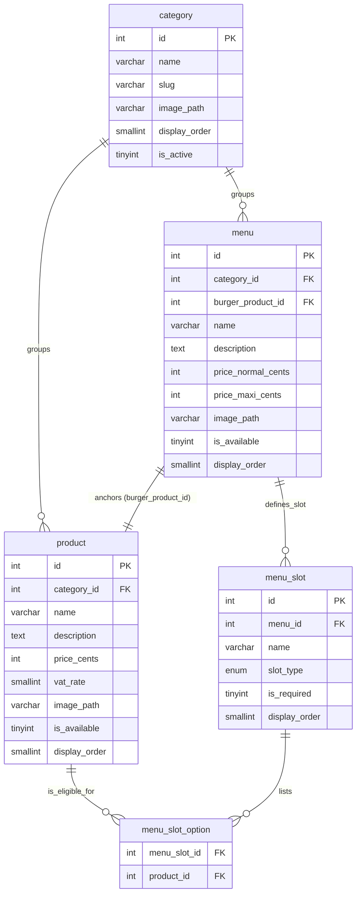
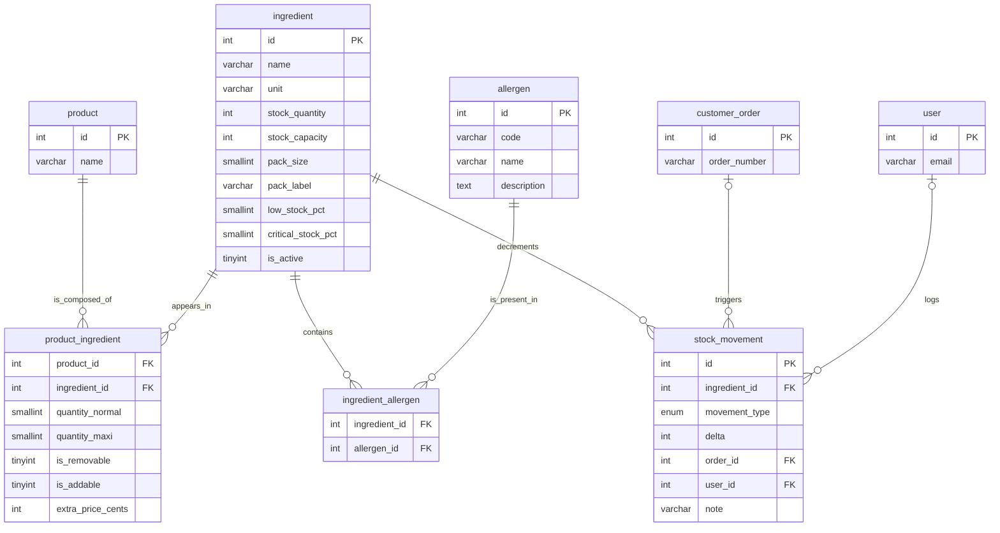
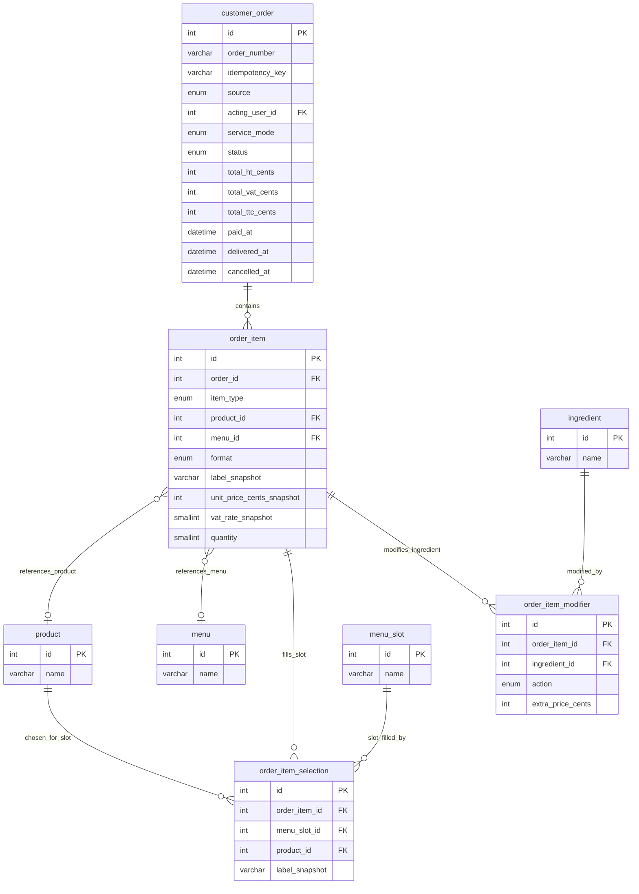
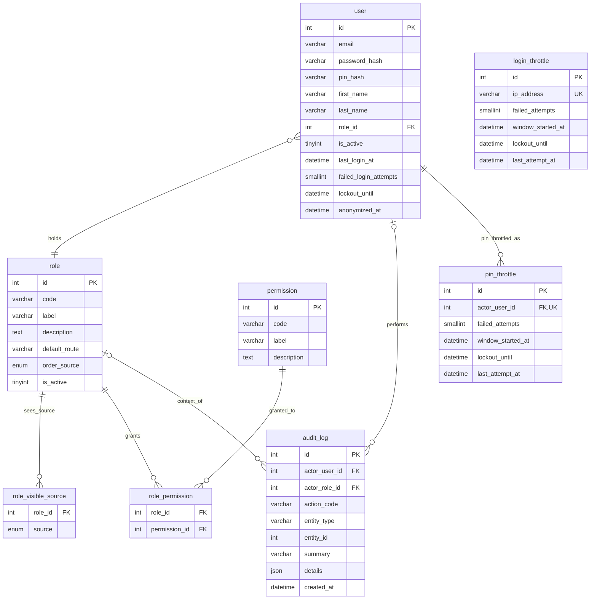

# Modele Conceptuel de Donnees (MCD) — Wakdo

**Phase Merise** : P1 - Conception, etape 2 (data dictionary first, mantra #33)
**Version** : v0.3 — prod-like, 22 entites (19 prod-like + couche security-by-design)
**Date** : 2026-06-04 (ajouts security-by-design 2026-06-11)
**Branche** : `feat/p1-conception`
**Statut** : prod-like — toutes les decisions D1-D8 + stock appliquees (voir `docs/notes/revue-alignement-p1.md` §7) ; couche security-by-design (audit_log + colonnes imputabilite/auth) en cours
**Auteur** : BYAN (couche methodologie)

---

## 1. Objectif de ce document

Le MCD (Modele Conceptuel des Donnees) formalise les **entites** du domaine Wakdo,
leurs **associations**, et les **cardinalites** qui regissent ces associations.
C'est la traduction normalisee du dictionnaire de donnees, et il sert de base au
MLD (mapping relationnel).

Contrairement au dictionnaire (qui detaille les attributs et les types), le MCD se concentre sur la
structure relationnelle : combien de X par Y, si la participation est obligatoire, si les associations portent
leurs propres attributs.

**Sources** :
- `docs/merise/dictionary.md` (v0.3 — 22 entites, source de verite pour tous les noms, types, ENUMs)
- `docs/notes/revue-alignement-p1.md` §7 (table de decisions D1-D8 + stock)
- `docs/PROJECT_CONTEXT.md` (regles metier : composition de menu, flux de commande, RBAC, modes de service)
- `docs/merise/_sources/` (donnees de l'ecole : 9 categories, 53 produits, 13 menus)

---

## 2. Notation Merise utilisee

### Cardinalites au pied de l'association (style Merise francais)

A chaque extremite d'une association, la cardinalite `(min,max)` indique combien de fois une
instance de l'entite participe a l'association.

```
ENTITY_A  (min,max) ----[ ASSOCIATION ]---- (min,max)  ENTITY_B
```

| Notation | Lecture | Exemple |
|---|---|---|
| `(0,1)` | Optionnel, au plus 1 | Un stock_movement est lie a (0,1) customer_order |
| `(1,1)` | Obligatoire, exactement 1 | Un product appartient a (1,1) category |
| `(0,N)` | Optionnel, non borne | Une category regroupe (0,N) products |
| `(1,N)` | Au moins 1, non borne | Une commande contient (1,N) order_items |

Lecture : "une instance de l'entite source participe au moins MIN fois et au plus
MAX fois a l'association".

### Convention de nommage des associations

Verbe d'action en termes metier, par exemple : `groups`, `anchors`, `defines_slot`, `contains`,
`references_product`, `references_menu`, `fills_slot`, `modifies_ingredient`, `logs`,
`holds`, `grants`, `filters_source`, `decrements`.

Les associations N-N qui portent leurs propres attributs deviennent des **entites associatives** dans le MLD
(table de jointure avec colonnes propres).

---

## 3. Decomposition par sous-domaine

Le modele de 22 entites est divise en 4 sous-domaines pour la lisibilite. Au-dela d'environ
5 entites, un diagramme plat unique devient difficile a lire ; la decomposition est la pratique
Merise standard pour les modeles de cette taille.

| Sous-domaine | Entites | Nombre |
|---|---|---|
| Catalogue | category, product, menu, menu_slot, menu_slot_option | 5 |
| Ingredients & Stock | ingredient, product_ingredient, allergen, ingredient_allergen, stock_movement | 5 |
| Order | customer_order, order_item, order_item_selection, order_item_modifier | 4 |
| RBAC & Audit | user, role, role_visible_source, permission, role_permission, audit_log, login_throttle, pin_throttle | 8 |

> **Couche security-by-design (2026-06-11)** : `audit_log` (entite 20) est un journal transverse,
> append-only des actions sensibles ; il est place dans le sous-domaine RBAC & Audit parce que
> ses references (`actor_user_id`, `actor_role_id`) sont des entites RBAC. `login_throttle`
> (entite 21) est un throttle anti-brute-force par IP source, indexe par IP et ne portant aucune FK ; il se situe
> dans le meme sous-domaine parce qu'il protege le chemin d'authentification. `pin_throttle` (entite 22,
> RG-T22) est un throttle du PIN d'action sensible par utilisateur AGISSANT (FK `actor_user_id -> user`,
> ON DELETE CASCADE), compteurs separes du login. Nouvelles colonnes sur des entites existantes :
> `user` cycle de vie auth + `pin_hash` + `anonymized_at`, `customer_order.acting_user_id`
> + `idempotency_key`. Voir note 13 du dictionnaire.

**Note sur l'absence d'un diagramme global** : un unique diagramme ER de 22 entites serait
illisible et impossible a maintenir. La decomposition par sous-domaine ci-dessous est le choix
structurel intentionnel. Chaque sous-domaine est un `erDiagram` Mermaid (faisant autorite, rendu
nativement) avec un rendu SVG portable dans `docs/merise/_diagrams/` ; voir la section 11 pour les
sources et la commande de regeneration.

---

## 4. Sous-domaine : Catalogue

### 4.1 Diagramme entite-relation Mermaid



### 4.2 Cardinalites des associations

| # | Association | Cote A | Cardinalite A | Cote B | Cardinalite B | Justification |
|---|---|---|---|---|---|---|
| C1 | groups (product) | category | (0,N) | product | (1,1) | Une categorie peut exister sans aucun produit pour l'instant (creee vide). Un produit doit appartenir a exactement une categorie pour apparaitre sur la borne. |
| C2 | groups (menu) | category | (0,N) | menu | (1,1) | Meme raisonnement que C1 pour les menus. Les 13 menus appartiennent a la categorie `menus`. |
| C3 | anchors | menu | (1,1) | product | (0,N) | Chaque menu est construit autour d'exactement un produit burger fixe (`burger_product_id`). Un produit peut ancrer 0 ou plusieurs menus (un burger pas encore utilise dans un menu ; ou un burger populaire ancrant plusieurs formats). |
| C4 | defines_slot | menu | (1,N) | menu_slot | (1,1) | Un menu doit definir au moins un slot (boisson, accompagnement, sauce) pour avoir une composition personnalisable. Un slot appartient a exactement un menu. |
| C5 | lists | menu_slot | (1,N) | menu_slot_option | (1,1) | Un slot doit lister au moins un produit eligible (sinon le client ne peut pas le remplir). Chaque ligne d'option appartient a exactement un slot. |
| C6 | is_eligible_for | product | (0,N) | menu_slot_option | (1,1) | Un produit peut etre eligible pour un nombre quelconque de slots a travers tous les menus, ou aucun s'il n'est vendu qu'a la carte. Chaque ligne d'option reference exactement un produit. |

### 4.3 Notes sur le sous-domaine Catalogue

**`menu_slot` vs filtre par categorie** : la liste d'eligibilite explicite `menu_slot_option(menu_slot_id, product_id)` a ete choisie plutot qu'un filtre base sur la categorie (`menu_slot.category_id`). Raisonnement : un produit ajoute a la categorie `drinks` ne devrait pas apparaitre automatiquement dans chaque slot boisson de chaque menu. La liste explicite evite une eligibilite accidentelle quand le catalogue s'agrandit (voir note 11 du dictionnaire).

**`menu.burger_product_id` comme ancre** : le menu reference un produit burger specifique, pas un slot generique. Cela permet au configurateur d'ingredients (sous-domaine Ingredients & Stock) de resoudre quels ingredients sont modifiables pour une ligne de menu, via `menu -> burger_product_id -> product_ingredient`.

**Format Normal / Maxi** : deux prix (`price_normal_cents`, `price_maxi_cents`) sur `menu` ; format enregistre au niveau de `order_item.format`. Aucun differentiel de prix au niveau du slot individuel n'est stocke (voir note 7 du dictionnaire).

---

## 5. Sous-domaine : Ingredients & Stock

### 5.1 Diagramme entite-relation Mermaid



### 5.2 Cardinalites des associations

| # | Association | Cote A | Cardinalite A | Cote B | Cardinalite B | Justification |
|---|---|---|---|---|---|---|
| I1 | is_composed_of | product | (0,N) | product_ingredient | (1,1) | Un produit peut n'avoir aucun ingredient encore saisi dans le systeme (la ligne de catalogue existe avant que la recette ne soit saisie). Une ligne de recette appartient a exactement un produit. |
| I2 | appears_in | ingredient | (1,N) | product_ingredient | (1,1) | Un ingredient en usage actif apparait dans au moins une recette de produit. Chaque ligne de recette reference exactement un ingredient. Les ingredients nouvellement crees sans ligne de recette sont modelises en (0,N) d'un point de vue purement structurel ; la regle metier de (1,N) s'applique aux ingredients en usage de production. |
| I3 | contains (allergens) | ingredient | (0,N) | ingredient_allergen | (1,1) | Un ingredient peut ne contenir aucun allergene reglemente (par exemple, du sel pur). Chaque ligne de lien d'allergene appartient a un ingredient. |
| I4 | is_present_in | allergen | (0,N) | ingredient_allergen | (1,1) | Un allergene peut initialement n'avoir aucun ingredient lie (seed : le catalogue d'allergenes est complet avant que les donnees de recette ne soient saisies). Chaque ligne de lien reference un allergene. |
| I5 | decrements | ingredient | (0,N) | stock_movement | (1,1) | Tous les mouvements affectent exactement un ingredient. Un ingredient peut n'avoir encore aucune ligne de mouvement de stock s'il a ete cree recemment et qu'aucune commande n'a ete passee. Chaque ligne de mouvement reference exactement un ingredient. |
| I6 | triggers | customer_order | (0,1) | stock_movement | (0,N) | Un mouvement `sale` ou `cancellation` reference la commande d'origine. Un `restock` ou `inventory_correction` n'a pas de commande (NULL). Une commande donnee declenche des mouvements sur tous ses ingredients ; une commande encore `pending_payment` n'a declenche aucun mouvement. |
| I7 | logs | user | (0,1) | stock_movement | (0,N) | Les decrements de vente automatises n'ont pas d'utilisateur (NULL). Les reapprovisionnements et corrections manuels sont attribues a un utilisateur. Un utilisateur peut journaliser un nombre quelconque de mouvements. |

### 5.3 Notes sur le sous-domaine Ingredients & Stock

**`product_ingredient` comme entite associative** : l'association N-N entre `product` et `ingredient` porte cinq attributs (`quantity_normal`, `quantity_maxi`, `is_removable`, `is_addable`, `extra_price_cents`). Elle devient une table de jointure dans le MLD avec une PK composite `(product_id, ingredient_id)`.

**`ingredient_allergen` comme table de jointure pure** : aucun attribut propre. L'ensemble des allergenes d'un produit est calcule au moment de la requete en joignant `product_ingredient -> ingredient_allergen -> allergen` ; aucune saisie manuelle par produit n'est necessaire.

**Immuabilite de `stock_movement`** : cette table est append-only. Aucun UPDATE ni DELETE n'est autorise au niveau applicatif. Les corrections sont de nouvelles lignes avec `movement_type = 'inventory_correction'` et un `delta` signe.

**Modele de stock base sur les pourcentages** : la sante du stock est ancree sur une `stock_capacity` par ingredient (la reference 100%, `CHECK > 0`). `stock_quantity` est signe et peut devenir negatif quand les ventes depassent le stock compte ; le systeme ne bloque pas une commande sur une lecture de stock bas. `stock_pct = ROUND(stock_quantity / stock_capacity * 100)` est calcule, pas stocke. Deux seuils en pourcentage pilotent un comportement a trois bandes : `low_stock_pct` (bande d'alerte, defaut 10%) et `critical_stock_pct` (plancher de mise en rupture automatique, defaut 5%), avec l'invariant au niveau de la table `critical_stock_pct < low_stock_pct`. Au-dessus de la bande d'alerte, c'est normal ; entre critique et bas, le produit reste commandable et une alerte manager est levee (le manager soit retire le produit via `product.is_available = 0`, soit reapprovisionne pour lever l'alerte) ; au niveau ou en dessous de la bande critique, le produit passe automatiquement en rupture (calcule, voir ci-dessous).

**Disponibilite produit calculee (regle RG-T21, voir `mlt.md`)** : la commandabilite effective est derivee, pas stockee. Un produit est commandable quand `product.is_available = 1` ET que chaque ingredient non retirable (`is_removable = 0`) de son `product_ingredient` a `stock_quantity > stock_capacity * critical_stock_pct / 100`. Un ingredient requis atteignant la bande critique met le produit en rupture automatique sans ecriture et sans cascade ; un retrait manuel (`product.is_available = 0`) est une surcharge forte ; un reapprovisionnement au-dessus de la bande critique rend le produit commandable a nouveau de lui-meme. Un ingredient retirable/optionnel a la bande critique ne bloque pas le produit (seul son supplement devient indisponible). Le tableau de bord distingue un retrait manuel d'une rupture pilotee par le stock.

---

## 6. Sous-domaine : Order

### 6.1 Diagramme entite-relation Mermaid



### 6.2 Cardinalites des associations

| # | Association | Cote A | Cardinalite A | Cote B | Cardinalite B | Justification |
|---|---|---|---|---|---|---|
| O1 | contains | customer_order | (1,N) | order_item | (1,1) | Une commande sans au moins une ligne n'a aucun sens metier. Une ligne appartient a exactement une commande. ON DELETE CASCADE : si la commande est purgee, ses lignes partent avec elle. |
| O2 | references_product | order_item | (0,1) | product | (0,N) | Quand `item_type = 'product'`, `product_id` est non nul (1 produit reference). Quand `item_type = 'menu'`, `product_id` est NULL (0). Un produit peut apparaitre dans un nombre quelconque de lignes de commande a travers l'historique. |
| O3 | references_menu | order_item | (0,1) | menu | (0,N) | Symetrique a O2 pour la branche du discriminateur menu. Exactement un de O2/O3 est actif par ligne (contrainte CHECK dans le MLD). |
| O4 | fills_slot | order_item | (0,N) | order_item_selection | (1,1) | Une ligne de commande de type `menu` a une selection par slot (typiquement 2-3). Une ligne de type `product` n'a aucune selection (0). Chaque ligne de selection appartient a exactement une ligne de commande. |
| O5 | slot_filled_by | menu_slot | (0,N) | order_item_selection | (1,1) | Une definition de slot peut avoir ete choisie de nombreuses fois a travers les commandes historiques (0,N). Chaque ligne de selection reference exactement un slot. ON DELETE RESTRICT : preserve les enregistrements historiques si la definition de slot est modifiee ulterieurement. |
| O6 | chosen_for_slot | product | (0,N) | order_item_selection | (1,1) | Un produit peut avoir ete selectionne pour de nombreux choix de slot a travers l'historique. Chaque selection reference un produit. |
| O7 | modifies_ingredient | order_item | (0,N) | order_item_modifier | (1,1) | Une ligne de commande peut avoir un nombre quelconque de modifications d'ingredients (retirer l'oignon, ajouter du fromage). Chaque ligne de modificateur appartient a une ligne de commande. |
| O8 | modified_by | ingredient | (0,N) | order_item_modifier | (1,1) | Un ingredient peut avoir ete modifie dans de nombreuses lignes de commande a travers l'historique. Chaque modificateur reference un ingredient. |

### 6.3 Notes sur le sous-domaine Order

**Polymorphisme sur `order_item`** : chaque ligne reference soit un `product`, soit un `menu` (ni les deux, ni aucun). Le discriminateur `item_type` ENUM pilote quelle FK est renseignee. L'exclusivite mutuelle est imposee par une contrainte CHECK dans le MLD. Ce pattern (2 FK nullables + discriminateur + CHECK) est une approche relationnelle standard de l'heritage en table unique sans table separee par type.

**`order_item_selection` (choix de slot de menu)** : capture quel produit le client a choisi pour chaque slot d'une ligne de menu. Une ligne par slot rempli. Utilise pour l'analyse de KPI (combinaisons boisson/accompagnement les plus populaires). Le `label_snapshot` preserve le nom du produit au moment de la transaction.

**`order_item_modifier` (modifications d'ingredients)** : se rattache a un `order_item` que la ligne soit un produit autonome ou un menu. Pour une ligne de menu, le produit modifiable est le burger fixe, resolu via `order_item.menu_id -> menu.burger_product_id` (voir note 10 du dictionnaire). Aucune colonne FK supplementaire n'est necessaire sur `order_item_modifier`.

**Snapshots de prix** : `label_snapshot`, `unit_price_cents_snapshot`, et `vat_rate_snapshot` sur `order_item` preservent l'etat au moment de la transaction. Si un produit est ulterieurement renomme ou retarife, les donnees de commande historiques restent coherentes. ON DELETE RESTRICT sur `product_id` et `menu_id` est une protection secondaire.

**Calcul de `service_day`** (regroupement KPI) : non stocke comme colonne. Calcule au moment de la requete :
```sql
CASE WHEN HOUR(created_at) < 10 THEN DATE(created_at) - INTERVAL 1 DAY ELSE DATE(created_at) END
```
Seuil : 10:00. La formule de colonne generee avec `INTERVAL 4 HOUR 30 MINUTE` du MLD v0.1
etait incorrecte et est abandonnee (decision D6, `revue-alignement-p1.md` §7).

**`source = 'drive' => service_mode = 'drive'`** : contrainte croisee. Une commande du canal drive ne peut
avoir que `service_mode = 'drive'`. Imposee au niveau applicatif (et optionnellement comme CHECK dans
le MLD).

**Machine a 4 etats** (`pending_payment -> paid -> delivered` + `cancelled`) :
`preparing` et `ready` sont abandonnes (decision D4, `revue-alignement-p1.md` §7). Le timing KPI est
`delivered_at - paid_at` ; le codage couleur KDS est calcule a partir de `NOW() - paid_at`.

**Colonnes security-by-design (2026-06-11)** : `idempotency_key` (UUID client, UNIQUE)
deduplique un `POST /api/orders` rejoue. `acting_user_id` (FK -> `user`, ON DELETE SET NULL)
enregistre l'employe de comptoir/drive qui a pris la commande sous PIN ; NULL pour les commandes anonymes de la borne.
Cela ajoute une association `customer_order |o--o| user : "taken_by"` (cardinalite : une commande est
prise par (0,1) user ; un user prend (0,N) commandes). Voir note 13 du dictionnaire.

---

## 7. Sous-domaine : RBAC

### 7.1 Diagramme entite-relation Mermaid



> `login_throttle` est une entite autonome sans association : elle est indexee par IP source
> (`ip_address UNIQUE`), pas par un acteur modelise, donc elle ne porte aucune FK et ne se connecte a aucune
> autre entite du diagramme. `pin_throttle` (RG-T22), au contraire, est cle par l'utilisateur AGISSANT
> (`actor_user_id UNIQUE`, FK -> `user` ON DELETE CASCADE) : c'est la dimension qui rend le throttle du PIN
> non contournable par rotation d'email et sans collateral sur un poste partage.

### 7.2 Cardinalites des associations

| # | Association | Cote A | Cardinalite A | Cote B | Cardinalite B | Justification |
|---|---|---|---|---|---|---|
| R1 | holds | user | (1,1) | role | (0,N) | Un utilisateur doit avoir exactement un role pour acceder au back-office. Un role peut n'avoir aucun utilisateur actuel (cree mais pas encore assigne). ON DELETE RESTRICT sur `role_id` : un role ne peut etre supprime tant que des utilisateurs le detiennent. |
| R2 | sees_source | role | (0,N) | role_visible_source | (1,1) | Un role peut voir 0 ou plusieurs sources de commande sur le tableau de bord de preparation (admin/manager utilisent une vue globale sans filtre de source). Chaque ligne de visibilite appartient a exactement un role. |
| R3 | grants | role | (0,N) | role_permission | (1,1) | Un role peut n'avoir aucune permission (un role nouvellement cree avant assignation) ou plusieurs. Chaque ligne de mapping appartient a un role. |
| R4 | granted_to | permission | (0,N) | role_permission | (1,1) | Une permission peut n'etre encore accordee a aucun role (declaree au seed, pas encore distribuee) ou a plusieurs. Chaque ligne de mapping reference une permission. |
| R5 | performs | user | (0,1) | audit_log | (0,N) | Une action sensible capturee sous PIN enregistre son utilisateur agissant ; les entrees automatisees/non attribuables portent NULL. Un utilisateur peut avoir journalise un nombre quelconque d'actions. ON DELETE SET NULL preserve la trace lors de l'anonymisation/suppression de l'utilisateur. |
| R6 | context_of | role | (0,1) | audit_log | (0,N) | Chaque ligne d'audit peut denormaliser le role de l'acteur au moment de l'action (NULL autorise). Un role peut etre le contexte de nombreuses lignes d'audit. ON DELETE SET NULL preserve la trace. |
| R9 | pin_throttled_as | user | (1,1) | pin_throttle | (0,1) | Throttle du PIN d'action sensible (RG-T22) : au plus une ligne `pin_throttle` par utilisateur agissant (cle UNIQUE `actor_user_id`), creee au premier echec et upsertee ensuite. ON DELETE CASCADE : l'etat de throttle (ephemere) part avec le compte supprime/anonymise. |

### 7.3 Notes sur le sous-domaine RBAC

**Architecture RBAC** : les roles sont dynamiques (creables et modifiables via l'UI admin). Les permissions sont statiques (declarees en migration, liees au code applicatif). Le code applicatif teste les permissions, pas les noms de role : ajouter un nouveau role avec les bonnes permissions ne necessite aucun changement de code (permission-driven, selon le modele RBAC Sandhu/NIST — decision D4, `revue-alignement-p1.md` §7).

**`role.order_source`** : quand un employe de comptoir ou de drive cree une commande, la colonne `source` sur `customer_order` est automatiquement renseignee a partir de l'`order_source` de son role. NULL pour admin et manager (ils peuvent creer pour le compte de n'importe quel canal).

**`role.default_route`** : l'ecran d'arrivee pour chaque role, stocke en base de donnees. Le routage front-end lit cette valeur au login ; aucun nom de role n'est code en dur dans la logique de routage.

**`role_visible_source`** : une table de jointure pure liant un role a l'ensemble des sources de commande visibles sur le tableau de bord de preparation. Un role `kitchen` voit les trois sources ; un role `counter` voit `kiosk` et `counter` ; un role `drive` ne voit que `drive`.

**`role_permission`** et **`role_visible_source`** utilisent tous deux des PK composites. ON DELETE CASCADE sur les deux FK de `role_permission` (supprimer un role ou une permission retire ses mappings). ON DELETE CASCADE sur le `role_id` de `role_visible_source`.

**Roles de seed** (5 roles, figes au DDL ; extensibles sans changement de code) :
`admin`, `manager`, `kitchen`, `counter`, `drive`.

**`audit_log` (security-by-design)** : journal append-only des actions sensibles, immuable comme
`stock_movement`. Les deux FK (`actor_user_id`, `actor_role_id`) sont nullables avec ON DELETE
SET NULL, de sorte que la trace survit a l'anonymisation de l'utilisateur (RGPD) et a la suppression de role. Le `actor_role_id`
est denormalise a dessein : meme si l'utilisateur est ulterieurement anonymise, le contexte de role de
l'action est preserve. Il ne porte aucune PII (le JSON `details` stocke les noms des champs modifies, pas les
valeurs pour les actions ciblant un utilisateur). Voir dictionnaire 3.20 et note 13.

**`login_throttle` (security-by-design)** : throttle anti-brute-force par IP source, complementant
le compteur par compte deja present sur `user` (`failed_login_attempts` / `lockout_until`). Une ligne
par IP (`ip_address VARCHAR(45) UNIQUE`, 45 caracteres pour contenir un litteral IPv6 complet), upsertee a chaque
echec de login : `failed_attempts` compte les echecs consecutifs depuis cette IP dans la fenetre courante,
`window_started_at` marque le debut de cette fenetre (qui se reinitialise a son expiration), `lockout_until`
contient la fin du backoff degressif (NULL = non throttle), `last_attempt_at` l'horodatage
de la derniere tentative echouee. Elle n'a aucune FK (une IP n'est pas une entite modelisee) et aucune association. Un
cron quotidien purge les lignes sans lockout actif dont le `last_attempt_at` est plus ancien que 24h. Voir
dictionnaire 3.21 et note 13.

**`pin_throttle` (security-by-design, RG-T22)** : throttle du PIN d'action sensible, distinct du throttle
de connexion. La dimension est l'utilisateur AGISSANT (l'identite de session qui soumet email+PIN), pas
l'email cible (contournable par rotation) ni l'IP (qui penaliserait tous les equipiers d'un poste partage).
Une ligne par acteur (`actor_user_id UNIQUE`, FK -> `user` ON DELETE CASCADE), upsertee a chaque echec hors
verrou ; memes colonnes que `login_throttle` mais des bornes propres (PIN_THROTTLE_*, plus permissives).
Compteurs physiquement separes du login : un echec de PIN n'incremente aucun compteur de connexion. Meme
purge cron quotidienne. Association R9 (`user` 1 -- 0,N `pin_throttle`). Voir dictionnaire 3.22 et note 13.

---

## 8. Validation croisee MCD <-> dictionnaire

Verification que les 22 entites du dictionnaire apparaissent dans le MCD et reciproquement.

| # | Entite du dictionnaire (section 3) | Sous-domaine dans le MCD | Presente |
|---|---|---|---|
| 1 | `category` (3.1) | Catalogue | Oui |
| 2 | `product` (3.2) | Catalogue + Ingredients + Order | Oui |
| 3 | `menu` (3.3) | Catalogue + Order | Oui |
| 4 | `menu_slot` (3.4) | Catalogue + Order | Oui |
| 5 | `menu_slot_option` (3.5) | Catalogue | Oui |
| 6 | `ingredient` (3.6) | Ingredients + Order | Oui |
| 7 | `product_ingredient` (3.7) | Ingredients | Oui |
| 8 | `allergen` (3.8) | Ingredients | Oui |
| 9 | `ingredient_allergen` (3.9) | Ingredients | Oui |
| 10 | `customer_order` (3.10) | Order | Oui |
| 11 | `order_item` (3.11) | Order | Oui |
| 12 | `order_item_selection` (3.12) | Order | Oui |
| 13 | `order_item_modifier` (3.13) | Order | Oui |
| 14 | `user` (3.14) | RBAC | Oui |
| 15 | `role` (3.15) | RBAC | Oui |
| 16 | `role_visible_source` (3.16) | RBAC | Oui |
| 17 | `permission` (3.17) | RBAC | Oui |
| 18 | `role_permission` (3.18) | RBAC | Oui |
| 19 | `stock_movement` (3.19) | Ingredients & Stock | Oui |
| 20 | `audit_log` (3.20) | RBAC & Audit | Oui |
| 21 | `login_throttle` (3.21) | RBAC & Audit | Oui |
| 22 | `pin_throttle` (3.22) | RBAC & Audit | Oui |

**Resultat** : 22/22 entites tracees (19 prod-like + `audit_log`, `login_throttle` et `pin_throttle`
security-by-design). Aucune entite du dictionnaire n'est absente du MCD. Aucune entite du MCD
ne tombe en dehors du dictionnaire.

**Entites apparaissant dans plusieurs sous-domaines** (entites partagees inter-domaines) :
- `product` : Catalogue (article vendu, eligibilite de slot) + Ingredients (recette) + Order (reference de ligne, choix de slot)
- `menu` : Catalogue (definition, slots) + Order (reference de ligne)
- `menu_slot` : Catalogue (definition de slot) + Order (choix de slot via `order_item_selection`)
- `ingredient` : Ingredients (recette, stock) + Order (modificateurs)
- `customer_order` : Order (cycle de vie de la commande) + Ingredients (declencheur de mouvement de stock) + RBAC & Audit (employe taken_by via `acting_user_id`)
- `user` : RBAC (authentification) + Ingredients (auteur de mouvement de stock) + Order (`acting_user_id` sur les commandes comptoir/drive) + Audit (acteur de `audit_log`)
- `role` : RBAC (permissions, sources visibles) + Audit (contexte `actor_role_id` denormalise sur `audit_log`)

C'est attendu dans un modele normalise. La division par sous-domaine est pour la lisibilite ; le schema
relationnel reel est un graphe unifie.

---

## 9. Decisions reportees au MLD

Le MCD reste au niveau conceptuel. Les decisions suivantes sont reportees au MLD :

1. **Resolution des entites associatives en tables** : `product_ingredient`, `menu_slot_option`,
   `ingredient_allergen`, `role_visible_source`, `role_permission` deviennent des tables de jointure avec
   des PK composites.
2. **PK technique vs identifiant metier** : `id INT UNSIGNED AUTO_INCREMENT` sur toutes les entites principales.
   `customer_order` porte en plus `order_number VARCHAR(20) UNIQUE` (lisible par un humain,
   format `K/C/D-YYYY-MM-DD-NNN` par canal).
3. **Regles ON DELETE** : CASCADE vs RESTRICT vs SET NULL. Detaillees dans le MLD.
4. **Contraintes CHECK** : exclusivite de polymorphisme sur `order_item`, contrainte croisee
   `source/service_mode` sur `customer_order`, invariant arithmetique sur les totaux.
5. **Index** : non discutes au niveau MCD. Definis dans le MLD pour les patterns de requete frequents.
6. **Formule `service_day`** : expression applicative CASE, pas une colonne generee stockee.
   Documentee dans le MLD.

---

## 10. Coherence MCD <-> MCT (mantra #34)

Pre-validation : chaque entite participe a au moins un traitement.

| Entite | Traitement(s) attendu(s) |
|---|---|
| `category` | CRUD admin |
| `product` | CRUD admin + ajout au panier borne |
| `menu` | CRUD admin + ajout au panier borne |
| `menu_slot` | CRUD admin (composition de menu) |
| `menu_slot_option` | CRUD admin (gestion de l'eligibilite des slots) |
| `ingredient` | CRUD admin + mouvements de stock |
| `product_ingredient` | Gestion des recettes admin |
| `allergen` | CRUD admin (seed : catalogue en lecture seule) |
| `ingredient_allergen` | Mapping des allergenes admin |
| `customer_order` | Cycle de vie complet de la commande (create -> pay -> deliver / cancel) |
| `order_item` | Construction du panier, creation de ligne a la validation |
| `order_item_selection` | Selection de slot de menu pendant la construction du panier |
| `order_item_modifier` | Modification d'ingredient pendant la construction du panier |
| `user` | CRUD admin + login |
| `role` | CRUD admin + assignation d'utilisateur |
| `role_visible_source` | Configuration de role admin |
| `permission` | Gestion de la matrice de permissions admin |
| `role_permission` | Gestion de la matrice de permissions admin |
| `stock_movement` | Automatique a la transition `paid` ; reapprovisionnement manuel et correction d'inventaire |
| `audit_log` | Ecrit par les operations sensibles : UPDATE/DELETE product/menu (8.2/8.3/8.6), CANCEL_ORDER (7.1), RESTOCK/INVENTORY_COUNT (9.1/9.2), operations utilisateur (10.1-10.3), MANAGE_RBAC (10.4), et logins echoues/reussis (12.1) |
| `login_throttle` | Lu et ecrit par AUTHENTICATE_USER (12.1) : throttle par IP source upserte a chaque echec de login, lu pour imposer la fenetre de backoff, purge par un cron quotidien |

La validation croisee MCD <-> MCT (mantra #34) sera completee de maniere exhaustive dans `mct.md`
une fois que le MCT integrera les operations security-by-design (actions sensibles protegees par PIN,
ecritures d'audit, reset/lockout, anonymisation). Les ajouts de la couche traitements y sont suivis.

---

## 11. Sources des diagrammes et regeneration

Le modele graphique faisant autorite est l'ensemble des blocs `erDiagram` Mermaid des sections 4-7,
un par sous-domaine. Ils s'affichent nativement sur Forgejo et GitHub. Le MCD est decompose par
sous-domaine a dessein : un unique diagramme de 22 entites ne peut etre dispose sans croisement de
lignes de relation (limite de planarite intrinseque, et `erDiagram` n'offre aucun controle de mise en page
manuel). Chaque sous-domaine reste a 5-8 entites, ce que la mise en page automatique gere proprement. La
vue integree a travers les sous-domaines est la table de validation croisee de la section 8.

Des rendus SVG portables se trouvent dans `docs/merise/_diagrams/` (pour l'export PDF / consultation hors ligne) :

| Sous-domaine | Source | Rendu |
|---|---|---|
| Catalogue | `mcd-catalogue.mmd` | `mcd-catalogue.svg` |
| Ingredients & Stock | `mcd-ingredients-stock.mmd` | `mcd-ingredients-stock.svg` |
| Order | `mcd-order.mmd` | `mcd-order.svg` |
| RBAC | `mcd-rbac.mmd` | `mcd-rbac.svg` |

Les fichiers `.mmd` sont extraits des blocs `erDiagram` ci-dessus ; les `.svg` sont produits par
`make docs-render` (mmdc). Si un bloc ici change, re-extraire le `.mmd` correspondant et relancer
`make docs-render`. Les anciennes sources `.drawio` v0.1 ont ete supprimees : drawio offrait un controle de mise en page
manuel mais necessitait une edition a la main et ne s'affichait pas dans les apercus Markdown, alors que
les blocs Mermaid decomposes sont versionnes, s'affichent partout, et restent synchronises avec
ce document.
