# Modele Conceptuel des Donnees (MCD) - Wakdo

**Phase Merise** : P1 - Conception, etape 2 (apres dictionnaire de donnees)
**Statut** : v0.1
**Date** : 2026-04-30
**Branche** : `feat/p1-conception`

---

## 1. Objet du document

Le MCD (Modele Conceptuel des Donnees) formalise les **entites** du domaine
Wakdo, leurs **associations** et les **cardinalites** qui regissent ces
associations. Il est la traduction normalisee du dictionnaire de donnees, et
sert de base au MLD (Modele Logique des Donnees) qui produira le schema
relationnel.

A la difference du dictionnaire (qui detaille les attributs et types), le MCD
focalise sur la structure relationnelle : combien de X pour un Y, est-ce
obligatoire, peut-il y avoir des relations sans participants ?

**Sources** :
- `docs/merise/dictionary.md` (entites + attributs identifies)
- `docs/PROJECT_CONTEXT.md` (regles metier : composition menu, parcours commande, RBAC)
- `docs/merise/_sources/` (donnees ecole : 9 categories + 53 produits + 13 menus)

---

## 2. Notation Merise utilisee

### Cardinalites au pied de l'association (style francais)

A chaque extremite d'une association, la cardinalite `(min, max)` precise
combien de fois une instance de l'entite participe a l'association.

```
ENTITE_A  (min,max) ----[ ASSOCIATION ]---- (min,max)  ENTITE_B
```

| Notation | Lecture | Exemple |
|---|---|---|
| `(0,1)` | Optionnel, au plus 1 | Un user a (0,1) avatar |
| `(1,1)` | Obligatoire, exactement 1 | Un produit appartient a (1,1) categorie |
| `(0,N)` | Optionnel, illimite | Une categorie regroupe (0,N) produits |
| `(1,N)` | Obligatoire au moins 1, illimite | Une commande contient (1,N) lignes |

Lecture francaise : "une instance de l'entite-source participe au moins MIN
fois et au plus MAX fois a l'association".

### Convention nommage des associations

Verbe a l'infinitif au sens metier, ex : `regroupe`, `compose`, `contient`,
`refere`, `a_pour_role`, `possede`.

Les associations qui portent des attributs (= relations N-N enrichies)
deviennent des **entites associatives** au MLD (table de jointure avec
colonnes propres).

---

## 3. Vue d'ensemble (diagramme global)

Diagramme entites-relations dessine dans draw.io, exporte en SVG. Les
sources `.drawio` editables sont dans `_diagrams/`. Cardinalites Merise
`(min,max)` notees directement sur les associations. Recapitulatif des
cardinalites en section 5.


*Source : [`_diagrams/mcd-global.drawio`](_diagrams/mcd-global.drawio)*

> **A regenerer** : le diagramme global doit etre mis a jour pour inclure l'entite `COMMANDE_EVENT` (11 entites au total) et l'attribut `source` sur `COMMANDE`. Le SVG actuel reflete l'etat anterieur a ces decisions.

### Lecture rapide

- Une `CATEGORIE` regroupe `(0,N)` `PRODUIT` ou `MENU` ; un `PRODUIT` ou un
  `MENU` appartient a `(1,1)` categorie (chacun cote sa categorie de
  rattachement).
- Un `MENU` est compose de `(1,N)` produits (un menu sans composition n'a pas
  de sens metier) ; un `PRODUIT` peut faire partie de `(0,N)` menus
  (independance).
- Une `COMMANDE` contient `(1,N)` `LIGNE_COMMANDE` (commande vide impossible) ;
  une ligne appartient a `(1,1)` commande.
- Une `LIGNE_COMMANDE` refere `(0,1)` `PRODUIT` OU `(0,1)` `MENU` selon le
  discriminateur `type_item` (polymorphisme).
- Une `COMMANDE` est journalisee par `(1,N)` `COMMANDE_EVENT` (au moins 1 event `CREATED`, append-only).
- Un `USER` declenche `(0,N)` `COMMANDE_EVENT` (NULL possible si event auto-kiosk).
- Un `USER` a `(1,1)` `ROLE` (un user sans role ne peut pas se connecter) ;
  un `ROLE` peut etre porte par `(0,N)` users.
- Un `ROLE` possede `(0,N)` `PERMISSION` via `ROLE_PERMISSION` (matrice N-N).

---

## 4. Decomposition par sous-domaine

Le modele est segmente en 3 sous-domaines pour faciliter la lecture et
l'analyse :

1. **Catalogue** : produits, menus, categories, composition
2. **Commande** : commande, lignes, references polymorphiques
3. **RBAC** : users, roles, permissions, mapping

### 4.1 Sous-domaine Catalogue



*Source : [`_diagrams/mcd-catalogue.drawio`](_diagrams/mcd-catalogue.drawio)*

#### Justification des cardinalites

| Cote | Cardinalite | Justification |
|---|---|---|
| Categorie -> Produit | `(0,N)` cote Categorie | Une categorie peut etre creee a vide (ex : "petit dejeuner" ajoutee sans produit initial). Maximum illimite (au moins 53 produits dans la source actuelle, repartis sur 9 categories). |
| Categorie -> Produit | `(1,1)` cote Produit | Tout produit doit etre rattache a une categorie pour etre affiche sur la borne. Pas de produit "orphelin". |
| Categorie -> Menu | `(0,N)` cote Categorie | Toutes les categories sauf "menus" ont 0 menu. La categorie "menus" en a 13. |
| Categorie -> Menu | `(1,1)` cote Menu | Tout menu est rattache a la categorie "menus" (par construction du modele). Un menu sans categorie ne s'affiche pas sur la borne. |
| Menu -> MenuProduit | `(1,N)` cote Menu | Un menu doit avoir au moins 1 produit dans sa composition. Sans composition, le menu est invendable. |
| Produit -> MenuProduit | `(0,N)` cote Produit | Un produit peut exister independamment des menus (vente a la carte uniquement). Inversement, un produit peut entrer dans plusieurs menus differents (ex : frites moyennes presentes dans plusieurs combos). |

#### Note sur l'entite associative `MENU_PRODUIT`

`MENU_PRODUIT` est une entite associative : la relation N-N entre `MENU` et
`PRODUIT` porte deux attributs metier (`role` et `position`). Au MLD, elle
deviendra une table de jointure avec PK composite `(menu_id, produit_id)`.

### 4.2 Sous-domaine Commande


*Source : [`_diagrams/mcd-commande.drawio`](_diagrams/mcd-commande.drawio)*

> **A regenerer** : le diagramme `mcd-commande.drawio` doit etre mis a jour pour inclure l'entite `COMMANDE_EVENT` (cf. section 4.2.bis ci-dessous) et l'attribut `source` sur `COMMANDE`. Le SVG actuel reflete l'etat anterieur a ces decisions.

#### Justification des cardinalites

| Cote | Cardinalite | Justification |
|---|---|---|
| Commande -> LigneCommande | `(1,N)` cote Commande | Une commande sans aucune ligne n'a pas de sens metier. Au moment de la validation (passage de `pending_payment` a `paid`), au moins 1 ligne est presente. |
| Commande -> LigneCommande | `(1,1)` cote LigneCommande | Toute ligne appartient a exactement une commande. ON DELETE CASCADE (si commande supprimee, lignes aussi). |
| LigneCommande -> Produit | `(0,N)` cote Produit | Un produit peut etre commande des centaines de fois. Maximum non borne. |
| LigneCommande -> Produit | `(0,1)` cote LigneCommande | Selon `type_item` : si `'produit'` -> 1 produit reference ; si `'menu'` -> 0 (la colonne `produit_id` est NULL). |
| LigneCommande -> Menu | `(0,N)` cote Menu | Symetrique de Produit. |
| LigneCommande -> Menu | `(0,1)` cote LigneCommande | Selon `type_item` : si `'menu'` -> 1 menu reference ; si `'produit'` -> 0. |
| Commande -> CommandeEvent | `(1,N)` cote Commande | Toute commande a au moins 1 event (CREATED) ; en pratique 5-8 events sur tout son cycle de vie. |
| Commande -> CommandeEvent | `(1,1)` cote CommandeEvent | Chaque event appartient a exactement une commande. ON DELETE CASCADE. |
| User -> CommandeEvent | `(0,N)` cote User | Un equipier peut declencher 0 a N events (un nouveau user n'a encore rien fait). |
| User -> CommandeEvent | `(0,1)` cote CommandeEvent | NULL si event auto (kiosk paye via CB sans equipier) ou si le user a ete supprime (ON DELETE SET NULL preserve l'audit). |

#### Note sur le polymorphisme

La cardinalite `(0,1)` cote LigneCommande pour les deux associations
`refere_si_type_produit` et `refere_si_type_menu` reflete le polymorphisme :
**exactement une** des deux references est non-nulle, l'autre est nulle.
Cette regle d'exclusivite est a renforcer au MLD via une contrainte CHECK
SQL ou une regle applicative :

```sql
CHECK (
    (type_item = 'produit' AND produit_id IS NOT NULL AND menu_id IS NULL)
    OR (type_item = 'menu' AND menu_id IS NOT NULL AND produit_id IS NULL)
)
```

Voir `docs/notes/polymorphic-fk-snapshots.md` pour le detail du choix de
modelisation polymorphique.

#### 4.2.bis Journal d'audit `COMMANDE_EVENT` (event sourcing simplifie)

`COMMANDE_EVENT` est une entite append-only qui journalise chaque changement d'etat d'une commande, avec l'auteur de la transition (un `USER` ou NULL si auto). Pattern event sourcing simplifie (cf. note 10 du dictionnaire).

Trois proprietes invariantes :

1. **Append-only** : aucun UPDATE / DELETE applicatif sur `commande_event`. Garantie d'integrite de l'audit.
2. **Lien fort a la commande** : `ON DELETE CASCADE` cote `commande_id` (si la commande disparait, son journal aussi).
3. **Lien faible a l'user** : `ON DELETE SET NULL` cote `user_id` (si un equipier est supprime, les events restent avec `user_id = NULL` ; l'audit reste consultable, seule l'attribution individuelle est perdue).

La contrainte croisee `(source, mode_consommation)` introduite par l'attribut `source` sur `COMMANDE` (cf. dictionnaire note 8) est verifiee au MLT lors de la creation de la commande, pas au MCD.

### 4.3 Sous-domaine RBAC


*Source : [`_diagrams/mcd-rbac.drawio`](_diagrams/mcd-rbac.drawio)*

#### Justification des cardinalites

| Cote | Cardinalite | Justification |
|---|---|---|
| User -> Role | `(1,1)` cote User | Un user doit avoir un role pour acceder au back-office. Pas de connexion sans role. |
| User -> Role | `(0,N)` cote Role | Un role peut exister sans aucun user (ex : nouveau role cree dans l'UI admin avant d'etre assigne). |
| Role -> Permission (via ROLE_PERMISSION) | `(0,N)` cote Role | Un role peut avoir 0 permission (role "vide" ou "en construction") jusqu'a toutes les permissions (admin). |
| Role -> Permission (via ROLE_PERMISSION) | `(0,N)` cote Permission | Une permission peut etre assignee a 0 role (permission declaree mais pas encore distribuee) ou a plusieurs roles. |

#### Note sur le modele RBAC

Le RBAC retenu est **dynamique cote roles** (creables/modifiables via UI
admin) et **statique cote permissions** (declarees en migration, liees au
code applicatif). Voir `docs/notes/rbac-roles-permissions.md` pour le detail
du choix.

---

## 5. Recapitulatif global des cardinalites

| # | Association | Cote A | Cardinalite A | Cote B | Cardinalite B |
|---|---|---|---|---|---|
| 1 | regroupe (Categorie -> Produit) | Categorie | (0,N) | Produit | (1,1) |
| 2 | regroupe (Categorie -> Menu) | Categorie | (0,N) | Menu | (1,1) |
| 3 | compose (Menu <-> Produit via MenuProduit) | Menu | (1,N) | Produit | (0,N) |
| 4 | contient (Commande -> LigneCommande) | Commande | (1,N) | LigneCommande | (1,1) |
| 5 | refere_si_type_produit (LigneCommande -> Produit) | LigneCommande | (0,1) | Produit | (0,N) |
| 6 | refere_si_type_menu (LigneCommande -> Menu) | LigneCommande | (0,1) | Menu | (0,N) |
| 7 | journalise (Commande -> CommandeEvent) | Commande | (1,N) | CommandeEvent | (1,1) |
| 8 | declenche (User -> CommandeEvent) | User | (0,N) | CommandeEvent | (0,1) |
| 9 | a_pour_role (User -> Role) | User | (1,1) | Role | (0,N) |
| 10 | possede (Role <-> Permission via RolePermission) | Role | (0,N) | Permission | (0,N) |

---

## 6. Cross-validation avec le dictionnaire de donnees

Verification que chaque entite du dictionnaire est presente dans le MCD et
inversement.

| Entite dictionnaire (section 3) | Presente dans MCD ? | Sous-domaine |
|---|---|---|
| `categorie` (3.1) | Oui | Catalogue |
| `produit` (3.2) | Oui | Catalogue |
| `menu` (3.3) | Oui | Catalogue |
| `menu_produit` (3.4) | Oui (entite associative) | Catalogue |
| `commande` (3.5) | Oui | Commande |
| `ligne_commande` (3.6) | Oui | Commande |
| `commande_event` (3.7) | Oui (journal d'audit) | Commande |
| `user` (3.8) | Oui | RBAC |
| `role` (3.9) | Oui | RBAC |
| `permission` (3.10) | Oui | RBAC |
| `role_permission` (3.11) | Oui (entite associative) | RBAC |

Coherence : 100%. Aucune entite du dictionnaire n'est absente du MCD, aucune
entite du MCD n'est en plus du dictionnaire.

---

## 7. Decisions reportees au MLD

Le MCD reste au niveau conceptuel. Les decisions suivantes sont reportees au
MLD (modele logique des donnees, etape suivante) :

1. **Resolution des entites associatives en tables** : `MENU_PRODUIT` et
   `ROLE_PERMISSION` deviendront des tables de jointure avec PK composite.
2. **Choix des PK techniques vs metier** : pour les entites principales, PK
   technique `id INT UNSIGNED AUTO_INCREMENT`. Pour `commande`, garder
   un identifiant metier `numero` UNIQUE en plus de l'id technique.
3. **Index techniques** : non discutes au MCD (couche logique). Au MLD :
   index sur les FK, sur les colonnes `est_actif`/`est_disponible`, sur les
   colonnes utilisees dans les `WHERE`/`ORDER BY` frequents (`created_at`,
   `statut`).
4. **Contraintes CHECK SQL** : la regle d'exclusivite polymorphique sur
   `LIGNE_COMMANDE` sera materialisee via CHECK en MariaDB 10.2+, ou via
   trigger sur versions anteriures.
5. **Triggers / vues** : non identifies au MCD. A evaluer au MLD pour les
   denormalisations utiles (vue `commande_avec_total` ?).

---

## 8. Coherence avec le MCT

Le MCT (Modele Conceptuel des Traitements) decrira les operations metier qui
manipulent ces entites :

- **Composer panier** (kiosk) : creation de COMMANDE statut `pending_payment` + insertion COMMANDE_EVENT `CREATED`
- **Valider payment** : transition COMMANDE statut `pending_payment` -> `paid` + insertion COMMANDE_EVENT `PAID`
- **Preparer commande** (cuisine) : transition `paid` -> `preparing` + insertion COMMANDE_EVENT `PREPARING_STARTED`
- **Marquer pret** : transition `preparing` -> `ready` + insertion COMMANDE_EVENT `READY`
- **Remettre client** : transition `ready` -> `delivered` + insertion COMMANDE_EVENT `DELIVERED`
- **Annuler** : transition vers `cancelled` (depuis tout statut sauf `delivered`) + insertion COMMANDE_EVENT `CANCELLED`
- **CRUD admin** : operations sur PRODUIT, MENU, CATEGORIE, USER, ROLE

Cross-validation MCD <-> MCT (mantra #34) : verifier au MCT que chaque
entite du MCD participe a au moins un traitement, et que chaque traitement
manipule des entites existantes du MCD.

Pre-validation rapide (intuitive, a re-valider au MCT) :

| Entite MCD | Au moins 1 traitement attendu ? |
|---|---|
| Categorie | Oui (CRUD admin) |
| Produit | Oui (CRUD admin + ajout panier) |
| Menu | Oui (CRUD admin + ajout panier) |
| MenuProduit | Oui (composition menu admin) |
| Commande | Oui (cycle de vie complet) |
| LigneCommande | Oui (creation panier) |
| CommandeEvent | Oui (insere a chaque transition de statut) |
| User | Oui (CRUD admin + login + declenchement events) |
| Role | Oui (CRUD admin + assignation) |
| Permission | Oui (consultation + assignation matrice) |
| RolePermission | Oui (matrice admin) |

---

## 9. A faire au prochain sprint (MCT)

- Lister exhaustivement les operations metier (acteurs, evenements
  declencheurs, regles de declenchement)
- Modeliser les flux entre acteurs (client kiosk, equipier comptoir, equipier
  cuisine, equipier drive, manager, admin)
- Identifier les synchronisations (ex : passage de `paid` a `preparing` peut
  etre manuel cuisine ou automatique selon volume)
- Cross-valider MCD <-> MCT exhaustivement
