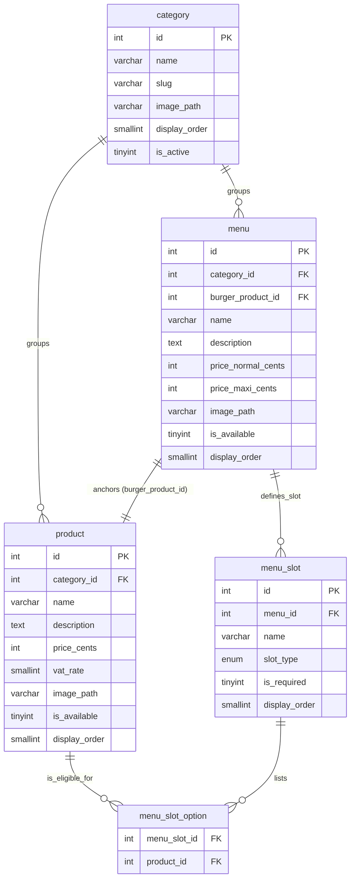
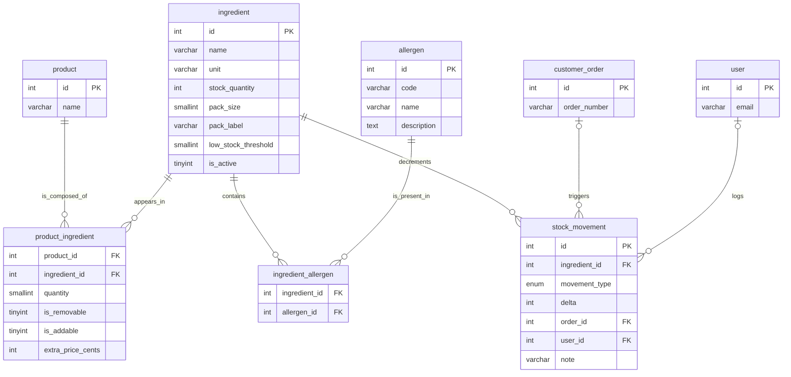
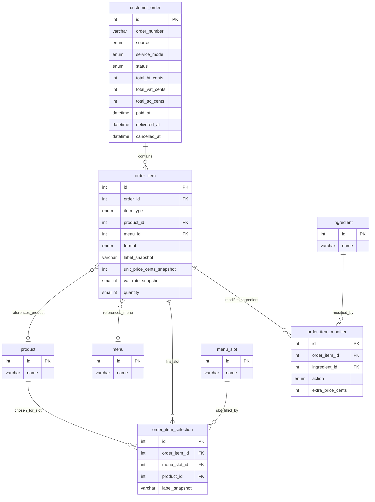
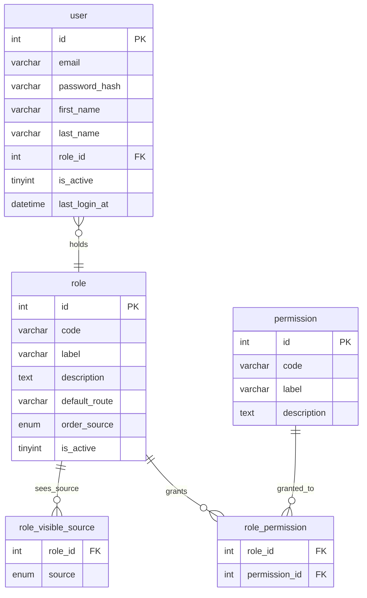

# Conceptual Data Model (MCD) — Wakdo

**Merise phase** : P1 - Conception, step 2 (data dictionary first, mantra #33)
**Version** : v0.2 — prod-like, 19 entities
**Date** : 2026-06-04
**Branch** : `feat/p1-conception`
**Status** : prod-like — all D1-D8 + stock decisions applied (see `docs/notes/revue-alignement-p1.md` §7)
**Author** : BYAN (methodology layer)

---

## 1. Purpose of this document

The MCD (Modele Conceptuel des Donnees) formalises the **entities** of the Wakdo domain,
their **associations**, and the **cardinalities** governing those associations.
It is the normalised translation of the data dictionary, and serves as the basis for the
MLD (relational mapping).

Unlike the dictionary (which details attributes and types), the MCD focuses on relational
structure: how many X per Y, whether participation is mandatory, whether associations carry
their own attributes.

**Sources**:
- `docs/merise/dictionary.md` (v0.2 — 19 entities, source of truth for all names, types, ENUMs)
- `docs/notes/revue-alignement-p1.md` §7 (decision table D1-D8 + stock)
- `docs/PROJECT_CONTEXT.md` (business rules: menu composition, order flow, RBAC, service modes)
- `docs/merise/_sources/` (school data: 9 categories, 53 products, 13 menus)

---

## 2. Merise notation used

### Cardinalities at the association foot (French Merise style)

At each end of an association, the cardinality `(min,max)` states how many times an
instance of the entity participates in the association.

```
ENTITY_A  (min,max) ----[ ASSOCIATION ]---- (min,max)  ENTITY_B
```

| Notation | Reading | Example |
|---|---|---|
| `(0,1)` | Optional, at most 1 | A stock_movement links to (0,1) customer_order |
| `(1,1)` | Mandatory, exactly 1 | A product belongs to (1,1) category |
| `(0,N)` | Optional, unbounded | A category groups (0,N) products |
| `(1,N)` | At least 1, unbounded | An order contains (1,N) order_items |

Reading: "one instance of the source entity participates at least MIN times and at most
MAX times in the association".

### Association naming convention

Active verb in business terms, e.g.: `groups`, `anchors`, `defines_slot`, `contains`,
`references_product`, `references_menu`, `fills_slot`, `modifies_ingredient`, `logs`,
`holds`, `grants`, `filters_source`, `decrements`.

N-N associations that carry their own attributes become **associative entities** in the MLD
(join table with own columns).

---

## 3. Decomposition by sub-domain

The 19-entity model is split into 4 sub-domains for readability. Beyond approximately
5 entities, a single flat diagram becomes difficult to read; decomposition is the standard
Merise practice for models of this size.

| Sub-domain | Entities | Count |
|---|---|---|
| Catalogue | category, product, menu, menu_slot, menu_slot_option | 5 |
| Ingredients & Stock | ingredient, product_ingredient, allergen, ingredient_allergen, stock_movement | 5 |
| Order | customer_order, order_item, order_item_selection, order_item_modifier | 4 |
| RBAC | user, role, role_visible_source, permission, role_permission | 5 |

**Note on the absence of a global diagram**: a single 19-entity ER diagram would be
unreadable and unmaintainable. The sub-domain decomposition below is the intentional
structural choice. The `.drawio` source files will be regenerated from this document as the
single reference once the MCD is stabilised (regeneration tracked in `docs/notes/`).

---

## 4. Sub-domain: Catalogue

### 4.1 Mermaid entity-relationship diagram



### 4.2 Association cardinalities

| # | Association | Side A | Cardinality A | Side B | Cardinality B | Justification |
|---|---|---|---|---|---|---|
| C1 | groups (product) | category | (0,N) | product | (1,1) | A category can exist with no products yet (created empty). A product must belong to exactly one category to appear on the kiosk. |
| C2 | groups (menu) | category | (0,N) | menu | (1,1) | Same rationale as C1 for menus. All 13 menus belong to the `menus` category. |
| C3 | anchors | menu | (1,1) | product | (0,N) | Each menu is built around exactly one fixed burger product (`burger_product_id`). A product may anchor 0 or more menus (a burger not used in a menu yet; or a popular burger anchoring several formats). |
| C4 | defines_slot | menu | (1,N) | menu_slot | (1,1) | A menu must define at least one slot (drink, side, sauce) to have customisable composition. A slot belongs to exactly one menu. |
| C5 | lists | menu_slot | (1,N) | menu_slot_option | (1,1) | A slot must list at least one eligible product (otherwise the customer cannot fill it). Each option row belongs to exactly one slot. |
| C6 | is_eligible_for | product | (0,N) | menu_slot_option | (1,1) | A product may be eligible for any number of slots across all menus, or none if it is only sold a la carte. Each option row references exactly one product. |

### 4.3 Notes on the Catalogue sub-domain

**`menu_slot` vs category filter**: the explicit eligibility list `menu_slot_option(menu_slot_id, product_id)` was chosen over a category-based filter (`menu_slot.category_id`). Rationale: a product added to the `drinks` category should not automatically appear in every drink slot of every menu. The explicit list avoids accidental eligibility when the catalogue grows (see dictionary note 11).

**`menu.burger_product_id` as anchor**: the menu references a specific burger product, not a generic slot. This allows the ingredient configurator (sub-domain Ingredients & Stock) to resolve which ingredients are modifiable for a menu line, via `menu -> burger_product_id -> product_ingredient`.

**Normal / Maxi format**: two prices (`price_normal_cents`, `price_maxi_cents`) on `menu`; format recorded at `order_item.format`. No individual slot-level price differential is stored (see dictionary note 7).

---

## 5. Sub-domain: Ingredients & Stock

### 5.1 Mermaid entity-relationship diagram



### 5.2 Association cardinalities

| # | Association | Side A | Cardinality A | Side B | Cardinality B | Justification |
|---|---|---|---|---|---|---|
| I1 | is_composed_of | product | (0,N) | product_ingredient | (1,1) | A product may have no ingredients entered in the system yet (catalogue row exists before recipe is entered). A recipe row belongs to exactly one product. |
| I2 | appears_in | ingredient | (1,N) | product_ingredient | (1,1) | An ingredient in active use appears in at least one product recipe. Each recipe row references exactly one ingredient. Newly created ingredients with no recipe row yet are modelled as (0,N) from a pure structural standpoint; the business rule of (1,N) applies to ingredients in production use. |
| I3 | contains (allergens) | ingredient | (0,N) | ingredient_allergen | (1,1) | An ingredient may contain no regulated allergens (e.g., pure salt). Each allergen-link row belongs to one ingredient. |
| I4 | is_present_in | allergen | (0,N) | ingredient_allergen | (1,1) | An allergen may initially have no linked ingredients (seed: allergen catalogue is complete before recipe data is entered). Each link row references one allergen. |
| I5 | decrements | ingredient | (0,N) | stock_movement | (1,1) | All movements affect exactly one ingredient. An ingredient may have no stock movement rows yet if it was recently created and no orders have been placed. Each movement row references exactly one ingredient. |
| I6 | triggers | customer_order | (0,1) | stock_movement | (0,N) | A `sale` or `cancellation` movement references the originating order. A `restock` or `inventory_correction` has no order (NULL). A given order triggers movements across all its ingredients; an order still `pending_payment` has triggered no movement yet. |
| I7 | logs | user | (0,1) | stock_movement | (0,N) | Automated sale decrements have no user (NULL). Manual restocks and corrections are attributed to a user. A user may log any number of movements. |

### 5.3 Notes on the Ingredients & Stock sub-domain

**`product_ingredient` as an associative entity**: the N-N association between `product` and `ingredient` carries four attributes (`quantity`, `is_removable`, `is_addable`, `extra_price_cents`). It becomes a join table in the MLD with composite PK `(product_id, ingredient_id)`.

**`ingredient_allergen` as a pure join table**: no own attributes. The allergen set for a product is computed at query time by joining `product_ingredient -> ingredient_allergen -> allergen`; no manual per-product entry is needed.

**`stock_movement` immutability**: this table is append-only. No UPDATE or DELETE is permitted at application layer. Corrections are new rows with `movement_type = 'inventory_correction'` and a signed `delta`.

**Low-stock alert**: computed at display time (`stock_quantity <= low_stock_threshold`); no additional stored column.

---

## 6. Sub-domain: Order

### 6.1 Mermaid entity-relationship diagram



### 6.2 Association cardinalities

| # | Association | Side A | Cardinality A | Side B | Cardinality B | Justification |
|---|---|---|---|---|---|---|
| O1 | contains | customer_order | (1,N) | order_item | (1,1) | An order without at least one line has no business meaning. A line belongs to exactly one order. ON DELETE CASCADE: if the order is purged, its lines go with it. |
| O2 | references_product | order_item | (0,1) | product | (0,N) | When `item_type = 'product'`, `product_id` is non-null (1 product referenced). When `item_type = 'menu'`, `product_id` is NULL (0). A product may appear in any number of order lines across history. |
| O3 | references_menu | order_item | (0,1) | menu | (0,N) | Symmetric to O2 for the menu discriminator branch. Exactly one of O2/O3 is active per line (CHECK constraint in MLD). |
| O4 | fills_slot | order_item | (0,N) | order_item_selection | (1,1) | A `menu`-type order line has one selection per slot (typically 2-3). A `product`-type line has no selections (0). Each selection row belongs to exactly one order line. |
| O5 | slot_filled_by | menu_slot | (0,N) | order_item_selection | (1,1) | A slot definition may have been chosen many times across historical orders (0,N). Each selection row references exactly one slot. ON DELETE RESTRICT: preserves historical records if the slot definition is later changed. |
| O6 | chosen_for_slot | product | (0,N) | order_item_selection | (1,1) | A product may have been selected for many slot choices across history. Each selection references one product. |
| O7 | modifies_ingredient | order_item | (0,N) | order_item_modifier | (1,1) | An order line may have any number of ingredient modifications (remove onion, add cheese). Each modifier row belongs to one order line. |
| O8 | modified_by | ingredient | (0,N) | order_item_modifier | (1,1) | An ingredient may have been modified in many order lines across history. Each modifier references one ingredient. |

### 6.3 Notes on the Order sub-domain

**Polymorphism on `order_item`**: each line references either a `product` or a `menu` (not both, not neither). The discriminator `item_type` ENUM drives which FK is populated. The mutual exclusivity is enforced by a CHECK constraint in the MLD. This pattern (2 nullable FKs + discriminator + CHECK) is a standard relational approach to single-table inheritance without a separate table per type.

**`order_item_selection` (menu slot choices)**: captures which product the customer chose for each slot of a menu line. One row per slot filled. Used for KPI analysis (most popular drink/side combinations). The `label_snapshot` preserves the product name at transaction time.

**`order_item_modifier` (ingredient modifications)**: attaches to an `order_item` regardless of whether the line is a standalone product or a menu. For a menu line, the modifiable product is the fixed burger, resolved via `order_item.menu_id -> menu.burger_product_id` (see dictionary note 10). No additional FK column is needed on `order_item_modifier`.

**Price snapshots**: `label_snapshot`, `unit_price_cents_snapshot`, and `vat_rate_snapshot` on `order_item` preserve the state at transaction time. If a product is later renamed or repriced, historical order data remains consistent. ON DELETE RESTRICT on `product_id` and `menu_id` is a secondary safeguard.

**`service_day` computation** (KPI grouping): not stored as a column. Computed at query time:
```sql
CASE WHEN HOUR(created_at) < 10 THEN DATE(created_at) - INTERVAL 1 DAY ELSE DATE(created_at) END
```
Cutoff: 10:00. The generated-column formula with `INTERVAL 4 HOUR 30 MINUTE` from the v0.1 MLD
was incorrect and is dropped (decision D6, `revue-alignement-p1.md` §7).

**`source = 'drive' => service_mode = 'drive'`**: cross-constraint. A drive-channel order can
only have `service_mode = 'drive'`. Enforced at application layer (and optionally as a CHECK in
the MLD).

**4-state machine** (`pending_payment -> paid -> delivered` + `cancelled`):
`preparing` and `ready` are dropped (decision D4, `revue-alignement-p1.md` §7). KPI timing is
`delivered_at - paid_at`; KDS colour coding is computed from `NOW() - paid_at`.

---

## 7. Sub-domain: RBAC

### 7.1 Mermaid entity-relationship diagram



### 7.2 Association cardinalities

| # | Association | Side A | Cardinality A | Side B | Cardinality B | Justification |
|---|---|---|---|---|---|---|
| R1 | holds | user | (1,1) | role | (0,N) | A user must have exactly one role to access the back-office. A role may have no current users (created but not yet assigned). ON DELETE RESTRICT on `role_id`: a role cannot be deleted while users hold it. |
| R2 | sees_source | role | (0,N) | role_visible_source | (1,1) | A role may see 0 or more order sources on the preparation dashboard (admin/manager use a global view with no source filter). Each visibility row belongs to exactly one role. |
| R3 | grants | role | (0,N) | role_permission | (1,1) | A role may have no permissions (a newly created role before assignment) or many. Each mapping row belongs to one role. |
| R4 | granted_to | permission | (0,N) | role_permission | (1,1) | A permission may be granted to no roles yet (declared at seed, not yet distributed) or to several. Each mapping row references one permission. |

### 7.3 Notes on the RBAC sub-domain

**RBAC architecture**: roles are dynamic (creatable and modifiable via admin UI). Permissions are static (declared in migration, tied to application code). Application code tests permissions, not role names: adding a new role with the right permissions requires no code change (permission-driven, per Sandhu/NIST RBAC model — decision D4, `revue-alignement-p1.md` §7).

**`role.order_source`**: when a counter or drive staff member creates an order, the `source` column on `customer_order` is automatically populated from their role's `order_source`. NULL for admin and manager (they can create on behalf of any channel).

**`role.default_route`**: the landing screen for each role, stored in the database. Front-end routing reads this value at login; no role name is hardcoded in routing logic.

**`role_visible_source`**: a pure join table linking a role to the set of order sources visible on the preparation dashboard. A `kitchen` role sees all three sources; a `counter` role sees `kiosk` and `counter`; a `drive` role sees only `drive`.

**`role_permission`** and **`role_visible_source`** both use composite PKs. ON DELETE CASCADE on both FKs of `role_permission` (deleting a role or a permission removes its mappings). ON DELETE CASCADE on `role_id` of `role_visible_source`.

**Seed roles** (5 roles, frozen at DDL; extendable without code change):
`admin`, `manager`, `kitchen`, `counter`, `drive`.

---

## 8. Cross-validation MCD <-> dictionary

Verification that all 19 dictionary entities appear in the MCD and vice versa.

| # | Dictionary entity (section 3) | Sub-domain in MCD | Present |
|---|---|---|---|
| 1 | `category` (3.1) | Catalogue | Yes |
| 2 | `product` (3.2) | Catalogue + Ingredients + Order | Yes |
| 3 | `menu` (3.3) | Catalogue + Order | Yes |
| 4 | `menu_slot` (3.4) | Catalogue + Order | Yes |
| 5 | `menu_slot_option` (3.5) | Catalogue | Yes |
| 6 | `ingredient` (3.6) | Ingredients + Order | Yes |
| 7 | `product_ingredient` (3.7) | Ingredients | Yes |
| 8 | `allergen` (3.8) | Ingredients | Yes |
| 9 | `ingredient_allergen` (3.9) | Ingredients | Yes |
| 10 | `customer_order` (3.10) | Order | Yes |
| 11 | `order_item` (3.11) | Order | Yes |
| 12 | `order_item_selection` (3.12) | Order | Yes |
| 13 | `order_item_modifier` (3.13) | Order | Yes |
| 14 | `user` (3.14) | RBAC | Yes |
| 15 | `role` (3.15) | RBAC | Yes |
| 16 | `role_visible_source` (3.16) | RBAC | Yes |
| 17 | `permission` (3.17) | RBAC | Yes |
| 18 | `role_permission` (3.18) | RBAC | Yes |
| 19 | `stock_movement` (3.19) | Ingredients & Stock | Yes |

**Result**: 19/19 entities traced. No entity from the dictionary is absent from the MCD.
No entity in the MCD falls outside the dictionary.

**Entities appearing in multiple sub-domains** (cross-domain shared entities):
- `product`: Catalogue (sold item, slot eligibility) + Ingredients (recipe) + Order (line reference, slot choice)
- `menu`: Catalogue (definition, slots) + Order (line reference)
- `menu_slot`: Catalogue (slot definition) + Order (slot choices via `order_item_selection`)
- `ingredient`: Ingredients (recipe, stock) + Order (modifiers)
- `customer_order`: Order (order lifecycle) + Ingredients (stock movement trigger)
- `user`: RBAC (authentication) + Ingredients (stock movement author)

This is expected in a normalised model. The sub-domain split is for readability; the actual
relational schema is a unified graph.

---

## 9. Decisions deferred to the MLD

The MCD remains at the conceptual level. The following decisions are deferred to the MLD:

1. **Resolution of associative entities into tables**: `product_ingredient`, `menu_slot_option`,
   `ingredient_allergen`, `role_visible_source`, `role_permission` become join tables with
   composite PKs.
2. **Technical PK vs business identifier**: `id INT UNSIGNED AUTO_INCREMENT` on all main entities.
   `customer_order` additionally carries `order_number VARCHAR(20) UNIQUE` (human-readable,
   format `K/C/D-YYYY-MM-DD-NNN` per channel).
3. **ON DELETE rules**: CASCADE vs RESTRICT vs SET NULL. Detailed in the MLD.
4. **CHECK constraints**: polymorphism exclusivity on `order_item`, cross-constraint
   `source/service_mode` on `customer_order`, arithmetic invariant on totals.
5. **Indexes**: not discussed at MCD level. Defined in the MLD for frequent query patterns.
6. **`service_day` formula**: applicative CASE expression, not a stored generated column.
   Documented in the MLD.

---

## 10. MCD <-> MCT coherence (mantra #34)

Pre-validation: each entity participates in at least one treatment.

| Entity | Expected treatment(s) |
|---|---|
| `category` | Admin CRUD |
| `product` | Admin CRUD + kiosk cart add |
| `menu` | Admin CRUD + kiosk cart add |
| `menu_slot` | Admin CRUD (menu composition) |
| `menu_slot_option` | Admin CRUD (slot eligibility management) |
| `ingredient` | Admin CRUD + stock movements |
| `product_ingredient` | Admin recipe management |
| `allergen` | Admin CRUD (seed: read-only catalogue) |
| `ingredient_allergen` | Admin allergen mapping |
| `customer_order` | Full order lifecycle (create -> pay -> deliver / cancel) |
| `order_item` | Cart building, line creation at validation |
| `order_item_selection` | Menu slot selection during cart building |
| `order_item_modifier` | Ingredient modification during cart building |
| `user` | Admin CRUD + login |
| `role` | Admin CRUD + user assignment |
| `role_visible_source` | Admin role configuration |
| `permission` | Admin permission matrix management |
| `role_permission` | Admin permission matrix management |
| `stock_movement` | Automatic at `paid` transition; manual restock and inventory correction |

Cross-validation MCD <-> MCT (mantra #34) to be completed exhaustively in `mct.md`
once the MCT is updated to the 4-state machine and 19-entity model.

---

## 11. Note on .drawio diagram regeneration

The `.drawio` XML sources in `docs/merise/_diagrams/` reflect the v0.1 model (11 entities,
French naming). They are scheduled for regeneration from this v0.2 MCD as a separate task.
Until regenerated, this Markdown document is the authoritative conceptual model. The Mermaid
`erDiagram` blocks in sections 4-7 render natively on GitHub and serve as the interim
graphical reference.
