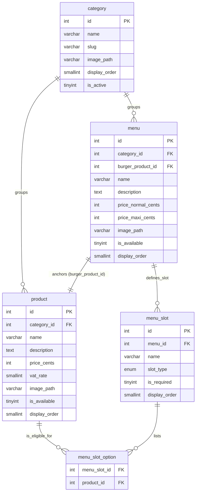
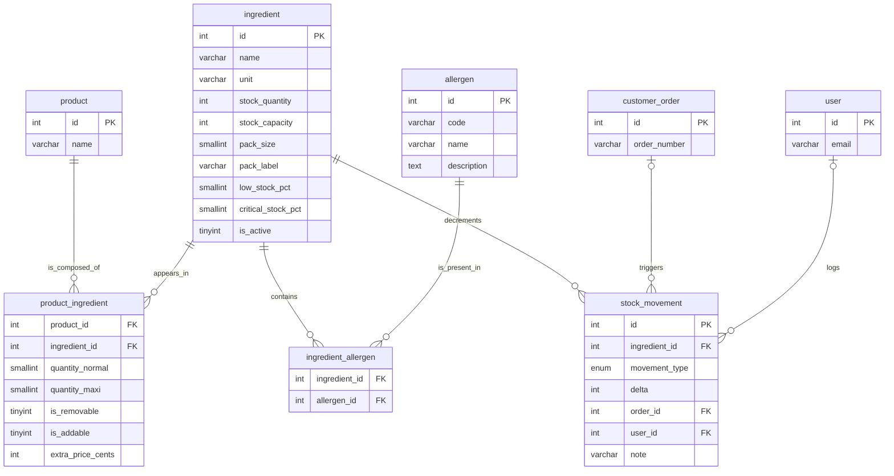
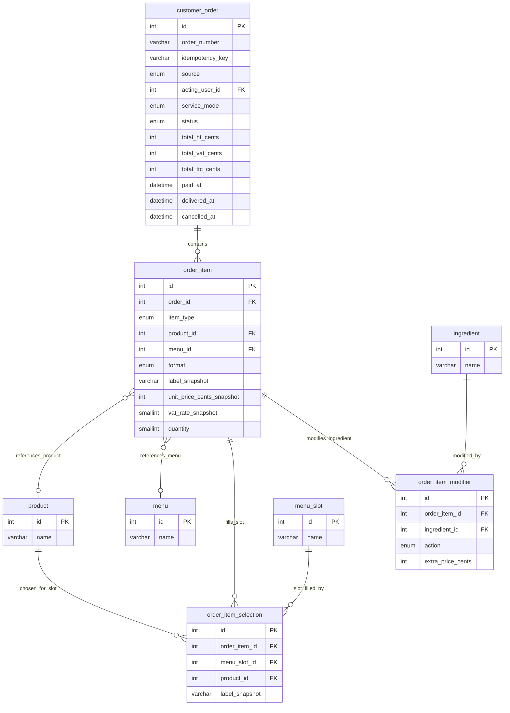
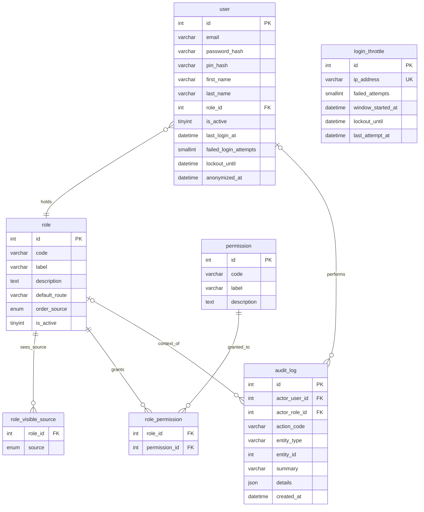

# Conceptual Data Model (MCD) — Wakdo

**Merise phase** : P1 - Conception, step 2 (data dictionary first, mantra #33)
**Version** : v0.2 — prod-like, 21 entities (19 prod-like + security-by-design layer)
**Date** : 2026-06-04 (security-by-design additions 2026-06-11)
**Branch** : `feat/p1-conception`
**Status** : prod-like — all D1-D8 + stock decisions applied (see `docs/notes/revue-alignement-p1.md` §7); security-by-design layer (audit_log + accountability/auth columns) in progress
**Author** : BYAN (methodology layer)

---

## 1. Purpose of this document

The MCD (Modele Conceptuel des Donnees) formalises the **entities** of the Wakdo domain,
their **associations**, and the **cardinalities** governing those associations.
It is the normalised translation of the data dictionary, and serves as the basis for the
MLD (relational mapping).

Unlike the dictionary (which details attributes and types), the MCD focuses on relational
structure: how many X per Y, whether participation is mandatory, whether associations carry
their own attributes.

**Sources**:
- `docs/merise/dictionary.md` (v0.2 — 21 entities, source of truth for all names, types, ENUMs)
- `docs/notes/revue-alignement-p1.md` §7 (decision table D1-D8 + stock)
- `docs/PROJECT_CONTEXT.md` (business rules: menu composition, order flow, RBAC, service modes)
- `docs/merise/_sources/` (school data: 9 categories, 53 products, 13 menus)

---

## 2. Merise notation used

### Cardinalities at the association foot (French Merise style)

At each end of an association, the cardinality `(min,max)` states how many times an
instance of the entity participates in the association.

```
ENTITY_A  (min,max) ----[ ASSOCIATION ]---- (min,max)  ENTITY_B
```

| Notation | Reading | Example |
|---|---|---|
| `(0,1)` | Optional, at most 1 | A stock_movement links to (0,1) customer_order |
| `(1,1)` | Mandatory, exactly 1 | A product belongs to (1,1) category |
| `(0,N)` | Optional, unbounded | A category groups (0,N) products |
| `(1,N)` | At least 1, unbounded | An order contains (1,N) order_items |

Reading: "one instance of the source entity participates at least MIN times and at most
MAX times in the association".

### Association naming convention

Active verb in business terms, e.g.: `groups`, `anchors`, `defines_slot`, `contains`,
`references_product`, `references_menu`, `fills_slot`, `modifies_ingredient`, `logs`,
`holds`, `grants`, `filters_source`, `decrements`.

N-N associations that carry their own attributes become **associative entities** in the MLD
(join table with own columns).

---

## 3. Decomposition by sub-domain

The 21-entity model is split into 4 sub-domains for readability. Beyond approximately
5 entities, a single flat diagram becomes difficult to read; decomposition is the standard
Merise practice for models of this size.

| Sub-domain | Entities | Count |
|---|---|---|
| Catalogue | category, product, menu, menu_slot, menu_slot_option | 5 |
| Ingredients & Stock | ingredient, product_ingredient, allergen, ingredient_allergen, stock_movement | 5 |
| Order | customer_order, order_item, order_item_selection, order_item_modifier | 4 |
| RBAC & Audit | user, role, role_visible_source, permission, role_permission, audit_log, login_throttle | 7 |

> **Security-by-design layer (2026-06-11)**: `audit_log` (entity 20) is a cross-cutting,
> append-only log of sensitive actions; it is placed in the RBAC & Audit sub-domain because
> its references (`actor_user_id`, `actor_role_id`) are RBAC entities. `login_throttle`
> (entity 21) is a per-source-IP brute-force throttle, keyed by IP and carrying no FK; it sits
> in the same sub-domain because it guards the authentication path. New columns on existing
> entities: `user` auth-lifecycle + `pin_hash` + `anonymized_at`, `customer_order.acting_user_id`
> + `idempotency_key`. See dictionary note 13.

**Note on the absence of a global diagram**: a single 21-entity ER diagram would be
unreadable and unmaintainable. The sub-domain decomposition below is the intentional
structural choice. Each sub-domain is a Mermaid `erDiagram` (authoritative, rendered
natively) with a portable SVG render in `docs/merise/_diagrams/`; see section 11 for the
sources and regeneration command.

---

## 4. Sub-domain: Catalogue

### 4.1 Mermaid entity-relationship diagram



### 4.2 Association cardinalities

| # | Association | Side A | Cardinality A | Side B | Cardinality B | Justification |
|---|---|---|---|---|---|---|
| C1 | groups (product) | category | (0,N) | product | (1,1) | A category can exist with no products yet (created empty). A product must belong to exactly one category to appear on the kiosk. |
| C2 | groups (menu) | category | (0,N) | menu | (1,1) | Same rationale as C1 for menus. All 13 menus belong to the `menus` category. |
| C3 | anchors | menu | (1,1) | product | (0,N) | Each menu is built around exactly one fixed burger product (`burger_product_id`). A product may anchor 0 or more menus (a burger not used in a menu yet; or a popular burger anchoring several formats). |
| C4 | defines_slot | menu | (1,N) | menu_slot | (1,1) | A menu must define at least one slot (drink, side, sauce) to have customisable composition. A slot belongs to exactly one menu. |
| C5 | lists | menu_slot | (1,N) | menu_slot_option | (1,1) | A slot must list at least one eligible product (otherwise the customer cannot fill it). Each option row belongs to exactly one slot. |
| C6 | is_eligible_for | product | (0,N) | menu_slot_option | (1,1) | A product may be eligible for any number of slots across all menus, or none if it is only sold a la carte. Each option row references exactly one product. |

### 4.3 Notes on the Catalogue sub-domain

**`menu_slot` vs category filter**: the explicit eligibility list `menu_slot_option(menu_slot_id, product_id)` was chosen over a category-based filter (`menu_slot.category_id`). Rationale: a product added to the `drinks` category should not automatically appear in every drink slot of every menu. The explicit list avoids accidental eligibility when the catalogue grows (see dictionary note 11).

**`menu.burger_product_id` as anchor**: the menu references a specific burger product, not a generic slot. This allows the ingredient configurator (sub-domain Ingredients & Stock) to resolve which ingredients are modifiable for a menu line, via `menu -> burger_product_id -> product_ingredient`.

**Normal / Maxi format**: two prices (`price_normal_cents`, `price_maxi_cents`) on `menu`; format recorded at `order_item.format`. No individual slot-level price differential is stored (see dictionary note 7).

---

## 5. Sub-domain: Ingredients & Stock

### 5.1 Mermaid entity-relationship diagram



### 5.2 Association cardinalities

| # | Association | Side A | Cardinality A | Side B | Cardinality B | Justification |
|---|---|---|---|---|---|---|
| I1 | is_composed_of | product | (0,N) | product_ingredient | (1,1) | A product may have no ingredients entered in the system yet (catalogue row exists before recipe is entered). A recipe row belongs to exactly one product. |
| I2 | appears_in | ingredient | (1,N) | product_ingredient | (1,1) | An ingredient in active use appears in at least one product recipe. Each recipe row references exactly one ingredient. Newly created ingredients with no recipe row yet are modelled as (0,N) from a pure structural standpoint; the business rule of (1,N) applies to ingredients in production use. |
| I3 | contains (allergens) | ingredient | (0,N) | ingredient_allergen | (1,1) | An ingredient may contain no regulated allergens (e.g., pure salt). Each allergen-link row belongs to one ingredient. |
| I4 | is_present_in | allergen | (0,N) | ingredient_allergen | (1,1) | An allergen may initially have no linked ingredients (seed: allergen catalogue is complete before recipe data is entered). Each link row references one allergen. |
| I5 | decrements | ingredient | (0,N) | stock_movement | (1,1) | All movements affect exactly one ingredient. An ingredient may have no stock movement rows yet if it was recently created and no orders have been placed. Each movement row references exactly one ingredient. |
| I6 | triggers | customer_order | (0,1) | stock_movement | (0,N) | A `sale` or `cancellation` movement references the originating order. A `restock` or `inventory_correction` has no order (NULL). A given order triggers movements across all its ingredients; an order still `pending_payment` has triggered no movement yet. |
| I7 | logs | user | (0,1) | stock_movement | (0,N) | Automated sale decrements have no user (NULL). Manual restocks and corrections are attributed to a user. A user may log any number of movements. |

### 5.3 Notes on the Ingredients & Stock sub-domain

**`product_ingredient` as an associative entity**: the N-N association between `product` and `ingredient` carries five attributes (`quantity_normal`, `quantity_maxi`, `is_removable`, `is_addable`, `extra_price_cents`). It becomes a join table in the MLD with composite PK `(product_id, ingredient_id)`.

**`ingredient_allergen` as a pure join table**: no own attributes. The allergen set for a product is computed at query time by joining `product_ingredient -> ingredient_allergen -> allergen`; no manual per-product entry is needed.

**`stock_movement` immutability**: this table is append-only. No UPDATE or DELETE is permitted at application layer. Corrections are new rows with `movement_type = 'inventory_correction'` and a signed `delta`.

**Percentage-based stock model**: stock health is anchored on a per-ingredient `stock_capacity` (the 100% reference, `CHECK > 0`). `stock_quantity` is signed and may go negative when sales outrun counted stock; the system does not block an order on a low stock read. `stock_pct = ROUND(stock_quantity / stock_capacity * 100)` is computed, not stored. Two percentage thresholds drive a three-band behaviour: `low_stock_pct` (warning band, default 10%) and `critical_stock_pct` (auto-out-of-stock floor, default 5%), with the table-level invariant `critical_stock_pct < low_stock_pct`. Above the low band is normal; between critical and low the product stays orderable and a manager alert is raised (the manager either pulls the product via `product.is_available = 0` or restocks to clear the alert); at or below the critical band the product auto-goes out-of-stock (computed, see below).

**Computed product availability (rule RG-T21, see `mlt.md`)**: effective orderability is derived, not stored. A product is orderable when `product.is_available = 1` AND each non-removable (`is_removable = 0`) ingredient in its `product_ingredient` has `stock_quantity > stock_capacity * critical_stock_pct / 100`. A required ingredient reaching the critical band makes the product auto-out-of-stock with no write and no cascade; a manual pull (`product.is_available = 0`) is a hard override; restock above the critical band makes the product orderable again on its own. A removable/optional ingredient at the critical band does not block the product (only its add-on becomes unavailable). The dashboard distinguishes a manual pull from a stock-driven OOS.

---

## 6. Sub-domain: Order

### 6.1 Mermaid entity-relationship diagram



### 6.2 Association cardinalities

| # | Association | Side A | Cardinality A | Side B | Cardinality B | Justification |
|---|---|---|---|---|---|---|
| O1 | contains | customer_order | (1,N) | order_item | (1,1) | An order without at least one line has no business meaning. A line belongs to exactly one order. ON DELETE CASCADE: if the order is purged, its lines go with it. |
| O2 | references_product | order_item | (0,1) | product | (0,N) | When `item_type = 'product'`, `product_id` is non-null (1 product referenced). When `item_type = 'menu'`, `product_id` is NULL (0). A product may appear in any number of order lines across history. |
| O3 | references_menu | order_item | (0,1) | menu | (0,N) | Symmetric to O2 for the menu discriminator branch. Exactly one of O2/O3 is active per line (CHECK constraint in MLD). |
| O4 | fills_slot | order_item | (0,N) | order_item_selection | (1,1) | A `menu`-type order line has one selection per slot (typically 2-3). A `product`-type line has no selections (0). Each selection row belongs to exactly one order line. |
| O5 | slot_filled_by | menu_slot | (0,N) | order_item_selection | (1,1) | A slot definition may have been chosen many times across historical orders (0,N). Each selection row references exactly one slot. ON DELETE RESTRICT: preserves historical records if the slot definition is later changed. |
| O6 | chosen_for_slot | product | (0,N) | order_item_selection | (1,1) | A product may have been selected for many slot choices across history. Each selection references one product. |
| O7 | modifies_ingredient | order_item | (0,N) | order_item_modifier | (1,1) | An order line may have any number of ingredient modifications (remove onion, add cheese). Each modifier row belongs to one order line. |
| O8 | modified_by | ingredient | (0,N) | order_item_modifier | (1,1) | An ingredient may have been modified in many order lines across history. Each modifier references one ingredient. |

### 6.3 Notes on the Order sub-domain

**Polymorphism on `order_item`**: each line references either a `product` or a `menu` (not both, not neither). The discriminator `item_type` ENUM drives which FK is populated. The mutual exclusivity is enforced by a CHECK constraint in the MLD. This pattern (2 nullable FKs + discriminator + CHECK) is a standard relational approach to single-table inheritance without a separate table per type.

**`order_item_selection` (menu slot choices)**: captures which product the customer chose for each slot of a menu line. One row per slot filled. Used for KPI analysis (most popular drink/side combinations). The `label_snapshot` preserves the product name at transaction time.

**`order_item_modifier` (ingredient modifications)**: attaches to an `order_item` regardless of whether the line is a standalone product or a menu. For a menu line, the modifiable product is the fixed burger, resolved via `order_item.menu_id -> menu.burger_product_id` (see dictionary note 10). No additional FK column is needed on `order_item_modifier`.

**Price snapshots**: `label_snapshot`, `unit_price_cents_snapshot`, and `vat_rate_snapshot` on `order_item` preserve the state at transaction time. If a product is later renamed or repriced, historical order data remains consistent. ON DELETE RESTRICT on `product_id` and `menu_id` is a secondary safeguard.

**`service_day` computation** (KPI grouping): not stored as a column. Computed at query time:
```sql
CASE WHEN HOUR(created_at) < 10 THEN DATE(created_at) - INTERVAL 1 DAY ELSE DATE(created_at) END
```
Cutoff: 10:00. The generated-column formula with `INTERVAL 4 HOUR 30 MINUTE` from the v0.1 MLD
was incorrect and is dropped (decision D6, `revue-alignement-p1.md` §7).

**`source = 'drive' => service_mode = 'drive'`**: cross-constraint. A drive-channel order can
only have `service_mode = 'drive'`. Enforced at application layer (and optionally as a CHECK in
the MLD).

**4-state machine** (`pending_payment -> paid -> delivered` + `cancelled`):
`preparing` and `ready` are dropped (decision D4, `revue-alignement-p1.md` §7). KPI timing is
`delivered_at - paid_at`; KDS colour coding is computed from `NOW() - paid_at`.

**Security-by-design columns (2026-06-11)**: `idempotency_key` (client UUID, UNIQUE)
deduplicates a retried `POST /api/orders`. `acting_user_id` (FK -> `user`, ON DELETE SET NULL)
records the counter/drive staff who took the order under PIN; NULL for anonymous kiosk orders.
This adds a `customer_order |o--o| user : "taken_by"` association (cardinality: an order is
taken by (0,1) user; a user takes (0,N) orders). See dictionary note 13.

---

## 7. Sub-domain: RBAC

### 7.1 Mermaid entity-relationship diagram



> `login_throttle` is a standalone entity with no association: it is keyed by source IP
> (`ip_address UNIQUE`), not by a modelled actor, so it carries no FK and connects to no
> other entity in the diagram.

### 7.2 Association cardinalities

| # | Association | Side A | Cardinality A | Side B | Cardinality B | Justification |
|---|---|---|---|---|---|---|
| R1 | holds | user | (1,1) | role | (0,N) | A user must have exactly one role to access the back-office. A role may have no current users (created but not yet assigned). ON DELETE RESTRICT on `role_id`: a role cannot be deleted while users hold it. |
| R2 | sees_source | role | (0,N) | role_visible_source | (1,1) | A role may see 0 or more order sources on the preparation dashboard (admin/manager use a global view with no source filter). Each visibility row belongs to exactly one role. |
| R3 | grants | role | (0,N) | role_permission | (1,1) | A role may have no permissions (a newly created role before assignment) or many. Each mapping row belongs to one role. |
| R4 | granted_to | permission | (0,N) | role_permission | (1,1) | A permission may be granted to no roles yet (declared at seed, not yet distributed) or to several. Each mapping row references one permission. |
| R5 | performs | user | (0,1) | audit_log | (0,N) | A sensitive action captured under PIN records its acting user; automated/non-attributable entries carry NULL. A user may have logged any number of actions. ON DELETE SET NULL preserves the trail on user anonymisation/removal. |
| R6 | context_of | role | (0,1) | audit_log | (0,N) | Each audit row may denormalise the actor's role at action time (NULL allowed). A role may be the context of many audit rows. ON DELETE SET NULL preserves the trail. |

### 7.3 Notes on the RBAC sub-domain

**RBAC architecture**: roles are dynamic (creatable and modifiable via admin UI). Permissions are static (declared in migration, tied to application code). Application code tests permissions, not role names: adding a new role with the right permissions requires no code change (permission-driven, per Sandhu/NIST RBAC model — decision D4, `revue-alignement-p1.md` §7).

**`role.order_source`**: when a counter or drive staff member creates an order, the `source` column on `customer_order` is automatically populated from their role's `order_source`. NULL for admin and manager (they can create on behalf of any channel).

**`role.default_route`**: the landing screen for each role, stored in the database. Front-end routing reads this value at login; no role name is hardcoded in routing logic.

**`role_visible_source`**: a pure join table linking a role to the set of order sources visible on the preparation dashboard. A `kitchen` role sees all three sources; a `counter` role sees `kiosk` and `counter`; a `drive` role sees only `drive`.

**`role_permission`** and **`role_visible_source`** both use composite PKs. ON DELETE CASCADE on both FKs of `role_permission` (deleting a role or a permission removes its mappings). ON DELETE CASCADE on `role_id` of `role_visible_source`.

**Seed roles** (5 roles, frozen at DDL; extendable without code change):
`admin`, `manager`, `kitchen`, `counter`, `drive`.

**`audit_log` (security-by-design)**: append-only log of sensitive actions, immutable like
`stock_movement`. Both FKs (`actor_user_id`, `actor_role_id`) are nullable with ON DELETE
SET NULL, so the trail survives user anonymisation (RGPD) and role removal. The `actor_role_id`
is denormalised on purpose: even if the user is later anonymised, the role context of the
action is preserved. It carries no PII (the `details` JSON stores changed field names, not
values for user-targeted actions). See dictionary 3.20 and note 13.

**`login_throttle` (security-by-design)**: per-source-IP brute-force throttle, complementing
the per-account counter already on `user` (`failed_login_attempts` / `lockout_until`). One row
per IP (`ip_address VARCHAR(45) UNIQUE`, 45 chars to hold a full IPv6 literal), upserted on each
failed login: `failed_attempts` counts consecutive failures from this IP in the current window,
`window_started_at` marks the start of that window (which resets when expired), `lockout_until`
holds the end of the degressive backoff (NULL = not throttled), `last_attempt_at` the timestamp
of the last failed attempt. It has no FK (an IP is not a modelled entity) and no association. A
daily cron purges rows with no active lockout whose `last_attempt_at` is older than 24h. See
dictionary 3.21 and note 13.

---

## 8. Cross-validation MCD <-> dictionary

Verification that all 21 dictionary entities appear in the MCD and vice versa.

| # | Dictionary entity (section 3) | Sub-domain in MCD | Present |
|---|---|---|---|
| 1 | `category` (3.1) | Catalogue | Yes |
| 2 | `product` (3.2) | Catalogue + Ingredients + Order | Yes |
| 3 | `menu` (3.3) | Catalogue + Order | Yes |
| 4 | `menu_slot` (3.4) | Catalogue + Order | Yes |
| 5 | `menu_slot_option` (3.5) | Catalogue | Yes |
| 6 | `ingredient` (3.6) | Ingredients + Order | Yes |
| 7 | `product_ingredient` (3.7) | Ingredients | Yes |
| 8 | `allergen` (3.8) | Ingredients | Yes |
| 9 | `ingredient_allergen` (3.9) | Ingredients | Yes |
| 10 | `customer_order` (3.10) | Order | Yes |
| 11 | `order_item` (3.11) | Order | Yes |
| 12 | `order_item_selection` (3.12) | Order | Yes |
| 13 | `order_item_modifier` (3.13) | Order | Yes |
| 14 | `user` (3.14) | RBAC | Yes |
| 15 | `role` (3.15) | RBAC | Yes |
| 16 | `role_visible_source` (3.16) | RBAC | Yes |
| 17 | `permission` (3.17) | RBAC | Yes |
| 18 | `role_permission` (3.18) | RBAC | Yes |
| 19 | `stock_movement` (3.19) | Ingredients & Stock | Yes |
| 20 | `audit_log` (3.20) | RBAC & Audit | Yes |
| 21 | `login_throttle` (3.21) | RBAC & Audit | Yes |

**Result**: 21/21 entities traced (19 prod-like + `audit_log` and `login_throttle`
security-by-design). No entity from the dictionary is absent from the MCD. No entity in the MCD
falls outside the dictionary.

**Entities appearing in multiple sub-domains** (cross-domain shared entities):
- `product`: Catalogue (sold item, slot eligibility) + Ingredients (recipe) + Order (line reference, slot choice)
- `menu`: Catalogue (definition, slots) + Order (line reference)
- `menu_slot`: Catalogue (slot definition) + Order (slot choices via `order_item_selection`)
- `ingredient`: Ingredients (recipe, stock) + Order (modifiers)
- `customer_order`: Order (order lifecycle) + Ingredients (stock movement trigger) + RBAC & Audit (taken_by staff via `acting_user_id`)
- `user`: RBAC (authentication) + Ingredients (stock movement author) + Order (`acting_user_id` on counter/drive orders) + Audit (actor of `audit_log`)
- `role`: RBAC (permissions, visible sources) + Audit (denormalised `actor_role_id` context on `audit_log`)

This is expected in a normalised model. The sub-domain split is for readability; the actual
relational schema is a unified graph.

---

## 9. Decisions deferred to the MLD

The MCD remains at the conceptual level. The following decisions are deferred to the MLD:

1. **Resolution of associative entities into tables**: `product_ingredient`, `menu_slot_option`,
   `ingredient_allergen`, `role_visible_source`, `role_permission` become join tables with
   composite PKs.
2. **Technical PK vs business identifier**: `id INT UNSIGNED AUTO_INCREMENT` on all main entities.
   `customer_order` additionally carries `order_number VARCHAR(20) UNIQUE` (human-readable,
   format `K/C/D-YYYY-MM-DD-NNN` per channel).
3. **ON DELETE rules**: CASCADE vs RESTRICT vs SET NULL. Detailed in the MLD.
4. **CHECK constraints**: polymorphism exclusivity on `order_item`, cross-constraint
   `source/service_mode` on `customer_order`, arithmetic invariant on totals.
5. **Indexes**: not discussed at MCD level. Defined in the MLD for frequent query patterns.
6. **`service_day` formula**: applicative CASE expression, not a stored generated column.
   Documented in the MLD.

---

## 10. MCD <-> MCT coherence (mantra #34)

Pre-validation: each entity participates in at least one treatment.

| Entity | Expected treatment(s) |
|---|---|
| `category` | Admin CRUD |
| `product` | Admin CRUD + kiosk cart add |
| `menu` | Admin CRUD + kiosk cart add |
| `menu_slot` | Admin CRUD (menu composition) |
| `menu_slot_option` | Admin CRUD (slot eligibility management) |
| `ingredient` | Admin CRUD + stock movements |
| `product_ingredient` | Admin recipe management |
| `allergen` | Admin CRUD (seed: read-only catalogue) |
| `ingredient_allergen` | Admin allergen mapping |
| `customer_order` | Full order lifecycle (create -> pay -> deliver / cancel) |
| `order_item` | Cart building, line creation at validation |
| `order_item_selection` | Menu slot selection during cart building |
| `order_item_modifier` | Ingredient modification during cart building |
| `user` | Admin CRUD + login |
| `role` | Admin CRUD + user assignment |
| `role_visible_source` | Admin role configuration |
| `permission` | Admin permission matrix management |
| `role_permission` | Admin permission matrix management |
| `stock_movement` | Automatic at `paid` transition; manual restock and inventory correction |
| `audit_log` | Written by sensitive operations: UPDATE/DELETE product/menu (8.2/8.3/8.6), CANCEL_ORDER (7.1), RESTOCK/INVENTORY_COUNT (9.1/9.2), user ops (10.1-10.3), MANAGE_RBAC (10.4), and failed/successful logins (12.1) |
| `login_throttle` | Read and written by AUTHENTICATE_USER (12.1): per-source-IP throttle upserted on each failed login, read to enforce the backoff window, purged by a daily cron |

Cross-validation MCD <-> MCT (mantra #34) to be completed exhaustively in `mct.md`
once the MCT incorporates the security-by-design operations (PIN-gated sensitive actions,
audit writes, reset/lockout, anonymisation). The treatment-layer additions are tracked there.

---

## 11. Diagram sources and regeneration

The authoritative graphical model is the set of Mermaid `erDiagram` blocks in sections 4-7,
one per sub-domain. They render natively on Forgejo and GitHub. The MCD is decomposed by
sub-domain on purpose: a single 21-entity diagram cannot be laid out without crossing
relationship lines (intrinsic planarity limit, and `erDiagram` offers no manual layout
control). Each sub-domain stays at 5-8 entities, which auto-layout handles cleanly. The
integrated view across sub-domains is the cross-validation table in section 8.

Portable SVG renders live in `docs/merise/_diagrams/` (for PDF export / offline viewing):

| Sub-domain | Source | Render |
|---|---|---|
| Catalogue | `mcd-catalogue.mmd` | `mcd-catalogue.svg` |
| Ingredients & Stock | `mcd-ingredients-stock.mmd` | `mcd-ingredients-stock.svg` |
| Order | `mcd-order.mmd` | `mcd-order.svg` |
| RBAC | `mcd-rbac.mmd` | `mcd-rbac.svg` |

The `.mmd` files are extracted from the `erDiagram` blocks above; the `.svg` are produced by
`make docs-render` (mmdc). If a block here changes, re-extract the matching `.mmd` and re-run
`make docs-render`. The legacy v0.1 `.drawio` sources have been removed: drawio gave manual
layout control but required hand-editing and did not render in the Markdown previews, whereas
the decomposed Mermaid blocks are version-controlled, render everywhere, and stay in sync with
this document.
