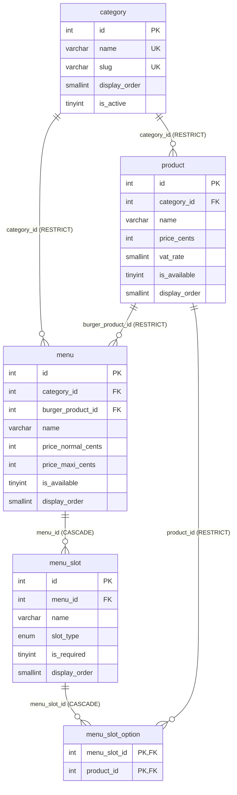
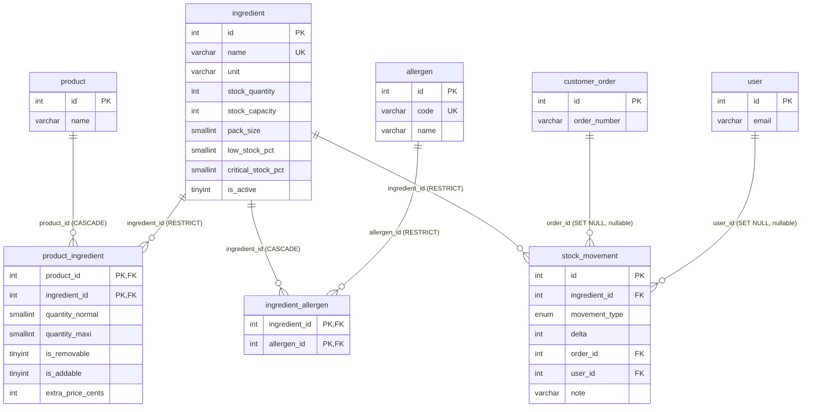
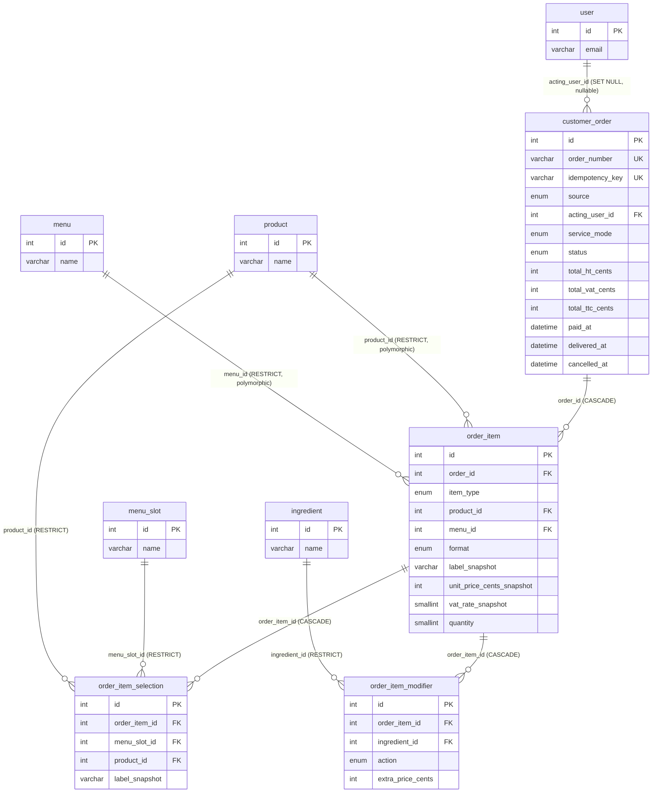
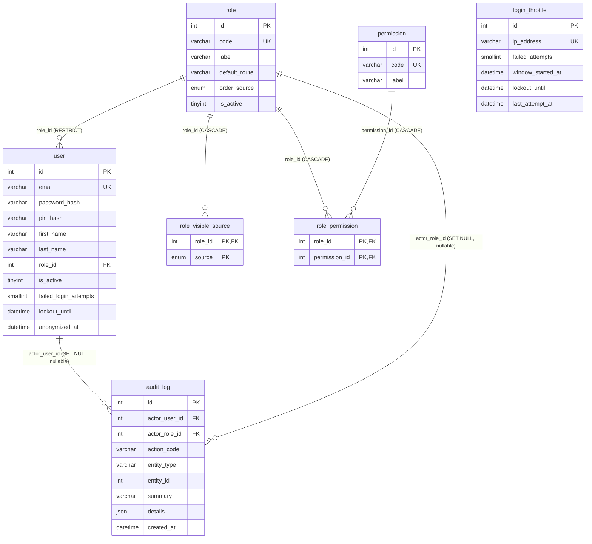

# Modele Logique de Donnees (MLD) — Wakdo

**Phase Merise** : P1 - Conception, etape 5 (apres MCD, MCT, MLT)
**Version** : v0.2 — prod-like, 21 tables (19 prod-like + couche security-by-design)
**Date** : 2026-06-04 (ajouts security-by-design 2026-06-11)
**Branche** : `feat/p1-conception`
**Statut** : prod-like — toutes les decisions D1-D8 + stock appliquees (voir `docs/notes/revue-alignement-p1.md` §7) ; couche security-by-design (audit_log + colonnes imputabilite/auth) en cours
**Auteur** : BYAN (couche methodologique)

---

## 1. Objectif de ce document

Le MLD transcrit le MCD en un schema relationnel formel : 1 entite -> 1 table, chaque
association traduite selon sa cardinalite, contraintes referentielles materialisees,
index dimensionnes pour les patterns d'acces frequents.

C'est l'etape qui transforme la modelisation conceptuelle en une specification implementable.
Le DDL SQL (`db/migrations/0001_init_schema.sql`) sera derive directement de ce
document en P2.

**Sources** :
- `docs/merise/dictionary.md` (v0.2 — types et contraintes par attribut, source de verite)
- `docs/merise/mcd.md` (v0.2 — entites + cardinalites + decisions reportees)
- `docs/notes/revue-alignement-p1.md` §7 (table de decisions D1-D8 + stock)

**Plateforme cible** :
- MariaDB 11.4 LTS (cf. `docker-compose.yml` service `wakdo-db`)
- Moteur InnoDB (ACID, support des FK, verrouillage au niveau ligne, CHECK depuis 10.2.1)
- Charset `utf8mb4`, collation `utf8mb4_unicode_ci`

---

## 2. Conventions de notation

### Notation relationnelle

```
table_name (col1, col2, #col_fk, [col_nullable])

  PK  : col1
  UK  : col2
  FK  : col_fk -> other_table(id) ON DELETE <rule>
  IDX : (col_a, col_b)
  CHK : <expression>
```

| Symbole | Signification |
|---|---|
| `col` | Colonne NOT NULL |
| `[col]` | Colonne nullable |
| `#col` | Colonne FK |

La notation suit l'usage Merise francais (convention Nanci/Espinasse adaptee a l'ASCII).

### Resume des types

Tous les types exacts sont definis dans `dictionary.md` section 2. Conventions retenues :
- `INT UNSIGNED AUTO_INCREMENT` pour toutes les PK techniques
- `INT UNSIGNED` pour tous les montants monetaires en centimes (anti-FLOAT, voir note 1 du dictionnaire)
- `SMALLINT UNSIGNED` pour les valeurs pour-mille de `vat_rate` (55 ou 100)
- `ENUM(...)` pour les valeurs metier stables (voir note 2 du dictionnaire)
- `DATETIME` pour les horodatages (pas TIMESTAMP, qui se convertit implicitement en UTC dans MariaDB)

---

## 3. Regles de traduction MCD -> MLD appliquees

### 3.1 Entite -> Table

Chaque entite MCD devient une table. L'identifiant conceptuel `id` devient une PK
`INT UNSIGNED AUTO_INCREMENT`. Les attributs conservent leurs noms et types.

### 3.2 Association `(1,1) - (1,N)` -> FK simple

L'entite du cote `(1,1)` porte la FK vers l'entite `(0,N)` ou `(1,N)`.

### 3.3 Association `(0,N) - (0,N)` ou `(1,N) - (1,N)` -> table de jointure

L'association devient sa propre table avec une PK composite des deux FK. Applique a :
`product_ingredient`, `menu_slot_option`, `ingredient_allergen`,
`role_visible_source`, `role_permission`.

### 3.4 Entite associative avec attributs propres -> table de jointure avec colonnes

Quand une association N-N porte ses propres attributs, elle devient une table avec ces attributs
en plus de la PK composite des FK. Applique a `product_ingredient`.

### 3.5 Polymorphisme -> 2 FK nullables + discriminateur + CHECK

`order_item` reference soit `product` soit `menu`. Traduit en 2 colonnes FK nullables +
1 discriminateur ENUM + 1 contrainte CHECK imposant l'exclusivite mutuelle.

---

## 4. Schema relationnel (21 tables)

Les tables sont ordonnees par dependance (tables sans FK d'abord, puis tables qui en dependent).

### Diagrammes relationnels (par sous-domaine)

Le schema relationnel est presente sous forme de quatre vues Mermaid `erDiagram`, une par sous-domaine (meme
decomposition que le MCD ; un unique diagramme de 21 tables ne se disposerait pas proprement). Elles different
du MCD : les entites associatives sont resolues en tables de jointure avec PK composites, le
polymorphisme de `order_item` apparait sous forme de deux FK nullables (`product_id` / `menu_id`), et chaque
cle etrangere est explicite. Les horodatages d'audit (`created_at` / `updated_at`) sont presents sur la plupart des
tables (voir les sections par table ci-dessous) mais omis des diagrammes pour les garder lisibles.
Les libelles de relation portent la colonne FK et son comportement `ON DELETE`. Les cibles de FK
inter-sous-domaines sont representees comme des tables stub (id + name). Les rendus SVG portables sont dans `_diagrams/`
(`mld-catalogue.svg`, `mld-ingredients-stock.svg`, `mld-order.svg`, `mld-rbac.svg`).

#### Catalogue



#### Ingredients et Stock



#### Commande



#### RBAC & securite



> `login_throttle` n'a pas de FK (une IP n'est pas une entite modelisee) ; elle est autonome, cle par
> `ip_address`.

---

### 4.1 `category`

```
category (id, name, slug, [image_path], display_order, is_active, created_at, updated_at)

  PK  : id
  UK  : name
  UK  : slug
```

| Colonne | Type | NULL | Notes |
|---|---|---|---|
| `id` | INT UNSIGNED AUTO_INCREMENT | NO | PK |
| `name` | VARCHAR(60) | NO | Nom d'affichage unique (voir dict 3.1) |
| `slug` | VARCHAR(60) | NO | Slug d'URL, p. ex. `burgers` |
| `image_path` | VARCHAR(255) | YES | Chemin relatif depuis la racine publique |
| `display_order` | SMALLINT UNSIGNED NOT NULL DEFAULT 0 | NO | Ordre d'affichage borne |
| `is_active` | TINYINT(1) NOT NULL DEFAULT 1 | NO | Desactivation logique |
| `created_at` | DATETIME NOT NULL DEFAULT CURRENT_TIMESTAMP | NO | Audit |
| `updated_at` | DATETIME NOT NULL DEFAULT CURRENT_TIMESTAMP ON UPDATE CURRENT_TIMESTAMP | NO | Audit |

Pas de FK. Table racine du sous-domaine Catalogue.

---

### 4.2 `product`

```
product (id, #category_id, name, [description], price_cents, vat_rate,
         [image_path], is_available, display_order, created_at, updated_at)

  PK  : id
  FK  : category_id -> category(id) ON DELETE RESTRICT
  IDX : (category_id, is_available, display_order)
  CHK : price_cents > 0
  CHK : vat_rate IN (55, 100)
```

| Colonne | Type | NULL | Notes |
|---|---|---|---|
| `id` | INT UNSIGNED AUTO_INCREMENT | NO | PK |
| `category_id` | INT UNSIGNED | NO | FK -> category |
| `name` | VARCHAR(120) | NO | Libelle du produit |
| `description` | TEXT | YES | Description longue optionnelle |
| `price_cents` | INT UNSIGNED | NO | Prix a la carte, TVA incluse, en centimes |
| `vat_rate` | SMALLINT UNSIGNED | NO | Pour-mille : 100 = 10%, 55 = 5.5% |
| `image_path` | VARCHAR(255) | YES | Chemin relatif depuis la racine publique |
| `is_available` | TINYINT(1) NOT NULL DEFAULT 1 | NO | Bascule de disponibilite manuelle |
| `display_order` | SMALLINT UNSIGNED NOT NULL DEFAULT 0 | NO | Ordre d'affichage au sein de la categorie |
| `created_at` | DATETIME NOT NULL DEFAULT CURRENT_TIMESTAMP | NO | Audit |
| `updated_at` | DATETIME NOT NULL DEFAULT CURRENT_TIMESTAMP ON UPDATE CURRENT_TIMESTAMP | NO | Audit |

**ON DELETE RESTRICT** sur `category_id` : une categorie avec des produits ne peut pas etre supprimee. Empeche les
produits orphelins.

---

### 4.3 `menu`

```
menu (id, #category_id, #burger_product_id, name, [description],
      price_normal_cents, price_maxi_cents, [image_path],
      is_available, display_order, created_at, updated_at)

  PK  : id
  FK  : category_id      -> category(id) ON DELETE RESTRICT
  FK  : burger_product_id -> product(id)  ON DELETE RESTRICT
  IDX : (category_id, is_available, display_order)
  CHK : price_normal_cents > 0
  CHK : price_maxi_cents > 0
```

| Colonne | Type | NULL | Notes |
|---|---|---|---|
| `id` | INT UNSIGNED AUTO_INCREMENT | NO | PK |
| `category_id` | INT UNSIGNED | NO | FK -> category (typiquement la categorie `menus`) |
| `burger_product_id` | INT UNSIGNED | NO | FK -> product — le burger fixe qui ancre ce menu |
| `name` | VARCHAR(120) | NO | p. ex. "Menu Le 280" |
| `description` | TEXT | YES | Optionnel |
| `price_normal_cents` | INT UNSIGNED | NO | Prix du format Normal en centimes |
| `price_maxi_cents` | INT UNSIGNED | NO | Prix du format Maxi en centimes (~+150 centimes) |
| `image_path` | VARCHAR(255) | YES | Reutilise typiquement l'image du burger |
| `is_available` | TINYINT(1) NOT NULL DEFAULT 1 | NO | Bascule de disponibilite |
| `display_order` | SMALLINT UNSIGNED NOT NULL DEFAULT 0 | NO | Ordre d'affichage |
| `created_at` | DATETIME NOT NULL DEFAULT CURRENT_TIMESTAMP | NO | Audit |
| `updated_at` | DATETIME NOT NULL DEFAULT CURRENT_TIMESTAMP ON UPDATE CURRENT_TIMESTAMP | NO | Audit |

**ON DELETE RESTRICT** sur les deux FK : empeche la suppression d'une categorie ou d'un produit burger
encore reference par une definition de menu.

---

### 4.4 `menu_slot`

```
menu_slot (id, #menu_id, name, slot_type, is_required, display_order)

  PK  : id
  FK  : menu_id -> menu(id) ON DELETE CASCADE
  IDX : (menu_id, display_order)
```

| Colonne | Type | NULL | Notes |
|---|---|---|---|
| `id` | INT UNSIGNED AUTO_INCREMENT | NO | PK |
| `menu_id` | INT UNSIGNED | NO | FK -> menu |
| `name` | VARCHAR(80) | NO | p. ex. "Drink", "Side", "Sauce" |
| `slot_type` | ENUM('drink','side','sauce','dessert','extra') | NO | Role semantique |
| `is_required` | TINYINT(1) NOT NULL DEFAULT 1 | NO | Indique si le client doit remplir ce slot |
| `display_order` | SMALLINT UNSIGNED NOT NULL DEFAULT 0 | NO | Ordre d'affichage dans le constructeur de menu |

**Pas de champs d'audit** : un slot fait partie de la definition du menu ; cree et mis a jour en meme temps que
le menu.

**ON DELETE CASCADE** sur `menu_id` : si un menu est supprime, ses slots sont supprimes avec lui.

---

### 4.5 `menu_slot_option`

Table de jointure pure. PK composite.

```
menu_slot_option (#menu_slot_id, #product_id)

  PK  : (menu_slot_id, product_id)
  FK  : menu_slot_id -> menu_slot(id) ON DELETE CASCADE
  FK  : product_id   -> product(id)   ON DELETE RESTRICT
```

| Colonne | Type | NULL | Notes |
|---|---|---|---|
| `menu_slot_id` | INT UNSIGNED | NO | FK -> menu_slot |
| `product_id` | INT UNSIGNED | NO | FK -> product |

**ON DELETE CASCADE** sur `menu_slot_id` : si un slot est supprime, sa liste d'eligibilite disparait avec lui.
**ON DELETE RESTRICT** sur `product_id` : un produit liste comme eligible dans un slot ne peut pas etre
supprime sans le retirer d'abord des options du slot. Empeche la rupture silencieuse des menus.

Pas d'horodatages. Table de jointure pure.

---

### 4.6 `ingredient`

```
ingredient (id, name, unit, stock_quantity, stock_capacity, pack_size, [pack_label],
            low_stock_pct, critical_stock_pct, is_active, created_at, updated_at)

  PK  : id
  UK  : name
  CHK : stock_capacity > 0
  CHK : pack_size > 0
  CHK : low_stock_pct BETWEEN 0 AND 100
  CHK : critical_stock_pct BETWEEN 0 AND 100
  CHK : critical_stock_pct < low_stock_pct
```

| Colonne | Type | NULL | Notes |
|---|---|---|---|
| `id` | INT UNSIGNED AUTO_INCREMENT | NO | PK |
| `name` | VARCHAR(120) | NO | Nom unique, p. ex. "Sesame Bun" |
| `unit` | VARCHAR(40) | NO | Libelle d'unite de conditionnement (libre, pas ENUM) |
| `stock_quantity` | INT NOT NULL DEFAULT 0 | NO | Stock courant. INT signe pouvant devenir negatif quand les ventes depassent le stock compte (ampleur de la survente, remontee aux managers) ; le systeme ne bloque pas une commande sur le stock |
| `stock_capacity` | INT NOT NULL | NO | Niveau "plein" de reference en unites = le 100% utilise pour calculer le pourcentage de stock ; CHECK > 0 protege aussi la division du pourcentage contre la division par zero |
| `pack_size` | SMALLINT UNSIGNED NOT NULL DEFAULT 1 | NO | Unites par lot de reapprovisionnement |
| `pack_label` | VARCHAR(80) | YES | Libelle humain du lot |
| `low_stock_pct` | SMALLINT UNSIGNED NOT NULL DEFAULT 10 | NO | Bande d’alerte, pourcentage de la capacite (CHECK BETWEEN 0 AND 100) |
| `critical_stock_pct` | SMALLINT UNSIGNED NOT NULL DEFAULT 5 | NO | Plancher de rupture automatique, pourcentage de la capacite (CHECK BETWEEN 0 AND 100 ; CHECK de table `critical_stock_pct < low_stock_pct`) |
| `is_active` | TINYINT(1) NOT NULL DEFAULT 1 | NO | Desactiver les ingredients obsoletes |
| `created_at` | DATETIME NOT NULL DEFAULT CURRENT_TIMESTAMP | NO | Audit |
| `updated_at` | DATETIME NOT NULL DEFAULT CURRENT_TIMESTAMP ON UPDATE CURRENT_TIMESTAMP | NO | Audit |

Pas de FK. Table racine du sous-domaine Ingredients & Stock.

**Modele de stock base sur les pourcentages** : l'etat de stock est calcule (PAS stocke) comme
`stock_pct = ROUND(stock_quantity / stock_capacity * 100)`. Deux bandes en derivent :
`LOW` quand `stock_quantity <= stock_capacity * low_stock_pct/100`, et
`CRITICAL` quand `stock_quantity <= stock_capacity * critical_stock_pct/100`.
Comportement a trois bandes : au-dessus de `low` = normal ; entre `critical` et `low` = commandable
plus alerte manager (le manager soit retire le produit via `product.is_available=0`, soit
reapprovisionne pour lever l'alerte) ; au niveau ou en dessous de `critical` = rupture automatique (calculee, regle
RG-T21). `stock_quantity` est signe et peut devenir negatif ; le systeme ne bloque pas une commande
sur le stock, donc une valeur negative enregistre l'ampleur de la survente pour les managers.

**Disponibilite calculee (regle RG-T21)** : un produit est effectivement commandable quand
`product.is_available = 1` ET chaque ingredient non-retirable (`is_removable=0`) de son
`product_ingredient` a `stock_quantity > stock_capacity * critical_stock_pct/100`. A la
bande critique, un produit passe automatiquement en rupture sans ecriture ni cascade ; un retrait manuel
(`product.is_available=0`) est une surcharge forte ; un reapprovisionnement au-dessus de la bande critique rend le
produit a nouveau commandable de lui-meme ; un ingredient retirable/optionnel a la bande critique ne
bloque pas le produit (seul son supplement devient indisponible). Le tableau de bord distingue un
retrait manuel (`is_available=0`) d'une rupture pilotee par le stock (`is_available=1` mais un ingredient
requis est critique).

---

### 4.7 `product_ingredient`

Table associative portant les metadonnees de recette et de personnalisation. PK composite.

```
product_ingredient (#product_id, #ingredient_id, quantity_normal, quantity_maxi,
                    is_removable, is_addable, extra_price_cents)

  PK  : (product_id, ingredient_id)
  FK  : product_id    -> product(id)    ON DELETE CASCADE
  FK  : ingredient_id -> ingredient(id) ON DELETE RESTRICT
  CHK : quantity_normal > 0
  CHK : quantity_maxi >= quantity_normal
  CHK : extra_price_cents >= 0
```

| Colonne | Type | NULL | Notes |
|---|---|---|---|
| `product_id` | INT UNSIGNED | NO | FK -> product |
| `ingredient_id` | INT UNSIGNED | NO | FK -> ingredient |
| `quantity_normal` | SMALLINT UNSIGNED NOT NULL DEFAULT 1 | NO | Unites consommees au format Normal |
| `quantity_maxi` | SMALLINT UNSIGNED NOT NULL DEFAULT 1 | NO | Unites consommees au format Maxi ; egal a `quantity_normal` pour burger/sauce (invariant au format), superieur pour side/drink |
| `is_removable` | TINYINT(1) NOT NULL DEFAULT 1 | NO | Le client peut retirer sans frais |
| `is_addable` | TINYINT(1) NOT NULL DEFAULT 0 | NO | Le client peut ajouter une unite supplementaire |
| `extra_price_cents` | INT UNSIGNED NOT NULL DEFAULT 0 | NO | Supplement si `is_addable=1` et que le client l'ajoute |

**ON DELETE CASCADE** sur `product_id` : si un produit est supprime, ses lignes de recette sont supprimees.
**ON DELETE RESTRICT** sur `ingredient_id` : impossible de supprimer un ingredient encore reference dans une
recette. L'administrateur doit d'abord retirer le lien produit-ingredient.

Pas d'horodatages. Table de jointure avec attributs.

---

### 4.8 `allergen`

```
allergen (id, code, name, [description])

  PK  : id
  UK  : code
```

| Colonne | Type | NULL | Notes |
|---|---|---|---|
| `id` | INT UNSIGNED AUTO_INCREMENT | NO | PK |
| `code` | VARCHAR(30) | NO | Code machine, p. ex. `gluten`, `milk` |
| `name` | VARCHAR(80) | NO | Nom d'affichage |
| `description` | TEXT | YES | Indication optionnelle |

Pas de FK. Table de reference ; 14 lignes au seed (Reglement INCO (UE) 1169/2011).
Pas de `updated_at` : le catalogue d'allergenes est considere stable (les ajouts requierent une migration, pas une action UI).

---

### 4.9 `ingredient_allergen`

Table de jointure pure. PK composite.

```
ingredient_allergen (#ingredient_id, #allergen_id)

  PK  : (ingredient_id, allergen_id)
  FK  : ingredient_id -> ingredient(id) ON DELETE CASCADE
  FK  : allergen_id   -> allergen(id)   ON DELETE RESTRICT
```

| Colonne | Type | NULL | Notes |
|---|---|---|---|
| `ingredient_id` | INT UNSIGNED | NO | FK -> ingredient |
| `allergen_id` | INT UNSIGNED | NO | FK -> allergen |

**ON DELETE CASCADE** sur `ingredient_id` : si un ingredient est supprime, ses liens d'allergenes disparaissent avec lui.
**ON DELETE RESTRICT** sur `allergen_id` : un allergene du catalogue reglemente ne peut pas etre supprime.

Pas d'horodatages. Table de jointure pure.

---

### 4.10 `role`

Placee avant `user` car `user` depend de `role`.

```
role (id, code, label, [description], [default_route], [order_source],
      is_active, created_at, updated_at)

  PK  : id
  UK  : code
```

| Colonne | Type | NULL | Notes |
|---|---|---|---|
| `id` | INT UNSIGNED AUTO_INCREMENT | NO | PK |
| `code` | VARCHAR(40) | NO | Code machine : `admin`, `manager`, `kitchen`, `counter`, `drive` |
| `label` | VARCHAR(80) | NO | Nom d'affichage |
| `description` | TEXT | YES | Optionnel |
| `default_route` | VARCHAR(120) | YES | Ecran d'arrivee, p. ex. `/admin/dashboard` |
| `order_source` | ENUM('kiosk','counter','drive') | YES | Source auto-etiquetee quand ce role cree une commande ; NULL pour admin/manager |
| `is_active` | TINYINT(1) NOT NULL DEFAULT 1 | NO | La desactivation preserve l'historique |
| `created_at` | DATETIME NOT NULL DEFAULT CURRENT_TIMESTAMP | NO | Audit |
| `updated_at` | DATETIME NOT NULL DEFAULT CURRENT_TIMESTAMP ON UPDATE CURRENT_TIMESTAMP | NO | Audit |

Pas de FK. Table racine pour le RBAC.

---

### 4.11 `user`

```
user (id, email, password_hash, [pin_hash], first_name, last_name, #role_id,
      is_active, [last_login_at], failed_login_attempts, [last_failed_login_at],
      [lockout_until], [password_reset_token_hash], [password_reset_expires_at],
      [anonymized_at], created_at, updated_at)

  PK  : id
  UK  : email
  FK  : role_id -> role(id) ON DELETE RESTRICT
  IDX : (is_active, role_id)
```

| Colonne | Type | NULL | Notes |
|---|---|---|---|
| `id` | INT UNSIGNED AUTO_INCREMENT | NO | PK |
| `email` | VARCHAR(254) | NO | Longueur max RFC 5321. PII (anonymisation RGPD, voir ci-dessous) |
| `password_hash` | VARCHAR(255) | NO | hash argon2id |
| `pin_hash` | VARCHAR(255) | YES | hash argon2id du PIN par membre du personnel (autorisation d'action sensible). Security-by-design |
| `first_name` | VARCHAR(60) | NO | PII |
| `last_name` | VARCHAR(60) | NO | PII |
| `role_id` | INT UNSIGNED | NO | FK -> role |
| `is_active` | TINYINT(1) NOT NULL DEFAULT 1 | NO | Desactivation sans suppression |
| `last_login_at` | DATETIME | YES | Audit, detection de compte dormant |
| `failed_login_attempts` | SMALLINT UNSIGNED NOT NULL DEFAULT 0 | NO | Compteur de force brute (throttling degressif) |
| `last_failed_login_at` | DATETIME | YES | Horodatage de la derniere connexion echouee |
| `lockout_until` | DATETIME | YES | Fin de la fenetre de throttling courante (backoff, pas un verrou indefini) |
| `password_reset_token_hash` | VARCHAR(255) | YES | Hash du token de reinitialisation (pas le token brut) |
| `password_reset_expires_at` | DATETIME | YES | Expiration du token de reinitialisation |
| `anonymized_at` | DATETIME | YES | Marqueur tombstone RGPD ; PII annulees/remplacees quand defini |
| `created_at` | DATETIME NOT NULL DEFAULT CURRENT_TIMESTAMP | NO | Audit |
| `updated_at` | DATETIME NOT NULL DEFAULT CURRENT_TIMESTAMP ON UPDATE CURRENT_TIMESTAMP | NO | Audit |

**ON DELETE RESTRICT** sur `role_id` : un role ne peut pas etre supprime tant que des utilisateurs le detiennent.
Desactivez d'abord le role (`is_active = 0`), puis reaffectez les utilisateurs avant suppression.

**Anonymisation RGPD** (security-by-design, note 13 du dict.) : le droit a l'effacement est honore en
anonymisant, pas en supprimant physiquement. `email` devient un placeholder unique non identifiant
(`anon-<id>@wakdo.invalid`, domaine reserve RFC 2606 — preserve la contrainte UNIQUE),
`first_name`/`last_name` sont effaces, `password_hash`/`pin_hash` sont invalides, `is_active=0`,
`anonymized_at = NOW()`. La ligne persiste pour que les FK `audit_log` et `stock_movement` restent valides.

---

### 4.12 `role_visible_source`

Table de jointure pure. PK composite.

```
role_visible_source (#role_id, source)

  PK  : (role_id, source)
  FK  : role_id -> role(id) ON DELETE CASCADE
```

| Colonne | Type | NULL | Notes |
|---|---|---|---|
| `role_id` | INT UNSIGNED | NO | FK -> role |
| `source` | ENUM('kiosk','counter','drive') | NO | Source de commande visible sur le tableau de bord |

**ON DELETE CASCADE** sur `role_id` : si un role est supprime, ses filtres de source du tableau de bord disparaissent avec lui.

Pas d'horodatages. Table de jointure pure.

Donnees de seed :
- `kitchen` : kiosk, counter, drive
- `counter` : kiosk, counter
- `drive` : drive
- `admin`, `manager` : pas de lignes (vue globale, pas de filtre de source)

---

### 4.13 `permission`

```
permission (id, code, label, [description], created_at)

  PK  : id
  UK  : code
```

| Colonne | Type | NULL | Notes |
|---|---|---|---|
| `id` | INT UNSIGNED AUTO_INCREMENT | NO | PK |
| `code` | VARCHAR(60) | NO | Format `<resource>.<action>` |
| `label` | VARCHAR(120) | NO | Nom d'affichage |
| `description` | TEXT | YES | Optionnel |
| `created_at` | DATETIME NOT NULL DEFAULT CURRENT_TIMESTAMP | NO | Audit |

Pas de `updated_at` : les permissions sont declarees en migration et non modifiees via l'UI.
Le catalogue est fige a 23 codes (voir dictionnaire section 3.17).

---

### 4.14 `role_permission`

Table de jointure pure. PK composite.

```
role_permission (#role_id, #permission_id)

  PK  : (role_id, permission_id)
  FK  : role_id       -> role(id)       ON DELETE CASCADE
  FK  : permission_id -> permission(id) ON DELETE CASCADE
  IDX : permission_id
```

| Colonne | Type | NULL | Notes |
|---|---|---|---|
| `role_id` | INT UNSIGNED | NO | FK -> role |
| `permission_id` | INT UNSIGNED | NO | FK -> permission |

**ON DELETE CASCADE** sur les deux FK : supprimer un role ou une permission retire ses associations.
L'index secondaire sur `permission_id` supporte la requete inverse "quels roles ont cette
permission ?" sans scanner la table entiere.

Pas d'horodatages. Table de jointure pure.

---

### 4.15 `customer_order`

```
customer_order (id, order_number, [idempotency_key], source, [#acting_user_id],
                service_mode, status,
                total_ht_cents, total_vat_cents, total_ttc_cents,
                [paid_at], [delivered_at], [cancelled_at],
                created_at, updated_at)

  PK  : id
  UK  : order_number
  UK  : idempotency_key
  FK  : acting_user_id -> user(id) ON DELETE SET NULL
  IDX : (status, created_at)
  IDX : (source, created_at)
  IDX : created_at
  CHK : total_ht_cents >= 0
  CHK : total_vat_cents >= 0
  CHK : total_ttc_cents > 0
  CHK : total_ttc_cents = total_ht_cents + total_vat_cents
  CHK : source != 'drive' OR service_mode = 'drive'
```

| Colonne | Type | NULL | Notes |
|---|---|---|---|
| `id` | INT UNSIGNED AUTO_INCREMENT | NO | PK |
| `order_number` | VARCHAR(20) | NO | Format `K/C/D-YYYY-MM-DD-NNN` par canal |
| `idempotency_key` | VARCHAR(36) | YES | UUID client, UNIQUE ; deduplique un POST reessaye (security-by-design) |
| `source` | ENUM('kiosk','counter','drive') | NO | Canal de saisie |
| `acting_user_id` | INT UNSIGNED | YES | FK -> user ; personnel counter/drive sous PIN ; NULL pour kiosk |
| `service_mode` | ENUM('dine_in','takeaway','drive') | NO | Mode de consommation (stats uniquement, pas de role fiscal) |
| `status` | ENUM('pending_payment','paid','delivered','cancelled') NOT NULL DEFAULT 'pending_payment' | NO | Machine a 4 etats |
| `total_ht_cents` | INT UNSIGNED | NO | Snapshot du total HT |
| `total_vat_cents` | INT UNSIGNED | NO | Snapshot du montant de TVA |
| `total_ttc_cents` | INT UNSIGNED | NO | Total TTC ; doit egaler HT + TVA |
| `paid_at` | DATETIME | YES | Horodatage de la transition vers `paid` |
| `delivered_at` | DATETIME | YES | Horodatage de la transition vers `delivered` |
| `cancelled_at` | DATETIME | YES | Horodatage de l'annulation |
| `created_at` | DATETIME NOT NULL DEFAULT CURRENT_TIMESTAMP | NO | Utilise comme base de `service_day` |
| `updated_at` | DATETIME NOT NULL DEFAULT CURRENT_TIMESTAMP ON UPDATE CURRENT_TIMESTAMP | NO | Audit |

**Attribution du personnel (security-by-design)** : `acting_user_id` (FK -> `user`, ON DELETE SET NULL)
enregistre le personnel counter/drive qui a pris la commande sous PIN ; NULL pour les commandes kiosk anonymes.
Les commandes kiosk restent anonymes par conception. `stock_movement.user_id` couvre l'attribution des actions
de stock. `idempotency_key` (UNIQUE, nullable) deduplique un `POST /api/orders` reessaye
(plusieurs NULL autorises par l'index UNIQUE, donc les chemins legacy non idempotents sont toleres).

**Machine a 4 etats** : `pending_payment -> paid -> delivered` (+ `cancelled`). Les etats `preparing`
et `ready` sont abandonnes (decision D4). KPI : `delivered_at - paid_at` (SLA cible ~10 min).

**Calcul de `service_day`** (utilise dans les requetes de stats — PAS une colonne stockee) :
```sql
CASE WHEN HOUR(created_at) < 10
     THEN DATE(created_at) - INTERVAL 1 DAY
     ELSE DATE(created_at)
END
```
Coupure : 10:00. La formule de colonne generee avec `INTERVAL 4 HOUR 30 MINUTE` de la v0.1 etait
incorrecte et est abandonnee (decision D6).

**Calcul de TVA** : les totaux sur `customer_order` sont la somme des calculs au niveau ligne.
TVA au niveau ligne : `unit_price_cents_snapshot * quantity` est le montant TTC par ligne ;
HT = `ROUND(ttc_cents * 100 / (100 + vat_rate_per_cent))` ou `vat_rate_per_cent`
vaut `vat_rate_snapshot / 10`. Calcule au niveau applicatif a la validation du panier.

**`source = 'drive' => service_mode = 'drive'`** : le CHECK l'impose au niveau de la BD.

---

### 4.16 `order_item`

```
order_item (id, #order_id, item_type, [#product_id], [#menu_id], format,
            label_snapshot, unit_price_cents_snapshot, vat_rate_snapshot,
            quantity, created_at)

  PK  : id
  FK  : order_id   -> customer_order(id) ON DELETE CASCADE
  FK  : product_id -> product(id)        ON DELETE RESTRICT
  FK  : menu_id    -> menu(id)           ON DELETE RESTRICT
  IDX : order_id
  CHK : unit_price_cents_snapshot > 0
  CHK : vat_rate_snapshot IN (55, 100)
  CHK : quantity > 0
  CHK : (item_type = 'product' AND product_id IS NOT NULL AND menu_id IS NULL)
        OR (item_type = 'menu' AND menu_id IS NOT NULL AND product_id IS NULL)
```

| Colonne | Type | NULL | Notes |
|---|---|---|---|
| `id` | INT UNSIGNED AUTO_INCREMENT | NO | PK |
| `order_id` | INT UNSIGNED | NO | FK -> customer_order |
| `item_type` | ENUM('product','menu') | NO | Discriminateur |
| `product_id` | INT UNSIGNED | YES | Non-null si `item_type = 'product'`, NULL sinon |
| `menu_id` | INT UNSIGNED | YES | Non-null si `item_type = 'menu'`, NULL sinon |
| `format` | ENUM('normal','maxi') NOT NULL DEFAULT 'normal' | NO | Format du menu. Pour les produits autonomes, la valeur est `normal` |
| `label_snapshot` | VARCHAR(120) | NO | Libelle au moment de la commande |
| `unit_price_cents_snapshot` | INT UNSIGNED | NO | Prix unitaire TVA incluse au moment de la commande |
| `vat_rate_snapshot` | SMALLINT UNSIGNED | NO | Taux de TVA pour-mille au moment de la commande |
| `quantity` | SMALLINT UNSIGNED NOT NULL DEFAULT 1 | NO | Quantite (p. ex. 3 boissons = 1 ligne, quantity=3) |
| `created_at` | DATETIME NOT NULL DEFAULT CURRENT_TIMESTAMP | NO | Audit |

**ON DELETE CASCADE** sur `order_id` : les lignes sont supprimees avec la commande.
**ON DELETE RESTRICT** sur `product_id` et `menu_id` : un produit ou menu reference dans une
ligne de commande historique ne peut pas etre supprime. Le snapshot rend la reference FK non critique
pour l'affichage, mais RESTRICT evite l'orphelinage silencieux de la structure relationnelle.

**CHECK d'exclusivite du polymorphisme** : MariaDB 10.2+ l'impose au moment de l'INSERT/UPDATE.

---

### 4.17 `order_item_selection`

Choix du client pour un slot d'une ligne de commande de menu.

```
order_item_selection (id, #order_item_id, #menu_slot_id, #product_id, label_snapshot)

  PK  : id
  FK  : order_item_id -> order_item(id) ON DELETE CASCADE
  FK  : menu_slot_id  -> menu_slot(id)  ON DELETE RESTRICT
  FK  : product_id    -> product(id)    ON DELETE RESTRICT
  IDX : order_item_id
```

| Colonne | Type | NULL | Notes |
|---|---|---|---|
| `id` | INT UNSIGNED AUTO_INCREMENT | NO | PK |
| `order_item_id` | INT UNSIGNED | NO | FK -> order_item (doit etre une ligne de type menu) |
| `menu_slot_id` | INT UNSIGNED | NO | FK -> menu_slot (quel slot a ete rempli) |
| `product_id` | INT UNSIGNED | NO | FK -> product (choisi par le client) |
| `label_snapshot` | VARCHAR(120) | NO | Libelle du produit au moment de la commande |

**ON DELETE CASCADE** sur `order_item_id` : si la ligne de commande parente est supprimee, ses
selections de slot disparaissent avec elle.
**ON DELETE RESTRICT** sur `menu_slot_id` et `product_id` : les enregistrements historiques de choix de slot
ne doivent pas etre silencieusement rompus par des changements de catalogue.

Note : la contrainte metier voulant que `order_item_id` reference une ligne avec `item_type='menu'`
est imposee au niveau applicatif (pas dans MariaDB sans trigger ou contrainte differee).

---

### 4.18 `order_item_modifier`

Modification au niveau ingredient appliquee par le client a un produit ou au burger fixe d'un menu.

```
order_item_modifier (id, #order_item_id, #ingredient_id, action, extra_price_cents)

  PK  : id
  FK  : order_item_id -> order_item(id)   ON DELETE CASCADE
  FK  : ingredient_id -> ingredient(id)   ON DELETE RESTRICT
  IDX : order_item_id
  CHK : extra_price_cents >= 0
```

| Colonne | Type | NULL | Notes |
|---|---|---|---|
| `id` | INT UNSIGNED AUTO_INCREMENT | NO | PK |
| `order_item_id` | INT UNSIGNED | NO | FK -> order_item |
| `ingredient_id` | INT UNSIGNED | NO | FK -> ingredient |
| `action` | ENUM('remove','add') | NO | `remove` = retrait gratuit ; `add` = unite supplementaire |
| `extra_price_cents` | INT UNSIGNED NOT NULL DEFAULT 0 | NO | Snapshot du supplement au moment de la commande (0 pour les retraits) |

**ON DELETE CASCADE** sur `order_item_id` : si la ligne de commande est supprimee, ses modificateurs disparaissent avec elle.
**ON DELETE RESTRICT** sur `ingredient_id` : un ingredient reference dans un modificateur historique
ne peut pas etre supprime.

**Rattachement du modificateur pour les lignes de menu** : le produit modifiable est le burger fixe, resolu
via `order_item.menu_id -> menu.burger_product_id`. Aucune colonne FK supplementaire n'est necessaire sur
cette table (voir note 10 du dictionnaire).

---

### 4.19 `stock_movement`

Journal d'audit append-only de tous les changements de stock par ingredient.

```
stock_movement (id, #ingredient_id, movement_type, delta,
                [#order_id], [#user_id], [note], created_at)

  PK  : id
  FK  : ingredient_id -> ingredient(id)      ON DELETE RESTRICT
  FK  : order_id      -> customer_order(id)  ON DELETE SET NULL
  FK  : user_id       -> user(id)            ON DELETE SET NULL
  IDX : (ingredient_id, created_at)
  IDX : (movement_type, created_at)
```

| Colonne | Type | NULL | Notes |
|---|---|---|---|
| `id` | INT UNSIGNED AUTO_INCREMENT | NO | PK |
| `ingredient_id` | INT UNSIGNED | NO | FK -> ingredient |
| `movement_type` | ENUM('sale','cancellation','restock','inventory_correction') | NO | Nature du mouvement |
| `delta` | INT | NO | Changement signe : negatif pour consommation, positif pour reapprovisionnement/annulation/correction |
| `order_id` | INT UNSIGNED | YES | FK -> customer_order ; non-null pour `sale` et `cancellation` |
| `user_id` | INT UNSIGNED | YES | FK -> user ; null pour les decrements de vente automatises |
| `note` | VARCHAR(255) | YES | Note humaine optionnelle |
| `created_at` | DATETIME NOT NULL DEFAULT CURRENT_TIMESTAMP | NO | Horodatage immuable |

**ON DELETE RESTRICT** sur `ingredient_id` : un ingredient avec un historique de mouvements ne peut pas etre
supprime. L'administrateur doit plutot archiver l'ingredient (`is_active = 0`).
**ON DELETE SET NULL** sur `order_id` : si une commande est purgee du systeme, ses enregistrements de
mouvement restent avec `order_id = NULL`. Le journal d'audit est preserve ; seul le lien de commande est perdu.
**ON DELETE SET NULL** sur `user_id` : si un utilisateur est supprime, les enregistrements de mouvement restent avec
`user_id = NULL`. L'audit est preserve ; l'attribution individuelle est perdue.

**Regle d'immuabilite** : aucun UPDATE ni DELETE au niveau applicatif. Les corrections sont de nouvelles lignes
avec `movement_type = 'inventory_correction'` et un `delta` signe.

Pas de `updated_at`. Table immuable append-only.

---

### 4.20 `audit_log`

Journal append-only des actions back-office sensibles (security-by-design, dict. 3.20).

```
audit_log (id, [#actor_user_id], [#actor_role_id], action_code,
           [entity_type], [entity_id], [summary], [details], created_at)

  PK  : id
  FK  : actor_user_id -> user(id) ON DELETE SET NULL
  FK  : actor_role_id -> role(id) ON DELETE SET NULL
  IDX : (actor_user_id, created_at)
  IDX : (entity_type, entity_id)
  IDX : (action_code, created_at)
```

| Colonne | Type | NULL | Notes |
|---|---|---|---|
| `id` | INT UNSIGNED AUTO_INCREMENT | NO | PK |
| `actor_user_id` | INT UNSIGNED | YES | FK -> user ; personnel agissant (capture par PIN) ou NULL si non attribuable |
| `actor_role_id` | INT UNSIGNED | YES | FK -> role ; contexte de role denormalise (survit a l'anonymisation de l'utilisateur) |
| `action_code` | VARCHAR(60) | NO | Code d'operation MCT / permission, p. ex. `product.update`, `order.cancel` |
| `entity_type` | VARCHAR(40) | YES | Nom de la table affectee |
| `entity_id` | INT UNSIGNED | YES | PK de la ligne affectee |
| `summary` | VARCHAR(255) | YES | Description courte non personnelle du changement |
| `details` | JSON | YES | Diff avant/apres optionnel (noms de champs pour les actions ciblant un utilisateur, pas les valeurs PII) |
| `created_at` | DATETIME NOT NULL DEFAULT CURRENT_TIMESTAMP | NO | Horodatage immuable |

**ON DELETE SET NULL** sur les deux FK : la piste est preservee quand un utilisateur est anonymise/supprime
ou un role supprime ; seul le lien est rompu (le `actor_role_id` denormalise conserve le contexte de
role meme apres l'anonymisation de l'utilisateur).

**Regle d'immuabilite** : aucun UPDATE ni DELETE au niveau applicatif. **Retention** : une purge cron
planifiee retire les lignes plus anciennes que la fenetre de retention (~12 mois, interet legitime /
tracabilite fiscale), decouplee du cycle de vie des PII de l'utilisateur (note 13 du dict.).

Pas de `updated_at`. Table immuable append-only.

---

### 4.21 `login_throttle`

Throttle de force brute par IP source (security-by-design). Complete le compteur par compte
deja present sur `user` (`failed_login_attempts` / `lockout_until`).

```
login_throttle (id, ip_address, failed_attempts, window_started_at,
                [lockout_until], last_attempt_at)

  PK  : id
  UK  : ip_address
  IDX : lockout_until
```

| Colonne | Type | NULL | Notes |
|---|---|---|---|
| `id` | INT UNSIGNED AUTO_INCREMENT | NO | PK |
| `ip_address` | VARCHAR(45) | NO | IP source, une ligne par IP, upsertee ; 45 caracteres contiennent un litteral IPv6 complet. UNIQUE |
| `failed_attempts` | SMALLINT UNSIGNED NOT NULL DEFAULT 0 | NO | Connexions echouees consecutives depuis cette IP dans la fenetre courante |
| `window_started_at` | DATETIME NOT NULL DEFAULT CURRENT_TIMESTAMP | NO | Debut de la fenetre de comptage courante |
| `lockout_until` | DATETIME | YES | Fin de la fenetre de backoff degressif ; NULL = pas throttle |
| `last_attempt_at` | DATETIME NOT NULL DEFAULT CURRENT_TIMESTAMP | NO | Horodatage de la derniere tentative echouee |

Pas de FK : une IP n'est pas une entite modelisee. Append/upsert par IP ; la fenetre se reinitialise a expiration. Un
cron quotidien purge les lignes sans verrouillage actif dont le `last_attempt_at` est plus ancien que 24h.

Pas de `updated_at` : les lignes sont upsertees par IP, pas editees via une UI.

---

## 5. Resume de l'integrite referentielle

| Colonne FK | References | ON DELETE | Justification |
|---|---|---|---|
| `product.category_id` | `category(id)` | RESTRICT | Pas de produit orphelin |
| `menu.category_id` | `category(id)` | RESTRICT | Idem |
| `menu.burger_product_id` | `product(id)` | RESTRICT | La definition du menu requiert son burger d'ancrage |
| `menu_slot.menu_id` | `menu(id)` | CASCADE | Les slots n'ont pas de sens sans leur menu |
| `menu_slot_option.menu_slot_id` | `menu_slot(id)` | CASCADE | La liste d'eligibilite disparait avec le slot |
| `menu_slot_option.product_id` | `product(id)` | RESTRICT | Retirer un produit ne doit pas rompre silencieusement les menus |
| `product_ingredient.product_id` | `product(id)` | CASCADE | La recette disparait avec le produit |
| `product_ingredient.ingredient_id` | `ingredient(id)` | RESTRICT | Impossible de retirer un ingredient encore dans une recette |
| `ingredient_allergen.ingredient_id` | `ingredient(id)` | CASCADE | Les liens d'allergenes disparaissent avec l'ingredient |
| `ingredient_allergen.allergen_id` | `allergen(id)` | RESTRICT | Le catalogue d'allergenes reglemente est immuable |
| `user.role_id` | `role(id)` | RESTRICT | Un utilisateur ne peut pas exister sans role |
| `role_visible_source.role_id` | `role(id)` | CASCADE | Les filtres du tableau de bord disparaissent avec le role |
| `role_permission.role_id` | `role(id)` | CASCADE | Les associations de permission disparaissent avec le role |
| `role_permission.permission_id` | `permission(id)` | CASCADE | Les associations de permission disparaissent avec la permission |
| `order_item.order_id` | `customer_order(id)` | CASCADE | Les lignes disparaissent avec la commande |
| `order_item.product_id` | `product(id)` | RESTRICT | La reference historique ne doit pas etre silencieusement orphelinee |
| `order_item.menu_id` | `menu(id)` | RESTRICT | Idem |
| `order_item_selection.order_item_id` | `order_item(id)` | CASCADE | Les choix de slot disparaissent avec la ligne |
| `order_item_selection.menu_slot_id` | `menu_slot(id)` | RESTRICT | Enregistrement historique de slot preserve |
| `order_item_selection.product_id` | `product(id)` | RESTRICT | Enregistrement historique de choix preserve |
| `order_item_modifier.order_item_id` | `order_item(id)` | CASCADE | Les modificateurs disparaissent avec la ligne |
| `order_item_modifier.ingredient_id` | `ingredient(id)` | RESTRICT | Enregistrement historique de modificateur preserve |
| `stock_movement.ingredient_id` | `ingredient(id)` | RESTRICT | Un ingredient avec historique ne peut pas etre supprime |
| `stock_movement.order_id` | `customer_order(id)` | SET NULL | Audit preserve, lien de commande perdu |
| `stock_movement.user_id` | `user(id)` | SET NULL | Audit preserve, attribution utilisateur perdue |
| `customer_order.acting_user_id` | `user(id)` | SET NULL | Attribution du personnel preservee comme principal anonymise ; commande conservee |
| `audit_log.actor_user_id` | `user(id)` | SET NULL | Piste d'audit preservee a l'anonymisation de l'utilisateur ; seul le lien est rompu |
| `audit_log.actor_role_id` | `role(id)` | SET NULL | Contexte de role conserve jusqu'a la suppression du role ; denormalise donc il survit a l'anonymisation de l'utilisateur |

**Cle utilisee** : CASCADE = l'enfant n'a pas de sens sans le parent ; RESTRICT = la suppression du parent
est bloquee tant que des enfants existent ; SET NULL = l'enfant est preserve, seul le lien est rompu.

---

## 6. Resume des contraintes CHECK

| Table | Expression CHECK | Objectif |
|---|---|---|
| `product` | `price_cents > 0` | Un prix nul ou negatif est un bug |
| `product` | `vat_rate IN (55, 100)` | Seuls deux taux de TVA legaux pour ce modele |
| `menu` | `price_normal_cents > 0` | Comme pour product |
| `menu` | `price_maxi_cents > 0` | Idem |
| `ingredient` | `stock_capacity > 0` | La reference 100% doit etre positive ; protege aussi la division du pourcentage contre la division par zero |
| `ingredient` | `pack_size > 0` | Une taille de lot nulle rend la logique de reapprovisionnement incoherente |
| `ingredient` | `low_stock_pct BETWEEN 0 AND 100` | La bande d’alerte est un pourcentage de la capacite |
| `ingredient` | `critical_stock_pct BETWEEN 0 AND 100` | Le plancher de rupture automatique est un pourcentage de la capacite |
| `ingredient` | `critical_stock_pct < low_stock_pct` | Le plancher critique se situe sous la bande d’alerte |
| `product_ingredient` | `quantity_normal > 0` | Une quantite de recette nulle n'a pas de sens |
| `product_ingredient` | `quantity_maxi >= quantity_normal` | Maxi consomme au moins autant que Normal (side/drink plus, burger/sauce egal) |
| `product_ingredient` | `extra_price_cents >= 0` | Pas de supplement negatif |
| `customer_order` | `total_ht_cents >= 0` | Zero est autorise (cas limite pendant la construction du panier) |
| `customer_order` | `total_vat_cents >= 0` | Idem |
| `customer_order` | `total_ttc_cents > 0` | Une commande validee doit avoir un total positif |
| `customer_order` | `total_ttc_cents = total_ht_cents + total_vat_cents` | Invariant arithmetique ; defense en profondeur contre les bugs applicatifs |
| `customer_order` | `source != 'drive' OR service_mode = 'drive'` | Contrainte inter-dimensions (note 5 du dict.) |
| `order_item` | `unit_price_cents_snapshot > 0` | Prix non nul au moment de la transaction |
| `order_item` | `vat_rate_snapshot IN (55, 100)` | Le snapshot doit correspondre aux taux autorises |
| `order_item` | `quantity > 0` | Quantite non nulle |
| `order_item` | `(item_type='product' AND product_id IS NOT NULL AND menu_id IS NULL) OR (item_type='menu' AND menu_id IS NOT NULL AND product_id IS NULL)` | Polymorphisme : exactement une FK renseignee par valeur de discriminateur |
| `order_item_modifier` | `extra_price_cents >= 0` | Snapshot du supplement ; ne peut pas etre negatif |

---

## 7. Index recommandes (au-dela des auto-index PK / UK / FK)

MariaDB InnoDB cree automatiquement un index pour chaque declaration de FK (s'il n'existe pas d'index
utilisable). Les index supplementaires suivants ciblent les patterns de requete frequents identifies dans le
MCT / MLT.

| Table | Colonnes d'index | Pattern de requete |
|---|---|---|
| `product` | `(category_id, is_available, display_order)` | Chargement du catalogue borne : filtre par categorie + disponibilite, tri par ordre |
| `menu` | `(category_id, is_available, display_order)` | Meme pattern pour les menus |
| `menu_slot` | `(menu_id, display_order)` | Constructeur de menu : charger tous les slots d'un menu dans l'ordre |
| `customer_order` | `(status, created_at)` | File des commandes actives : commandes pending/paid triees par temps |
| `customer_order` | `(source, created_at)` | Analytics par canal et filtrage des commandes |
| `customer_order` | `created_at` | Agregations par plage de temps (stats horaires, `service_day`) |
| `order_item` | `order_id` | Recuperer toutes les lignes d'une commande |
| `order_item_selection` | `order_item_id` | Recuperer les choix de slot d'une ligne de menu |
| `order_item_modifier` | `order_item_id` | Recuperer les modifications d'ingredient d'une ligne |
| `stock_movement` | `(ingredient_id, created_at)` | Historique de stock par ingredient (dict. section 3.19) |
| `stock_movement` | `(movement_type, created_at)` | Stats : annulations par semaine, reapprovisionnements par mois |
| `role_permission` | `permission_id` | Requete inverse : "quels roles ont cette permission ?" |
| `user` | `(is_active, role_id)` | Verification de connexion + resolution des permissions |
| `audit_log` | `(actor_user_id, created_at)` | Historique d'audit par acteur |
| `audit_log` | `(entity_type, entity_id)` | "qu'est-il arrive a ce produit/commande/utilisateur ?" |
| `audit_log` | `(action_code, created_at)` | Audit par type d'action sur une plage de temps |
| `login_throttle` | `lockout_until` | Purge cron quotidienne des lignes sans verrouillage actif |

**Index non ajoutes** (intentionnel) :
- `customer_order.order_number` : l'index UK suffit ; aucune requete de plage attendue sur cette colonne.
- `customer_order.service_mode` : faible cardinalite (3 valeurs) ; un scan complet sur l'index de status
  avec un filtre `service_mode` est acceptable au volume attendu.
- `customer_order.paid_at` : NULL pour la plupart des lignes en cours ; un index clairseme apporte un benefice limite.

---

## 8. Validation croisee MLD <-> MCD

Verification que les 21 entites MCD (19 prod-like + 2 security-by-design) correspondent a une table,
et que toutes les tables se rattachent au MCD.

| Entite MCD | Table MLD | Type de mapping | Notes |
|---|---|---|---|
| `category` (C1) | `category` (4.1) | entite 1:1 | |
| `product` (C2) | `product` (4.2) | entite 1:1 | |
| `menu` (C3) | `menu` (4.3) | entite 1:1 | Nouveau : `burger_product_id`, `price_normal_cents`, `price_maxi_cents` |
| `menu_slot` (C4) | `menu_slot` (4.4) | entite 1:1 | Nouvelle entite (v0.2) |
| `menu_slot_option` (C5) | `menu_slot_option` (4.5) | Table de jointure (PK composite) | Nouvelle entite (v0.2) |
| `ingredient` (C6) | `ingredient` (4.6) | entite 1:1 | Nouvelle entite (v0.2) |
| `product_ingredient` (C7) | `product_ingredient` (4.7) | Table de jointure avec attributs | Nouvelle entite (v0.2) |
| `allergen` (C8) | `allergen` (4.8) | entite 1:1 | Nouvelle entite (v0.2) |
| `ingredient_allergen` (C9) | `ingredient_allergen` (4.9) | Table de jointure (PK composite) | Nouvelle entite (v0.2) |
| `role` (C10) | `role` (4.10) | entite 1:1 | Nouveau : `default_route`, `order_source` |
| `user` (C11) | `user` (4.11) | entite 1:1 | Colonnes renommees en anglais |
| `role_visible_source` (C12) | `role_visible_source` (4.12) | Table de jointure (PK composite) | Nouvelle entite (v0.2) |
| `permission` (C13) | `permission` (4.13) | entite 1:1 | |
| `role_permission` (C14) | `role_permission` (4.14) | Table de jointure (PK composite) | |
| `customer_order` (C15) | `customer_order` (4.15) | entite 1:1 | Renommee depuis `commande` ; machine a 4 etats ; horodatages de phase |
| `order_item` (C16) | `order_item` (4.16) | entite 1:1 | Nouveau : `format`, `vat_rate_snapshot` ; CHECK de polymorphisme |
| `order_item_selection` (C17) | `order_item_selection` (4.17) | entite 1:1 | Nouvelle entite (v0.2) |
| `order_item_modifier` (C18) | `order_item_modifier` (4.18) | entite 1:1 | Nouvelle entite (v0.2) |
| `stock_movement` (C19) | `stock_movement` (4.19) | entite 1:1 | Nouvelle entite (v0.2) |
| `audit_log` (R5/R6) | `audit_log` (4.20) | entite 1:1 | Nouvelle entite (security-by-design) |
| `login_throttle` (R7) | `login_throttle` (4.21) | entite 1:1 | Nouvelle entite (security-by-design) |

**Resultat** : 21/21 entites mappees (19 prod-like + `audit_log` + `login_throttle`). Aucune entite
sans table ; aucune table hors du MCD. Nouvelles colonnes sur les tables existantes : `user`
(cycle de vie auth + `pin_hash` + `anonymized_at`), `customer_order` (`idempotency_key`,
`acting_user_id`), `ingredient` (`stock_capacity`, `low_stock_pct`, `critical_stock_pct` ;
`low_stock_threshold` reaffecte).

**Abandonne depuis v0.1** : `commande_event` (remplace par les horodatages de phase `paid_at`, `delivered_at`, `cancelled_at`
sur `customer_order` — decision 2.A) ; le modele de composition fixe `menu_produit`
(remplace par `menu_slot` + `menu_slot_option` — decision D1).

---

## 9. Estimation de volume (6 mois)

| Table | Lignes a 6 mois | Taille moyenne de ligne | Taille est. |
|---|---|---|---|
| `category` | ~10 | 200 octets | < 1 KB |
| `product` | ~55 | 400 octets | ~22 KB |
| `menu` | ~13 | 450 octets | ~6 KB |
| `menu_slot` | ~40 | 150 octets | ~6 KB |
| `menu_slot_option` | ~150 | 30 octets | ~5 KB |
| `ingredient` | ~100 | 300 octets | ~30 KB |
| `product_ingredient` | ~400 | 40 octets | ~16 KB |
| `allergen` | 14 | 200 octets | ~3 KB |
| `ingredient_allergen` | ~200 | 20 octets | ~4 KB |
| `role` | ~5 | 200 octets | ~1 KB |
| `user` | ~20 | 500 octets | ~10 KB |
| `role_visible_source` | ~7 | 15 octets | < 1 KB |
| `permission` | 23 | 250 octets | ~6 KB |
| `role_permission` | ~80 | 15 octets | ~2 KB |
| `customer_order` | ~30k | 300 octets | ~9 MB |
| `order_item` | ~150k | 250 octets | ~37 MB |
| `order_item_selection` | ~300k | 150 octets | ~45 MB |
| `order_item_modifier` | ~150k | 80 octets | ~12 MB |
| `stock_movement` | ~500k | 180 octets | ~90 MB |
| `audit_log` | ~5k-10k | 200 octets | ~2 MB |
| `login_throttle` | ~100-1k | 80 octets | < 1 MB |

**Total estime** : ~190 MB de donnees + ~60-80 MB pour les index = ~250-270 MB sur 6 mois
(`audit_log` est negligeable : les actions sensibles sont d'un ordre de grandeur plus rares que les commandes).
Gerable sur le conteneur MariaDB (volume nomme `wakdo_db_data` dans `docker-compose.yml`).

`stock_movement` est la table au plus fort volume (~5-15 lignes par commande tous ingredients confondus).
L'index `(ingredient_id, created_at)` est le chemin de requete principal pour l'historique par
ingredient ; il portera une amplification d'ecriture significative a l'echelle.

---

## 10. Decisions reportees au DDL et a P2

1. **Colonne generee MariaDB** pour `service_day` : une colonne `VIRTUAL GENERATED` est techniquement
   possible avec la syntaxe MariaDB 5.7+. Si les requetes de stats s'averent lourdes sans colonne
   materialisee, une colonne `STORED GENERATED` pourrait etre ajoutee en migration. Pour ce modele,
   l'expression CASE applicative est retenue (plus simple, evite les cas limites des colonnes generees).
2. **Partitionnement** : `stock_movement` pourrait etre partitionnee par mois si le volume depasse les
   estimations. Hors perimetre pour le DDL initial.
3. **Triggers** : decrement de stock a la transition `paid` et re-credit a `cancelled` (depuis `paid`)
   pourraient etre implementes en triggers MariaDB ou en logique applicative. A decider en P2.
4. **Collation** : `utf8mb4_unicode_ci` retenue (conforme Unicode, insensible a la casse).
   Si un tri alphabetique francais strict est necessaire, `utf8mb4_fr_0900_ai_ci` est disponible dans
   MySQL 8 mais pas MariaDB ; `unicode_ci` est le choix portable.
5. **Outillage de migration** : Phinx, Doctrine Migrations, ou un simple script PHP. Decision en P2.
6. **Contrainte `order_item_id` pour les selections** : la regle metier voulant que
   `order_item_selection.order_item_id` reference une ligne avec `item_type='menu'`
   est imposee au niveau applicatif. Un trigger MariaDB pourrait renforcer cela au niveau de la BD si
   necessaire.

---

## 11. Prochaines etapes (DDL + Seed)

1. **DDL** (`db/migrations/0001_init_schema.sql`) : transcrire ce MLD en instructions
   `CREATE TABLE` executables, dans l'ordre de dependance :
   - `category` -> `product`, `ingredient`, `allergen`, `role`
   - `menu` (depend de `category`, `product`)
   - `menu_slot` (depend de `menu`), `menu_slot_option` (depend de `menu_slot`, `product`)
   - `product_ingredient` (depend de `product`, `ingredient`)
   - `ingredient_allergen` (depend de `ingredient`, `allergen`)
   - `user` (depend de `role`), `role_visible_source` (depend de `role`)
   - `permission`, `role_permission` (depend de `role`, `permission`)
   - `customer_order`
   - `order_item` (depend de `customer_order`, `product`, `menu`)
   - `order_item_selection` (depend de `order_item`, `menu_slot`, `product`)
   - `order_item_modifier` (depend de `order_item`, `ingredient`)
   - `stock_movement` (depend de `ingredient`, `customer_order`, `user`)
   - `audit_log` (depend de `user`, `role`)
   - `login_throttle` (pas de FK, peut etre cree a n'importe quel moment)

   Note : `customer_order` porte desormais `acting_user_id -> user`, donc `user` doit etre cree
   avant `customer_order` (deja le cas : le bloc RBAC precede `customer_order`).

2. **Seed** (`db/seeds/0001_demo_data.sql`) :
   - 9 categories + 53 produits + 13 menus depuis les sources JSON (`docs/merise/_sources/`)
   - 13 menus avec slots et options de slot
   - 14 allergenes (INCO UE 1169/2011)
   - Catalogue d'ingredients exemple avec recettes
   - 5 roles avec matrice `role_permission` et donnees `role_visible_source`
   - 1 utilisateur admin
   - Commandes exemple pour la demo

3. **Export JSON de fallback** (`scripts/export-fallback.{sh|php}`) : extraire les donnees de seed vers
   `src/public/borne/data/*.json` pour le mode borne isole (Bloc 1 sans BD).

4. **Tests de validation DDL** : confirmer que les contraintes CHECK se declenchent comme attendu ; confirmer
   que les comportements ON DELETE CASCADE / RESTRICT / SET NULL correspondent a la specification.
