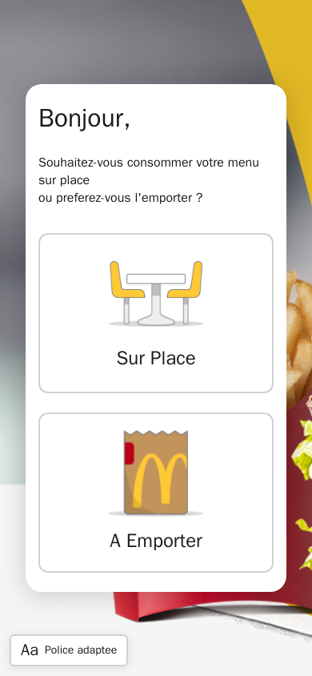
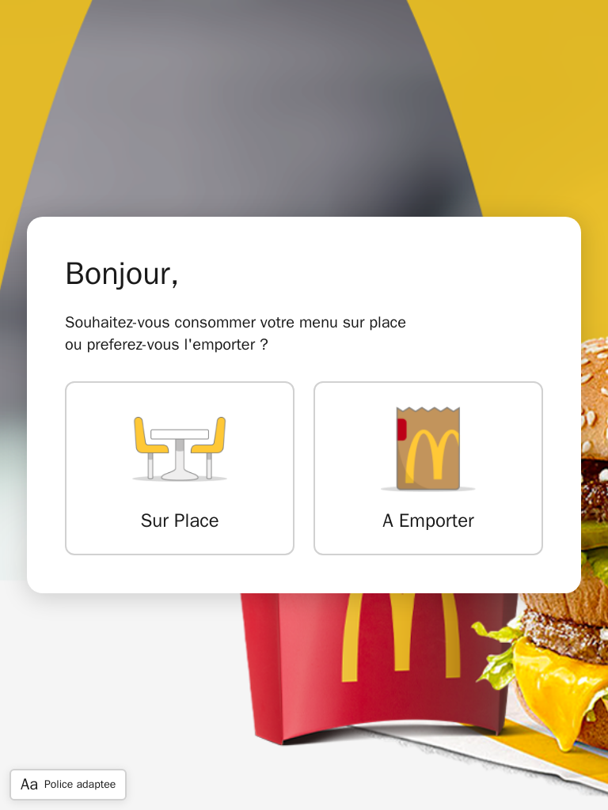
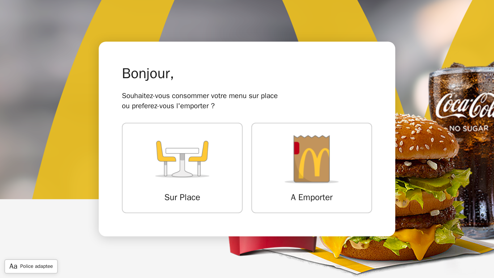
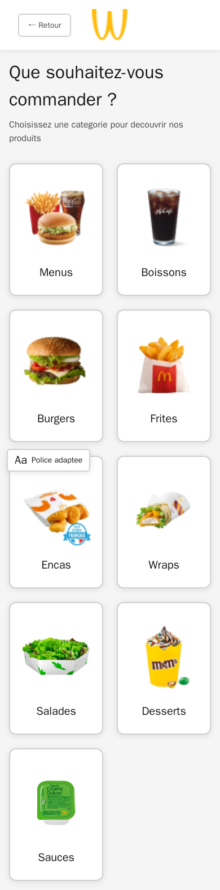
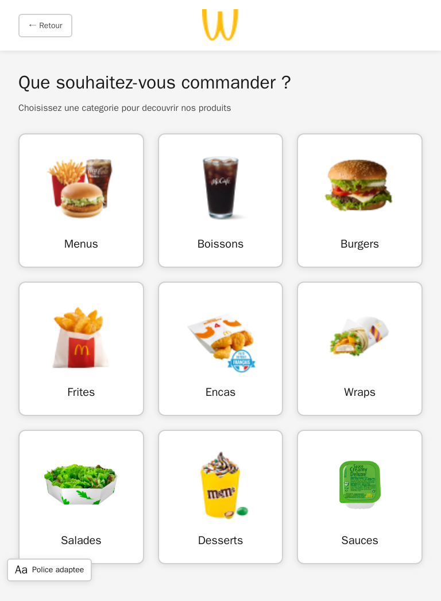
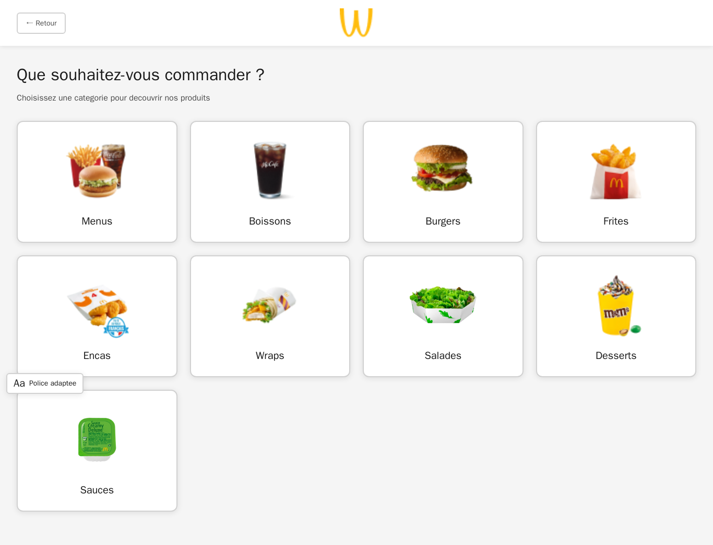
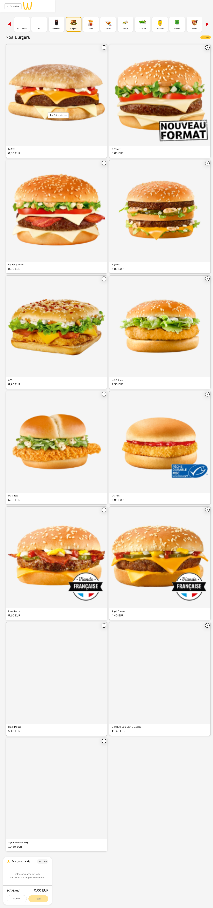
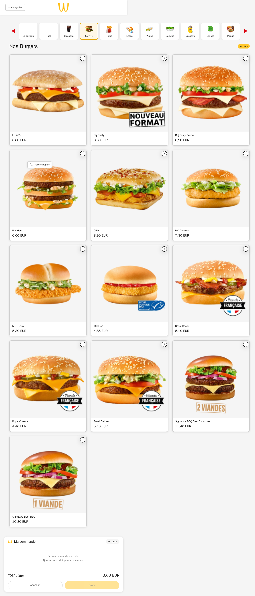
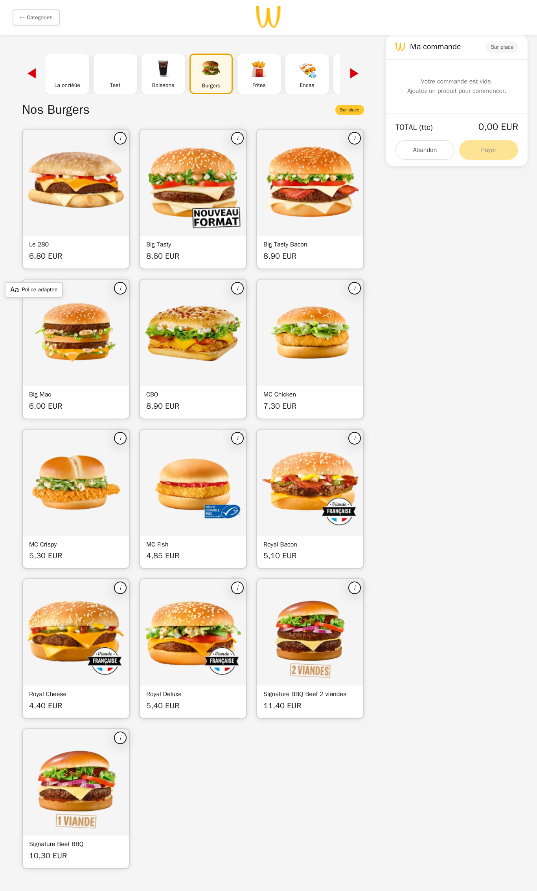

# Preuve 02 — Matrice responsive (C1.b)

**Bloc 1 — Developpement de la partie front-end d'une application web**
**Competence C1.b — Realiser une interface utilisateur adaptable (responsive)**
**Critere d'evaluation vise : Cr 1.b.1 — L'application s'adapte aux differentes resolutions d'ecran.**

## 1. Objet et perimetre

Cette preuve documente le comportement responsive des deux interfaces front-end du projet Wakdo :

- **la borne de commande client** (feuille `src/public/borne/assets/css/style.css`), cible primaire annoncee en tete de fichier : `1080x1920` portrait tactile (`style.css:14`) ;
- **le back-office administrateur** (feuille `src/public/admin/assets/css/admin.css`), conçu en desktop-first, optimise pour `1280px+` (`admin.css:4`).

L'adaptation repose sur des `@media` queries qui reorganisent les grilles, empilent les panneaux lateraux et ajustent la typographie. Chaque comportement est ancre dans une regle CSS reelle, citee en `fichier:ligne`.

Toutes les pages declarent le viewport meta responsive `width=device-width, initial-scale=1.0`, condition prealable a l'application des media queries :

- borne : `src/public/borne/index.html`, `categories.html`, `products.html`, `payment.html`, `confirmation.html` (viewport verifie sur les cinq pages) ;
- admin : `src/app/Views/admin/layout.php:64` (layout partage de toutes les pages admin) ; layout public partage : `src/app/Views/layout.php:18`.

## 2. Recensement des points de rupture reels

### 2.1 Borne (`style.css`)

| Point de rupture | Direction | Regle (fichier:ligne) | Effet principal |
|---|---|---|---|
| `min-width: 1080px` | montante (grand ecran) | `style.css:405` | carte d'accueil elargie a `820px` ; `.category-grid` passe a **4 colonnes** (`style.css:418`) ; icones de choix `150px` |
| `max-width: 900px` | descendante | `style.css:1731` | `.order-layout` passe en `flex-direction: column` (`style.css:1732`) ; le `.order-panel` perd son `sticky`/largeur fixe et s'etire (`static`, `width:auto`) (`style.css:1736-1742`) |
| `max-width: 700px` | descendante | `style.css:949` | `.products-grid` passe a **2 colonnes** (`style.css:951`) ; `.payment-methods` s'empile (`flex-direction: column`) (`style.css:954`) |
| `max-width: 600px` | descendante | `style.css:423` | carte d'accueil resserree ; `.welcome__greeting` reduit a `xl` ; `.category-grid` a **2 colonnes** (`style.css:437`) ; `.composer-grid` en tuiles `120px` (`style.css:1496`) |
| `max-width: 480px` | descendante | `style.css:446` et `style.css:960` | `.welcome__choices` en colonne unique (`style.css:447`) ; `.products-grid` en `1fr 1fr` avec gap resserre (`style.css:961`) |

Les cinq points de rupture attendus (`1080` / `900` / `700` / `600` / `480`) sont presents dans le fichier.

### 2.2 Admin (`admin.css`)

| Point de rupture | Direction | Regle (fichier:ligne) | Effet principal |
|---|---|---|---|
| `max-width: 900px` | descendante | `admin.css:2094` | `.stock-summary` passe a 1 colonne (`admin.css:2095`) ; `.stock-list__row` degrille en 1 colonne (`admin.css:2098`) ; actions realignees a gauche (`admin.css:2102`) |
| `max-width: 860px` | descendante | `admin.css:1819` | POS comptoir/drive : `.pos__main` en colonne (`admin.css:1820`) ; le `.pos__panel` perd son `sticky` et passe pleine largeur (`admin.css:1821-1826`) ; hauteur du panier plafonnee (`admin.css:1827`) |
| `max-width: 700px` | descendante | `admin.css:1489` | `.perm-grid` (matrice de droits) passe a 1 colonne (`admin.css:1490`) |

Les trois points de rupture attendus (`900` / `860` / `700`) sont presents dans le fichier.

## 3. Matrice Page x Point de rupture -> comportement de layout

Notation des tranches : **XL** = `>= 1080px` ; **L** = `901-1079px` (etat de base, hors media query descendante) ; **M** = `<= 900px` ; **S** = `<= 700px` ; **XS** = `<= 480px`. Chaque cellule renvoie a la regle CSS qui la produit ; une cellule marquee "base" signifie qu'aucune media query ne s'applique et que le layout de base du composant reste actif.

### 3.1 Borne

| Page | XL (`>=1080`) | L (base) | M (`<=900`) | S (`<=700`) | XS (`<=480`) |
|---|---|---|---|---|---|
| **Accueil** (`index.html`) | carte `820px`, choix en ligne, icones `150px` (`style.css:405-414`) | carte `700px` max, `.welcome__choices` en ligne flex-wrap, icones `120px` (`style.css:180,200-204,239`) | base (pas de MQ dediee entre 600 et 900) | carte resserree `space-5/4`, titre reduit a `xl` (`style.css:423-434`) | `.welcome__choices` en **colonne unique** (`style.css:446-449`) |
| **Categories** (`categories.html`) | `.category-grid` **4 colonnes** (`style.css:416-419`) | `.category-grid` **3 colonnes** (base) (`style.css:342-346`) | base 3 colonnes (pas de MQ entre 600 et 900) | 3 colonnes (le seuil categorie est `600`, pas `700`) | `.category-grid` **2 colonnes** + main resserre (`style.css:436-442`) |
| **Produits / commande** (`products.html`, `order-layout`) | grille `.products-grid` **3 colonnes** ; panneau lateral `.order-panel` fixe `360px` sticky a droite (`style.css:592-599,1539-1551`) | idem base : 3 colonnes + panneau lateral sticky `360px` (`style.css:1527-1551`) | **`.order-layout` empile** en colonne ; `.order-panel` passe `static`, `width:auto`, pleine largeur, sous la grille (`style.css:1731-1743`) | `.products-grid` **2 colonnes** (`style.css:949-952`) ; l'empilement du panneau (herite de la MQ 900) reste actif | `.products-grid` en `1fr 1fr` gap resserre, main padding reduit (`style.css:960-968`) |
| **Paiement** (`payment.html`) | `.payment-methods` 2 boutons cote a cote (flex-wrap, `max-width:640`) (`style.css:791-799`) | idem base : boutons cote a cote (`style.css:792-799`) | base (pas de MQ entre 700 et 900) | `.payment-methods` en **colonne** (`flex-direction: column`, `align-items: stretch`) (`style.css:949,954-957`) | herite de l'empilement `<=700`, recap `max-width:480` inchange (`style.css:764-772`) |

Note sur l'accueil et les categories : la borne n'a pas de media query descendante dans l'intervalle `601-900px`, donc en tranche M ces deux pages conservent leur layout de base (respectivement choix en ligne et grille 3 colonnes). C'est un choix assume : la borne physique est large ; les seuils bas couvrent la degradation vers tablette/telephone.

Note sur le composant de composition de menu (modale ouverte depuis la grille produits) : `.composer-grid` s'adapte independamment via `@media (max-width: 600px)` (tuiles `minmax(120px,1fr)`, footer en colonne, `style.css:1495-1520`).

### 3.2 Admin

| Page / zone | Base (`>= ~1280`) | `<=900` | `<=860` | `<=700` |
|---|---|---|---|---|
| **Shell** (topbar + sidebar, `admin-layout`) | grille 2 colonnes `264px 1fr` x 2 lignes `72px 1fr`, zones `sidebar/topbar/content` (`admin.css:119-128`) ; markup : `src/app/Views/admin/layout.php:70-71,94,162` | **inchange** : aucune media query ne restructure `.admin-layout` ; la sidebar reste en colonne fixe `264px` | inchange | inchange |
| **Dashboard stock** (`.stock-summary`, `.stock-list`) | `.stock-summary` **3 colonnes** (`admin.css:1893-1898`) ; `.stock-list__row` en grille `1fr 200px auto` (`admin.css:2043-2050`) | `.stock-summary` **1 colonne** ; `.stock-list__row` **1 colonne**, actions a gauche (`admin.css:2094-2104`) | idem `<=900` (herite) | idem |
| **POS comptoir/drive** (`.pos__main`, `.pos__panel`) | catalogue `flex:1` a gauche + panneau `340px` sticky a droite (`admin.css:1524-1532,1695-1707`) | base (pas de MQ a 900 pour le POS) | **`.pos__main` empile** en colonne ; `.pos__panel` `static`, pleine largeur, panier plafonne `320px` (`admin.css:1819-1828`) | idem `<=860` (herite) |
| **Formulaire Roles** (`.perm-grid`) | matrice de droits **2 colonnes** (`admin.css:1462-1468`) | base (seuil a 700) | base | `.perm-grid` **1 colonne** (`admin.css:1489-1491`) |

Point d'honnetete sur le shell admin : le `.admin-layout` en `grid` conserve sa **sidebar fixe de 264px a toutes les resolutions** — il n'existe aucune media query qui la reduise, la masque ou la transforme en menu hamburger (recherche confirmee : les seules `@media` d'`admin.css` sont `900`, `860`, `700`, et aucune ne cible `.admin-layout`, `.sidebar` ou `.topbar`). En dessous d'environ `600px` de large, la zone de contenu devient donc etroite. C'est coherent avec la cible declaree (back-office desktop/tablette, `admin.css:4`) mais **le shell admin n'est pas optimise pour le mobile portrait etroit** ; les composants internes (stock, POS, roles) s'adaptent, pas l'ossature. Cr 1.b.1 est donc **couvert pour la borne (cible tactile) et pour les composants admin, partiellement couvert pour l'ossature admin sur tres petits ecrans.**

## 4. Mecanismes d'adaptation employes (synthese technique)

- **Reflow de grille** par changement de `grid-template-columns` selon le point de rupture : 4 -> 3 -> 2 -> 1 colonnes selon les zones (`style.css:342,418,437,594,951,961` ; `admin.css:508,1893,2098,1465,1490`).
- **Empilement de panneau lateral** par bascule `flex-direction: row -> column` et neutralisation du `position: sticky` (passage en `static`) : borne `order-layout`/`order-panel` (`style.css:1731-1743`), admin POS `pos__main`/`pos__panel` (`admin.css:1819-1828`).
- **Grilles fluides intrinsequement responsives** via `repeat(auto-fill/auto-fit, minmax(...))`, qui s'adaptent sans media query : `.composer-grid` (`style.css:1122`), `.kpi-grid` fixe mais `.stats-cards` et `.kitchen-grid` en auto-fit/auto-fill (`admin.css:1308,1034`), `.pos__grid` (`admin.css:1573`), `.stock-cards` (`admin.css:1988`).
- **Ajustement typographique** aux petits ecrans (ex. `.welcome__greeting` de `2xl` a `xl`, `style.css:428-430`).
- **Unites relatives** (`rem`, `%`, `1fr`, `vh`) et images fluides (`img { max-width: 100%; height: auto }`, `style.css:104-108`) pour eviter les debordements horizontaux.
- **Repli de compatibilite** documente pour `gap` sur flex via `@supports not (gap: 1rem)` (`style.css:1996-2001`) — releve du critere de compatibilite navigateur (Cr 1.b.3) plutot que de la resolution, mentionne ici pour contexte.

## 5. Captures multi-viewport

Les captures reelles multi-viewport ont ete generees via Playwright (Chromium, image officielle `mcr.microsoft.com/playwright:v1.49.1-jammy`) contre la borne en ligne (`https://corentin-wakdo.stark.a3n.fr`, categorie « burgers ») aux trois tailles de reference : **mobile 390px**, **tablette 768px**, **desktop 1366px**. Les neuf images (3 pages x 3 viewports) sont versionnees dans `docs/soutenance/preuves/captures-responsive/`. La methode de generation (harnais Playwright + selection de viewport) est reproductible ; elle partage le moteur avec la validation W3C (voir `01-validation-w3c.md`).

Correspondance viewport -> tranche CSS attendue de la borne :
- **390px** -> tranche XS (`<=480`) : produits en `1fr 1fr` resserre, panneau commande empile sous la grille, choix d'accueil en colonne.
- **768px** -> tranche S/M (`<=900` et `<=700`) : produits 2 colonnes, panneau commande empile, paiement en colonne.
- **1366px** -> tranche XL (`>=1080`) : categories 4 colonnes, produits 3 colonnes, panneau commande lateral sticky.

### Accueil

- Mobile 390px : 
- Tablette 768px : 
- Desktop 1366px : 

### Categories

- Mobile 390px : 
- Tablette 768px : 
- Desktop 1366px : 

### Produits / commande

- Mobile 390px : 
- Tablette 768px : 
- Desktop 1366px : 

### Captures de reference deja presentes dans le depot

Le dossier `docs/design/screens/` contient dix captures de la maquette/interface de reference de la borne, deja versionnees (non generees pour cette preuve, elles illustrent les ecrans nominaux, pas la variation de resolution) :

- `docs/design/screens/01-accueil.png`
- `docs/design/screens/02-commande-menus.png`
- `docs/design/screens/03-modale-taille-menu.png`
- `docs/design/screens/04-modale-accompagnement.png`
- `docs/design/screens/05-modale-boisson.png`
- `docs/design/screens/06-commande-boissons.png`
- `docs/design/screens/07-boissons-selection.png`
- `docs/design/screens/08-modale-format-quantite.png`
- `docs/design/screens/09-chevalet.png`
- `docs/design/screens/10-remerciement.png`

Ces captures montrent les etats fonctionnels d'un seul viewport (borne portrait) ; les captures multi-viewport de la section precedente les completent en apportant la preuve directe de l'adaptation par resolution (Cr 1.b.1).

## 6. Verdict sur Cr 1.b.1

| Element | Etat | Preuve |
|---|---|---|
| Viewport meta responsive present | Couvert | 5 pages borne + `layout.php` admin (voir section 1) |
| Adaptation par media queries (borne) | Couvert | 5 points de rupture reels, matrice section 3.1 |
| Adaptation des composants admin | Couvert | 3 points de rupture reels, matrice section 3.2 |
| Empilement des panneaux lateraux en etroit | Couvert | `style.css:1731-1743`, `admin.css:1819-1828` |
| Reflow des grilles multi-colonnes | Couvert | citations section 4 |
| Ossature admin (sidebar) sur mobile portrait etroit | Partiel | aucune media query sur `.admin-layout`/`.sidebar` (section 3.2) |
| Preuve visuelle multi-viewport | Couvert | 9 captures Playwright versionnees (section 5) |

**Conclusion.** Le critere Cr 1.b.1 est demontre pour la borne client (interface principale evaluee au titre du front-end) via cinq points de rupture verifies dans le code et pour les composants du back-office via trois points de rupture. La reserve honnete porte sur l'ossature de la sidebar admin, non adaptee au mobile portrait etroit, ce qui reste coherent avec sa cible desktop/tablette declaree. Les neuf captures multi-viewport versionnees completent la preuve visuelle.
