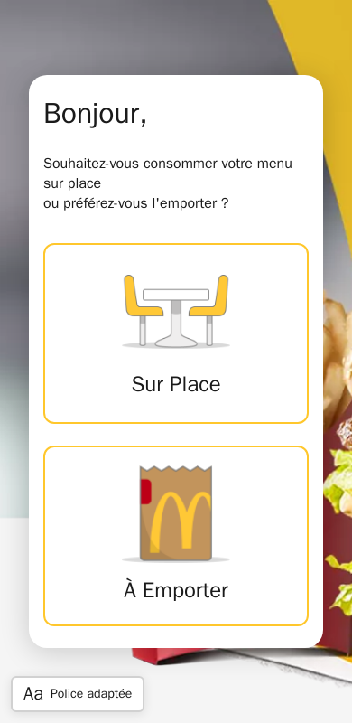
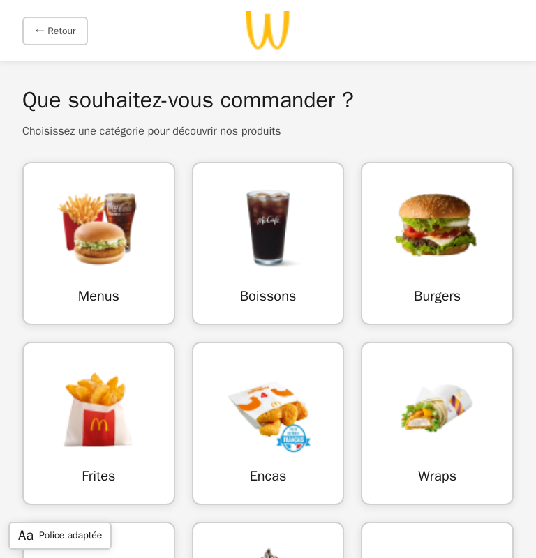
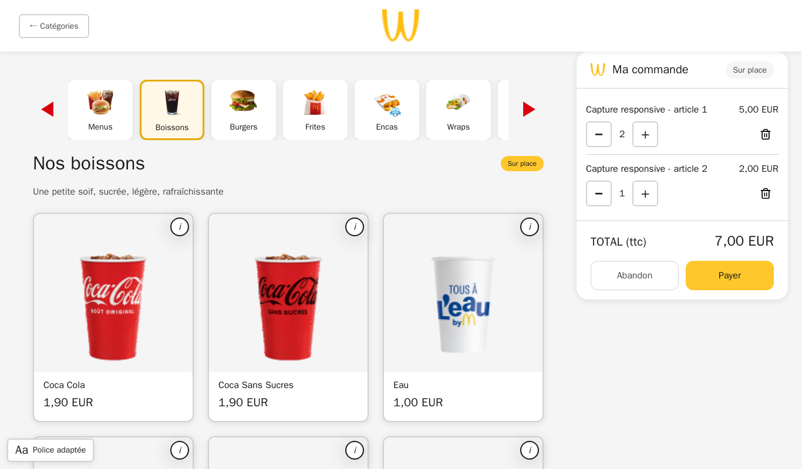
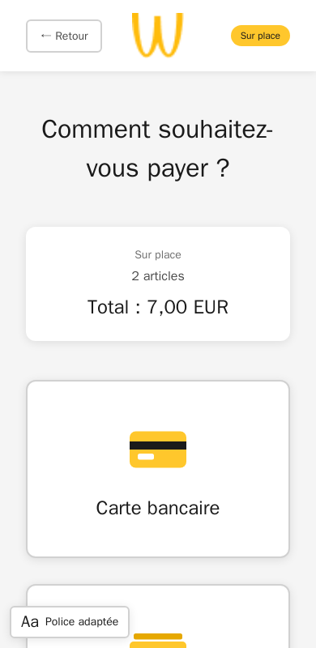
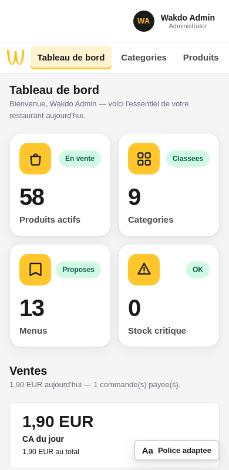
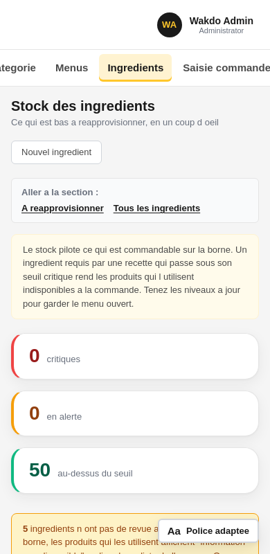
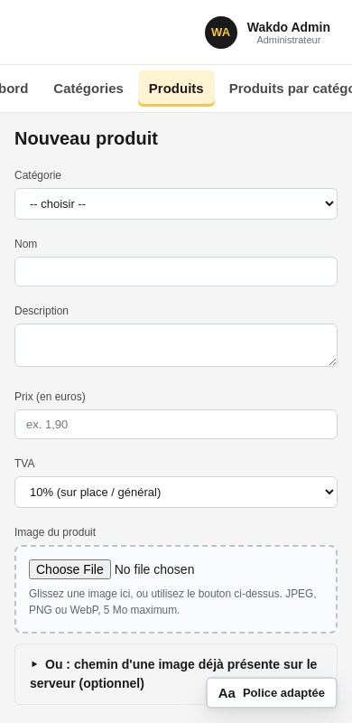
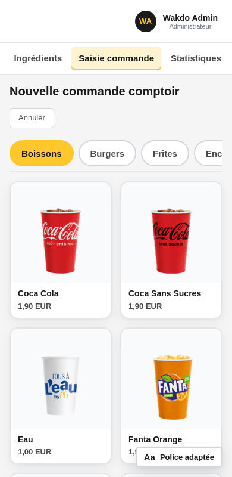

# Preuve 02 — Matrice responsive (C1.b)

**Bloc 1 — Developpement de la partie front-end d'une application web**
**Competence C1.b — Realiser une interface utilisateur adaptable (responsive)**
**Critere d'evaluation vise : Cr 1.b.1 — L'application s'adapte aux differentes resolutions d'ecran.**

## 1. Objet et perimetre

Cette preuve documente le comportement responsive des deux interfaces front-end du projet Wakdo :

- **la borne de commande client** (feuille `src/public/borne/assets/css/style.css`), cible primaire annoncee en tete de fichier : `1080x1920` portrait tactile (en-tete du fichier `style.css`) ;
- **le back-office administrateur** (feuille `src/public/admin/assets/css/admin.css`), conçu en desktop-first, optimise pour `1280px+` (en-tete du fichier `admin.css`).

L'adaptation repose sur des `@media` queries qui reorganisent les grilles, empilent les panneaux lateraux et ajustent la typographie. Chaque comportement est ancre dans une regle CSS reelle, citee par selecteur et par section du sommaire de `style.css` (sections 1 a 21) ou par section nommee d'`admin.css` — repere stable, une ligne de fichier ne l'est pas (voir la note de fin de document).

Toutes les pages declarent le viewport meta responsive `width=device-width, initial-scale=1.0`, condition prealable a l'application des media queries :

- borne : `src/public/borne/index.html`, `categories.html`, `products.html`, `payment.html`, `confirmation.html` (viewport verifie sur les cinq pages) ;
- admin : `src/app/Views/admin/layout.php:64` (layout partage de toutes les pages admin) ; layout public partage : `src/app/Views/layout.php:18`.

## 2. Recensement des points de rupture reels

### 2.1 Borne (`style.css`)

| Point de rupture | Direction | Regle (selecteur, section) | Effet principal |
|---|---|---|---|
| `min-width: 1080px` | montante (grand ecran) | `.welcome__card` (section 6) | carte d'accueil elargie a `820px` ; `.category-grid` passe a **4 colonnes** (meme regle, section 6) ; icones de choix `150px` |
| `max-width: 900px` | descendante | `.order-layout` (section 15) | `.order-layout` passe en `flex-direction: column` (meme regle, section 15) ; le `.order-panel` perd son `sticky`/largeur fixe et s'etire (`static`, `width:auto`) (`.order-panel`, section 15) ; depuis le 2026-09-23, le contenu (`.order-layout > main`) est lui aussi etire a la largeur disponible (section 15, voir section 3.3) |
| `max-width: 700px` | descendante | `.products-grid` (section 12) | `.products-grid` passe a **2 colonnes** (meme regle, section 12) ; `.payment-methods` s'empile (`flex-direction: column`) (`.payment-methods`, section 12) |
| `max-width: 600px` | descendante | `.welcome__card` (section 6) | carte d'accueil resserree ; `.welcome__greeting` reduit a `xl` ; `.category-grid` a **2 colonnes** (meme regle, section 6) ; `.composer-grid` en tuiles `120px` (`.composer-grid`, sous-bloc Responsive en fin de section 14 — le composeur est range en section 13 au sommaire, mais sa regle responsive est placee physiquement apres l'en-tete de la section 14) |
| `max-width: 480px` | descendante | `.welcome__choices` (section 6) et `.products-grid` (section 12) | `.welcome__choices` en colonne unique (meme regle, section 6) ; `.products-grid` en `1fr 1fr` avec gap resserre (meme regle, section 12) |

Les cinq points de rupture attendus (`1080` / `900` / `700` / `600` / `480`) sont presents dans le fichier.

### 2.2 Admin (`admin.css`)

| Point de rupture | Direction | Regle (selecteur, section) | Effet principal |
|---|---|---|---|
| `max-width: 900px` | descendante | `.stock-summary` (section « Stock dashboard (page d'accueil ingredients) ») | `.stock-summary` passe a 1 colonne (meme regle) ; `.stock-list__row` degrille en 1 colonne (`.stock-list__row`, meme section) ; actions realignees a gauche (meme section) |
| `max-width: 860px` | descendante | `.pos__main` (section « POS tactile a tuiles comptoir/drive ») | POS comptoir/drive : `.pos__main` en colonne (meme regle) ; le `.pos__panel` perd son `sticky` et passe pleine largeur (`.pos__panel`, meme section) ; hauteur du panier plafonnee (`.order-cart`, meme section) |
| `max-width: 720px` | descendante | `.catalogue-grid` (section « Produits par categorie (vue groupee back-office, F20) ») | `.catalogue-summary` passe a 1 colonne ; `.catalogue-grid` (base : `repeat(auto-fill, minmax(min(240px,100%),1fr))`) passe a 1 colonne (memes regles) |
| `max-width: 700px` | descendante | `.perm-grid` (section « Matrice de droits d'acces groupee (formulaire Roles humanise) ») | `.perm-grid` (matrice de droits) passe a 1 colonne (meme regle) |
| `max-width: 640px` | descendante | bloc « Ossature sur petit ecran (Cr 1.b.1) » (section du meme nom, apres `.content`), et bloc de la section « Dashboard (direction A+C) » (apres les regles `.tile`) | **ossature** : grille a 1 colonne (barre du haut, bande de navigation, contenu) ; le menu lateral devient une bande horizontale defilante, recentree sur la page courante (`admin.js`) ; contenu pleine largeur. **Tableau de bord** : tuiles sur 2 colonnes au lieu de 4 ; boutons d'en-tete sous le titre (ajoutes le 2026-09-23) |
| `max-width: 640px` | descendante | `.allergen-matrix` (section « Revue des allergenes d'un ingredient (F11b) ») | `.allergen-matrix` (base : `repeat(auto-fill, minmax(260px,1fr))`) passe a 1 colonne (meme regle) |

Les points de rupture des composants (`900` / `860` / `720` / `700`) sont presents dans le fichier, ainsi que deux points a `640` : l'ossature (ajoutee le 2026-09-23) et la matrice d'allergenes (presente depuis le 2026-07-31, PR #128).

## 3. Matrice Page x Point de rupture -> comportement de layout

Notation des tranches : **XL** = `>= 1080px` ; **L** = `901-1079px` (etat de base, hors media query descendante) ; **M** = `<= 900px` ; **S** = `<= 700px` ; **XS** = `<= 480px`. Chaque cellule renvoie a la regle CSS qui la produit ; une cellule marquee "base" signifie qu'aucune media query ne s'applique et que le layout de base du composant reste actif.

### 3.1 Borne

| Page | XL (`>=1080`) | L (base) | M (`<=900`) | S (`<=700`) | XS (`<=480`) |
|---|---|---|---|---|---|
| **Accueil** (`index.html`) | carte `820px`, choix en ligne, icones `150px` (`.welcome__card`, section 6) | carte `700px` max, `.welcome__choices` en ligne flex-wrap, icones `120px` (`.welcome__card`/`.welcome__choices`/`.choice-btn__image`, section 4) | base (pas de MQ dediee entre 600 et 900) | carte resserree `space-5/4`, titre reduit a `xl` (`.welcome__card`, section 6) | `.welcome__choices` en **colonne unique** (`.welcome__choices`, section 6) |
| **Categories** (`categories.html`) | `.category-grid` **4 colonnes** (section 6) | `.category-grid` **3 colonnes** (base) (`.category-grid`, section 5) | base 3 colonnes (pas de MQ entre 600 et 900) | 3 colonnes (le seuil categorie est `600`, pas `700`) | `.category-grid` **2 colonnes** + main resserre (meme regle, section 6) |
| **Produits / commande** (`products.html`, `order-layout`) | grille `.products-grid` **3 colonnes** ; panneau lateral `.order-panel` fixe `360px` sticky a droite (`.products-grid`, section 8 ; `.order-panel`, section 15) | idem base : 3 colonnes + panneau lateral sticky `360px` (memes regles) | **`.order-layout` empile** en colonne ; `.order-panel` passe `static`, `width:auto`, pleine largeur, sous la grille (`.order-layout`/`.order-panel`, section 15) | `.products-grid` **2 colonnes** (`.products-grid`, section 12) ; l'empilement du panneau (herite de la MQ 900) reste actif | `.products-grid` en `1fr 1fr` gap resserre, main padding reduit (`.products-grid`/`.products-main`, section 12) |
| **Paiement** (`payment.html`) | `.payment-methods` 2 boutons cote a cote (flex-wrap, `max-width:640`) (`.payment-methods`, section 10) | idem base : boutons cote a cote (meme regle) | base (pas de MQ entre 700 et 900) | `.payment-methods` en **colonne** (`flex-direction: column`, `align-items: stretch`) (`.payment-methods`, section 12) | herite de l'empilement `<=700` ; aucune regle CSS supplementaire propre a ce seuil pour l'ecran de paiement |

Note sur l'accueil et les categories : la borne n'a pas de media query descendante dans l'intervalle `601-900px`, donc en tranche M ces deux pages conservent leur layout de base (respectivement choix en ligne et grille 3 colonnes). C'est un choix assume : la borne physique est large ; les seuils bas couvrent la degradation vers tablette/telephone.

Note sur le composant de composition de menu (modale ouverte depuis la grille produits) : `.composer-grid` s'adapte independamment via `@media (max-width: 600px)` (tuiles `minmax(120px,1fr)`, footer en colonne ; `.composer-grid`, sous-bloc Responsive en fin de section 14).

### 3.2 Admin

| Page / zone | Base (`>= ~1280`) | `<=900` | `<=860` | `<=700` |
|---|---|---|---|---|
| **Shell** (topbar + sidebar, `admin-layout`) | grille 2 colonnes `264px 1fr` x 2 lignes `72px 1fr`, zones `sidebar/topbar/content` (`.admin-layout`, section « Layout Shell ») ; markup : `src/app/Views/admin/layout.php`, elements `.admin-layout` / `header.topbar` / `nav.sidebar` / `main.content` | **inchange au-dessus de 640px** : aucune media query dans cette plage (900/860/700) ne restructure `.admin-layout` ; la sidebar reste en colonne fixe `264px`. Sous `640px`, une media query dediee restructure bien `.admin-layout` (voir la note « Ossature admin » sous ce tableau). | inchange | inchange |
| **Dashboard stock** (`.stock-summary`, `.stock-list`) | `.stock-summary` **3 colonnes** (section « Stock dashboard (page d'accueil ingredients) ») ; `.stock-list__row` en grille `1fr 200px auto` (meme section) | `.stock-summary` **1 colonne** ; `.stock-list__row` **1 colonne**, actions a gauche (meme section, regle `max-width: 900px`) | idem `<=900` (herite) | idem |
| **POS comptoir/drive** (`.pos__main`, `.pos__panel`) | catalogue `flex:1` a gauche + panneau `340px` sticky a droite (section « POS tactile a tuiles comptoir/drive ») | base (pas de MQ a 900 pour le POS) | **`.pos__main` empile** en colonne ; `.pos__panel` `static`, pleine largeur, panier plafonne `320px` (meme section, regle `max-width: 860px`) | idem `<=860` (herite) |
| **Formulaire Roles** (`.perm-grid`) | matrice de droits **2 colonnes** (section « Matrice de droits d'acces groupee (formulaire Roles humanise) ») | base (seuil a 700) | base | `.perm-grid` **1 colonne** (meme section, regle `max-width: 700px`) |

**Ossature admin (mise a jour du 2026-09-23).** Jusqu'a cette date, le `.admin-layout` gardait sa colonne de menu de `264px` a toutes les largeurs : aucune media query ne ciblait `.admin-layout`, `.sidebar` ou `.topbar`, et sous `600px` environ le contenu devenait etroit. Depuis le lot F33, sous `640px` :

| Zone | `<= 640px` |
|---|---|
| `.admin-layout` | 1 colonne : barre du haut (`72px`), bande de navigation, contenu |
| `.sidebar` | bande horizontale defilante, pleine largeur ; logo reduit, intitules de rubrique retires (redondants avec les liens) ; page courante reperee par un trait jaune sous le lien |
| `.content` | pleine largeur, marges de `16px` |

Tous les liens restent dans la page, dans le meme ordre de tabulation ; seul le recentrage de la bande sur la page courante passe par JavaScript (`admin.js`), la mise en page n'en depend pas.

**Mesure** dans Chromium (`tests/e2e/responsive.spec.js`) sur **16 pages** du back-office (tableau de bord, ingredients, produits, nouveau produit, produits par categorie, categories, menus, nouveau menu, commandes, saisie commande, **nouvelle commande comptoir**, cuisine, statistiques, utilisateurs, roles, mon PIN) a 360 et 390 px. Le back-office ne defile pas au niveau du document (`.admin-layout` : hauteur fixe, `overflow: hidden`) : c'est la zone de contenu `main.content` qui defile, c'est donc elle qui est mesuree. Resultat : aucun defilement horizontal de la zone de contenu, menu et contenu a pleine largeur, menu au-dessus du contenu, page courante visible dans la bande ; a 1366 px, le menu reste une colonne a gauche. Les tableaux larges defilent dans leur propre cadre (`.table-wrapper`), ce qui est voulu.

**Ajout du 2026-09-26 : la caisse elle-meme est mesuree.** Jusque-la, la liste ne contenait que `/counter/orders` (la **liste** des commandes comptoir), pas `/counter/orders/new` — c'est-a-dire l'ecran de caisse a tuiles dont la ligne « POS comptoir/drive » du tableau ci-dessus decrit l'empilement sous 860 px. Le comportement etait donc decrit dans le CSS et affirme ici, sans etre mesure a aucune largeur. Il l'est desormais aux deux largeurs telephone, avec capture.

Cette mesure a d'abord echoue, ce qui a fait corriger trois defauts du back-office sur telephone : les 4 tuiles du tableau de bord (382 px de trop a 360 px), les boutons d'en-tete de la liste des produits (19 px), et trois tableaux poses sans cadre defilant (liste des commandes, deux listes de la saisie comptoir : 275 px de trop avec une seule commande). Une premiere version du test mesurait le document, qui ne peut pas deborder ici : elle passait a tort, la relecture l'a releve.

### 3.3 Defaut corrige : page produits de la borne sur telephone

Le meme test a revele un defaut plus ancien, present dans le code de `dev` au commit `74d4398` : sur la page produits, a 360 et 390 px, toute la page defilait horizontalement (902 et 872 px de trop). Sous `900px`, `.order-layout` passe en colonne avec `align-items: flex-start` : le contenu prenait alors la largeur de son element le plus large, le bandeau de categories (1 206 px), au lieu de celle de l'ecran. La regle `min-width: 0` existante ne joue qu'en ligne. Correctif : `.order-layout > main { align-self: stretch; }` sous `900px` ; le bandeau defile desormais dans son propre cadre, et le debordement mesure est de 0 px aux deux largeurs. Le defaut touchait toute largeur sous `900px` : les captures d'alors (`produits-mobile.png`, 1 506 x 6 394 pixels pour une fenetre de 390 px, et `produits-tablette.png`, 1 538 x 3 588 pixels pour 768 px) le montraient deja, sans qu'il ait ete releve. Elles ont ete remplacees le 2026-09-23, puis regenerees le 2026-09-26 sous les noms `borne-produits-<largeur>.png` (voir section 5) ; les deux fichiers cites ici ne sont plus sur disque, ils restent consultables dans l'historique git. Le test verifie desormais 360, 390, 768 et 1366 px.

## 4. Mecanismes d'adaptation employes (synthese technique)

- **Reflow de grille** par changement de `grid-template-columns` selon le point de rupture : 4 -> 3 -> 2 colonnes pour `.category-grid` (base section 5, overrides section 6), 3 -> 2 -> `1fr 1fr` pour `.products-grid` (base section 8, overrides section 12) ; admin `.stock-summary` 3 -> 1 colonne et `.perm-grid` 2 -> 1 colonne (sections « Stock dashboard (page d'accueil ingredients) » et « Matrice de droits d'acces groupee (formulaire Roles humanise) »).
- **Empilement de panneau lateral** par bascule `flex-direction: row -> column` et neutralisation du `position: sticky` (passage en `static`) : borne `order-layout`/`order-panel` (style.css, section 15), admin POS `pos__main`/`pos__panel` (admin.css, section « POS tactile a tuiles comptoir/drive »).
- **Grilles fluides intrinsequement responsives** via `repeat(auto-fill/auto-fit, minmax(...))`, qui s'adaptent sans media query : `.composer-grid` (style.css, section 13), `.kpi-grid` fixe mais `.stats-cards` et `.kitchen-grid` en auto-fit/auto-fill (admin.css, sections « Statistiques — cartes KPI (tableau de bord stats.read) » et « Kitchen Cards »), `.pos__grid` (admin.css, section « POS tactile a tuiles comptoir/drive »), `.stock-cards` (admin.css, section « Stock dashboard (page d'accueil ingredients) »).
- **Ajustement typographique** aux petits ecrans (ex. `.welcome__greeting` de `2xl` a `xl`, style.css section 6).
- **Unites relatives** (`rem`, `%`, `1fr`, `vh`) et images fluides (`img { max-width: 100%; height: auto }`, style.css section 2) pour eviter les debordements horizontaux.
- **Repli de compatibilite** documente pour `gap` sur flex via `@supports not (gap: 1rem)` (style.css section 20) — releve du critere de compatibilite navigateur (Cr 1.b.3) plutot que de la resolution, mentionne ici pour contexte.

## 5. Captures multi-viewport

**Refaites integralement le 2026-09-26.** Les captures precedentes dataient du 2026-09-23 et montraient une interface qui n'existe plus : la borne a recu cinq lots depuis (dont la mise en conformite a la maquette), et le back-office a ete entierement refondu (demandes de fusion #158 a #166). Presenter au jury des images de l'ancienne version, sur un oral dont l'accessibilite est l'axe principal, aurait ete une incoherence.

### Comment elles sont produites (une commande)

```bash
# Monte une pile jetable, joue responsive.spec.js avec CAPTURES_DIR pose,
# range les images dans les deux dossiers de preuves, puis demonte tout.
tests/e2e/run-captures.sh
```

Playwright, image officielle `mcr.microsoft.com/playwright:v1.49.1-jammy`, Chromium 131, contre une **pile de test jetable** (donnees de demonstration), pas contre la production : aucune donnee reelle n'entre dans le dossier de preuves. Le script tourne sous l'identifiant de l'appelant, les fichiers deposes ne sont donc pas la propriete de root. Avant cette date, les captures de la borne etaient prises a la main contre la borne en ligne, sans script versionne : elles n'etaient pas refaisables a l'identique.

**52 images** sont versionnees dans `captures-responsive/`, nommees `<perimetre>-<ecran>-<largeur>.png` — exactement les noms que la commande produit :

- **Borne** : 5 ecrans (accueil, categories, produits, paiement, confirmation) x 4 largeurs (360, 390, 768, 1366) = 20 images.
- **Back-office** : 16 ecrans x 2 largeurs (360, 390) = 32 images.

Correspondance largeur -> tranche CSS attendue de la borne :
- **360 et 390 px** -> tranche XS (`<=480`) : produits en `1fr 1fr` resserre, panneau commande empile sous la grille, choix d'accueil en colonne.
- **768 px** -> tranche S/M (`<=900` et `<=700`) : produits 2 colonnes, panneau commande empile, paiement en colonne.
- **1366 px** -> tranche XL (`>=1080`) : categories 4 colonnes, produits 3 colonnes, panneau commande lateral sticky.

### 5.1 Defaut trouve en refaisant les captures : le paiement n'etait pas capture

En regenerant, une anomalie est apparue tout de suite : `borne-paiement-390.png` etait **identique octet pour octet** a `borne-categories-390.png`, aux quatre largeurs. Explication : le test chargeait `/payment.html` **sans panier**, et `page-payment.js` renvoie alors le client vers les categories. Le test mesurait donc deux fois l'ecran categories, dont une fois sous le nom « paiement », et il passait — un ecran sans debordement reste un ecran sans debordement, meme si ce n'est pas le bon.

C'est le meme angle mort que celui trouve cote audit d'accessibilite (`06-audit-accessibilite-mesure.md`, section 5 ter), dans l'autre fichier de test : **mesurer un ecran qui ne s'est pas affiche**.

**Correction.** `responsive.spec.js` seme desormais l'etat client (mode de consommation, panier de deux lignes, derniere commande) avant chaque page borne, comme le fait deja l'audit d'accessibilite, et **verifie l'adresse reellement atteinte** apres chaque navigation. Une page qui se renverrait ailleurs fait maintenant echouer le test au lieu de produire une capture mal etiquetee. Les captures « paiement » et « confirmation » montrent desormais un recapitulatif calcule et un numero de commande.

Aucune commande n'est creee pour autant : l'etat est pose dans le stockage du navigateur, aucun envoi ne part vers le serveur.

### 5.2 Les ecrans de la borne

| Ecran | 360 px | 390 px | 768 px | 1366 px |
|---|---|---|---|---|
| Accueil | `borne-accueil-360.png` | `borne-accueil-390.png` | `borne-accueil-768.png` | `borne-accueil-1366.png` |
| Categories | `borne-categories-360.png` | `borne-categories-390.png` | `borne-categories-768.png` | `borne-categories-1366.png` |
| Produits / commande | `borne-produits-360.png` | `borne-produits-390.png` | `borne-produits-768.png` | `borne-produits-1366.png` |
| Paiement | `borne-paiement-360.png` | `borne-paiement-390.png` | `borne-paiement-768.png` | `borne-paiement-1366.png` |
| Confirmation | `borne-confirmation-360.png` | `borne-confirmation-390.png` | `borne-confirmation-768.png` | `borne-confirmation-1366.png` |

- Accueil, mobile 390 px : 
- Categories, tablette 768 px : 
- Produits, bureau 1366 px : 
- Paiement, mobile 390 px : 

### 5.3 Les ecrans du back-office

Seize ecrans, aux deux largeurs telephone (360 et 390 px), fichiers `admin-<ecran>-<largeur>.png` : tableau de bord, ingredients, produits, nouveau produit, produits par categorie, categories, menus, nouveau menu, commandes, saisie commande, **nouvelle commande comptoir**, cuisine, statistiques, utilisateurs, roles, mon PIN.

- Tableau de bord, 390 px : 
- Ingredients, 390 px : 
- Nouveau produit, 390 px : 
- Nouvelle commande comptoir (caisse a tuiles), 390 px : 

### Captures de reference deja presentes dans le depot

Le dossier `docs/design/screens/` contient dix captures de la maquette/interface de reference de la borne, deja versionnees (non generees pour cette preuve, elles illustrent les ecrans nominaux, pas la variation de resolution) :

- `docs/design/screens/01-accueil.png`
- `docs/design/screens/02-commande-menus.png`
- `docs/design/screens/03-modale-taille-menu.png`
- `docs/design/screens/04-modale-accompagnement.png`
- `docs/design/screens/05-modale-boisson.png`
- `docs/design/screens/06-commande-boissons.png`
- `docs/design/screens/07-boissons-selection.png`
- `docs/design/screens/08-modale-format-quantite.png`
- `docs/design/screens/09-chevalet.png`
- `docs/design/screens/10-remerciement.png`

Ces captures montrent les etats fonctionnels d'un seul viewport (borne portrait) ; les captures multi-viewport de la section precedente les completent en apportant la preuve directe de l'adaptation par resolution (Cr 1.b.1).

## 6. Verdict sur Cr 1.b.1

| Element | Etat | Preuve |
|---|---|---|
| Viewport meta responsive present | Couvert | 5 pages borne + `layout.php` admin (voir section 1) |
| Adaptation par media queries (borne) | Couvert | 5 points de rupture reels, matrice section 3.1 |
| Adaptation des composants admin | Couvert | 3 points de rupture reels, matrice section 3.2 |
| Empilement des panneaux lateraux en etroit | Couvert | `.order-layout`/`.order-panel` (style.css, section 15), `.pos__main`/`.pos__panel` (admin.css, section « POS tactile a tuiles comptoir/drive ») |
| Reflow des grilles multi-colonnes | Couvert | citations section 4 |
| Ossature admin (sidebar) sur mobile portrait etroit | Couvert | bande de navigation sous `640px` (section 3.2), mesuree dans Chromium |
| Aucun defilement horizontal (borne : 5 pages a 360, 390, 768 et 1366 px ; back-office : 16 pages a 360 et 390 px, mesure dans la zone de contenu) | Couvert | `tests/e2e/responsive.spec.js` ; defauts corriges : page produits de la borne (section 3.3), tableau de bord, en-tetes et trois tableaux du back-office (section 3.2) |
| L'ecran mesure est bien celui demande | Couvert | controle d'adresse apres chaque navigation borne, ajoute le 2026-09-26 apres la decouverte de la section 5.1 |
| Preuve visuelle multi-viewport | Couvert | **52 captures** Playwright (20 de la borne, 32 du back-office), regenerees le 2026-09-26 par `tests/e2e/run-captures.sh` (section 5) |

**Conclusion.** Le critere Cr 1.b.1 est demontre pour la borne client (interface principale evaluee au titre du front-end) via cinq points de rupture verifies dans le code, et pour le back-office via les points de rupture de ses composants et, depuis le 2026-09-23, de son ossature. Un test dans un vrai navigateur verifie l'absence de defilement horizontal sur **21 pages** (borne : 5 pages a 360, 390, 768 et 1366 px ; back-office : 16 pages a 360 et 390 px) ; il a revele et fait corriger un defaut de la page produits de la borne sous 900 px (section 3.3) et trois defauts du back-office sur telephone (section 3.2). Les captures versionnees, refaites le 2026-09-26 contre le code courant, completent la preuve visuelle.

**Ce qui a bouge entre le 2026-09-23 et le 2026-09-26 (avant / apres).**

| Indicateur | 2026-09-23 | 2026-09-26 |
|---|---|---|
| Pages borne mesurees | 5 annoncees, **4 reellement distinctes** (le paiement retombait sur les categories) | 5, controle d'adresse a l'appui |
| Largeurs borne | 360, 390, 768 | 360, 390, 768, **1366** |
| Pages back-office mesurees | 15 | **16** (ajout de la caisse comptoir) |
| Captures versionnees | 12 | **52** |
| Provenance des captures borne | borne en ligne, harnais manuel | pile de test jetable, une commande versionnee |

**Correction du 2026-09-24.** Les renvois `fichier:ligne` d'origine dataient de la redaction du document ; les feuilles de style ont evolue depuis (sommaire et renumerotation de `style.css`, ossature d'`admin.css`), et plusieurs lignes citees ne pointaient plus vers la bonne regle. Ce document cite desormais chaque regle par son selecteur et par sa section (numero du sommaire pour `style.css`, nom du bloc de commentaire pour `admin.css`), un repere qui reste juste meme si des corrections d'interface deplacent des lignes ailleurs dans le fichier.
