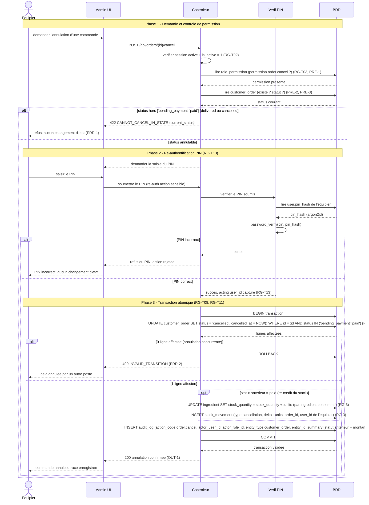

# Diagramme de sequence securite - Annulation de commande avec PIN (CANCEL_ORDER)

**Phase UML** : P1 - Conception, complement UML (passe security-by-design)
**Statut** : v0.2 - flux sensible PIN-gate + audit_log (controle anti-fraude interne)
**Date** : 2026-06-12
**Branche** : `feat/p1-conception`
**Auteur methodologie** : BYAN

---

## 1. Objet du document

Ce document decrit le **flux temporel securise** de l'annulation d'une commande
en back-office (`CANCEL_ORDER`). L'annulation est une action de **manipulation
d'argent** : annuler une commande deja `paid` peut servir a masquer un
detournement d'especes (l'equipier encaisse, annule, garde le cash). Le flux
ci-dessous materialise le controle qui adresse ce risque : une **re-authentification
par PIN par equipier** (`RG-T13`) avant l'execution, et l'ecriture d'une ligne
**`audit_log` immuable** dans la meme transaction que l'effet (`RG-T14`), de sorte
que chaque annulation est rattachee a une personne meme sur un poste partage.

Le diagramme reste au niveau conceptuel / logique. Il nomme les echanges entre
participants sans detailler l'implementation PHP ni le SQL exact. Il complete
l'operation `CANCEL_ORDER` du `docs/merise/mlt.md` (7.1), la transition T5 de
`docs/uml/state-commande.md` (`paid -> cancelled`, re-credit du stock) et le cas
d'utilisation "Annuler une commande" de `docs/uml/use-cases.md` (UC13).

**Sources** :
- `docs/merise/mlt.md` 7.1 `CANCEL_ORDER` (PRE-1..PRE-3, RG-1..RG-6, POST, ERR)
- `docs/merise/mlt.md` section 2 : `RG-T13` (PIN sensible), `RG-T14` (audit_log), `RG-T11` (re-credit dans la meme transaction), `RG-T07` (garde de concurrence), `RG-T08` (transaction atomique)
- `docs/merise/dictionary.md` 3.14 (`user.pin_hash`, argon2id) et 3.20 (`audit_log`)
- `docs/uml/state-commande.md` T5 (`paid -> cancelled`, `stock_movement` type `cancellation`)

---

## 2. Participants

| Participant | Role | Couche |
|---|---|---|
| **Equipier** | Counter / Drive / Admin titulaire de `order.cancel`, sur poste partage | Acteur |
| **Admin UI** | Interface back-office (Bloc 3, formulaire d'annulation + saisie PIN) | Presentation |
| **Controleur** | Back-end REST sous `/api/*` (Bloc 2), orchestre la transaction | Application |
| **Verif PIN** | Service de verification du PIN (`password_verify` argon2id) | Application |
| **BDD** | Base de donnees MariaDB | Persistance |

La session est **partagee par poste de travail** pour le routine 95% ; le PIN
re-introduit une attribution individuelle sur le sous-ensemble sensible
(`mlt.md` `RG-T13`). Le PIN n'est pas une session : il est verifie a chaque action
sensible et sert a capturer le `user_id` qui sera ecrit dans `audit_log`.

---

## 3. Diagramme de sequence

---

## 4. Notes de modelisation : chaque pas et sa regle

Le tableau ci-dessous mappe chaque interaction du diagramme a la regle
`mlt.md` 7.1 ou a la regle transverse correspondante, et a l'entite ecrite.

| # | Interaction | Regle (mlt.md) | Entite ecrite / lue |
|---|---|---|---|
| 1 | Verifier session active + `is_active = 1` | `RG-T02` | `user` (lecture) |
| 2 | Verifier `order.cancel` via `role_permission` | `RG-T03`, 7.1 PRE-1 | `role_permission` (lecture) |
| 3 | Charger la commande et lire son `status` | 7.1 PRE-2, PRE-3 | `customer_order` (lecture) |
| 4 | Bloquer si `status` est `delivered` ou `cancelled` | 7.1 ERR-1 | aucune ecriture (HTTP 422) |
| 5 | Demander + verifier le PIN (`password_verify` argon2id) | `RG-T13`, 7.1 RG-6 | `user.pin_hash` (lecture) |
| 6 | Rejeter si PIN incorrect, sans changement d'etat | `RG-T13` | aucune ecriture |
| 7 | Capturer l'`acting user_id` pour l'audit | `RG-T13` | (en memoire, sert aux pas 11-12) |
| 8 | `BEGIN` transaction | `RG-T08` | transaction |
| 9 | `UPDATE customer_order SET status='cancelled'` avec garde `AND status IN (...)` | 7.1 RG-1, `RG-T07` | `customer_order` (ecriture) |
| 10 | `ROLLBACK` + 409 si 0 ligne affectee (concurrence) | 7.1 ERR-2, `RG-T07` | aucune ecriture nette |
| 11 | Re-credit conditionnel du stock si statut anterieur `paid` | 7.1 RG-3, `RG-T11` | `ingredient`, `stock_movement` (type `cancellation`) |
| 12 | `INSERT audit_log` dans la meme transaction | 7.1 RG-6, `RG-T14` | `audit_log` (ecriture) |
| 13 | `COMMIT` (tout ou rien) | `RG-T08`, `RG-T11` | transaction |
| 14 | Reponse 200 de confirmation | 7.1 OUT-1 | aucune ecriture |

### 4.1 Re-credit conditionnel du stock (`RG-T11`)

Le re-credit ne s'applique que si la commande etait au statut `paid` avant
l'annulation (7.1 RG-3). Une commande `pending_payment` n'avait pas encore
decremente le stock (le decrement a lieu a la transition `paid`), donc il n'y a
rien a re-crediter. Pour chaque `order_item` d'une commande `paid`, les unites
consommees sont recalculees (format `normal`/`maxi`, ajustees par les
`order_item_modifier`), `ingredient.stock_quantity` est re-incremente et un
`stock_movement` de type `cancellation` est insere. `RG-T11` garantit que ce
re-credit et l'`UPDATE` du statut sont dans la **meme transaction** : il n'y a pas
de decrement orphelin si une etape echoue.

### 4.2 Garde de concurrence (`RG-T07`)

L'`UPDATE` porte la clause `AND status IN ('pending_payment','paid')`. Si deux
postes tentent d'annuler la meme commande au meme instant, seul le premier
obtient une ligne affectee ; le second recoit 0 ligne et le controleur repond
409 `INVALID_TRANSITION` apres `ROLLBACK` (7.1 ERR-2). Cette garde optimiste
reduit le risque d'une double annulation et d'un double re-credit du stock.

### 4.3 PIN distinct de la session (`RG-T13`)

La session reste **partagee par poste** pour le flux routine. Le PIN est verifie
a chaque action du sous-ensemble sensible (annulation, prix/VAT, RBAC, gestion
utilisateur, correction d'inventaire), et c'est lui qui fournit l'`actor_user_id`
ecrit dans `audit_log`. Le `pin_hash` est un hash argon2id (`dictionary.md` 3.14),
compare via `password_verify` ; il fait partie des champs RESTRICTED tenus hors
des logs et des reponses API.

---

## 5. Menace adressee : repudiation et detournement d'especes

L'annulation d'une commande `paid` est le geste qui permet le schema de fraude
"encaisser puis annuler pour garder le cash" (insider cash-skim). Sans controle,
sur un poste a session partagee, une annulation ne serait rattachee a personne :
l'auteur pourrait nier l'avoir faite (repudiation). Le flux ci-dessus reduit le
risque de ce schema en combinant deux mecanismes concrets :

- **PIN par equipier (`RG-T13`)** : l'annulation exige une re-authentification
  individuelle. Sur un poste partage, cela rattache l'acte a une personne et non
  au seul poste. Le PIN tend a dissuader l'usage opportuniste d'une session
  laissee ouverte par un collegue.
- **`audit_log` immuable (`RG-T14`)** : chaque annulation ecrit une ligne
  `audit_log` (`action_code = order.cancel`, `actor_user_id`, `actor_role_id`,
  `entity_type`, `entity_id`, `summary` avec le statut anterieur et le montant
  re-credite) dans la **meme transaction** que l'`UPDATE` du statut. La table
  n'accepte ni `UPDATE` ni `DELETE` au niveau applicatif (`dictionary.md` 3.20).
  Une annulation ne peut donc pas exister sans sa trace, et la trace ne peut pas
  etre effacee par l'auteur.

L'effet combine : un pic d'annulations rattachees a un meme `actor_user_id`
devient visible et opposable lors d'une revue. Ceci ne supprime pas le risque,
mais le **reduit** en transformant un acte anonyme et niable en un acte attribue
et trace. La residualite (collusion, partage de PIN) releve de controles
organisationnels hors du modele de donnees.

> Note : `audit_log` enregistre des **noms de champs** et un `summary`
> non-personnel (`details` stocke les noms de champs modifies, pas de PII),
> conformement a `RG-T14` et a la classification de `PROJECT_CONTEXT.md` section 19.
> L'attribution `stock_movement.user_id` du re-credit complete la trace cote stock
> sans double journalisation.

---

## 6. Coherence avec les autres livrables

| Verification | Resultat |
|---|---|
| Statuts annulables coherents avec `state-commande.md` | Oui : `pending_payment` et `paid` (T3, T5) ; `delivered` non annulable (7.1 ERR-1) |
| Transition `paid -> cancelled` avec re-credit | Couverte par T5 et 7.1 RG-3 (`stock_movement` type `cancellation`) |
| Entites ecrites presentes au dictionnaire | `customer_order` (3.10), `ingredient`, `stock_movement`, `audit_log` (3.20) |
| Regle PIN appliquee | `RG-T13` (sous-ensemble sensible inclut 7.1) ; `user.pin_hash` (3.14) |
| Regle audit appliquee | `RG-T14` ; colonnes conformes a `audit_log` (3.20) |
| Atomicite re-credit + statut + audit | `RG-T08` + `RG-T11` (une transaction, `COMMIT` / `ROLLBACK`) |
| Codes d'erreur | 422 `CANNOT_CANCEL_IN_STATE` (ERR-1), 409 `INVALID_TRANSITION` (ERR-2) |

---

## 7. Arbitrage tranche

Le flux retient la re-authentification **par PIN** plutot qu'une re-saisie du mot
de passe complet : le PIN couvre le sous-ensemble sensible sans casser le routine
95% a session partagee (`RG-T13`), tout en fournissant l'attribution
individuelle. L'`audit_log` est ecrit dans la **meme transaction** que l'effet
(`RG-T14` + `RG-T08`) : une annulation sans trace ne peut pas etre committee. Le
re-credit du stock est conditionnel au statut anterieur `paid` (`RG-T11`), ce qui
ecarte un re-credit indu sur une commande `pending_payment` qui n'a pas ete
decrementee. Les codes d'erreur (`CANNOT_CANCEL_IN_STATE`, `INVALID_TRANSITION`)
reprennent ceux de `mlt.md` 7.1, sans en inventer de nouveaux.
