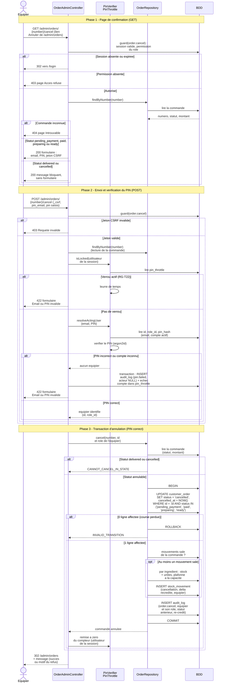

# Diagramme de sequence securite - Annulation de commande avec PIN (CANCEL_ORDER)

**Phase UML** : P1 - Conception, complement UML (passe security-by-design)
**Statut** : v0.3 - realigne sur le code livre (`OrderAdminController`, `OrderRepository::cancel`)
**Date** : 2026-06-12 (v0.2), 2026-09-24 (v0.3)
**Historique** : v0.3 (2026-09-24) - mise en coherence avec le code livre (2a09597) : route
`/admin/orders/{number}/cancel` (page de confirmation en GET, envoi en POST) au lieu de
`POST /api/orders/{id}/cancel` ; PIN saisi avec la demande et verifie en premier ; echec de PIN
trace (`pin.failed`) et compte (`pin_throttle`) ; quatre statuts annulables (`pending_payment`, `paid`,
`preparing`, `ready`) ; re-credit du stock conditionne a l'existence de mouvements `sale` ; reponses par
message puis redirection au lieu de codes 422 / 409.
**Branche** : `feat/p1-conception`
**Auteur methodologie** : BYAN

---

## 1. Objet du document

Ce document decrit le **flux temporel securise** de l'annulation d'une commande
en back-office (`CANCEL_ORDER`). L'annulation est une action de **manipulation
d'argent** : annuler une commande encaissee peut servir a masquer un detournement
d'especes (l'equipier encaisse, annule, garde le cash). Le flux ci-dessous
materialise le controle qui adresse ce risque : une **re-authentification par PIN
de l'equipier** (`RG-T13`) avant l'effet, et l'ecriture d'une ligne **`audit_log`**
dans la meme transaction que l'effet (`RG-T14`), de sorte que chaque annulation est
rattachee a une personne meme sur un poste partage.

Il complete l'operation `CANCEL_ORDER` du `docs/merise/mlt.md` (7.1), la transition
T5 de `docs/uml/state-commande.md` et le cas d'utilisation "Annuler une commande"
de `docs/uml/use-cases.md` (UC13).

**Sources** :
- `src/public/admin/index.php` (routes `GET` et `POST /admin/orders/{number}/cancel`)
- `src/app/Controllers/OrderAdminController.php` (`confirmCancel`, `cancel`, `logFailedPin`)
- `src/app/Auth/PinVerifier.php` (`resolveActingUser`), `src/app/Auth/PinThrottle.php`
- `src/app/Order/OrderRepository.php` (`cancel`, `hasSaleMovements`)
- `src/app/Views/admin/orders/cancel.php` (formulaire email + PIN)
- `docs/merise/mlt.md` 7.1 et section 2 (`RG-T01`, `RG-T07`, `RG-T08`, `RG-T11`, `RG-T13`, `RG-T14`, `RG-T22`)

---

## 2. Participants

| Participant | Role | Couche |
|---|---|---|
| **Equipier** | Counter, drive ou admin titulaire de `order.cancel`, depuis son navigateur sur un poste partage | Acteur |
| **OrderAdminController** | Pages rendues serveur du back-office : garde, CSRF, orchestration | Application |
| **PinVerifier / PinThrottle** | Verification du PIN (argon2id) et compteur d'echecs par utilisateur agissant | Application |
| **OrderRepository** | Transaction d'annulation, re-credit, trace d'audit | Application |
| **BDD** | Base de donnees MariaDB | Persistance |

La session est **partagee par poste de travail** pour le flux routinier ; le PIN
re-introduit une attribution individuelle sur le sous-ensemble sensible (`RG-T13`).
L'equipier saisit son email et son PIN **avec la demande** : c'est l'equipier ainsi
identifie, et non le titulaire de la session, qui est ecrit dans `audit_log`.

---

## 3. Diagramme de sequence

```mermaid
sequenceDiagram
    actor Equipier
    participant Ctrl as OrderAdminController
    participant PIN as PinVerifier<br/>PinThrottle
    participant Repo as OrderRepository
    participant BDD


    Note over Equipier,BDD: Phase 1 - Page de confirmation (GET)

    Equipier->>Ctrl: GET /admin/orders/<br/>{number}/cancel (lien<br/>Annuler de /admin/orders)
    Ctrl->>BDD: guard(order.cancel) :<br/>session valide, permission<br/>du role
    alt Session absente ou expiree
        Ctrl-->>Equipier: 302 vers /login
    else Permission absente
        Ctrl-->>Equipier: 403 page Acces refuse
    else Autorise
        Ctrl->>Repo: findByNumber(number)
        Repo->>BDD: lire la commande
        BDD-->>Repo: numero, statut, montant
        alt Commande inconnue
            Ctrl-->>Equipier: 404 page Introuvable
        else Statut pending_payment, paid,<br/>preparing ou ready
            Ctrl-->>Equipier: 200 formulaire :<br/>email, PIN, jeton CSRF
        else Statut delivered ou cancelled
            Ctrl-->>Equipier: 200 message bloquant,<br/>sans formulaire
        end
    end

    Note over Equipier,BDD: Phase 2 - Envoi et verification du PIN (POST)

    Equipier->>Ctrl: POST /admin/orders/<br/>{number}/cancel (_csrf,<br/>pin_email, pin saisis)
    Ctrl->>BDD: guard(order.cancel)
    alt Jeton CSRF invalide
        Ctrl-->>Equipier: 403 Requete invalide
    else Jeton valide
        Ctrl->>Repo: findByNumber(number)<br/>(lecture de la commande)
        Ctrl->>PIN: isLocked(utilisateur<br/>de la session)
        PIN->>BDD: lire pin_throttle
        alt Verrou actif (RG-T22)
            PIN->>PIN: leurre de temps
            Ctrl-->>Equipier: 422 formulaire<br/>Email ou PIN invalide
        else Pas de verrou
            Ctrl->>PIN: resolveActingUser<br/>(email, PIN)
            PIN->>BDD: lire id, role_id, pin_hash<br/>(email, compte actif)
            PIN->>PIN: verifier le PIN (argon2id)
            alt PIN incorrect ou compte inconnu
                PIN-->>Ctrl: aucun equipier
                Ctrl->>BDD: transaction : INSERT<br/>audit_log (pin.failed,<br/>acteur NULL) + echec<br/>compte dans pin_throttle
                Ctrl-->>Equipier: 422 formulaire<br/>Email ou PIN invalide
            else PIN correct
                PIN-->>Ctrl: equipier identifie<br/>(id, role_id)
            end
        end
    end

    Note over Equipier,BDD: Phase 3 - Transaction d'annulation (PIN correct)

    Ctrl->>Repo: cancel(number, id<br/>et role de l'equipier)
    Repo->>BDD: lire la commande<br/>(statut, montant)
    alt Statut delivered ou cancelled
        Repo-->>Ctrl: CANNOT_CANCEL_IN_STATE
    else Statut annulable
        Repo->>BDD: BEGIN
        Repo->>BDD: UPDATE customer_order<br/>SET status = 'cancelled',<br/>cancelled_at = NOW()<br/>WHERE id = :id AND status IN<br/>('pending_payment', 'paid',<br/>'preparing', 'ready')
        alt 0 ligne affectee (course perdue)
            Repo->>BDD: ROLLBACK
            Repo-->>Ctrl: INVALID_TRANSITION
        else 1 ligne affectee
            Repo->>BDD: mouvements sale<br/>de la commande ?
            opt Au moins un mouvement sale
                Repo->>BDD: par ingredient : stock<br/>+ unites, plafonne<br/>a la capacite
                Repo->>BDD: INSERT stock_movement<br/>(cancellation, delta<br/>recredite, equipier)
            end
            Repo->>BDD: INSERT audit_log<br/>(order.cancel, equipier<br/>et son role, statut<br/>anterieur, re-credit)
            Repo->>BDD: COMMIT
            Repo-->>Ctrl: commande annulee
            Ctrl->>PIN: remise a zero<br/>du compteur (utilisateur<br/>de la session)
        end
    end
    Ctrl-->>Equipier: 302 /admin/orders<br/>+ message (succes<br/>ou motif du refus)
```

---

## 4. Notes de modelisation : chaque pas et sa source

| # | Interaction | Regle | Code |
|---|---|---|---|
| 1 | Page de confirmation, garde `order.cancel` (302 vers `/login`, 403) | `RG-T02`, `RG-T03`, 7.1 PRE-1 | `OrderAdminController::confirmCancel`, `AdminController::guard` |
| 2 | Formulaire email + PIN seulement pour un statut annulable | 7.1 PRE-3 | `Views/admin/orders/cancel.php` |
| 3 | POST : jeton CSRF (403 sinon) | `RG-T01` | `OrderAdminController::cancel`, `Csrf::validate` |
| 4 | Verrou du throttle evalue avant la verification, leurre de temps | `RG-T22` | `PinThrottle::isLocked`, `PinVerifier::payTimingDecoy` |
| 5 | Equipier resolu par email + PIN (compte actif, argon2id) | `RG-T13` | `PinVerifier::resolveActingUser` |
| 6 | PIN refuse : `pin.failed` dans `audit_log` + echec compte, une transaction, 422 | `RG-T14`, `RG-T22`, `RG-T08` | `OrderAdminController::logFailedPin`, `PinThrottle::recordFailureWithin` |
| 7 | `UPDATE ... WHERE status IN ('pending_payment','paid','preparing','ready')` | 7.1 RG-1, `RG-T07` | `OrderRepository::cancel` |
| 8 | Re-credit si des mouvements `sale` existent, plafonne a la capacite | 7.1 RG-3, `RG-T11` | `OrderRepository::hasSaleMovements`, `IngredientRepository::clampToCapacity` |
| 9 | `audit_log` `order.cancel` dans la meme transaction | 7.1 RG-6, `RG-T14` | `OrderRepository::cancel` |
| 10 | Remise a zero du throttle, message, redirection vers `/admin/orders` | 7.1 OUT-1, ERR-1, ERR-2 | `OrderAdminController::cancel` |

### 4.1 Re-credit conditionnel du stock (`RG-T11`)

Le re-credit est decide sur l'**existence de mouvements `sale`** pour la commande,
lue dans la transaction, et non sur le statut lu avant : si un encaissement
concurrent gagne la course `pending_payment -> preparing -> cancel`, le stock qu'il a
debite est bien re-credite. Une commande non encaissee n'a aucun mouvement `sale`
et rien n'est re-credite. Les unites sont celles de l'encaissement ; le stock
re-credite ne depasse pas `stock_capacity`, et le `stock_movement` de type
`cancellation` porte le delta reellement applique.

### 4.2 Garde de concurrence (`RG-T07`)

L'`UPDATE` porte la clause `AND status IN (...)`. Si deux postes annulent la meme
commande au meme instant, seul le premier obtient une ligne affectee ; pour le
second, la transaction est annulee (`INVALID_TRANSITION`) et l'equipier voit le
message « Transition invalide : la commande a change d'etat. ».

### 4.3 PIN distinct de la session (`RG-T13`, `RG-T22`)

Le PIN est verifie a chaque action du sous-ensemble sensible. Les echecs sont
comptes par **utilisateur de la session** dans `pin_throttle`, separement des
compteurs de connexion ; au-dela du seuil, un verrou degressif s'applique et le
message reste generique (« Email ou PIN invalide »). Le `pin_hash` est un hash
argon2id, classe RESTRICTED et tenu hors des journaux et des reponses (`dictionary.md` 3.14).

---

## 5. Menace adressee : repudiation et detournement d'especes

L'annulation d'une commande encaissee est le geste qui permet le schema de fraude
"encaisser puis annuler pour garder le cash". Sans controle, sur un poste a session
partagee, une annulation ne serait rattachee a personne. Deux mecanismes reduisent ce
risque :

- **PIN par equipier (`RG-T13`)** : l'annulation exige l'email et le PIN d'un equipier
  actif, ce qui rattache l'acte a une personne et non au seul poste.
- **`audit_log` (`RG-T14`)** : chaque annulation ecrit une ligne `order.cancel`
  (`actor_user_id`, `actor_role_id`, `entity_type`, `entity_id`, `summary` avec le
  statut anterieur et le montant re-credite) dans la **meme transaction** que la mise
  a jour du statut ; chaque PIN refuse ecrit une ligne `pin.failed`. La table n'est
  modifiee ni supprimee par l'application (`dictionary.md` 3.20).

Un pic d'annulations rattachees a un meme equipier, ou de `pin.failed`, devient
visible lors d'une revue. Le risque est reduit, pas supprime : la collusion ou le
partage de PIN relevent de controles organisationnels.

---

## 6. Coherence avec les autres livrables

| Verification | Resultat |
|---|---|
| Statuts annulables coherents avec `state-commande.md` | Oui : `pending_payment`, `paid`, `preparing`, `ready` (T5) ; `delivered` et `cancelled` finaux |
| Re-credit | Conditionne aux mouvements `sale` (T5, 7.1 RG-3), `stock_movement` type `cancellation` |
| Entites ecrites presentes au dictionnaire | `customer_order` (3.10), `ingredient`, `stock_movement`, `audit_log` (3.20), `pin_throttle` (3.22) |
| Regles PIN et audit | `RG-T13`, `RG-T14`, `RG-T22` |
| Atomicite re-credit + statut + audit | `RG-T08` + `RG-T11` (une transaction, `COMMIT` / `ROLLBACK`) |
| Reponses | Page 422 pour un PIN refuse ; message puis redirection vers `/admin/orders` pour le succes, `CANNOT_CANCEL_IN_STATE` et `INVALID_TRANSITION` |

---

## 7. Arbitrage tranche

Le flux retient la re-authentification **par PIN** plutot qu'une re-saisie du mot de
passe : le PIN couvre le sous-ensemble sensible sans casser le flux routinier a
session partagee (`RG-T13`), tout en fournissant l'attribution individuelle.
L'`audit_log` est ecrit dans la **meme transaction** que l'effet (`RG-T14` +
`RG-T08`) : une annulation sans trace ne peut pas etre committee. Le re-credit du
stock repose sur les mouvements `sale` reellement ecrits (`RG-T11`), ce qui ecarte
un re-credit indu comme un re-credit oublie. La version v0.2 de ce document decrivait
une API JSON (`POST /api/orders/{id}/cancel`, codes 422 et 409) et deux statuts
annulables ; elle a ete remplacee le 2026-09-24.
