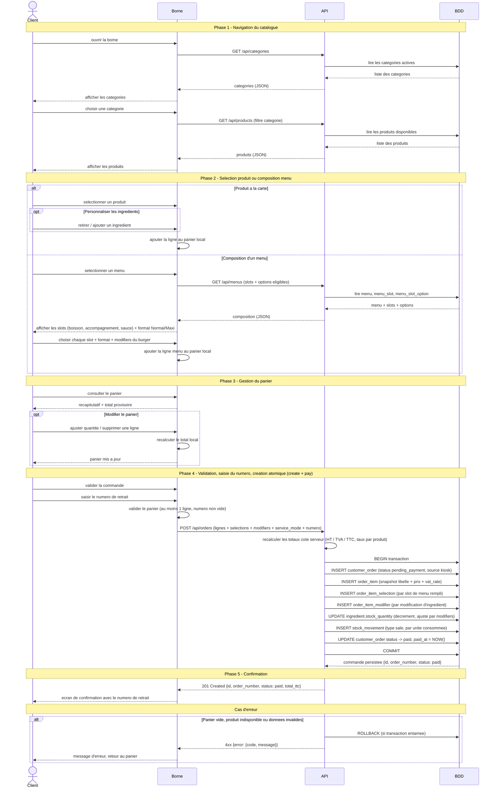

# Diagramme de sequence - Passer une commande (borne client)

**Phase UML** : P1 - Conception, complement UML (apres MCD)
**Statut** : v0.2 - prod-like, creation atomique (create + pay)
**Date** : 2026-06-11
**Branche** : `feat/p1-conception`
**Auteur methodologie** : BYAN

---

## 1. Objet du document

Ce document decrit le **flux temporel** du parcours "passer une commande" cote
**Client sur la borne kiosk** : navigation dans les categories, selection d'un
produit ou composition d'un menu (slots + format Normal/Maxi + modifiers
d'ingredients), gestion du panier, validation avec saisie du numero de retrait,
et confirmation. Dans le modele v0.2, la **creation et le paiement sont
atomiques** : un seul appel `POST /api/orders` cree la commande, la fait passer a
`paid`, decremente le stock et journalise les mouvements, dans une meme
transaction.

Le diagramme reste au niveau conceptuel / logique. Il nomme les echanges entre
participants sans detailler l'implementation PHP ni le SQL exact. Il complete le
cas d'utilisation "Passer une commande" de `docs/uml/use-cases.md` (4.1), la
machine a etats de `docs/uml/state-commande.md` (T1/T2) et l'operation
`CREATE_ORDER` du `docs/merise/mct.md` (3.3).

**Sources** :
- `docs/PROJECT_CONTEXT.md` section 2 (processus metier), section 7 (endpoints API)
- `docs/merise/dictionary.md` 3.10-3.13 (`customer_order`, `order_item`, `order_item_selection`, `order_item_modifier`)
- `docs/merise/mct.md` 3.3 CREATE_ORDER (transaction, snapshots, decrement stock)
- `docs/uml/state-commande.md` (transitions T1/T2, atomicite `pending_payment -> paid`)

---

## 2. Participants

| Participant | Role | Couche |
|---|---|---|
| **Client** | Utilisateur final, compose sa commande au doigt | Acteur |
| **Borne** | Interface tactile (front Bloc 1, HTML/CSS/JS vanilla) | Presentation |
| **API** | Back-end REST sous `/api/*` (Bloc 2) | Application |
| **BDD** | Base de donnees MariaDB | Persistance |

Le panier est gere **cote Borne** (etat local du front) jusqu'a la validation.
Aucune commande n'est creee en base avant la validation finale, pour eviter les
commandes fantomes abandonnees.

---

## 3. Diagramme de sequence

---

## 4. Notes de modelisation

### 4.1 Recalcul des totaux cote serveur (controle de securite)

La Borne affiche un total **provisoire** calcule localement pour l'experience
utilisateur. L'API recalcule les totaux a la reception du `POST /api/orders` a
partir des prix en base (HT, TVA ligne par ligne via `vat_rate`, TTC), puis fige
les snapshots (`unit_price_cents_snapshot`, `vat_rate_snapshot`,
`label_snapshot` sur `order_item`, voir `dictionary.md` 3.11). Le total affiche
par le client n'est pas considere comme la source de verite : ceci limite la
falsification du prix cote client.

### 4.2 Creation atomique (create + pay)

Le parcours materialise les transitions T1 et T2 de
`docs/uml/state-commande.md` dans **un seul appel et une seule transaction** :

- `POST /api/orders` cree la commande en `pending_payment` (T1) puis la fait
  passer a `paid` (T2) avant le `COMMIT`. `paid_at` est renseigne.
- La saisie du numero de retrait tient lieu de paiement (cadre RNCP) ; il n'y a
  pas d'appel `POST /api/orders/{id}/pay` separe (supprime par rapport au v0.1).
- Le decrement du stock (`ingredient.stock_quantity`) et la journalisation
  (`stock_movement` type `sale`) sont inclus dans la meme transaction que
  l'insert de la commande : soit tout reussit, soit tout est annule (`ROLLBACK`).

Le statut `pending_payment` n'est donc pas observable en dehors de la
transaction (coherent avec `mct.md` section 13).

### 4.3 Panier local jusqu'a la validation

Aucun appel ecriture vers la BDD n'a lieu pendant les phases 1 a 3. Le panier
vit dans l'etat du front (JavaScript). Ce choix evite de creer en base des
commandes abandonnees et reduit le nombre d'ecritures. Inconvenient connu : un
rafraichissement de la borne peut vider le panier ; un stockage local cote
navigateur peut etre envisage plus tard.

### 4.4 Fallback JSON (hors flux nominal)

`PROJECT_CONTEXT.md` section 4 prevoit un mode de repli ou la Borne lit des
fichiers JSON statiques si l'API est indisponible. Ce mode concerne uniquement
les lectures (phases 1 a 2). La validation et la creation (phase 4) requierent
l'API ; sans elle, la commande n'est ni persistee ni payee. Ce cas degrade
n'est pas detaille dans le diagramme nominal ci-dessus.

### 4.5 Garde-fous securite a venir (passe security-by-design)

Le flux ci-dessus est la cible **fonctionnelle** v0.2. La passe security-by-design
ajoutera, en complement (append, sans reecrire ce flux), des garde-fous sur le
`POST /api/orders` anonyme : cle d'idempotence (`idempotency_key` UNIQUE pour
dedupliquer les POST rejoues), limitation de debit / anti-spam, et verrou
pessimiste `SELECT ... FOR UPDATE` sur les ingredients pendant le decrement
(anti-oversell multi-bornes). Ces ajouts dependent de decisions encore a
trancher (oversell/idempotence, throttling) et seront documentes dans un artefact
`docs/uml/security-sequence.md` dedie.

---

## 5. Coherence avec les autres livrables

| Verification | Resultat |
|---|---|
| Endpoints utilises existent dans `PROJECT_CONTEXT.md` section 7 | `GET /api/categories`, `GET /api/products`, `GET /api/menus`, `POST /api/orders` ; l'appel `POST /api/orders/{id}/pay` du v0.1 est supprime (creation atomique) |
| Entites manipulees presentes au MCD / dictionnaire | Oui : `category`, `product`, `menu`, `menu_slot`, `menu_slot_option`, `ingredient`, `customer_order`, `order_item`, `order_item_selection`, `order_item_modifier`, `stock_movement` |
| Statuts utilises coherents avec `state-commande.md` | Oui : `pending_payment` puis `paid` (T1, T2), atomiques |
| Operation MCT correspondante | `mct.md` 3.3 CREATE_ORDER (transaction unique, snapshots, decrement stock, transition atomique) |
| Format de reponse JSON | Coherent avec `PROJECT_CONTEXT.md` section 7 (`{data, error}`) et la reponse `{id, order_number, status, total_ttc}` du POST orders |

---

## 6. Arbitrage tranche

La phase de paiement separee du v0.1 (`POST /api/orders/{id}/pay`) est supprimee :
la creation et le passage a `paid` sont atomiques dans `POST /api/orders`,
conformement au MCT v0.2 (3.3) et a la regle metier (saisie du numero = substitut
de paiement). Le decrement de stock et la journalisation `stock_movement` sont
inclus dans la meme transaction, garantissant la coherence stock/commande. Les
valeurs ENUM sont en anglais (`pending_payment`, `paid`). Les garde-fous de
securite (idempotence, rate-limit, verrou pessimiste) relevent de la passe
security-by-design et seront ajoutes en complement (section 4.5).
