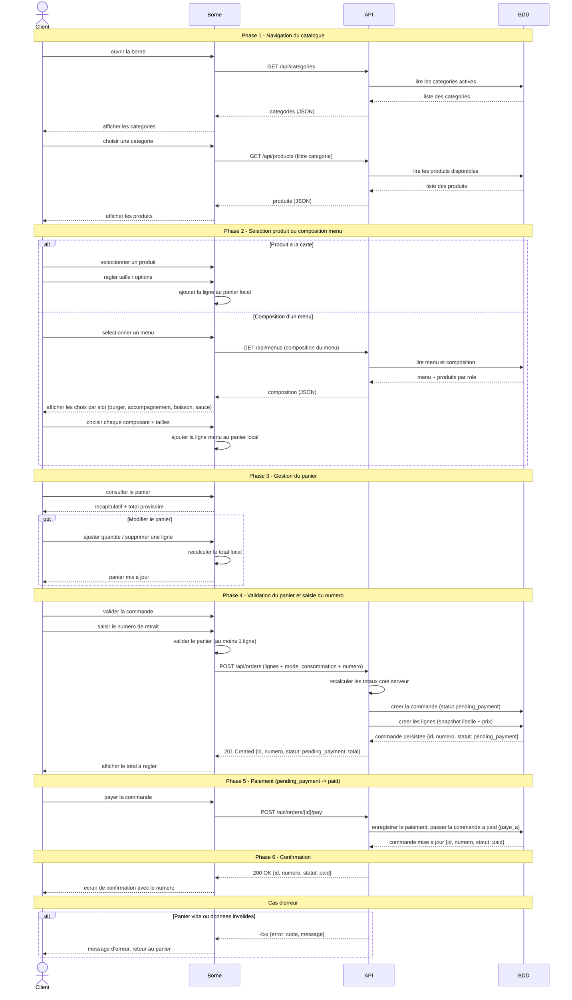

# Diagramme de sequence - Passer une commande (borne client)

**Phase UML** : P1 - Conception, complement UML (apres MCD)
**Statut** : v0.1
**Date** : 2026-05-21
**Branche** : `feat/p1-conception`
**Auteur methodologie** : BYAN

---

## 1. Objet du document

Ce document decrit le **flux temporel** du parcours "passer une commande" cote
**Client sur la borne kiosk** : navigation dans les categories, selection d'un
produit ou composition d'un menu, gestion du panier, validation avec saisie du
numero de retrait, paiement, puis confirmation.

Le diagramme reste au niveau **conceptuel / logique**. Il nomme les echanges
entre participants sans detailler l'implementation PHP (controllers, models)
ni le SQL exact. Il complete le cas d'utilisation "Passer une commande" de
`docs/uml/use-cases.md` et la machine a etats de `docs/uml/state-commande.md`.

**Sources** :
- `docs/PROJECT_CONTEXT.md` section 2 (processus metier), section 7 (endpoints API)
- `docs/merise/dictionary.md` (`commande`, `ligne_commande`, `menu`, `produit`)
- `docs/uml/state-commande.md` (transitions `pending_payment -> paid`)

---

## 2. Participants

| Participant | Role | Couche |
|---|---|---|
| **Client** | Utilisateur final, compose sa commande au doigt | Acteur |
| **Borne** | Interface tactile (front Bloc 1, HTML/CSS/JS vanilla) | Presentation |
| **API** | Back-end REST sous `/api/*` (Bloc 2) | Application |
| **BDD** | Base de donnees MariaDB | Persistance |

Le panier est gere **cote Borne** (etat local du front) jusqu'a la validation.
Aucune commande n'est creee en base avant la validation finale, pour eviter les
commandes fantomes abandonnees.

---

## 3. Diagramme de sequence

---

## 4. Notes de modelisation

### 4.1 Recalcul des totaux cote serveur

La Borne affiche un total **provisoire** calcule localement pour l'experience
utilisateur. L'API recalcule les totaux a la reception du `POST /api/orders` a
partir des prix en base, puis fige les snapshots
(`prix_unitaire_ttc_cents_snapshot`, `libelle_snapshot` dans `ligne_commande`,
voir `dictionary.md` 3.6). Le total affiche par le client n'est pas considere
comme la source de verite : ceci limite la falsification du prix cote client.

### 4.2 Transitions de statut

Le parcours materialise les transitions T1 et T2 de
`docs/uml/state-commande.md`, en deux phases successives conformes a la regle
metier :

- `POST /api/orders` cree la commande composee en `pending_payment` (T1).
- `POST /api/orders/{id}/pay` enregistre le paiement et fait passer la commande
  a `paid` (T2), avec l'horodatage `paye_a`.

La separation des deux appels reflete les deux phases du cycle de vie :
composer la commande, puis la payer.

### 4.3 Panier local jusqu'a la validation

Aucun appel ecriture vers la BDD n'a lieu pendant les phases 1 a 3. Le panier
vit dans l'etat du front (JavaScript). Ce choix evite de creer en base des
commandes abandonnees et reduit le nombre d'ecritures. Inconvenient connu : un
rafraichissement de la borne peut vider le panier ; un stockage local cote
navigateur peut etre envisage plus tard.

### 4.4 Fallback JSON (hors flux nominal)

`PROJECT_CONTEXT.md` section 4 prevoit un mode de repli ou la Borne lit des
fichiers JSON statiques si l'API est indisponible. Ce mode concerne uniquement
les lectures (phases 1 a 2). La validation (phase 4) et le paiement (phase 5)
requierent l'API ; sans elle, la commande n'est ni persistee ni payee. Ce cas
degrade n'est pas detaille dans le diagramme nominal ci-dessus.

---

## 5. Coherence avec les autres livrables

| Verification | Resultat |
|---|---|
| Endpoints utilises existent dans `PROJECT_CONTEXT.md` section 7 | `GET /api/categories`, `GET /api/products`, `GET /api/menus`, `POST /api/orders` ; `POST /api/orders/{id}/pay` est a confirmer en section 7 du brief |
| Entites manipulees presentes au MCD | Oui : `categorie`, `produit`, `menu`, `menu_produit`, `commande`, `ligne_commande` |
| Statuts utilises coherents avec `state-commande.md` | Oui : `pending_payment` puis `paid` (T1, T2), valeurs ENUM anglaises |
| Format de reponse JSON | Coherent avec `PROJECT_CONTEXT.md` section 7 (`{data, error}`) et la reponse `{id, number, status}` du POST orders |

---

## 6. Arbitrage tranche

La phase de paiement est integree au flux conformement a la regle metier des
deux phases (composer puis payer). La sequence suit la machine canonique de
`state-commande.md` : creation en `pending_payment` (T1) puis paiement vers
`paid` (T2), avec des valeurs ENUM en anglais. Point a confirmer au MCT :
l'endpoint de paiement (`POST /api/orders/{id}/pay`) doit etre reporte dans la
section 7 du brief s'il n'y figure pas encore.
