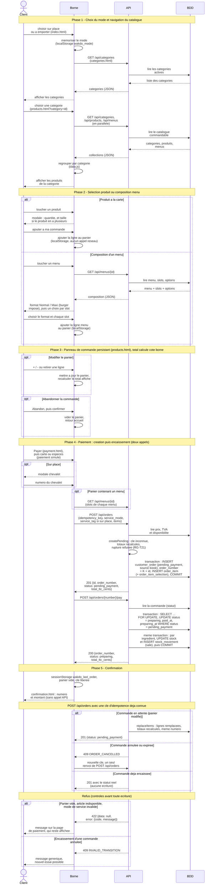

# Diagramme de sequence - Passer une commande (borne client)

**Phase UML** : P1 - Conception, complement UML (apres MCD)
**Statut** : v0.3 - realigne sur le code livre : creation puis encaissement (deux appels)
**Date** : 2026-06-11 (v0.2), 2026-09-24 (v0.3)
**Historique** : v0.3 (2026-09-24) - mise en coherence avec le code livre (2a09597) : la creation atomique
(un seul `POST /api/orders` qui cree, encaisse et decremente le stock) est remplacee par les deux appels
reels (creation en `pending_payment`, puis encaissement vers `preparing`) ; aucun modificateur d'ingredient
n'est construit par la borne ; panier conserve dans le navigateur ; repli JSON retire ; garde-fous
d'idempotence et de verrou decrits tels qu'ils sont livres.
**Branche** : `feat/p1-conception`
**Auteur methodologie** : BYAN

---

## 1. Objet du document

Ce document decrit le **flux temporel** du parcours "passer une commande" cote
**Client sur la borne kiosk** : choix du mode de consommation, navigation dans les
categories, selection d'un produit ou composition d'un menu (slots + format
Normal/Maxi), gestion du panier, paiement et confirmation.

La commande est persistee en **deux appels HTTP successifs**, orchestres par
`submitOrder()` (`src/public/borne/assets/js/checkout.js`) :

1. `POST /api/orders` cree la commande au statut `pending_payment` (lignes et
   selections avec leurs snapshots), sans effet sur le stock ;
2. `POST /api/orders/{number}/pay` l'encaisse : statut `preparing`, `paid_at` et
   `preparing_at` poses, stock decremente et journalise dans la meme transaction.

Le diagramme reste au niveau conceptuel / logique. Il complete le cas d'utilisation
"Passer une commande" de `docs/uml/use-cases.md` (4.1), la machine a etats de
`docs/uml/state-commande.md` (T1, T2, M1) et les operations `CREATE_ORDER`,
`MODIFY_PENDING_ORDER` et `PAY_ORDER` du `docs/merise/mlt.md` (3.3, 3.3bis, 3.3ter).
Le trace du code ligne a ligne pour un produit a la carte est dans
`docs/architecture/flux-borne-selection-vers-commande.md`.

**Sources** :
- `src/public/borne/assets/js/` : `data.js` (lectures), `product-options.js` et `page-product-menu.js`
  (selection), `state.js` et `order-panel.js` (panier), `checkout.js` et `page-payment.js` (paiement),
  `page-confirmation.js`
- `src/app/Controllers/OrderController.php` (`create`, `pay`, `orderError`)
- `src/app/Order/OrderRepository.php` (`createPending`, `persist`, `replaceItems`, `pay`)
- `docs/merise/mlt.md` 3.3, 3.3bis, 3.3ter ; `docs/uml/state-commande.md`

---

## 2. Participants

| Participant | Role | Couche |
|---|---|---|
| **Client** | Utilisateur final, compose sa commande au doigt | Acteur |
| **Borne** | Interface tactile (front Bloc 1, HTML/CSS/JS vanilla) | Presentation |
| **API** | Back-end REST sous `/api/*` (Bloc 2) | Application |
| **BDD** | Base de donnees MariaDB | Persistance |

Le panier est gere **cote Borne** jusqu'au paiement : il est conserve dans le
`localStorage` du navigateur (cle `wakdo_cart`, `state.js`) et survit donc a un
changement de page. Aucune commande n'est creee en base avant le paiement.

---

## 3. Diagramme de sequence

```mermaid
sequenceDiagram
    actor Client
    participant Borne
    participant API
    participant BDD

    Note over Client,BDD: Phase 1 - Choix du mode et navigation du catalogue

    Client->>Borne: choisir sur place<br/>ou a emporter (index.html)
    Borne->>Borne: memoriser le mode<br/>(localStorage wakdo_mode)
    Borne->>API: GET /api/categories<br/>(categories.html)
    API->>BDD: lire les categories<br/>actives
    BDD-->>API: liste des categories
    API-->>Borne: categories (JSON)
    Borne-->>Client: afficher les categories

    Client->>Borne: choisir une categorie<br/>(products.html?category=id)
    Borne->>API: GET /api/categories,<br/>/api/products, /api/menus<br/>(en parallele)
    API->>BDD: lire le catalogue<br/>commandable
    BDD-->>API: categories, produits,<br/>menus
    API-->>Borne: collections (JSON)
    Borne->>Borne: regrouper par categorie<br/>(data.js)
    Borne-->>Client: afficher les produits<br/>de la categorie

    Note over Client,BDD: Phase 2 - Selection produit ou composition menu

    alt Produit a la carte
        Client->>Borne: toucher un produit
        Borne-->>Client: modale : quantite, et taille<br/>si le produit en a plusieurs
        Client->>Borne: ajouter a ma commande
        Borne->>Borne: ajouter la ligne au panier<br/>(localStorage, aucun appel reseau)
    else Composition d'un menu
        Client->>Borne: toucher un menu
        Borne->>API: GET /api/menus/{id}
        API->>BDD: lire menu, slots, options
        BDD-->>API: menu + slots + options
        API-->>Borne: composition (JSON)
        Borne-->>Client: format Normal / Maxi (burger<br/>impose), puis un choix par slot
        Client->>Borne: choisir le format et chaque slot
        Borne->>Borne: ajouter la ligne menu<br/>au panier (localStorage)
    end

    Note over Client,BDD: Phase 3 - Panneau de commande persistant (products.html), total calcule cote borne

    opt Modifier le panier
        Client->>Borne: + / - ou retirer une ligne
        Borne->>Borne: mettre a jour le panier,<br/>recalculer le total affiche
    end
    opt Abandonner la commande
        Client->>Borne: Abandon, puis confirmer
        Borne->>Borne: vider le panier,<br/>retour accueil
    end

    Note over Client,BDD: Phase 4 - Paiement : creation puis encaissement (deux appels)

    Client->>Borne: Payer (payment.html),<br/>puis carte ou especes<br/>(paiement simule)
    opt Sur place
        Borne-->>Client: modale chevalet
        Client->>Borne: numero du chevalet
    end
    opt Panier contenant un menu
        Borne->>API: GET /api/menus/{id}<br/>(slots de chaque menu)
    end
    Borne->>API: POST /api/orders<br/>(idempotency_key, service_mode,<br/>service_tag si sur place, items)
    API->>BDD: lire prix, TVA<br/>et disponibilite
    API->>API: createPending : cle inconnue,<br/>totaux recalcules,<br/>rupture refusee (RG-T21)
    API->>BDD: transaction : INSERT<br/>customer_order (pending_payment,<br/>source kiosk), order_number<br/>= K + id, INSERT order_item<br/>(+ order_item_selection), COMMIT
    API-->>Borne: 201 {id, order_number,<br/>status: pending_payment,<br/>total_ttc_cents}

    Borne->>API: POST /api/orders/{number}/pay
    API->>BDD: lire la commande (statut)
    API->>BDD: transaction : SELECT ...<br/>FOR UPDATE, UPDATE status<br/>= preparing, paid_at,<br/>preparing_at WHERE status<br/>= pending_payment
    API->>BDD: meme transaction : par<br/>ingredient, UPDATE stock<br/>et INSERT stock_movement<br/>(sale), puis COMMIT
    API-->>Borne: 200 {order_number,<br/>status: preparing,<br/>total_ttc_cents}

    Note over Client,BDD: Phase 5 - Confirmation

    Borne->>Borne: sessionStorage wakdo_last_order,<br/>panier vide, cle liberee
    Borne-->>Client: confirmation.html : numero<br/>et montant (sans appel API)

    Note over Client,BDD: POST /api/orders avec une cle d'idempotence deja connue

    alt Commande en attente (panier modifie)
        API->>BDD: replaceItems : lignes remplacees,<br/>totaux recalcules, meme numero
        API-->>Borne: 201 (status: pending_payment)
    else Commande annulee ou expiree
        API-->>Borne: 409 ORDER_CANCELLED
        Borne->>API: nouvelle cle, un seul<br/>renvoi de POST /api/orders
    else Commande deja encaissee
        API-->>Borne: 201 avec le statut reel<br/>(aucune ecriture)
    end

    Note over Client,BDD: Refus (controles avant toute ecriture)

    alt Panier vide, article indisponible,<br/>mode de service invalide
        API-->>Borne: 422 {data: null,<br/>error: {code, message}}
        Borne-->>Client: message sur la page<br/>de paiement, qui reste affichee
    else Encaissement d'une commande annulee
        API-->>Borne: 409 INVALID_TRANSITION
        Borne-->>Client: message generique,<br/>nouvel essai possible
    end
```

---

## 4. Notes de modelisation

### 4.1 Recalcul des totaux cote serveur (controle de securite)

La Borne affiche un total **provisoire** calcule localement (`order-panel.js`).
L'API ne lit aucun prix envoye par le client : la charge ne porte que des
identifiants et des quantites (`checkout.js`, `buildOrderItem`). Les prix, la TVA
et la disponibilite sont relus en base (`OrderRepository::resolveAndTotal`, RG-T16,
RG-T21), puis figes dans les snapshots de `order_item` (`label_snapshot`,
`unit_price_cents_snapshot`, `vat_rate_snapshot`). Le total affiche par la borne
n'est pas la source de verite.

### 4.2 Creation puis encaissement

- La creation committe dans sa propre transaction : `pending_payment` est un etat
  **observable**. Un abandon entre les deux appels laisse une commande inerte, que
  le planificateur expire la nuit (`mlt.md` 13.6, transition T6).
- L'encaissement prend un verrou sur la ligne de commande (`SELECT ... FOR UPDATE`),
  relit le total, pose `preparing` avec `paid_at` et `preparing_at`, puis decremente
  le stock et insere un `stock_movement` de type `sale` par ingredient, dans la meme
  transaction. La commande part en cuisine sans geste intermediaire.
- Le paiement est simule (cadre RNCP) : le choix carte ou especes ne change pas la
  charge envoyee.

### 4.3 Panier cote navigateur

Aucun appel d'ecriture vers la BDD n'a lieu pendant les phases 1 a 3. Le panier est
conserve dans le `localStorage` : il survit a un rechargement de page et n'est vide
qu'au succes du paiement ou par le bouton « Abandon » du panneau de commande.

### 4.4 Lectures : API seule

La borne lit le catalogue par l'API (`data.js`). Le repli sur des fichiers JSON
statiques prevu a l'origine a ete retire (`docs/ARCHITECTURE.md` section 1) : sans
API, ni la lecture ni la commande ne sont possibles.

### 4.5 Garde-fous livres

- **Idempotence** : la borne envoie une `idempotency_key` stable pour la session de
  paiement (`checkout.js`, `checkoutKey`), colonne UNIQUE en base. Une cle deja
  connue remplace les lignes d'une commande encore en attente (panier modifie,
  `mlt.md` 3.3bis), renvoie l'etat reel d'une commande deja encaissee, ou repond
  409 `ORDER_CANCELLED` pour une commande annulee ou expiree ; la borne repart
  alors d'une cle neuve, une seule fois.
- **Concurrence** : la transition d'encaissement est gardee par
  `WHERE status = 'pending_payment'` et par le verrou de ligne pris aussi par la
  modification du panier (ADR-0016) ; le decrement de stock est une instruction
  atomique par ingredient, dans un ordre stable (RG-T20).

### 4.6 Modificateurs d'ingredient

Le contrat de l'API accepte des modificateurs (`OrderRepository::resolveModifiers`),
mais la borne livree n'en construit pas : la modale produit ne gere que la quantite
et la taille (`product-options.js`), le composeur de menu que le format et les slots.

---

## 5. Coherence avec les autres livrables

| Verification | Resultat |
|---|---|
| Endpoints utilises existent (`src/public/admin/index.php`) | `GET /api/categories`, `GET /api/products`, `GET /api/menus`, `GET /api/menus/{id}`, `POST /api/orders`, `POST /api/orders/{number}/pay` |
| Entites manipulees presentes au MCD | `category`, `product`, `menu`, `menu_slot`, `menu_slot_option`, `ingredient`, `customer_order`, `order_item`, `order_item_selection`, `stock_movement` |
| Statuts coherents avec `state-commande.md` | `pending_payment` (T1), puis `preparing` (T2) ; modification du panier en attente (M1) |
| Operations MLT correspondantes | `mlt.md` 3.3 CREATE_ORDER, 3.3bis MODIFY_PENDING_ORDER, 3.3ter PAY_ORDER |
| Format de reponse JSON | `{data}` en succes, `{data: null, error: {code, message}}` en echec ; 201 a la creation, 200 a l'encaissement, 404 / 409 / 422 selon le code metier (`OrderController::orderError`) |

---

## 6. Arbitrage tranche

La creation et l'encaissement sont **deux appels distincts** : c'est ce que le code
livre execute, et c'est ce qui rend possible la modification d'une commande en
attente avant paiement (F18, ADR-0016). La version v0.2 de ce document decrivait un
appel unique et atomique ; elle a ete remplacee le 2026-09-24. Les valeurs ENUM
restent en anglais (`pending_payment`, `preparing`).
