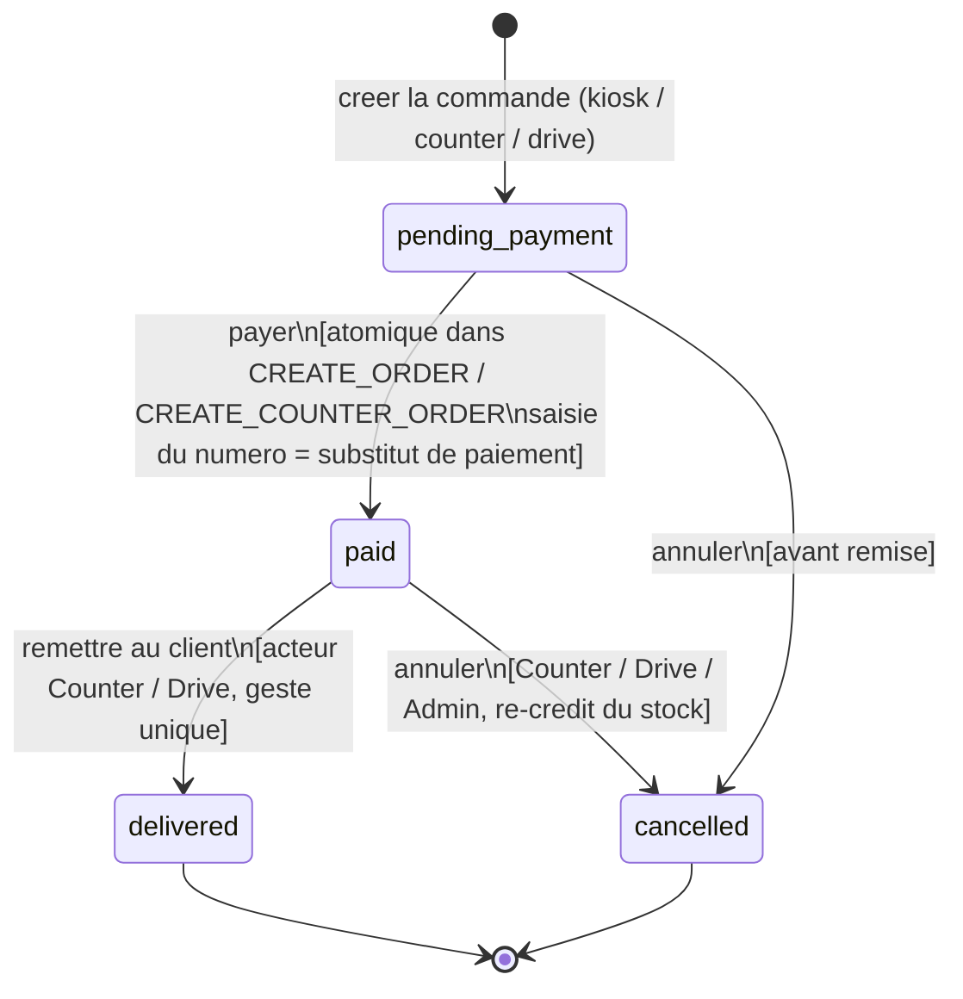

# Diagramme d'etats-transitions - Commande

**Phase UML** : P1 - Conception, complement UML (apres MCD)
**Statut** : v0.2 - prod-like, machine a 4 etats
**Date** : 2026-06-11
**Branche** : `feat/p1-conception`
**Auteur methodologie** : BYAN

---

## 1. Objet du document

Ce document formalise la **machine a etats** de l'attribut `customer_order.status`.
Il decrit les etats possibles d'une commande, les transitions autorisees entre
ces etats, les **evenements** qui les declenchent et les **gardes** (conditions)
qui les conditionnent.

Il complete le MCD (`docs/merise/mcd.md`, cycle de vie de la commande), le
dictionnaire (`docs/merise/dictionary.md` 3.10, qui declare l'ENUM `status`) et
le MCT (`docs/merise/mct.md` section 13, qui resume les transitions par
operation).

---

## 2. Source de verite et regle metier

Le modele v0.2 (prod-like) reduit la machine a **quatre etats**. La regle metier
distingue la **composition payee** de la **remise** : une commande est creee et
payee en une operation atomique (la saisie du numero de retrait tient lieu de
paiement dans le cadre RNCP), puis elle est remise au client en un geste unique.

| Source | Valeurs de statut |
|---|---|
| `dictionary.md` 3.10 (ENUM SQL) | `pending_payment`, `paid`, `delivered`, `cancelled` |
| `mct.md` section 13 (transitions) | creer+payer -> remettre, annulation depuis tout etat non terminal |

> Le dictionnaire (`dictionary.md` 3.10) et la machine ci-dessous partagent la
> meme ENUM a 4 valeurs, ce qui maintient la coherence entre le modele de
> donnees et le modele d'etats (cross-validation, mantra #34).

**Etats supprimes par rapport au v0.1** : `preparing` et `ready`. En contexte
fast-food, l'affichage cuisine (KDS) est un dispositif visuel : l'equipier lit
le ticket et agit. Ces deux etats intermediaires ajoutaient des transitions sans
valeur metier proportionnelle. La cuisine est en **lecture seule** ; la remise
(`DELIVER_ORDER`) est le geste unique qui fait avancer le statut. Le KPI est le
temps total `delivered_at - paid_at` (SLA ~10 min) ; la couleur du KDS est
calculee a l'affichage depuis `now - paid_at`, sans etat stocke supplementaire.

---

## 3. Etats retenus

| Etat | Valeur ENUM | Signification | Acteur qui declenche l'entree |
|---|---|---|---|
| En attente de paiement | `pending_payment` | Etat initial transitoire : commande composee, en attente de paiement. Non observable hors transaction (voir section 7). | Client (kiosk) ou Counter/Drive (back-office) |
| Payee | `paid` | Paiement effectue ; la commande entre en file de preparation (lecture seule cuisine). | Client (kiosk) ou Counter/Drive |
| Livree | `delivered` | Remise effectuee au client. Etat **final**. | Counter ou Drive |
| Annulee | `cancelled` | Commande abandonnee ou annulee avant remise. Etat **final**. | Counter, Drive ou Admin |

`pending_payment` est l'etat par defaut a l'INSERT (`dictionary.md` 3.10), mais
la transition vers `paid` est realisee dans la **meme transaction** que la
creation (operations `CREATE_ORDER` / `CREATE_COUNTER_ORDER` du MCT). Il est donc
conserve dans l'ENUM pour la lisibilite du cycle et pour laisser la porte
ouverte a un paiement reel ulterieur sans migration destructive.

---

## 4. Diagramme d'etats-transitions



---

## 5. Transitions detaillees

| # | De | Vers | Evenement declencheur | Garde (condition) | Acteur |
|---|---|---|---|---|---|
| T1 | (initial) | `pending_payment` | Creation de la commande composee | Au moins une ligne (`order_item`) ; numero de retrait non vide | Client / Counter / Drive |
| T2 | `pending_payment` | `paid` | Paiement (atomique a la creation) | La commande contient au moins une `order_item` ; decrement du stock et insert dans la meme transaction | Client / Counter / Drive |
| T3 | `pending_payment` | `cancelled` | Abandon avant paiement | Commande pas encore payee | Counter / Drive / Admin |
| T4 | `paid` | `delivered` | Remise physique au client | La commande est `paid` ; l'acteur detient `order.deliver` ; source compatible avec son role (`role_visible_source`) | Counter / Drive |
| T5 | `paid` | `cancelled` | Annulation avant remise | L'acteur detient `order.cancel` ; le stock consomme est re-credite (`stock_movement` type `cancellation`) | Counter / Drive / Admin |

### Invariants de la machine a etats

- `delivered` et `cancelled` sont des etats **finaux** : aucune transition n'en
  sort.
- Aucune transition ne revient en arriere. Une erreur operationnelle se traite
  par annulation puis nouvelle commande, pour preserver l'integrite de
  l'historique et des snapshots (`label_snapshot`, `unit_price_cents_snapshot`,
  `vat_rate_snapshot` sur `order_item`).
- La transition vers `cancelled` est possible depuis `pending_payment` et
  `paid`, mais pas depuis `delivered` (une commande remise ne s'annule pas dans
  ce modele). Coherent avec `mct.md` 7.1 (`CANCEL_ORDER`).
- `paid_at` (DATETIME, `dictionary.md` 3.10) est renseigne a la transition T2.
  `delivered_at` est renseigne a T4. `cancelled_at` est renseigne a T3/T5. Les
  trois colonnes sont NULL tant que la transition correspondante n'a pas eu lieu.
- La cuisine (`kitchen`) ne declenche aucune transition : son acces a la file
  des commandes `paid` est en **lecture seule** (`mct.md` 5.1,
  `LIST_ORDERS_DISPLAY`).

---

## 6. Coherence avec les autres livrables

| Verification | Resultat |
|---|---|
| Tous les etats du diagramme existent dans l'ENUM `dictionary.md` 3.10 | Oui (4 valeurs, toutes utilisees) |
| La regle "annulation possible sauf depuis delivered" de `mct.md` 7.1 | Respectee (T3, T5 ; pas de transition depuis `delivered`) |
| Transition `paid -> delivered` en geste unique de `mct.md` 6.1 | Couvert par T4 (`DELIVER_ORDER`) |
| Atomicite `pending_payment -> paid` de `mct.md` 3.3 / 4.1 / section 13 | Couvert par T2 (saisie du numero = substitut de paiement) |
| Acteurs de `use-cases.md` | Counter/Drive declenchent T4/T5 ; Admin peut annuler (T3/T5) ; Kitchen en lecture seule |
| Timestamps de phase `paid_at` / `delivered_at` / `cancelled_at` | Renseignes a T2 / T4 / T3-T5 |

---

## 7. Arbitrage tranche

La machine retenue est reduite a quatre etats (Decision 4,
`docs/notes/revue-alignement-p1.md` section 7) :

```
pending_payment -> paid -> delivered
        |            |
        +------------+--------> cancelled (depuis pending_payment ou paid)
```

**Note sur la transition `pending_payment -> paid`** : dans le cadre RNCP, le
paiement est remplace par la saisie du numero de commande (kiosk) ou par la
validation de l'equipier (counter/drive). La transition est **atomique** dans
`CREATE_ORDER` et `CREATE_COUNTER_ORDER` : le statut `pending_payment` n'est pas
observable en dehors de la transaction de creation. Il reste declare dans l'ENUM
pour exprimer le cycle de vie complet et pour autoriser un paiement reel
ulterieur (cout d'une valeur d'ENUM).

Les etats `preparing` et `ready` du v0.1 sont supprimes : la cuisine est un
affichage visuel en lecture seule, et la remise fusionne preparation+remise en
un geste unique (`DELIVER_ORDER`). Effet de bord propage : les operations
`MARK_IN_PREPARATION` et `MARK_READY` disparaissent du MCT (voir `mct.md`
sections 1 et 13).
