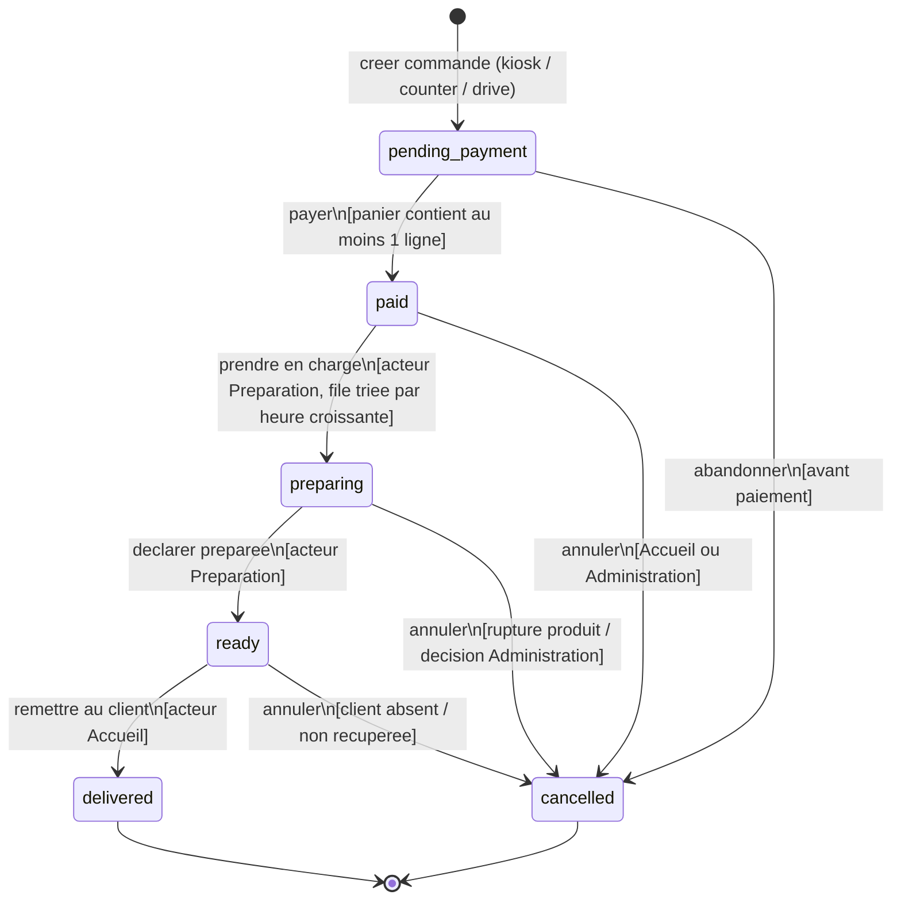

# Diagramme d'etats-transitions - Commande

**Phase UML** : P1 - Conception, complement UML (apres MCD)
**Statut** : v0.1
**Date** : 2026-05-21
**Branche** : `feat/p1-conception`
**Auteur methodologie** : BYAN

---

## 1. Objet du document

Ce document formalise la **machine a etats** de l'attribut `commande.statut`.
Il decrit les etats possibles d'une commande, les transitions autorisees entre
ces etats, les **evenements** qui les declenchent et les **gardes** (conditions)
qui les conditionnent.

Il complete le MCD (`docs/merise/mcd.md` section 9, qui esquisse le cycle de
vie) et le dictionnaire (`docs/merise/dictionary.md` 3.5, qui declare l'ENUM).

---

## 2. Source de verite et regle metier

La regle metier confirmee fixe deux phases successives dans le cycle de vie
d'une commande : le client **compose** sa commande, **puis** il **paie**. Une
fois payee, la commande entre en preparation. Le paiement fait partie integrante
du cycle. Les valeurs d'etat sont en anglais et alignees sur l'ENUM du
dictionnaire.

| Source | Valeurs de statut |
|---|---|
| `dictionary.md` 3.5 (ENUM SQL) | `pending_payment`, `paid`, `preparing`, `ready`, `delivered`, `cancelled` |
| Regle metier confirmee | composer -> payer -> preparer -> pret -> remettre |

**Machine a etats canonique** : la machine ci-dessous est la seule autorisee.
Elle suit l'ENUM du dictionnaire et la regle metier des deux phases :

- `pending_payment` : commande composee, en attente de paiement.
- `paid` : paiement effectue ; la commande peut entrer en file de preparation.

> Le dictionnaire (`dictionary.md` 3.5) et la machine ci-dessous partagent la
> meme ENUM, ce qui maintient la coherence entre le modele de donnees et le
> modele d'etats (cross-validation, mantra #34).

---

## 3. Etats retenus

| Etat | Valeur ENUM | Signification | Acteur qui declenche l'entree |
|---|---|---|---|
| En attente de paiement | `pending_payment` | Commande composee, panier fige, en attente de paiement. | Client (kiosk) ou Accueil (counter/drive) |
| Payee | `paid` | Paiement effectue ; la commande peut entrer en file de preparation. | Client (paiement) ou Accueil |
| En preparation | `preparing` | Prise en charge par la Preparation, en cuisine. | Preparation |
| Prete | `ready` | Preparation terminee, prete au comptoir. | Preparation |
| Livree | `delivered` | Remise effectuee au client. Etat **final**. | Accueil |
| Annulee | `cancelled` | Commande abandonnee ou annulee. Etat **final**. | Client, Accueil ou Administration |

---

## 4. Diagramme d'etats-transitions



---

## 5. Transitions detaillees

| # | De | Vers | Evenement declencheur | Garde (condition) | Acteur |
|---|---|---|---|---|---|
| T1 | (initial) | `pending_payment` | Creation de la commande composee | Au moins un item ajoute au panier en cours | Client / Accueil |
| T2 | `pending_payment` | `paid` | Paiement de la commande | La commande contient au moins une `ligne_commande` ; le paiement aboutit | Client / Accueil |
| T3 | `pending_payment` | `cancelled` | Abandon avant paiement | Commande pas encore payee | Client / Accueil |
| T4 | `paid` | `preparing` | Prise en charge en file | La commande est la plus ancienne non traitee (tri par heure de livraison croissante) | Preparation |
| T5 | `paid` | `cancelled` | Annulation avant preparation | Decision operationnelle | Accueil / Administration |
| T6 | `preparing` | `ready` | Declaration "preparee" | Preparation terminee | Preparation |
| T7 | `preparing` | `cancelled` | Annulation pendant preparation | Rupture produit ou decision Administration | Preparation / Administration |
| T8 | `ready` | `delivered` | Remise physique au client | Le client se presente avec le bon numero | Accueil |
| T9 | `ready` | `cancelled` | Annulation apres preparation | Client non present / commande non recuperee | Accueil / Administration |

### Invariants de la machine a etats

- `delivered` et `cancelled` sont des etats **finaux** : aucune transition n'en
  sort.
- Aucune transition ne revient en arriere (pas de `preparing -> paid`). Une
  erreur operationnelle se traite par annulation puis nouvelle commande, pour
  preserver l'integrite de l'historique et des snapshots de prix.
- La transition vers `cancelled` est possible depuis tous les etats **sauf**
  `delivered` (une commande remise ne s'annule pas dans ce modele). Ceci est
  coherent avec `mcd.md` section 9 : "Annuler : transition vers `cancelled`
  (depuis tout statut sauf `delivered`)".
- `paye_a` (DATETIME, `dictionary.md` 3.5) est renseigne au moment de la
  transition T2 (`pending_payment -> paid`) et reste NULL avant.

---

## 6. Coherence avec les autres livrables

| Verification | Resultat |
|---|---|
| Tous les etats du diagramme existent dans l'ENUM `dictionary.md` 3.5 | Oui (6 valeurs, toutes utilisees) |
| La regle "annulation possible sauf depuis delivered" de `mcd.md` 9 | Respectee (T5, T7, T9 ; pas de transition depuis `delivered`) |
| Cycle de vie esquisse dans `mcd.md` 9 | Couvert : `pending_payment` -> `paid` (payer), `paid` -> `preparing` (preparer), `preparing` -> `ready` (marquer pret), `ready` -> `delivered` (remettre) |
| Acteurs de `use-cases.md` | Preparation declenche T4/T6/T7 ; Accueil declenche T8/T9 ; Administration peut annuler |

---

## 7. Arbitrage tranche

La divergence historique entre l'ENUM du dictionnaire et un parcours sans
paiement est resolue par la regle metier confirmee : le cycle de vie comporte
deux phases successives, la composition de la commande puis son paiement. Le
paiement fait partie integrante du cycle.

La machine canonique retenue est donc :

```
pending_payment -> paid -> preparing -> ready -> delivered
                   (cancelled atteignable depuis pending_payment, paid, preparing)
```

Cette machine est la source de verite partagee par `dictionary.md` 3.5,
`use-cases.md` (cas "Payer la commande" cote Client) et
`sequence-passer-commande.md` (etape paiement entre validation du panier et
confirmation). La colonne `paye_a` est renseignee a la transition T2. A
revalider lors du MCT.
