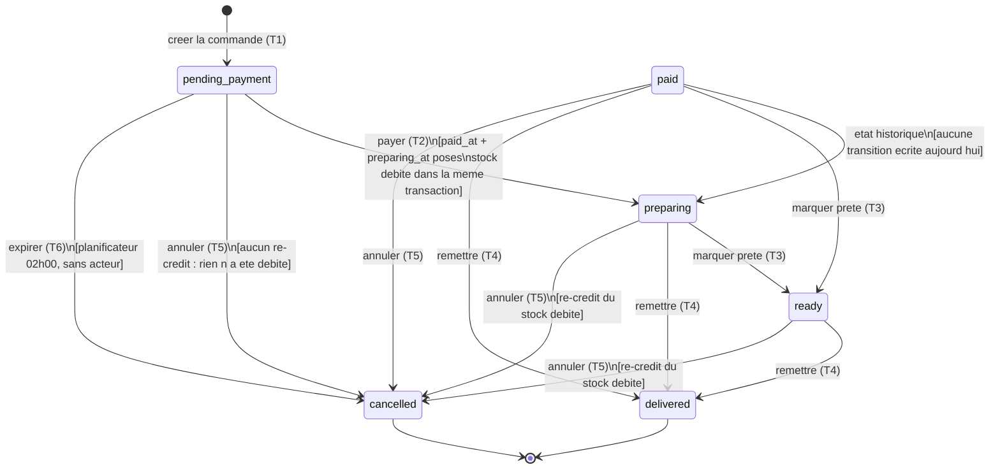

# Diagramme d'etats-transitions - Commande

**Phase UML** : P1 - Conception, complement UML (apres MCD)
**Statut** : v0.3 - realigne sur le code livre, machine a 6 valeurs
**Date** : 2026-07-31
**Auteur methodologie** : BYAN

---

## 1. Objet du document

Ce document formalise la **machine a etats** de l'attribut `customer_order.status`.
Il decrit les etats possibles d'une commande, les transitions autorisees, les
**evenements** qui les declenchent et les **gardes** qui les conditionnent.

Il complete le MCD (`docs/merise/mcd.md`), le dictionnaire (`docs/merise/dictionary.md`
3.10) et le MLT (`docs/merise/mlt.md` sections 13 et 14).

> **Realignement du 2026-07-31.** La version v0.2 de ce document decrivait une machine
> a 4 etats et affirmait que `preparing` et `ready` avaient ete supprimes, ainsi que
> `pending_payment` non observable hors transaction. Les trois affirmations sont
> devenues fausses : la migration `0009_order_prep_states.sql` a rendu `preparing` et
> `ready` reels, et la creation de commande committe dans sa propre transaction depuis
> que creation et encaissement sont deux appels HTTP distincts. Chaque transition
> ci-dessous est ancree dans le code qui l'execute.
>
> Portee du realignement : ce document et `mlt.md` sections 13/14. Le dictionnaire,
> le MLD et le MCD portent encore la description a 4 etats -- dette connue, traitee
> a part.

---

## 2. Source de verite

La source de verite est le **code**, croise avec l'enumeration reellement en base :

```sql
status enum('pending_payment','paid','preparing','ready','delivered','cancelled')
       NOT NULL DEFAULT 'pending_payment'
```

Les transitions vivent toutes dans `src/app/Order/OrderRepository.php`, un seul
proprietaire pour la machine a etats.

---

## 3. Etats

| Etat | Valeur ENUM | Signification | Ecrit par |
|---|---|---|---|
| En attente de paiement | `pending_payment` | Commande composee, totaux figes, lignes persistees, rien de debite. Etat initial. **Observable** : la creation committe dans sa propre transaction. | `persist()` (`OrderRepository.php:212-274`) |
| Payee | `paid` | **Etat historique.** Aucun chemin de code ne l'ecrit plus depuis que le paiement met directement en preparation. Il subsiste dans l'enumeration et dans les gardes pour les commandes creees AVANT ce changement (11 lignes en base de demonstration au 2026-07-31). | plus aucun code |
| En preparation | `preparing` | Encaissee et en cuisine. C'est ici que le stock est debite. `paid_at` ET `preparing_at` sont poses ensemble ; `paid_at` reste l'horloge de reference du SLA et des indicateurs de vente. | `pay()` (`:348`) |
| Prete | `ready` | Preparation terminee, en attente de remise. | `markReady()` (`:468`) |
| Remise | `delivered` | Remise au client. Etat **final**. | `deliver()` (`:417`) |
| Annulee | `cancelled` | Annulee par un equipier, ou expiree par le planificateur. Etat **final**. | `cancel()` (`:533`), `expireStalePending()` (`:656`) |

---

## 4. Diagramme d'etats-transitions


```mermaid
stateDiagram-v2
    [*] --> pending_payment : creer la commande (T1)

    pending_payment --> preparing : payer (T2)\n[paid_at + preparing_at poses\nstock debite dans la meme transaction]
    pending_payment --> cancelled : annuler (T5)\n[aucun re-credit : rien n a ete debite]
    pending_payment --> cancelled : expirer (T6)\n[planificateur 02h00, sans acteur]

    paid --> preparing : etat historique\n[aucune transition ecrite aujourd hui]
    paid --> ready : marquer prete (T3)
    paid --> delivered : remettre (T4)
    paid --> cancelled : annuler (T5)

    preparing --> ready : marquer prete (T3)
    preparing --> delivered : remettre (T4)
    preparing --> cancelled : annuler (T5)\n[re-credit du stock debite]

    ready --> delivered : remettre (T4)
    ready --> cancelled : annuler (T5)\n[re-credit du stock debite]

    delivered --> [*]
    cancelled --> [*]
```

---

## 5. Transitions detaillees

| # | De | Vers | Evenement | Garde | Acteur | Code |
|---|---|---|---|---|---|---|
| T1 | (initial) | `pending_payment` | Creation de la commande composee | Au moins une ligne resolue ; produits disponibles (RG-T21) ; prix refiges serveur | Client (borne) / Equipier (comptoir, drive) | `persist()` `:212-274` |
| T2 | `pending_payment` | `preparing` | Encaissement | `WHERE status = 'pending_payment'` ; 0 ligne affectee et etat deja encaisse -> sortie idempotente, sinon transition invalide | Client / Equipier | `pay()` `:344-375` |
| T3 | `paid`, `preparing` | `ready` | Preparation terminee | `WHERE status IN ('paid','preparing')` ; permission `order.read` | Cuisine | `markReady()` `:467-471` |
| T4 | `paid`, `preparing`, `ready` | `delivered` | Remise physique | `WHERE status IN ('paid','preparing','ready')` ; permission `order.deliver` ; source compatible avec le role (`role_visible_source`, PRE-3) | Comptoir / Drive | `deliver()` `:416-420` |
| T5 | `pending_payment`, `paid`, `preparing`, `ready` | `cancelled` | Annulation | `WHERE status IN (...)` ; permission `order.cancel` + PIN equipier ; re-credit du stock **conditionne a l'existence de mouvements `sale`**, pas au statut lu | Comptoir / Drive / Admin | `cancel()` `:507` |
| T6 | `pending_payment` | `cancelled` | **Expiration automatique** | Age > `ORDER_PENDING_EXPIRY_MINUTES` ; `WHERE status = 'pending_payment'` ; aucun mouvement `sale` ; **aucun effet de stock** | Systeme (planificateur 02h00) | `expireStalePending()` `:618` |

### Invariants

- `delivered` et `cancelled` sont **finaux** : aucune transition n'en sort.
- Aucun retour en arriere. Une erreur operationnelle se traite par annulation puis
  nouvelle commande, pour preserver les instantanes de prix (`label_snapshot`,
  `unit_price_cents_snapshot`, `vat_rate_snapshot` sur `order_item`).
- **Le stock ne bouge qu'a T2 et T5.** T2 debite (`stock_movement` type `sale`) ; T5
  re-credite (type `cancellation`) **si et seulement si** des mouvements `sale`
  existent pour cette commande. T6 n'ecrit rien sur le stock : une commande en attente
  n'a rien consomme, la re-crediter creerait du stock a partir de rien.
- La decision de re-credit de T5 repose sur l'**existence de mouvements `sale`**, pas
  sur le statut lu hors transaction : insensible a la course
  `pending_payment -> preparing -> cancel`.
- Chaque transition est gardee **dans le WHERE de son UPDATE**. Le projet n'utilise pas
  `SELECT ... FOR UPDATE` : 0 ligne affectee vaut course perdue.
- Horodatages : `paid_at` et `preparing_at` a T2, `ready_at` a T3, `delivered_at` a T4,
  `cancelled_at` a T5 et T6. NULL tant que la transition n'a pas eu lieu.
- T6 ecrit une trace `audit_log` avec `action_code = 'order.expire'` et un acteur
  **NULL** : personne n'a annule, la machine a nettoye.
- Une commande expiree **conserve** sa cle d'idempotence et ses lignes : on ferme, on ne
  detruit pas. Un essai tardif avec la meme cle retombe donc sur une commande annulee et
  l'encaissement echoue en conflit ; le client repart d'une commande neuve.

---

## 6. Coherence avec les autres livrables

| Verification | Resultat |
|---|---|
| Tous les etats du diagramme existent dans l'enumeration en base | Oui, 6 valeurs (mesure le 2026-07-31) |
| Tous les etats sont atteignables par du code | Non : `paid` ne l'est plus, conserve pour les commandes anterieures. Dit explicitement en section 3. |
| Annulation possible sauf depuis un etat final | Respectee (T5, T6 ; rien depuis `delivered` ni `cancelled`) |
| Le stock ne bouge qu'a l'encaissement et a l'annulation d'une commande encaissee | Verifie par test (unitaire + integration sur base reelle) |
| `mlt.md` section 13.6 (expiration) | Presente, alignee sur T6 |
| Dictionnaire / MLD / MCD | **En ecart** : ils decrivent encore 4 etats. Dette connue, hors perimetre de ce document. |

---

## 7. Arbitrages tranches

**Pourquoi `pending_payment` est observable.** La creation et l'encaissement sont deux
appels HTTP distincts : `persist()` committe une commande complete, puis `pay()` ouvre sa
propre transaction. L'etat intermediaire existe donc vraiment, et un abandon entre les
deux (reseau coupe, borne redemarree, onglet ferme) laisse une commande inerte. C'est
exactement ce que T6 nettoie.

**Pourquoi l'expiration passe par `cancelled` et non par un statut `expired`.** La valeur
existe deja, elle est deja terminale, deja exclue du chiffre d'affaires et de la file
cuisine, deja libellee « Annulee » a l'ecran. Un 7e statut obligerait a reprendre chaque
endroit qui enumere les statuts, pour un gain purement statistique -- alors que le journal
d'audit porte deja la distinction (`order.expire` contre `order.cancel`). Detail et
alternatives ecartees : `docs/adr/0014-expiration-commandes-pending.md`.

**Pourquoi le paiement met directement en preparation.** Retour d'oral du 2026-06-29 : en
fast-food, une commande encaissee part en cuisine sans geste intermediaire. Le bouton
manuel « Commencer » a donc ete retire et `pay()` pose `preparing`. La cuisine ne clique
plus que « Prete ». Consequence sur ce document : `paid` cesse d'etre ecrit.
