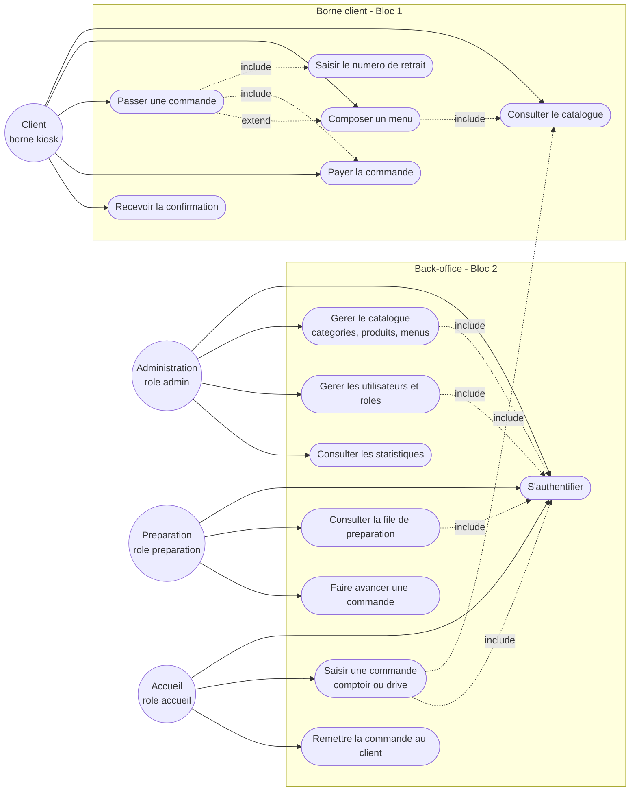

# Diagramme de cas d'utilisation - Wakdo

**Phase UML** : P1 - Conception, complement UML (apres MCD)
**Statut** : v0.1
**Date** : 2026-05-21
**Branche** : `feat/p1-conception`
**Auteur methodologie** : BYAN

---

## 1. Objet du document

Ce document recense les **cas d'utilisation** de Wakdo, c'est-a-dire les
fonctionnalites observables du systeme du point de vue de ses acteurs. Il
complete le MCD (`docs/merise/mcd.md`) et le dictionnaire
(`docs/merise/dictionary.md`) en passant de la vue **donnees** a la vue
**usages**.

Le diagramme reste au niveau conceptuel. Il ne prejuge pas de l'ecran ou de
l'endpoint qui realisera chaque cas, mais identifie qui fait quoi.

**Sources** :
- `docs/PROJECT_CONTEXT.md` sections 2 (acteurs, processus), 7 (scope RBAC)
- `docs/merise/dictionary.md` (entites `commande`, `role`, `user`)

---

## 2. Acteurs - perimetre et challenge de pertinence

Le brief (`PROJECT_CONTEXT.md` section 2 et section 7) definit les acteurs
metier. Avant de les retenir, chaque acteur propose dans la consigne initiale
est confronte au perimetre reel du projet.

| Acteur candidat | Statut | Justification (perimetre reel) |
|---|---|---|
| **Client (borne kiosk)** | Retenu | Acteur central du Bloc 1. Compose et valide une commande sur la borne tactile autonome (canal `kiosk`). Non authentifie. |
| **Manager / Admin** | Retenu, fusionne en **Administration** | Le brief ne distingue pas "manager" et "admin" comme deux roles. Le role RBAC reel est `admin` (section 7). Il porte le CRUD catalogue, la gestion des utilisateurs/roles et les stats. On nomme l'acteur **Administration** pour coller au vocabulaire du brief. |
| **Cuisine** | Retenu, renomme **Preparation** | Correspond au role RBAC `preparation` (section 7). Voit la file des commandes a preparer triees par heure de livraison croissante et fait avancer leur statut. Le terme "Cuisine" est un synonyme metier ; le role technique est `preparation`. |
| **Caisse** | Ecarte comme acteur distinct | Challenge : il n'existe pas de role RBAC `caisse` (les 3 roles sont `admin`, `preparation`, `accueil`). Le paiement existe dans le cycle (cote Client sur la borne et cote Accueil au comptoir/drive), mais aucun acteur "Caisse" dedie n'est modelise. L'equivalent operationnel le plus proche est l'**Accueil** (role `accueil`) qui saisit les commandes au comptoir/drive et remet les commandes livrees. |
| **Accueil** | Retenu (non liste dans la consigne mais present au brief) | Role RBAC `accueil`. Saisit les commandes au comptoir (canal `counter`) ou au drive (canal `drive`), puis remet les commandes au client (passage a `delivered`). C'est l'acteur qui recouvre le besoin que la consigne attribuait a "Caisse". |

### Decision sur les acteurs retenus

Quatre acteurs sont conserves au diagramme :

1. **Client** (borne, non authentifie)
2. **Administration** (role `admin`)
3. **Preparation** (role `preparation`, ex-"Cuisine")
4. **Accueil** (role `accueil`, recouvre le besoin "Caisse")

> Decision actee : il n'y a **pas** de parcours employe dedie modelise a part.
> Les cas d'usage des employes (Administration, Preparation, Accueil) sont
> couverts directement ici. Cette decision suit le mantra du Rasoir d'Ockham
> (#37) : on evite une couche de modelisation redondante tant qu'aucun besoin
> ne la justifie.

---

## 3. Diagramme de cas d'utilisation

Mermaid ne fournit pas de type `usecase` natif. La representation ci-dessous
utilise un `flowchart` : les acteurs sont des noeuds a gauche, les cas
d'utilisation sont des noeuds arrondis regroupes par sous-systeme, et les
fleches portent les relations (`<<include>>`, `<<extend>>`) la ou elles
ont du sens.

---

## 4. Description des cas d'utilisation

### 4.1 Acteur Client (borne kiosk)

| Cas | Description | Entites manipulees |
|---|---|---|
| Consulter le catalogue | Parcourir les categories, produits et menus disponibles. Charges via `GET /api/categories`, `/api/products`, `/api/menus` (ou JSON fallback). | `categorie`, `produit`, `menu` |
| Composer un menu | Choisir burger + accompagnement + boisson + sauce, regler les options de taille (normale / grande) et de personnalisation. Etend "Passer une commande" car un menu compose est une variante d'item au panier. | `menu`, `menu_produit`, `produit` |
| Passer une commande | Valider le panier, declencher la creation de la commande composee. Inclut la saisie du numero de retrait et le paiement. | `commande`, `ligne_commande` |
| Saisir le numero de retrait | Renseigner le numero qui identifie le client au comptoir. Cas inclus par "Passer une commande". | `commande.numero` |
| Payer la commande | Regler la commande une fois le panier compose et valide. Materialise la transition `pending_payment -> paid` de `state-commande.md`. Cas inclus par "Passer une commande". | `commande.statut`, `commande.paye_a` |
| Recevoir la confirmation | Afficher l'ecran de confirmation avec le numero, apres paiement. | `commande` |

> Note de coherence : le cycle de vie comporte deux phases successives, la
> composition de la commande puis son paiement (regle metier confirmee). Le cas
> "Payer la commande" est retenu cote Client et materialise la transition
> `pending_payment -> paid` de l'ENUM `statut`
> (`dictionary.md` 3.5, `state-commande.md`).

### 4.2 Acteur Administration (role admin)

| Cas | Description | Entites manipulees |
|---|---|---|
| Gerer le catalogue | CRUD sur categories, produits et menus (libelles, prix, images, disponibilite, composition de menu). | `categorie`, `produit`, `menu`, `menu_produit` |
| Gerer les utilisateurs et roles | CRUD sur les comptes back-office et leurs roles ; consultation de la matrice de permissions. | `user`, `role`, `permission`, `role_permission` |
| Consulter les statistiques | Voir les commandes du jour de service, le chiffre d'affaires, les produits les plus commandes. | `commande`, `ligne_commande` |

### 4.3 Acteur Preparation (role preparation, ex-Cuisine)

| Cas | Description | Entites manipulees |
|---|---|---|
| Consulter la file de preparation | Afficher les commandes a preparer triees par heure de livraison croissante, tous canaux confondus. | `commande`, `ligne_commande` |
| Faire avancer une commande | Declarer une commande "preparee", ce qui declenche une transition de statut (voir `state-commande.md`). | `commande.statut` |

### 4.4 Acteur Accueil (role accueil, recouvre Caisse)

| Cas | Description | Entites manipulees |
|---|---|---|
| Saisir une commande | Creer une commande pour un client au comptoir (`counter`) ou au drive (`drive`), en consultant le catalogue. | `commande`, `ligne_commande`, `produit`, `menu` |
| Remettre la commande au client | Declarer une commande "livree" au moment de la remise physique. | `commande.statut` |

### 4.5 Cas transverse - S'authentifier

Tous les acteurs du back-office (Administration, Preparation, Accueil) passent
par "S'authentifier" avant d'acceder a leurs cas. Modelise comme cas inclus
(`<<include>>`) par chaque cas back-office pour eviter de surcharger le
diagramme. Le Client de la borne n'est pas authentifie (canal `kiosk` public).

---

## 5. Relations include / extend retenues

| Relation | Type | Justification |
|---|---|---|
| Passer une commande -> Saisir le numero de retrait | include | La saisie du numero fait partie integrante de toute validation de commande. |
| Passer une commande -> Payer la commande | include | Le paiement suit la composition du panier et fait partie integrante du parcours (phase 2 du cycle de vie). |
| Composer un menu -> Consulter le catalogue | include | Composer un menu suppose de parcourir les produits eligibles a chaque slot. |
| Passer une commande -> Composer un menu | extend | Le menu est un cas optionnel : une commande peut ne contenir que des produits a la carte. La composition etend le parcours seulement si le client choisit un menu. |
| Saisir une commande (Accueil) -> Consulter le catalogue | include | L'equipier consulte le catalogue pour saisir au comptoir / drive. |
| Cas back-office -> S'authentifier | include | Acces conditionne a une session authentifiee. |

---

## 6. Incoherences remontees vers les autres livrables

Ces ecarts entre les sources sont signales pour arbitrage de l'auteur (la
modelisation finale releve de sa decision, mantra de validation humaine).

1. **ENUM `statut` et phase de paiement (tranche)**
   Le dictionnaire (`dictionary.md` 3.5) definit
   `statut ENUM('pending_payment','paid','preparing','ready','delivered','cancelled')`
   avec un paiement explicite. La regle metier confirmee fixe deux phases
   successives, la composition de la commande puis son paiement. Le cas
   "Payer la commande" est donc retenu cote Client et materialise la transition
   `pending_payment -> paid`. Cet ecart est tranche : la machine canonique de
   `state-commande.md` fait foi.

2. **Acteur "Caisse" absent du RBAC**
   Aucun role `caisse` n'existe (`PROJECT_CONTEXT.md` section 7 : `admin`,
   `preparation`, `accueil`). La fonction d'encaissement de la consigne a ete
   rattachee a l'acteur **Accueil**. A confirmer.

3. **"Manager" vs "Admin"**
   La consigne parle de "Manager/Admin" ; le brief ne connait que `admin`. Les
   deux ont ete fusionnes en un acteur **Administration**. A confirmer si un
   role manager intermediaire est souhaite (le dictionnaire 3.8 mentionne un
   role `manager` extensible, non present dans le scope section 7).
