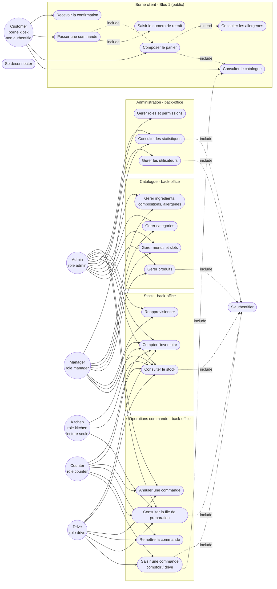

# Diagramme de cas d'utilisation - Wakdo

**Phase UML** : P1 - Conception, complement UML (apres MCD)
**Statut** : v0.2 - prod-like, 5 roles RBAC + catalogue de 23 permissions
**Date** : 2026-06-11
**Branche** : `feat/p1-conception`
**Auteur methodologie** : BYAN

---

## 1. Objet du document

Ce document recense les **cas d'utilisation** de Wakdo, c'est-a-dire les
fonctionnalites observables du systeme du point de vue de ses acteurs. Il
complete le MCD (`docs/merise/mcd.md`), le dictionnaire
(`docs/merise/dictionary.md`) et le MCT (`docs/merise/mct.md`, 26 operations) en
passant de la vue **donnees / traitements** a la vue **usages**.

Le diagramme reste au niveau conceptuel : il identifie qui fait quoi, sans
prejuger de l'ecran ou de l'endpoint qui realise chaque cas. Chaque cas
back-office est rattache a la **permission** qui le conditionne (catalogue fige
de 23 codes, `dictionary.md` 3.17), conformement a la regle RBAC
permission-driven : le code teste une permission, pas un nom de role.

**Sources** :
- `docs/PROJECT_CONTEXT.md` sections 2 (acteurs, processus), 7 (scope back-office)
- `docs/merise/dictionary.md` 3.14-3.18 (`user`, `role`, `role_visible_source`, `permission`, `role_permission`)
- `docs/merise/mct.md` (operations, acteurs, permissions par operation)

---

## 2. Acteurs - perimetre et challenge de pertinence

Le brief initial (`PROJECT_CONTEXT.md` section 2) decrivait quatre acteurs
metier (Client, Accueil, Preparation, Administration) adosses a 3 roles RBAC. Le
modele v0.2 (prod-like, Decision 4 de `revue-alignement-p1.md` section 7) raffine
le back-office en **5 roles** pour coller a l'organisation reelle d'un fast-food
multi-canal. Chaque acteur candidat est confronte au perimetre reel.

| Acteur candidat (brief) | Statut v0.2 | Justification (perimetre reel) |
|---|---|---|
| **Client (borne kiosk)** | Retenu (acteur `CUSTOMER`) | Acteur central du Bloc 1. Compose et valide une commande sur la borne tactile autonome (canal `kiosk`). **Non authentifie**. |
| **Accueil** | **Scinde** en `counter` et `drive` | Le besoin "Accueil" recouvre deux canaux operationnels distincts : le comptoir (`counter`) et le drive (`drive`). Le v0.2 les separe car le tag `source` de la commande et le filtre de dashboard (`role_visible_source`) different. Tous deux saisissent des commandes, les remettent et les annulent. |
| **Preparation** | Retenu, renomme `kitchen` | Role RBAC `kitchen`. Voit la file des commandes `paid` triees par `paid_at` croissant. **Lecture seule** : ne declenche aucune transition de statut (le KDS est un dispositif visuel ; la remise revient a `counter`/`drive`). |
| **Administration** | **Scinde** en `admin` et `manager` | Le v0.1 fusionnait "Manager/Admin". Le v0.2 distingue : `admin` (gestion des utilisateurs, des roles et permissions, suppressions catalogue) et `manager` (catalogue create/update, stock/reappro, stats), utilisateurs en lecture seule (`user.read`) et sans acces au RBAC. Resout le point ouvert v0.1 "Manager vs Admin". |
| **Caisse** | Ecarte (recouvert par `counter`/`drive`) | Aucun role `caisse` n'existe. L'encaissement est atomique a la creation de commande (saisie du numero = substitut de paiement) ; il est realise par le Client (kiosk) ou par `counter`/`drive` (back-office). Resout le point ouvert v0.1 "Caisse absente du RBAC". |
| **Systeme** | Retenu (acteur `SYS`) | Logique interne (generation du numero, reponse API de confirmation). Apparait dans le MCT (3.4 `DISPLAY_CONFIRMATION`) ; non represente comme acteur humain au diagramme. |

### Decision sur les acteurs retenus

Six acteurs sont conserves : un acteur public et cinq roles back-office.

1. **Customer** (borne kiosk, non authentifie)
2. **Admin** (role `admin`)
3. **Manager** (role `manager`)
4. **Kitchen** (role `kitchen`, ex-"Preparation", lecture seule)
5. **Counter** (role `counter`, ex-"Accueil" comptoir)
6. **Drive** (role `drive`, ex-"Accueil" drive)

> Regle RBAC permission-driven (`dictionary.md` 3.15) : les rattachements
> acteur -> cas ci-dessous refletent la **matrice de permissions par defaut au
> seed**. Le gardien reel est la permission, pas le nom du role : un role
> personnalise (ex. "chef-patissier") dote des bonnes permissions ouvre les
> memes cas, sans changement de code. Les 5 roles seed sont un point de depart,
> pas une liste fermee.

---

## 3. Diagramme de cas d'utilisation

Mermaid ne fournit pas de type `usecase` natif. La representation utilise un
`flowchart` : les acteurs sont a gauche, les cas d'utilisation regroupes par
sous-systeme. La permission qui conditionne chaque cas back-office est precisee
en section 4.

---

## 4. Description des cas d'utilisation

### 4.1 Acteur Customer (borne kiosk, non authentifie)

| Cas | Operation MCT | Description | Entites manipulees |
|---|---|---|---|
| Consulter le catalogue | 3.1 LOAD_CATALOGUE | Parcourir categories, produits et menus disponibles, charges via `GET /api/categories`, `/api/products`, `/api/menus` (ou JSON fallback). | `category`, `product`, `menu`, `menu_slot`, `menu_slot_option` |
| Composer le panier | 3.2 COMPOSE_CART | Ajouter produits a la carte ou menus ; remplir les slots d'un menu (`order_item_selection`), choisir le format Normal/Maxi, ajouter/retirer des ingredients (`order_item_modifier`). Panier volatil cote front, aucun ecrit BDD a ce stade. | `product`, `menu`, `menu_slot`, `menu_slot_option`, `ingredient`, `product_ingredient` |
| Consulter les allergenes | (derive de 3.1) | Afficher en modal les allergenes d'un produit, **calcules** par jointure `product_ingredient -> ingredient_allergen -> allergen` (INCO 1169/2011). Etend la composition. | `allergen`, `ingredient_allergen`, `product_ingredient` |
| Passer une commande | 3.3 CREATE_ORDER | Valider le panier et saisir le numero de retrait. Creation atomique : INSERT `customer_order` (`pending_payment` puis `paid` dans la meme transaction), `order_item` + selections + modifiers snapshotes, decrement du stock + `stock_movement`. | `customer_order`, `order_item`, `order_item_selection`, `order_item_modifier`, `ingredient`, `stock_movement` |
| Saisir le numero de retrait | (inclus dans 3.3) | Renseigner le numero qui identifie le client. Tient lieu de paiement (cadre RNCP). Cas inclus par "Passer une commande". | `customer_order.order_number` |
| Recevoir la confirmation | 3.4 DISPLAY_CONFIRMATION | Afficher l'ecran de confirmation avec le numero, apres reponse `201` (statut `paid`). La borne se reinitialise. | `customer_order` |

### 4.2 Acteurs Counter et Drive (roles `counter`, `drive`)

| Cas | Operation MCT | Permission | Description | Entites |
|---|---|---|---|---|
| Saisir une commande comptoir/drive | 4.1 CREATE_COUNTER_ORDER | `order.create` | Composer une commande pour un client au comptoir (`counter`) ou au drive (`drive`). Logique identique a CREATE_ORDER ; `source` auto-tague depuis `role.order_source`. Numero `C-`/`D-YYYY-MM-DD-NNN`. | `customer_order`, `order_item`, `order_item_selection`, `order_item_modifier`, `ingredient`, `stock_movement` |
| Consulter la file de preparation | 5.1 LIST_ORDERS_DISPLAY | `order.read` | Voir les commandes `paid` triees par `paid_at` croissant, filtrees par `role_visible_source` (counter voit kiosk+counter ; drive voit drive). Couleur KDS = `now - paid_at`. | `customer_order`, `order_item`, `order_item_selection`, `order_item_modifier`, `role_visible_source` |
| Remettre la commande | 6.1 DELIVER_ORDER | `order.deliver` | Geste unique `paid -> delivered`, `delivered_at = NOW()`. | `customer_order` |
| Annuler une commande | 7.1 CANCEL_ORDER | `order.cancel` | Transition vers `cancelled` depuis `pending_payment`/`paid`, `cancelled_at = NOW()`. Re-credit du stock si `paid`. | `customer_order`, `ingredient`, `stock_movement` |

### 4.3 Acteur Kitchen (role `kitchen`, lecture seule)

| Cas | Operation MCT | Permission | Description | Entites |
|---|---|---|---|---|
| Consulter la file de preparation | 5.1 LIST_ORDERS_DISPLAY | `order.read` | Voir toutes les sources (kiosk, counter, drive) en lecture seule. **Aucune transition de statut** : le KDS est un affichage visuel. | `customer_order`, `order_item`, `order_item_selection`, `order_item_modifier`, `role_visible_source` |

### 4.4 Stock (Kitchen, Counter, Drive, Manager, Admin)

| Cas | Operation MCT | Permission | Description | Entites |
|---|---|---|---|---|
| Consulter le stock | 9.3 READ_STOCK | `stock.read` | Lister les ingredients avec stock courant ; alerte rupture calculee a l'affichage (`stock_quantity <= low_stock_threshold`). | `ingredient`, `stock_movement` |
| Compter l'inventaire | 9.2 INVENTORY_COUNT | `stock.count` | Saisir un comptage physique ; le systeme enregistre l'ecart (`inventory_correction`). Inclut les equipiers (kitchen/counter/drive). | `ingredient`, `stock_movement` |
| Reapprovisionner | 9.1 RESTOCK | `stock.manage` | Enregistrer une livraison en conditionnements (`+= N * pack_size`). Reserve manager/admin. | `ingredient`, `stock_movement` |

### 4.5 Catalogue (Manager, Admin)

| Cas | Operation MCT | Permissions | Description | Entites |
|---|---|---|---|---|
| Gerer produits | 8.1-8.3 CREATE/UPDATE/DELETE_PRODUCT | `product.create`/`update` (manager+admin), `product.delete` (admin seul) | CRUD produits (nom, prix, `vat_rate`, image, dispo). La suppression physique est reservee a `admin` et bloquee si reference (FK RESTRICT). | `product`, `category` |
| Gerer menus et slots | 8.4-8.6 CREATE/UPDATE/DELETE_MENU | `menu.create`/`update` (manager+admin), `menu.delete` (admin seul) | CRUD menus avec leur configuration de slots (`menu_slot`, `menu_slot_option`) et le burger fixe. | `menu`, `menu_slot`, `menu_slot_option`, `product` |
| Gerer categories | 8.7 MANAGE_CATEGORY | `category.manage` (manager+admin) | CRUD categories ; desactivation `is_active=0`. | `category` |
| Gerer ingredients, compositions, allergenes | 8.8 MANAGE_INGREDIENT | `ingredient.manage` (manager+admin) | CRUD `ingredient` ; composition `product_ingredient` (quantites Normal/Maxi, retirable/ajoutable, supplement) ; mapping `ingredient_allergen` (14 allergenes UE). | `ingredient`, `product_ingredient`, `ingredient_allergen`, `allergen` |

### 4.6 Administration (role `admin`) + Stats (Manager, Admin)

| Cas | Operation MCT | Permissions | Description | Entites |
|---|---|---|---|---|
| Gerer les utilisateurs | 10.1-10.3 CREATE/UPDATE/DEACTIVATE_USER | `user.create`/`update`/`deactivate` (admin) ; `user.read` (admin+manager) | CRUD comptes back-office avec hash argon2id ; desactivation sans suppression (historique preserve). | `user`, `role` |
| Gerer roles et permissions | 10.4 MANAGE_RBAC | `role.manage` (admin) | Editer la matrice `role_permission`, creer/modifier des roles personnalises (`default_route`, `order_source`), regler `role_visible_source`. Permissions statiques (declarees en migration). | `role`, `permission`, `role_permission`, `role_visible_source` |
| Consulter les statistiques | 11.1 READ_STATS | `stats.read` (admin+manager) | Agregats par `service_day` (coupure 10h), top produits, taux d'annulation, temps moyen de remise `delivered_at - paid_at`, repartition par `source`/`service_mode`. | `customer_order`, `order_item` |

### 4.7 Cas transverses - Authentification

| Cas | Operation MCT | Description |
|---|---|---|
| S'authentifier | 12.1 AUTHENTICATE_USER | Tous les roles back-office passent par ce cas avant d'acceder a leurs cas (relation `<<include>>`). Verification argon2id, regeneration de session (anti-fixation), `is_active=1` requis, redirection vers `role.default_route`. Le Customer du kiosk n'est pas authentifie. |
| Se deconnecter | 12.2 LOGOUT_USER | Destruction de session (`session_destroy()`) sur clic ou expiration (idle 4h / absolu 10h). |

---

## 5. Relations include / extend retenues

| Relation | Type | Justification |
|---|---|---|
| Passer une commande -> Saisir le numero de retrait | include | La saisie du numero fait partie integrante de toute validation de commande. |
| Passer une commande -> Composer le panier | include | Une commande resulte d'un panier compose. |
| Composer le panier -> Consulter le catalogue | include | Composer suppose de parcourir les produits eligibles (a la carte ou par slot). |
| Composer le panier -> Consulter les allergenes | extend | La consultation des allergenes est un cas optionnel declenche a la demande du client sur un produit. |
| Saisir une commande (Counter/Drive) -> Consulter le catalogue | include | L'equipier consulte le catalogue pour saisir au comptoir/drive. |
| Cas back-office -> S'authentifier | include | Acces conditionne a une session authentifiee detenant la permission requise. |

---

## 6. Points resolus par rapport au v0.1

Les incoherences que le v0.1 remontait pour arbitrage sont desormais tranchees
par le modele v0.2 (`dictionary.md`, `mct.md`).

1. **Acteur "Caisse"** : ecarte. L'encaissement est atomique a la creation
   (saisie du numero = substitut de paiement, `mct.md` section 13) et realise
   par le Customer (kiosk) ou par `counter`/`drive` (back-office). Aucun role
   `caisse` n'est necessaire.
2. **"Manager" vs "Admin"** : scindes en deux roles distincts. `manager` gere le
   catalogue (create/update), le stock/reappro et les stats ; `admin` ajoute les
   suppressions catalogue, la gestion des utilisateurs et le RBAC.
3. **"Accueil" unique** : scinde en `counter` et `drive`, car le tag `source` et
   le filtre `role_visible_source` different selon le canal.
4. **Machine a etats** : alignee sur les 4 etats du `dictionary.md` 3.10
   (`pending_payment -> paid -> delivered` + `cancelled`). Plus de `preparing` /
   `ready` : la cuisine (`kitchen`) est en lecture seule, la remise est un geste
   unique (`counter`/`drive`).
5. **Modele permission-driven** : chaque cas back-office est rattache a sa
   permission (catalogue de 23 codes fige, `dictionary.md` 3.17). Le diagramme
   reflete la matrice seed ; le gardien effectif reste la permission.
