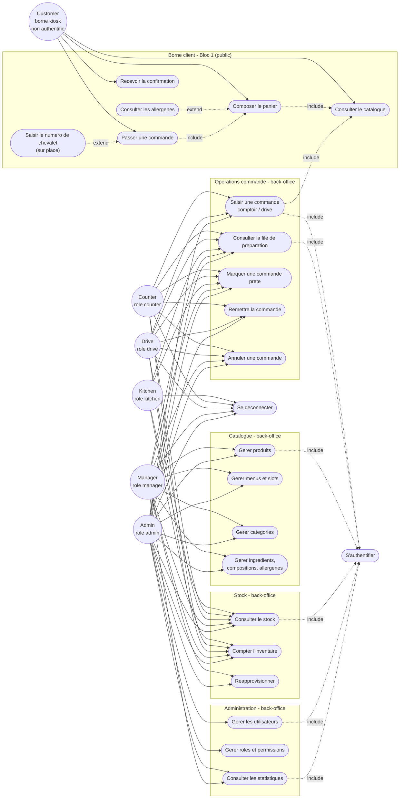

# Diagramme de cas d'utilisation - Wakdo

**Phase UML** : P1 - Conception, complement UML (apres MCD)
**Statut** : v0.5 - prod-like, 5 roles RBAC + catalogue de 23 permissions
**Historique** : v0.3 (2026-09-24) - mise en coherence avec le code livre (2a09597) : cas "Marquer une commande prete" ajoute (kitchen, counter, drive, admin, permission `order.read`), mention "lecture seule" retiree du role kitchen, "Saisir le numero de retrait" remplace par "Saisir le numero de chevalet (sur place)" en extension, admin relie a la saisie et a la remise, parcours de commande en deux appels (creation puis encaissement), aucun modificateur d'ingredient construit par la borne. v0.4 (2026-09-28) - audit final sur pieces : manager relie a "Consulter la file de preparation", "Marquer une commande prete" et "Annuler une commande" (`order.read` + `order.cancel` depuis ADR-0020, #176) sans `order.create` ni `order.deliver` ; cas livres absents ajoutes (page Sante, historique des mouvements, ajustement libre de stock, seuils, import CSV, enrichissement Open Food Facts, effacement RGPD, reinitialisation du PIN d'un equipier, choix de son propre PIN, mot de passe oublie, page confidentialite, API JSON d'administration, suivi public de commande) dans un second diagramme (section 3bis) pour garder le premier lisible ; UC51 "Se deconnecter" relie aux acteurs back-office ; statistiques (UC "Consulter les statistiques") realignees sur le code livre ; seuils de stock corriges en pourcentage de `stock_capacity`. v0.5 (2026-09-29) - contre-audit independant (base MariaDB jetable) : reference au MCT mise a jour (30 -> 40 operations) ; references `mct.md 13` corrigees en `mct.md 5.2` pour MARK_READY (fiche ajoutee a cette section, pas a la section 13 "machine a etats") ; cas manager/admin "Consulter la file de preparation" precise (`/admin/orders` = 50 commandes recentes TOUS statuts, distinct de `/kitchen/display` qui filtre sur `paid`/`preparing`/`ready`).
**Date** : 2026-06-11
**Branche** : `feat/p1-conception`
**Auteur methodologie** : BYAN

---

## 1. Objet du document

Ce document recense les **cas d'utilisation** de Wakdo, c'est-a-dire les
fonctionnalites observables du systeme du point de vue de ses acteurs. Il
complete le MCD (`docs/merise/mcd.md`), le dictionnaire
(`docs/merise/dictionary.md`) et le MCT (`docs/merise/mct.md`, 40 operations) en
passant de la vue **donnees / traitements** a la vue **usages**.

Le diagramme reste au niveau conceptuel : il identifie qui fait quoi, sans
prejuger de l'ecran ou de l'endpoint qui realise chaque cas. Chaque cas
back-office est rattache a la **permission** qui le conditionne (catalogue fige
de 23 codes, `dictionary.md` 3.17), conformement a la regle RBAC
permission-driven : le code teste une permission, pas un nom de role.

**Sources** :
- `docs/PROJECT_CONTEXT.md` sections 2 (acteurs, processus), 7 (scope back-office)
- `docs/merise/dictionary.md` 3.14-3.18 (`user`, `role`, `role_visible_source`, `permission`, `role_permission`)
- `docs/merise/mct.md` (operations, acteurs, permissions par operation)

---

## 2. Acteurs - perimetre et challenge de pertinence

Le brief initial (`PROJECT_CONTEXT.md` section 2) decrivait quatre acteurs
metier (Client, Accueil, Preparation, Administration) adosses a 3 roles RBAC. Le
modele v0.2 (prod-like, decision de conception documentee dans
`docs/journal/2026-06-04--p1-merise-v0.2-rewrite-and-forgejo-migration.md`) raffine
le back-office en **5 roles** pour coller a l'organisation reelle d'un fast-food
multi-canal. Chaque acteur candidat est confronte au perimetre reel.

| Acteur candidat (brief) | Statut v0.2 | Justification (perimetre reel) |
|---|---|---|
| **Client (borne kiosk)** | Retenu (acteur `CUSTOMER`) | Acteur central du Bloc 1. Compose et valide une commande sur la borne tactile autonome (canal `kiosk`). **Non authentifie**. |
| **Accueil** | **Scinde** en `counter` et `drive` | Le besoin "Accueil" recouvre deux canaux operationnels distincts : le comptoir (`counter`) et le drive (`drive`). Le v0.2 les separe car le tag `source` de la commande et le filtre de dashboard (`role_visible_source`) different. Tous deux saisissent des commandes, les remettent et les annulent. |
| **Preparation** | Retenu, renomme `kitchen` | Role RBAC `kitchen`. Voit la file des commandes `paid`, `preparing` et `ready` triees par `paid_at` croissant et **marque une commande prete** (`preparing -> ready`, permission `order.read`). Ne cree, ne remet ni n'annule de commande (la remise revient a `counter`/`drive`). |
| **Administration** | **Scinde** en `admin` et `manager` | Le v0.1 fusionnait "Manager/Admin". Le v0.2 distingue : `admin` (gestion des utilisateurs, des roles et permissions, suppressions catalogue, `order.create`/`order.deliver`) et `manager` (catalogue create/update, stock/reappro, stats, PLUS `order.read`/`order.cancel` depuis ADR-0020 (#176) — consulte la file de preparation, marque une commande prete et l'annule, mais ne cree ni ne remet de commande), utilisateurs en lecture seule (`user.read`) et sans acces au RBAC. Resout le point ouvert v0.1 "Manager vs Admin". |
| **Caisse** | Ecarte (recouvert par `counter`/`drive`) | Aucun role `caisse` n'existe. L'encaissement est simule (cadre RNCP) : il suit la creation de la commande, par un second appel de la borne ou dans la meme requete au comptoir et au drive. Resout le point ouvert v0.1 "Caisse absente du RBAC". |
| **Systeme** | Retenu (acteur `SYS`) | Logique interne (generation du numero, reponse API de confirmation). Apparait dans le MCT (3.4 `DISPLAY_CONFIRMATION`) ; non represente comme acteur humain au diagramme. |

### Decision sur les acteurs retenus

Six acteurs sont conserves : un acteur public et cinq roles back-office.

1. **Customer** (borne kiosk, non authentifie)
2. **Admin** (role `admin`)
3. **Manager** (role `manager` : catalogue, stock, stats, PLUS `order.read`/`order.cancel` — consulte la file, marque une commande prete, annule ; ni `order.create` ni `order.deliver`)
4. **Kitchen** (role `kitchen`, ex-"Preparation" : consulte la file et marque une commande prete)
5. **Counter** (role `counter`, ex-"Accueil" comptoir)
6. **Drive** (role `drive`, ex-"Accueil" drive)

> Regle RBAC permission-driven (`dictionary.md` 3.15) : les rattachements
> acteur -> cas ci-dessous refletent la **matrice de permissions par defaut au
> seed**. Le gardien reel est la permission, pas le nom du role : un role
> personnalise (ex. "chef-patissier") dote des bonnes permissions ouvre les
> memes cas, sans changement de code. Les 5 roles seed sont un point de depart,
> pas une liste fermee.

---

## 3. Diagramme de cas d'utilisation

Mermaid ne fournit pas de type `usecase` natif. La representation utilise un
`flowchart` : les acteurs sont a gauche, les cas d'utilisation regroupes par
sous-systeme. La permission qui conditionne chaque cas back-office est precisee
en section 4.

```mermaid
flowchart LR
    %% Acteurs
    Customer(("Customer<br/>borne kiosk<br/>non authentifie"))
    Admin(("Admin<br/>role admin"))
    Manager(("Manager<br/>role manager"))
    Kitchen(("Kitchen<br/>role kitchen"))
    Counter(("Counter<br/>role counter"))
    Drive(("Drive<br/>role drive"))

    %% Sous-systeme Borne client
    subgraph BORNE["Borne client - Bloc 1 (public)"]
        UC1(["Consulter le catalogue"])
        UC2(["Composer le panier"])
        UC3(["Consulter les allergenes"])
        UC4(["Passer une commande"])
        UC5(["Saisir le numero de chevalet<br/>(sur place)"])
        UC6(["Recevoir la confirmation"])
    end

    %% Sous-systeme Operations commande
    subgraph OPS["Operations commande - back-office"]
        UC10(["Saisir une commande<br/>comptoir / drive"])
        UC11(["Consulter la file de preparation"])
        UC14(["Marquer une commande prete"])
        UC12(["Remettre la commande"])
        UC13(["Annuler une commande"])
    end

    %% Sous-systeme Catalogue
    subgraph CAT["Catalogue - back-office"]
        UC20(["Gerer produits"])
        UC21(["Gerer menus et slots"])
        UC22(["Gerer categories"])
        UC23(["Gerer ingredients,<br/>compositions, allergenes"])
    end

    %% Sous-systeme Stock
    subgraph STK["Stock - back-office"]
        UC30(["Consulter le stock"])
        UC31(["Compter l'inventaire"])
        UC32(["Reapprovisionner"])
    end

    %% Sous-systeme Administration
    subgraph ADM["Administration - back-office"]
        UC40(["Gerer les utilisateurs"])
        UC41(["Gerer roles et permissions"])
        UC42(["Consulter les statistiques"])
    end

    %% Transverse
    UC50(["S'authentifier"])
    UC51(["Se deconnecter"])

    %% Relations Customer
    Customer --> UC1
    Customer --> UC2
    Customer --> UC4
    Customer --> UC6
    UC2 -. include .-> UC1
    UC3 -. extend .-> UC2
    UC5 -. extend .-> UC4
    UC4 -. include .-> UC2

    %% Operations commande : order.create, order.read, order.deliver, order.cancel
    Counter --> UC10
    Counter --> UC11
    Counter --> UC14
    Counter --> UC12
    Counter --> UC13
    Drive --> UC10
    Drive --> UC11
    Drive --> UC14
    Drive --> UC12
    Drive --> UC13
    Kitchen --> UC11
    Kitchen --> UC14
    Manager --> UC11
    Manager --> UC14
    Manager --> UC13
    Admin --> UC10
    Admin --> UC11
    Admin --> UC14
    Admin --> UC12
    Admin --> UC13
    UC10 -. include .-> UC1

    %% Stock : stock.read et stock.count (cinq roles), stock.manage (manager, admin)
    Kitchen --> UC30
    Kitchen --> UC31
    Counter --> UC30
    Counter --> UC31
    Drive --> UC30
    Drive --> UC31
    Manager --> UC30
    Manager --> UC31
    Manager --> UC32
    Admin --> UC30
    Admin --> UC31
    Admin --> UC32

    %% Catalogue (manager + admin)
    Manager --> UC20
    Manager --> UC21
    Manager --> UC22
    Manager --> UC23
    Admin --> UC20
    Admin --> UC21
    Admin --> UC22
    Admin --> UC23

    %% Administration (admin) + stats (manager + admin)
    Admin --> UC40
    Admin --> UC41
    Admin --> UC42
    Manager --> UC42

    %% Authentification mutualisee (tout cas back-office)
    UC10 -. include .-> UC50
    UC11 -. include .-> UC50
    UC20 -. include .-> UC50
    UC30 -. include .-> UC50
    UC40 -. include .-> UC50
    UC42 -. include .-> UC50

    %% Deconnexion : tout acteur back-office authentifie
    Kitchen --> UC51
    Counter --> UC51
    Drive --> UC51
    Manager --> UC51
    Admin --> UC51
```

---

## 3bis. Second diagramme — cas livres absents du premier

Le premier diagramme couvre le parcours de commande, le catalogue et le coeur RBAC. Les
cas ci-dessous existent dans le code livre (verifies dans `RouteSecurity.php`) mais
manquaient au diagramme : ils sont regroupes ici pour garder le premier lisible (Mantra
Ockham — un diagramme sature devient illisible pour un gain de completude marginal par
noeud supplementaire).

```mermaid
flowchart LR
    Customer(("Customer<br/>borne kiosk<br/>non authentifie"))
    Admin(("Admin<br/>role admin"))
    Manager(("Manager<br/>role manager"))
    Kitchen(("Kitchen<br/>role kitchen"))
    Counter(("Counter<br/>role counter"))
    Drive(("Drive<br/>role drive"))

    subgraph SYS["Systeme et securite - back-office"]
        UC60(["Consulter la sante de l'API<br/>(carte des routes)"])
        UC61(["Consulter l'historique<br/>des mouvements de stock"])
        UC62(["Ajuster librement<br/>le stock"])
        UC63(["Regler les seuils<br/>d'alerte de stock"])
        UC64(["Importer des produits<br/>depuis un CSV"])
        UC65(["Enrichir un ingredient<br/>via Open Food Facts"])
        UC66(["Effacer les donnees<br/>d'un equipier (RGPD)"])
        UC67(["Reinitialiser le PIN<br/>d'un equipier"])
        UC68(["Choisir son propre PIN"])
        UC69(["Demander une reinitialisation<br/>de mot de passe"])
        UC70(["Consulter la page<br/>de confidentialite"])
        UC71(["Utiliser l'API JSON<br/>d'administration"])
    end

    subgraph PUB["Suivi public"]
        UC72(["Suivre sa commande<br/>par son numero"])
    end

    %% role.manage : admin seul au seed
    Admin --> UC60

    %% stock.read (tous) / stock.count (tous, PIN) / stock.manage (manager+admin)
    Kitchen --> UC61
    Counter --> UC61
    Drive --> UC61
    Manager --> UC61
    Admin --> UC61
    Kitchen --> UC62
    Counter --> UC62
    Drive --> UC62
    Manager --> UC62
    Admin --> UC62
    Manager --> UC63
    Admin --> UC63

    %% product.create (manager+admin, PIN si changement de prix)
    Manager --> UC64
    Admin --> UC64

    %% ingredient.manage (manager+admin)
    Manager --> UC65
    Admin --> UC65

    %% user.update + PIN (admin seul)
    Admin --> UC66
    Admin --> UC67

    %% aucune permission dediee : tout compte back-office authentifie
    Kitchen --> UC68
    Counter --> UC68
    Drive --> UC68
    Manager --> UC68
    Admin --> UC68
    Kitchen --> UC70
    Counter --> UC70
    Drive --> UC70
    Manager --> UC70
    Admin --> UC70

    %% mot de passe oublie : public, avant authentification
    Kitchen -.-> UC69
    Counter -.-> UC69
    Drive -.-> UC69
    Manager -.-> UC69
    Admin -.-> UC69

    %% API JSON : meme perimetre fonctionnel que le HTML, canal alternatif,
    %% ouvert a chaque role selon ses permissions (pas reserve au manager et a l'admin)
    Manager --> UC71
    Admin --> UC71
    Kitchen --> UC71
    Counter --> UC71
    Drive --> UC71

    %% suivi public de commande (GET /api/orders/{number}) : route publique,
    %% pas appelee par les ecrans de la borne livree
    Customer -.-> UC72
```

Notes de lecture :
- **UC60** (`GET /admin/health`, `role.manage`) : seul `admin` detient `role.manage` au
  seed ; `manager` en est exclu.
- **UC61/UC62** (`stock.read`/`stock.count`) : memes cinq roles que "Consulter le stock"
  (4.4) et "Compter l'inventaire" — UC62 est PIN-garde (RG-T13), UC61 ne l'est pas.
- **UC63** (`stock.manage`) : reserve a `manager`/`admin`, comme "Reapprovisionner".
- **UC64** (`product.create`) : PIN uniquement si le fichier modifie un prix (meme regle
  que "Gerer produits", 4.5).
- **UC69** : fleche en pointilles (relation indirecte) — la demande est soumise SANS
  session active (route publique `sans_compte=true`), mais elle est utile a la personne
  identifiee par l'un des cinq roles back-office. Le Customer (kiosk) n'a pas de compte
  et n'est pas concerne.
- **UC71** ne cree aucune capacite nouvelle : c'est un canal JSON (`/admin/api`, 57
  routes) vers les MEMES cas que le HTML (sections 4.2, 4.4, 4.5, 4.6), avec les memes
  permissions et gardes PIN ; chaque role y accede selon ses permissions (la cuisine lit la
  file, le comptoir et le drive creent et remettent leurs commandes), pas seulement le manager
  et l'admin.
- **UC72** (`GET /api/orders/{number}`) est une route publique documentee et testee, mais
  aucun ecran de la borne livree ne l'appelle (verifie dans `src/public/borne/assets/js/`,
  29/09) : le lien est donc en pointille.

---

## 4. Description des cas d'utilisation

### 4.1 Acteur Customer (borne kiosk, non authentifie)

| Cas | Operation MCT | Description | Entites manipulees |
|---|---|---|---|
| Consulter le catalogue | 3.1 LOAD_CATALOGUE | Parcourir categories, produits et menus disponibles, charges via `GET /api/categories`, `/api/products`, `/api/menus` (le repli JSON statique initial a ete retire). | `category`, `product`, `menu`, `menu_slot`, `menu_slot_option` |
| Composer le panier | 3.2 COMPOSE_CART | Ajouter produits a la carte (quantite, taille s'il y en a plusieurs) ou menus ; remplir les slots d'un menu (`order_item_selection`), choisir le format Normal/Maxi, ajuster ou retirer une ligne dans le panneau de commande. Panier conserve dans le navigateur (`localStorage`), aucune ecriture en base a ce stade. La borne ne construit aucun modificateur d'ingredient. | `product`, `menu`, `menu_slot`, `menu_slot_option` |
| Consulter les allergenes | (derive de 3.1) | Afficher en modal les allergenes d'un produit, **calcules** par jointure `product_ingredient -> ingredient_allergen -> allergen` (INCO 1169/2011). Etend la composition. | `allergen`, `ingredient_allergen`, `product_ingredient` |
| Passer une commande | 3.3 CREATE_ORDER, 3.3ter PAY_ORDER | Toucher « Payer » puis choisir un mode de paiement (simule). Deux appels : `POST /api/orders` cree la commande en `pending_payment` (lignes et selections avec snapshots), puis `POST /api/orders/{number}/pay` la passe en `preparing`, decremente le stock et ecrit les `stock_movement`. | `customer_order`, `order_item`, `order_item_selection`, `ingredient`, `stock_movement` |
| Saisir le numero de chevalet (sur place) | (extension de 3.3) | En service sur place, renseigner le numero du chevalet pour etre servi a table. Extension de "Passer une commande" : absente en vente a emporter. Le numero de commande, lui, est genere par le serveur (`K<id>`). | `customer_order.service_tag` |
| Recevoir la confirmation | 3.4 DISPLAY_CONFIRMATION | Afficher l'ecran de confirmation avec le numero et le montant, apres la reponse `200` de l'encaissement (statut `preparing`), sans nouvel appel a l'API. | `customer_order` |

### 4.2 Acteurs Counter et Drive (roles `counter`, `drive`) — l'admin partage les memes cinq cas

L'admin detient les 23 permissions du seed, donc `order.create` et `order.deliver` aussi :
il peut saisir une commande comptoir/drive et la remettre, en plus de consulter la file,
marquer une commande prete et l'annuler (les cinq cas ci-dessous). C'est le seul role,
avec `counter`/`drive`, a cumuler les cinq.

| Cas | Operation MCT | Permission | Description | Entites |
|---|---|---|---|---|
| Saisir une commande comptoir/drive | 4.1 CREATE_COUNTER_ORDER | `order.create` | Composer une commande pour un client au comptoir (`counter`) ou au drive (`drive`). Logique identique a CREATE_ORDER. Le canal est deduit du CHEMIN emprunte (`/counter/orders` ou `/drive/orders`, `channelGuard()`) puis auto-tague en `source` depuis `role.order_source` pour un role a canal fixe ; l'admin (sans canal fixe) le choisit explicitement dans le corps de la requete API. Numero prefixe canal + id (`C<id>`/`D<id>`, voir dictionnaire note 4). | `customer_order`, `order_item`, `order_item_selection`, `order_item_modifier`, `ingredient`, `stock_movement` |
| Consulter la file de preparation | 5.1 LIST_ORDERS_DISPLAY | `order.read` | Voir les commandes `paid`, `preparing` et `ready` triees par `paid_at` croissant, filtrees par `role_visible_source` (counter voit kiosk+counter ; drive voit drive ; admin voit tout). Couleur KDS = `now - paid_at`. | `customer_order`, `order_item`, `order_item_selection`, `order_item_modifier`, `role_visible_source` |
| Marquer une commande prete | MARK_READY (`mct.md` 5.2) | `order.read` | Depuis la file, passer une commande `paid` ou `preparing` a `ready`, `ready_at = NOW()` (`POST /admin/orders/{number}/ready`). | `customer_order` |
| Remettre la commande | 6.1 DELIVER_ORDER | `order.deliver` | Geste unique vers `delivered` depuis `paid`, `preparing` ou `ready`, `delivered_at = NOW()`. Admin inclus (seul manager en est exclu, cf. 4.2bis). | `customer_order` |
| Annuler une commande | 7.1 CANCEL_ORDER | `order.cancel` + PIN | Transition vers `cancelled` depuis `pending_payment`, `paid`, `preparing` ou `ready`, `cancelled_at = NOW()`, apres verification du PIN de l'equipier. Re-credit du stock si des mouvements `sale` existent ; trace `audit_log`. | `customer_order`, `ingredient`, `stock_movement`, `audit_log` |

### 4.2bis Acteur Manager (role `manager`) — commandes

Le manager n'a pas de page de saisie dediee (pas de canal fixe `role.order_source`) : il
agit sur `/admin/orders`, la meme liste que l'admin, avec `order.read` + `order.cancel`
(migration `0018`, ADR-0020, #176) mais **sans** `order.create` ni `order.deliver`.

| Cas | Operation MCT | Permission | Description | Entites |
|---|---|---|---|---|
| Consulter les commandes | 5.1 LIST_ORDERS_DISPLAY (elargie) | `order.read` | Voit `/admin/orders` (`OrderAdminController::index`) comme l'admin, toutes sources, pas de filtre par canal — mais ce n'est PAS la file de preparation stricte : `/admin/orders` liste les 50 commandes les PLUS RECENTES TOUS STATUTS confondus (historique + action), la ou `/kitchen/display` (KitchenController, le vrai equivalent de LIST_ORDERS_DISPLAY 5.1) ne montre QUE `paid`/`preparing`/`ready`. Le manager n'a pas d'ecran `/kitchen/display` dedie ; `/admin/orders` lui sert des deux (consultation large + actions ready/cancel). | `customer_order`, `order_item`, `order_item_selection`, `order_item_modifier`, `role_visible_source` |
| Marquer une commande prete | MARK_READY (`mct.md` 5.2) | `order.read` | Depuis l'ecran cuisine (`/kitchen/display`, `order.read`), seul ecran ou le bouton « Prete » existe ; `/admin/orders` n'offre que « Annuler » (`Views/admin/orders/index.php`). | `customer_order` |
| Annuler une commande | 7.1 CANCEL_ORDER | `order.cancel` + PIN | Meme flux PIN + audit que counter/drive/admin (7.1). | `customer_order`, `ingredient`, `stock_movement`, `audit_log` |

### 4.3 Acteur Kitchen (role `kitchen`)

| Cas | Operation MCT | Permission | Description | Entites |
|---|---|---|---|---|
| Consulter la file de preparation | 5.1 LIST_ORDERS_DISPLAY | `order.read` | Voir toutes les sources (kiosk, counter, drive). | `customer_order`, `order_item`, `order_item_selection`, `order_item_modifier`, `role_visible_source` |
| Marquer une commande prete | MARK_READY (`mct.md` 5.2) | `order.read` | Bouton « Prete » de la file (`KitchenController`, `OrderAdminController::ready`) : seule transition de statut ouverte a la cuisine. | `customer_order` |

### 4.4 Stock (Kitchen, Counter, Drive, Manager, Admin)

| Cas | Operation MCT | Permission | Description | Entites |
|---|---|---|---|---|
| Consulter le stock | 9.3 READ_STOCK | `stock.read` | Lister TOUS les ingredients (actifs et inactifs) avec stock courant ; bandes `low_stock`/`critical_stock` calculees en pourcentage de `stock_capacity` (`stock_quantity <= stock_capacity * low_stock_pct/100`, defaut 10 % / 5 %) — pas de seuil absolu `low_stock_threshold`. | `ingredient`, `stock_movement` |
| Compter l'inventaire | 9.2 INVENTORY_COUNT | `stock.count` + PIN | Saisir un comptage physique ; le systeme enregistre l'ecart (`inventory_correction`), plafonne a la capacite. Inclut les equipiers (kitchen/counter/drive). Action sensible : PIN requis (RG-T13). | `ingredient`, `stock_movement` |
| Ajuster librement le stock | 9.4 ADJUST | `stock.count` + PIN | Correction signee (+/-) hors reappro/inventaire (casse, erreur a reprendre), plafonnee a la capacite. Meme PIN que l'inventaire (RG-T13). | `ingredient`, `stock_movement` |
| Reapprovisionner | 9.1 RESTOCK | `stock.manage` | Enregistrer une livraison en conditionnements (`+= N * pack_size`), plafonnee a la capacite. Reserve manager/admin, sans PIN. | `ingredient`, `stock_movement` |
| Regler les seuils d'alerte | 9.5 SET_STOCK_THRESHOLDS | `stock.manage` | Ajuster `stock_capacity`, `low_stock_pct`, `critical_stock_pct` d'un ingredient. Reserve manager/admin, sans PIN ni audit (parametrage, pas un mouvement). | `ingredient` |

### 4.5 Catalogue (Manager, Admin)

| Cas | Operation MCT | Permissions | Description | Entites |
|---|---|---|---|---|
| Gerer produits | 8.1-8.3 CREATE/UPDATE/DELETE_PRODUCT | `product.create`/`update` (manager+admin), `product.delete` (admin seul) | CRUD produits (nom, prix, `vat_rate`, image, dispo). La suppression physique est reservee a `admin` et bloquee si reference (FK RESTRICT). | `product`, `category` |
| Gerer menus et slots | 8.4-8.6 CREATE/UPDATE/DELETE_MENU | `menu.create`/`update` (manager+admin), `menu.delete` (admin seul) | CRUD menus avec leur configuration de slots (`menu_slot`, `menu_slot_option`) et le burger fixe. | `menu`, `menu_slot`, `menu_slot_option`, `product` |
| Gerer categories | 8.7 MANAGE_CATEGORY | `category.manage` (manager+admin) | CRUD categories ; desactivation `is_active=0`. | `category` |
| Gerer ingredients, compositions, allergenes | 8.8 MANAGE_INGREDIENT | `ingredient.manage` (manager+admin) | CRUD `ingredient` ; composition `product_ingredient` (quantites Normal/Maxi, retirable/ajoutable, supplement) ; mapping `ingredient_allergen` (14 allergenes UE). | `ingredient`, `product_ingredient`, `ingredient_allergen`, `allergen` |

### 4.6 Administration (role `admin`) + Stats (Manager, Admin)

| Cas | Operation MCT | Permissions | Description | Entites |
|---|---|---|---|---|
| Gerer les utilisateurs | 10.1-10.3 CREATE/UPDATE/DEACTIVATE_USER | `user.create`/`update`/`deactivate` (admin) ; `user.read` (admin+manager) | CRUD comptes back-office avec hash argon2id ; desactivation sans suppression (historique preserve). | `user`, `role` |
| Gerer roles et permissions | 10.4 MANAGE_RBAC | `role.manage` (admin) | Editer la matrice `role_permission`, creer/modifier des roles personnalises (`default_route`, `order_source`), regler `role_visible_source`. Permissions statiques (declarees en migration). | `role`, `permission`, `role_permission`, `role_visible_source` |
| Consulter les statistiques | 11.1 READ_STATS | `stats.read` (admin+manager) | CA encaisse (statuts `paid`/`preparing`/`ready`/`delivered`), panier moyen, CA et compte du jour, repartition par statut, serie 7 jours (CA + commandes), compteurs de catalogue et sante du stock. PAS encore codes : coupure `service_day` a 10h, top produits, taux d'annulation, temps moyen de remise, ventilation par `source`/`service_mode`. | `customer_order`, `order_item`, `category`, `product`, `menu`, `ingredient` |

### 4.7 Cas transverses - Authentification

| Cas | Operation MCT | Description |
|---|---|---|
| S'authentifier | 12.1 AUTHENTICATE_USER | Tous les roles back-office passent par ce cas avant d'acceder a leurs cas (relation `<<include>>`). Verification argon2id, regeneration de session (anti-fixation), `is_active=1` requis, redirection vers `role.default_route`. Le Customer du kiosk n'est pas authentifie. |
| Se deconnecter | 12.2 LOGOUT_USER | Destruction de session (`AuthService::logout()`) sur clic. A l'expiration (inactivite 4h / absolu 10h), `SessionGuard::check()` REFUSE la session (retour a la connexion) sans la detruire ; le fichier de session est ensuite supprime par le ramasse-miettes de PHP. |

---

## 5. Relations include / extend retenues

| Relation | Type | Justification |
|---|---|---|
| Saisir le numero de chevalet -> Passer une commande | extend | La saisie du chevalet ne concerne que le service sur place (`page-payment.js`). |
| Passer une commande -> Composer le panier | include | Une commande resulte d'un panier compose. |
| Composer le panier -> Consulter le catalogue | include | Composer suppose de parcourir les produits eligibles (a la carte ou par slot). |
| Consulter les allergenes -> Composer le panier | extend | La consultation des allergenes est un cas optionnel declenche a la demande du client sur un produit. |
| Saisir une commande (Counter/Drive) -> Consulter le catalogue | include | L'equipier consulte le catalogue pour saisir au comptoir/drive. |
| Cas back-office -> S'authentifier | include | Acces conditionne a une session authentifiee detenant la permission requise. |

---

## 6. Points resolus par rapport au v0.1

Les incoherences que le v0.1 remontait pour arbitrage sont desormais tranchees
par le modele v0.2 (`dictionary.md`, `mct.md`).

1. **Acteur "Caisse"** : ecarte. L'encaissement est simule (cadre RNCP) et suit
   la creation (PAY_ORDER, `mct.md` 3.3ter) ; il est realise par le Customer (kiosk)
   ou par `counter`/`drive` (back-office). Aucun role `caisse` n'est necessaire.
2. **"Manager" vs "Admin"** : scindes en deux roles distincts. `manager` gere le
   catalogue (create/update), le stock/reappro et les stats ; `admin` ajoute les
   suppressions catalogue, la gestion des utilisateurs et le RBAC.
3. **"Accueil" unique** : scinde en `counter` et `drive`, car le tag `source` et
   le filtre `role_visible_source` different selon le canal.
4. **Machine a etats** : six valeurs (`docs/uml/state-commande.md`) :
   `pending_payment -> preparing -> ready -> delivered` + `cancelled`, `paid` conserve
   pour l'historique. La cuisine (`kitchen`) marque une commande prete ; la remise
   reste un geste unique (`counter`/`drive`).
5. **Modele permission-driven** : chaque cas back-office est rattache a sa
   permission (catalogue de 23 codes fige, `dictionary.md` 3.17). Le diagramme
   reflete la matrice seed ; le gardien effectif reste la permission.
